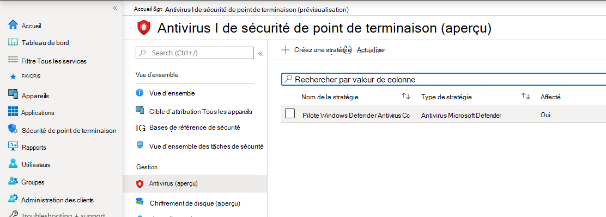
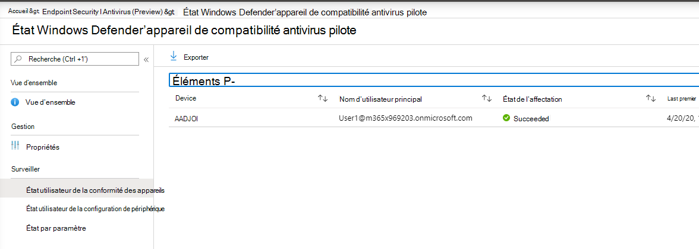
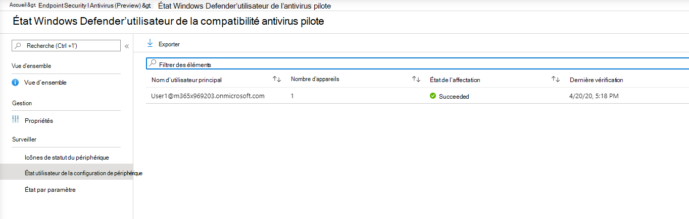
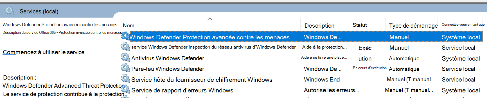

# Intégration à l'aide de Microsoft Endpoint Manager

[!INCLUDE [Microsoft 365 Defender rebranding](../../includes/microsoft-defender.md)]

**S’applique à :**

- [Microsoft Defender pour point de terminaison Plan 2](https://go.microsoft.com/fwlink/p/?linkid=2154037)
- [Microsoft 365 Defender](https://go.microsoft.com/fwlink/?linkid=2118804)

> Vous voulez découvrir Microsoft Defender pour point de terminaison ? [Inscrivez-vous pour bénéficier d’un essai gratuit.](https://signup.microsoft.com/create-account/signup?products=7f379fee-c4f9-4278-b0a1-e4c8c2fcdf7e&ru=https://aka.ms/MDEp2OpenTrial?ocid=docs-wdatp-exposedapis-abovefoldlink)

Cet article fait partie du guide de déploiement et sert d’exemple de méthode d’intégration.

Dans la rubrique [Planification](deployment-strategy.md) , plusieurs méthodes ont été fournies pour intégrer des appareils au service. Cette rubrique traite de l’architecture cloud native.

:::image type="content" source="images/cloud-native-architecture.png" alt-text="L’architecture cloud native" lightbox="images/cloud-native-architecture.png":::
*Diagramme des architectures d’environnement*

Bien que Defender pour point de terminaison prenne en charge l’intégration de différents points de terminaison et outils, cet article ne les aborde pas. Pour plus d’informations sur l’intégration générale à l’aide d’autres outils et méthodes de déploiement pris en charge, consultez [vue d’ensemble de l’intégration](onboarding.md).

[Microsoft Endpoint Manager](/mem/endpoint-manager-overview) est une plateforme de solutions qui unifie plusieurs services. Il inclut [Microsoft Intune](/mem/intune/fundamentals/what-is-intune) et [Configuration Manager de point de terminaison Microsoft](/mem/configmgr).

Cette rubrique guide les utilisateurs dans :

- Étape 1 : Intégration d’appareils au service en créant un groupe dans Microsoft Endpoint Manager (MEM) pour affecter des configurations sur
- Étape 2 : Configuration des fonctionnalités de Defender pour point de terminaison à l’aide de Microsoft Endpoint Manager

Ces conseils d’intégration vous guideront tout au long des étapes de base suivantes que vous devez suivre lors de l’utilisation de Microsoft Endpoint Manager :

- [Identification des appareils ou utilisateurs cibles](#identify-target-devices-or-users)
  - Création d’un groupe Azure Active Directory (utilisateur ou appareil)
- [Création d’un profil de configuration](#step-2-create-configuration-policies-to-configure-microsoft-defender-for-endpoint-capabilities)
  - Dans Microsoft Endpoint Manager, nous allons vous guider dans la création d’une stratégie distincte pour chaque fonctionnalité.

## Ressources

Voici les liens dont vous aurez besoin pour le reste du processus :

- [Portail MEM](https://aka.ms/memac)
- [Microsoft 365 Defender](https://security.microsoft.com)
- [bases de référence de sécurité Intune](/mem/intune/protect/security-baseline-settings-defender-atp#microsoft-defender)

Pour plus d’informations sur Microsoft Endpoint Manager, consultez les ressources suivantes :

- [Page Microsoft Endpoint Manager](/mem/)
- [Billet de blog sur la convergence de Intune et ConfigMgr](https://www.microsoft.com/microsoft-365/blog/2019/11/04/use-the-power-of-cloud-intelligence-to-simplify-and-accelerate-it-and-the-move-to-a-modern-workplace/)
- [Vidéo d’introduction sur MEM](https://www.microsoft.com/microsoft-365/blog/2019/11/04/use-the-power-of-cloud-intelligence-to-simplify-and-accelerate-it-and-the-move-to-a-modern-workplace)

## Étape 1 : Intégrer des appareils en créant un groupe dans MEM pour affecter des configurations sur

### Identifier les appareils ou utilisateurs cibles

Dans cette section, nous allons créer un groupe de tests sur lequel affecter vos configurations.

> [!NOTE]
> Intune utilise les groupes Azure Active Directory (Azure AD) pour gérer les utilisateurs et les appareils. En tant qu’administrateur Intune, vous pouvez configurer des groupes en fonction des besoins de votre organisation.
>
> Pour plus d’informations, voir [Ajouter des groupes pour organiser les utilisateurs et les appareils](/mem/intune/fundamentals/groups-add).

### Créer un groupe

1. Ouvrez le portail MEM.

2. Ouvrez **groupes > nouveau groupe**.

    > [!div class="mx-imgBorder"]
    > :::image type="content" source="images/66f724598d9c3319cba27f79dd4617a4.png" alt-text="Portail Microsoft Endpoint Manager 1" lightbox="images/66f724598d9c3319cba27f79dd4617a4.png":::

3. Entrez des détails et créez un groupe.

    > [!div class="mx-imgBorder"]
    > :::image type="content" source="images/b1e0206d675ad07db218b63cd9b9abc3.png" alt-text="Portail Microsoft Endpoint Manager 2" lightbox="images/b1e0206d675ad07db218b63cd9b9abc3.png":::

4. Ajoutez votre utilisateur ou appareil de test.

5. Dans le volet **Groupes > Tous les groupes** , ouvrez votre nouveau groupe.

6. Sélectionnez  **Membres > Ajouter des membres**.

7. Recherchez votre utilisateur ou appareil de test et sélectionnez-le.

    > [!div class="mx-imgBorder"]
    > :::image type="content" source="images/149cbfdf221cdbde8159d0ab72644cd0.png" alt-text="Portail Microsoft Endpoint Manager 3" lightbox="images/149cbfdf221cdbde8159d0ab72644cd0.png":::

8. Votre groupe de test a maintenant un membre à tester.

## Étape 2 : Créer des stratégies de configuration pour configurer Microsoft Defender pour point de terminaison fonctionnalités

Dans la section suivante, vous allez créer un certain nombre de stratégies de configuration.

Tout d’abord, une stratégie de configuration permet de sélectionner les groupes d’utilisateurs ou d’appareils qui seront intégrés à Defender pour point de terminaison :

- [Détection et réponse du point de terminaison](#endpoint-detection-and-response)

Ensuite, vous allez continuer en créant plusieurs types différents de stratégies de sécurité de point de terminaison :

- [Protection de nouvelle génération](#next-generation-protection)
- [Réduction de la surface d’attaque](#attack-surface-reduction---attack-surface-reduction-rules)

### Détection et réponse du point de terminaison

1. Ouvrez le portail MEM.

2. Accédez à **La sécurité des points de terminaison > la détection et la réponse des points de terminaison**. Cliquez sur **Créer un profil**.

    > [!div class="mx-imgBorder"]
    > :::image type="content" source="images/58dcd48811147feb4ddc17212b7fe840.png" alt-text="Portail Microsoft Endpoint Manager 4" lightbox="images/58dcd48811147feb4ddc17212b7fe840.png":::

3. Sous **Plateforme, sélectionnez Windows 10 et versions ultérieures, Profil - Détection de point de terminaison et réponse > Créer**.

4. Entrez un nom et une description, puis sélectionnez  **Suivant**.

    > [!div class="mx-imgBorder"]
    > :::image type="content" source="images/a5b2d23bdd50b160fef4afd25dda28d4.png" alt-text="Portail Microsoft Endpoint Manager 5" lightbox="images/a5b2d23bdd50b160fef4afd25dda28d4.png":::

5. Sélectionnez les paramètres en fonction des besoins, puis sélectionnez  **Suivant**.

    > [!div class="mx-imgBorder"]
    > :::image type="content" source="images/cea7e288b5d42a9baf1aef0754ade910.png" alt-text="Portail Microsoft Endpoint Manager 6" lightbox="images/cea7e288b5d42a9baf1aef0754ade910.png":::

    > [!NOTE]
    > Dans ce cas, il a été rempli automatiquement, car Defender pour point de terminaison a déjà été intégré à Intune. Pour plus d’informations sur l’intégration, consultez [Activer Microsoft Defender pour point de terminaison dans Intune](/mem/intune/protect/advanced-threat-protection-configure#to-enable-microsoft-defender-atp).
    >
    > L’image suivante est un exemple de ce que vous verrez lorsque Microsoft Defender pour point de terminaison n’est PAS intégré à Intune :
    >
    > :::image type="content" source="images/2466460812371ffae2d19a10c347d6f4.png" alt-text="Portail Microsoft Endpoint Manager 7" lightbox="images/2466460812371ffae2d19a10c347d6f4.png":::

6. Ajoutez des balises d’étendue si nécessaire, puis sélectionnez  **Suivant**.

    > [!div class="mx-imgBorder"]
    > :::image type="content" source="images/ef844f52ec2c0d737ce793f68b5e8408.png" alt-text="Portail Microsoft Endpoint Manager 8" lightbox="images/ef844f52ec2c0d737ce793f68b5e8408.png":::

7. Ajoutez un groupe de test en cliquant sur **Sélectionner des groupes à inclure** et choisissez votre groupe, puis sélectionnez  **Suivant**.

    > [!div class="mx-imgBorder"]
    > :::image type="content" source="images/fc3525e20752da026ec9f46ab4fec64f.png" alt-text="Portail Microsoft Endpoint Manager 9" lightbox="images/fc3525e20752da026ec9f46ab4fec64f.png":::

8. Passez en revue et acceptez, puis  **sélectionnez Créer**.

    > [!div class="mx-imgBorder"]
    > :::image type="content" source="images/289172dbd7bd34d55d24810d9d4d8158.png" alt-text="Portail Microsoft Endpoint Manager 10" lightbox="images/289172dbd7bd34d55d24810d9d4d8158.png":::

9. Vous pouvez afficher votre stratégie terminée.

    > [!div class="mx-imgBorder"]
    > :::image type="content" source="images/5a568b6878be8243ea2b9d82d41ed297.png" alt-text="Portail Microsoft Endpoint Manager 11" lightbox="images/5a568b6878be8243ea2b9d82d41ed297.png":::

### Protection de nouvelle génération

1. Ouvrez le portail MEM.

2. Accédez à **Endpoint Security > Antivirus > Créer une stratégie**.

    > [!div class="mx-imgBorder"]
    > :::image type="content" source="images/6b728d6e0d71108d768e368b416ff8ba.png" alt-text="Portail Microsoft Endpoint Manager 12" lightbox="images/6b728d6e0d71108d768e368b416ff8ba.png":::

3. Sélectionnez **Plateforme - Windows 10 et versions ultérieures - Windows et Profil - Microsoft Defender Antivirus > Créer**.

4. Entrez le nom et la description, puis sélectionnez  **Suivant**.

    > [!div class="mx-imgBorder"]
    > :::image type="content" source="images/a7d738dd4509d65407b7d12beaa3e917.png" alt-text="Portail Microsoft Endpoint Manager 13" lightbox="images/a7d738dd4509d65407b7d12beaa3e917.png":::

5. Dans la **page Paramètres de configuration** : définissez les configurations dont vous avez besoin pour Microsoft Defender Antivirus (protection cloud, exclusions, protection Real-Time et correction).

    > [!div class="mx-imgBorder"]
    > :::image type="content" source="images/3840b1576d6f79a1d72eb14760ef5e8c.png" alt-text="Portail Microsoft Endpoint Manager 14" lightbox="images/3840b1576d6f79a1d72eb14760ef5e8c.png":::

6. Ajoutez des balises d’étendue si nécessaire, puis sélectionnez  **Suivant**.

    > [!div class="mx-imgBorder"]
    > :::image type="content" source="images/2055e4f9b9141525c0eb681e7ba19381.png" alt-text="Portail Microsoft Endpoint Manager 15" lightbox="images/2055e4f9b9141525c0eb681e7ba19381.png":::

7. Sélectionnez les groupes à inclure, affectez-les à votre groupe de tests, puis sélectionnez  **Suivant**.

    > [!div class="mx-imgBorder"]
    > :::image type="content" source="images/48318a51adee06bff3908e8ad4944dc9.png" alt-text="Portail Microsoft Endpoint Manager 16" lightbox="images/48318a51adee06bff3908e8ad4944dc9.png":::

8. Passez en revue et créez, puis  **sélectionnez Créer**.

    > [!div class="mx-imgBorder"]
    > :::image type="content" source="images/dfdadab79112d61bd3693d957084b0ec.png" alt-text="Portail Microsoft Endpoint Manager 17" lightbox="images/dfdadab79112d61bd3693d957084b0ec.png":::

9. Vous verrez la stratégie de configuration que vous avez créée.

    > [!div class="mx-imgBorder"]
    > :::image type="content" source="images/38180219e632d6e4ec7bd25a46398da8.png" alt-text="Portail Microsoft Endpoint Manager 18" lightbox="images/38180219e632d6e4ec7bd25a46398da8.png":::

### Réduction de la surface d’attaque - Règles de réduction de la surface d’attaque

1. Ouvrez le portail MEM.

2. Accédez à **La sécurité des points de terminaison > réduction de la surface d’attaque**.

3. Sélectionnez  **Créer une stratégie**.

4. Sélectionnez **Plateforme - Windows 10 et versions ultérieures - Profil - Règles de réduction de la surface d’attaque > Créer**.

    > [!div class="mx-imgBorder"]
    > :::image type="content" source="images/522d9bb4288dc9c1a957392b51384fdd.png" alt-text="Portail Microsoft Endpoint Manager 19" lightbox="images/522d9bb4288dc9c1a957392b51384fdd.png":::

5. Entrez un nom et une description, puis sélectionnez  **Suivant**.

    > [!div class="mx-imgBorder"]
    > :::image type="content" source="images/a5a71fd73ec389f3cdce6d1a6bd1ff31.png" alt-text="Portail Microsoft Endpoint Manager 20" lightbox="images/a5a71fd73ec389f3cdce6d1a6bd1ff31.png":::

6. Dans la **page Paramètres de configuration** : définissez les configurations dont vous avez besoin pour les règles de réduction de la surface d’attaque, puis sélectionnez  **Suivant**.

    > [!NOTE]
    > Nous allons configurer toutes les règles de réduction de la surface d’attaque pour auditer.
    >
    > Pour plus d’informations, consultez [les règles de réduction de la surface d’attaque](attack-surface-reduction.md).

    > [!div class="mx-imgBorder"]
    > :::image type="content" source="images/dd0c00efe615a64a4a368f54257777d0.png" alt-text="Portail Microsoft Endpoint Manager 21" lightbox="images/dd0c00efe615a64a4a368f54257777d0.png":::

7. Ajoutez des balises d’étendue selon les besoins, puis sélectionnez  **Suivant**.

    > [!div class="mx-imgBorder"]
    > :::image type="content" source="images/6daa8d347c98fe94a0d9c22797ff6f28.png" alt-text="Portail Microsoft Endpoint Manager 22" lightbox="images/6daa8d347c98fe94a0d9c22797ff6f28.png":::

8. Sélectionnez les groupes à inclure et à affecter au groupe de test, puis sélectionnez  **Suivant**.

    > [!div class="mx-imgBorder"]
    > :::image type="content" source="images/45cefc8e4e474321b4d47b4626346597.png" alt-text="Portail Microsoft Endpoint Manager 23" lightbox="images/45cefc8e4e474321b4d47b4626346597.png":::

9. Passez en revue les détails, puis sélectionnez  **Créer**.

    > [!div class="mx-imgBorder"]
    > :::image type="content" source="images/2c2e87c5fedc87eba17be0cdeffdb17f.png" alt-text="Portail Microsoft Endpoint Manager 24" lightbox="images/2c2e87c5fedc87eba17be0cdeffdb17f.png":::

10. Affichez la stratégie.

    > [!div class="mx-imgBorder"]
    > :::image type="content" source="images/7a631d17cc42500dacad4e995823ffef.png" alt-text="Portail Microsoft Endpoint Manager 25" lightbox="images/7a631d17cc42500dacad4e995823ffef.png":::

### Réduction de la surface d’attaque - Protection web

1. Ouvrez le portail MEM.

2. Accédez à **La sécurité des points de terminaison > réduction de la surface d’attaque**.

3. Sélectionnez  **Créer une stratégie**.

4. Sélectionnez **Windows 10 et versions ultérieures - Protection web > Créer**.

    > [!div class="mx-imgBorder"]
    > :::image type="content" source="images/cd7b5a1cbc16cc05f878cdc99ba4c27f.png" alt-text="Portail Microsoft Endpoint Manager 26" lightbox="images/cd7b5a1cbc16cc05f878cdc99ba4c27f.png":::

5. Entrez un nom et une description, puis sélectionnez  **Suivant**.

    > [!div class="mx-imgBorder"]
    > :::image type="content" source="images/5be573a60cd4fa56a86a6668b62dd808.png" alt-text="Portail Microsoft Endpoint Manager 27" lightbox="images/5be573a60cd4fa56a86a6668b62dd808.png":::

6. Dans la **page Paramètres de configuration** : définissez les configurations dont vous avez besoin pour Web Protection, puis sélectionnez  **Suivant**.

    > [!NOTE]
    > Nous configurons web Protection pour bloquer.
    >
    > Pour plus d’informations, consultez [Web Protection](web-protection-overview.md).

    > [!div class="mx-imgBorder"]
    > :::image type="content" source="images/6104aa33a56fab750cf30ecabef9f5b6.png" alt-text="Portail Microsoft Endpoint Manager 28" lightbox="images/6104aa33a56fab750cf30ecabef9f5b6.png":::

7. Ajoutez **des balises d’étendue en fonction des besoins > Suivant**.

    > [!div class="mx-imgBorder"]
    > :::image type="content" source="images/6daa8d347c98fe94a0d9c22797ff6f28.png" alt-text="Portail Microsoft Endpoint Manager 29" lightbox="images/6daa8d347c98fe94a0d9c22797ff6f28.png":::

8. Sélectionnez **Affecter au groupe de test > Suivant**.

    > [!div class="mx-imgBorder"]
    > :::image type="content" source="images/45cefc8e4e474321b4d47b4626346597.png" alt-text="Portail Microsoft Endpoint Manager 30" lightbox="images/45cefc8e4e474321b4d47b4626346597.png":::

9. Sélectionnez **Vérifier et créer > Créer**.

    > [!div class="mx-imgBorder"]
    > :::image type="content" source="images/8ee0405f1a96c23d2eb6f737f11c1ae5.png" alt-text="Portail Microsoft Endpoint Manager 31" lightbox="images/8ee0405f1a96c23d2eb6f737f11c1ae5.png":::

10. Affichez la stratégie.

    > [!div class="mx-imgBorder"]
    > :::image type="content" source="images/e74f6f6c150d017a286e6ed3dffb7757.png" alt-text="Portail Microsoft Endpoint Manager 32" lightbox="images/e74f6f6c150d017a286e6ed3dffb7757.png":::

## Valider les paramètres de configuration

### Vérifier que les stratégies ont été appliquées

Une fois la stratégie de configuration affectée, l’application prend un certain temps.

Pour plus d’informations sur le minutage, consultez [Intune informations de configuration](/mem/intune/configuration/device-profile-troubleshoot#how-long-does-it-take-for-devices-to-get-a-policy-profile-or-app-after-they-are-assigned).

Pour vérifier que la stratégie de configuration a été appliquée à votre appareil de test, suivez le processus suivant pour chaque stratégie de configuration.

1. Ouvrez le portail MEM et accédez à la stratégie appropriée, comme indiqué dans les étapes ci-dessus. L’exemple suivant montre les paramètres de protection de nouvelle génération.

    > [!div class="mx-imgBorder"]
    >  

2. Sélectionnez la **stratégie de configuration** pour afficher l’état de la stratégie.

    > [!div class="mx-imgBorder"]
    > 

3. Sélectionnez  **État de l’appareil** pour afficher l’état.

    > [!div class="mx-imgBorder"]
    > 

4. Sélectionnez  **État de l’utilisateur** pour afficher l’état.

    > [!div class="mx-imgBorder"]
    > 

5. Sélectionnez  **l’état par paramètre** pour afficher l’état.

    > [!TIP]
    > Cette vue est très utile pour identifier les paramètres en conflit avec une autre stratégie.

    > [!div class="mx-imgBorder"]
    > 

### Confirmer la détection et la réponse des points de terminaison

1. Avant d’appliquer la configuration, le service Defender pour Endpoint Protection ne doit pas être démarré.

    > [!div class="mx-imgBorder"]
    > 

2. Une fois la configuration appliquée, le service Defender pour Endpoint Protection doit être démarré.

    > [!div class="mx-imgBorder"]
    > 

3. Une fois les services exécutés sur l’appareil, l’appareil apparaît dans Microsoft 365 Defender portail.

    > [!div class="mx-imgBorder"]
    > 

### Confirmer la protection de nouvelle génération

1. Avant d’appliquer la stratégie sur un appareil de test, vous devez être en mesure de gérer manuellement les paramètres, comme indiqué ci-dessous.

    > [!div class="mx-imgBorder"]
    > :::image type="content" source="images/88efb4c3710493a53f2840c3eac3e3d3.png" alt-text="Page paramètres-1" lightbox="images/88efb4c3710493a53f2840c3eac3e3d3.png":::

2. Une fois la stratégie appliquée, vous ne devez pas être en mesure de gérer manuellement les paramètres.

    > [!NOTE]
    > Dans l’image suivante, **l’option Activer la protection fournie par le cloud** et **Activer la protection en temps réel** est affichée comme gérée.

    > [!div class="mx-imgBorder"]
    > :::image type="content" source="images/9341428b2d3164ca63d7d4eaa5cff642.png" alt-text="Page paramètres-2" lightbox="images/9341428b2d3164ca63d7d4eaa5cff642.png":::

### Confirmer la réduction de la surface d’attaque - Règles de réduction de la surface d’attaque

1. Avant d’appliquer la stratégie sur un appareil de test, stylet une fenêtre PowerShell et tapez `Get-MpPreference`.

2. Cela doit répondre avec les lignes suivantes sans contenu :

    > AttackSurfaceReductionOnlyExclusions :
    >
    > AttackSurfaceReductionRules_Actions :
    >
    > AttackSurfaceReductionRules_Ids :

    :::image type="content" source="images/cb0260d4b2636814e37eee427211fe71.png" alt-text="Ligne de commande 1" lightbox="images/cb0260d4b2636814e37eee427211fe71.png":::

3. Après avoir appliqué la stratégie sur un appareil de test, ouvrez une fenêtre PowerShell et tapez `Get-MpPreference`.

4. Cela doit répondre avec les lignes suivantes avec du contenu comme indiqué ci-dessous :

   :::image type="content" source="images/619fb877791b1fc8bc7dfae1a579043d.png" alt-text="Ligne de commande 2" lightbox="images/619fb877791b1fc8bc7dfae1a579043d.png":::

### Confirmer la réduction de la surface d’attaque - Protection web

1. Sur l’appareil de test, ouvrez une fenêtre PowerShell et tapez  `(Get-MpPreference).EnableNetworkProtection`.

2. Cela doit répondre avec un 0 comme indiqué ci-dessous.

   :::image type="content" source="images/196a8e194ac99d84221f405d0f684f8c.png" alt-text="Ligne de commande 3" lightbox="images/196a8e194ac99d84221f405d0f684f8c.png":::

3. Après avoir appliqué la stratégie, ouvrez une fenêtre PowerShell et tapez  `(Get-MpPreference).EnableNetworkProtection`.

4. Cette réponse doit être 1, comme indiqué ci-dessous.

   :::image type="content" source="images/c06fa3bbc2f70d59dfe1e106cd9a4683.png" alt-text="Ligne de commande 4" lightbox="images/c06fa3bbc2f70d59dfe1e106cd9a4683.png":::
