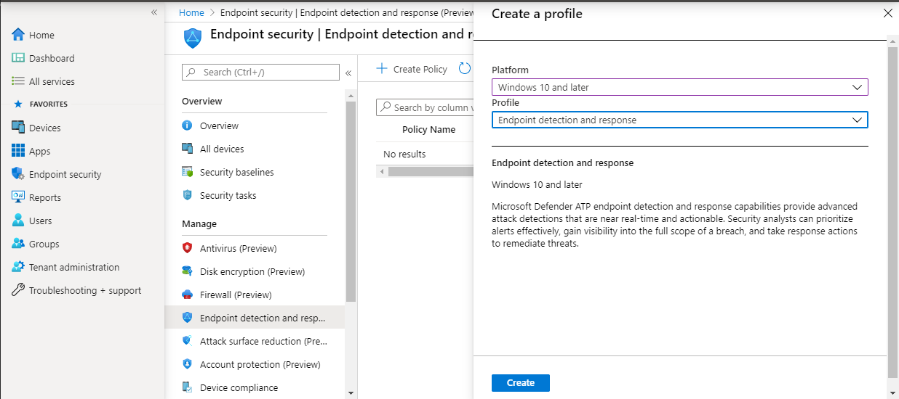
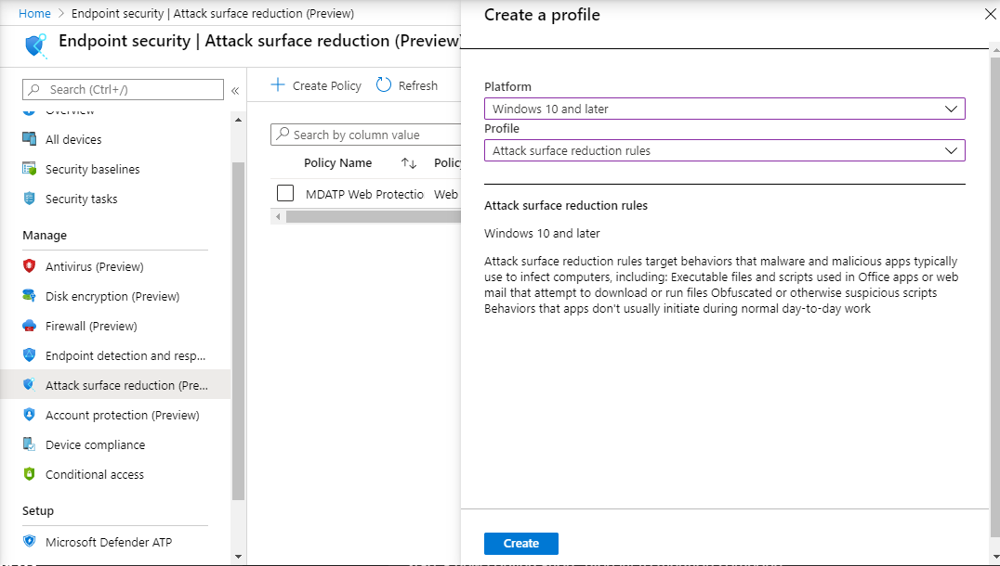

# Intégration à l'aide de Microsoft Endpoint Manager

[!INCLUDE [Microsoft 365 Defender rebranding](../../includes/microsoft-defender.md)]

**S’applique à :**
- [Microsoft Defender pour point de terminaison](https://go.microsoft.com/fwlink/p/?linkid=2154037)
- [Microsoft 365 Defender](https://go.microsoft.com/fwlink/?linkid=2118804)

> Vous voulez découvrir Microsoft Defender pour point de terminaison ? [Inscrivez-vous pour bénéficier d’un essai gratuit.](https://signup.microsoft.com/create-account/signup?products=7f379fee-c4f9-4278-b0a1-e4c8c2fcdf7e&ru=https://aka.ms/MDEp2OpenTrial?ocid=docs-wdatp-exposedapis-abovefoldlink)

Cet article fait partie du guide de déploiement et agit comme un exemple de méthode d’intégration.

Dans la [rubrique Planification,](deployment-strategy.md) plusieurs méthodes ont été fournies pour intégrer des appareils au service. Cette rubrique traite de l’architecture native du cloud.

 *Diagramme des architectures d’environnement*

Bien que Defender pour point de terminaison prend en charge l’intégration de différents points de terminaison et outils, cet article ne les traite pas. Pour plus d’informations sur l’intégration générale à l’aide d’autres outils et méthodes de déploiement pris en charge, voir [vue d’ensemble de l’intégration.](onboarding.md)

[Microsoft Endpoint Manager](/mem/endpoint-manager-overview) est une plateforme de solution qui unifie plusieurs services. Il inclut [des Microsoft Intune](/mem/intune/fundamentals/what-is-intune) pour la gestion des appareils en nuage.

Cette rubrique guide les utilisateurs dans :

- Étape 1 : intégration d’appareils au service en créant un groupe dans Microsoft Endpoint Manager (MEM) pour affecter des configurations sur
- Étape 2 : Configuration de Defender pour les fonctionnalités de point de terminaison à l’aide de Microsoft Endpoint Manager

Ces instructions d’intégration vous guident tout au long des étapes de base suivantes que vous devez suivre lors de l’utilisation Microsoft Endpoint Manager :

- [Identification des appareils ou des utilisateurs cibles](#identify-target-devices-or-users)
  - Création d’Azure Active Directory groupe (utilisateur ou appareil)
- [Création d’un profil de configuration](#step-2-create-configuration-policies-to-configure-microsoft-defender-for-endpoint-capabilities)
  - Dans Microsoft Endpoint Manager, nous vous guiderons dans la création d’une stratégie distincte pour chaque fonctionnalité.

## Ressources

Voici les liens dont vous aurez besoin pour le reste du processus :

- [Portail MEM](https://aka.ms/memac)
- [Centre de sécurité](https://securitycenter.windows.com/)
- [Bases de référence de sécurité Intune](/mem/intune/protect/security-baseline-settings-defender-atp#microsoft-defender)

Pour plus d’informations Microsoft Endpoint Manager, consultez les ressources ci-après :

- [Microsoft Endpoint Manager page](/mem/)
- [Billet de blog sur la convergence d’Intune et configMgr](https://www.microsoft.com/microsoft-365/blog/2019/11/04/use-the-power-of-cloud-intelligence-to-simplify-and-accelerate-it-and-the-move-to-a-modern-workplace/)
- [Vidéo d’introduction sur MEM](https://www.microsoft.com/microsoft-365/blog/2019/11/04/use-the-power-of-cloud-intelligence-to-simplify-and-accelerate-it-and-the-move-to-a-modern-workplace)

## Étape 1 : intégrer des appareils en créant un groupe dans MEM pour affecter des configurations

### Identifier les appareils ou les utilisateurs cibles

Dans cette section, nous allons créer un groupe de test pour affecter vos configurations.

> [!NOTE]
> Intune utilise Azure Active Directory groupes (Azure AD) pour gérer les appareils et les utilisateurs. En tant qu’administrateur Intune, vous pouvez configurer des groupes en fonction des besoins de votre organisation.
>
> Pour plus d’informations, voir [Ajouter des groupes pour organiser les utilisateurs et les appareils.](/mem/intune/fundamentals/groups-add)

### Créer un groupe

1. Ouvrez le portail MEM.

2. Ouvrez **groupes > nouveau groupe.**

    > [!div class="mx-imgBorder"]
    > 

3. Entrez des détails et créez un groupe.

    > [!div class="mx-imgBorder"]
    > 

4. Ajoutez votre utilisateur ou appareil de test.

5. Dans le **volet Groupes >** tous les groupes, ouvrez votre nouveau groupe.

6. Sélectionnez **membres > ajouter des membres.**

7. Recherchez votre utilisateur ou appareil de test et sélectionnez-le.

    > [!div class="mx-imgBorder"]
    > 

8. Votre groupe de test a maintenant un membre à tester.

## Étape 2 : Créer des stratégies de configuration pour configurer microsoft Defender pour les fonctionnalités de point de terminaison

Dans la section suivante, vous allez créer un certain nombre de stratégies de configuration.

Tout d’abord, il s’agit d’une stratégie de configuration qui permet de sélectionner les groupes d’utilisateurs ou d’appareils qui seront intégrés à Defender for Endpoint :

- [Détection et réponse du point de terminaison](#endpoint-detection-and-response)

Ensuite, vous allez continuer en créant différents types de stratégies de sécurité de point de terminaison :

- [Protection de nouvelle génération](#next-generation-protection)
- [Réduction de la surface d’attaque](#attack-surface-reduction---attack-surface-reduction-rules)

### Détection et réponse du point de terminaison

1. Ouvrez le portail MEM.

2. Accédez à **Endpoint security > endpoint detection and response**. Cliquez sur **Créer un profil.**

    > [!div class="mx-imgBorder"]
    > 

3. Sous **Plateforme, sélectionnez Windows 10 et ultérieure, Profil - Détection** de point de terminaison et réponse > créer.

4. Entrez un nom et une description, puis sélectionnez **Suivant.**

    > [!div class="mx-imgBorder"]
    > 

5. Sélectionnez les paramètres selon les besoins, puis sélectionnez **Suivant.**

    > [!div class="mx-imgBorder"]
    > 

    > [!NOTE]
    > Dans cette instance, cela a été automatiquement rempli comme Defender pour point de terminaison a déjà été intégré à Intune. Pour plus d’informations sur l’intégration, voir [Activer Microsoft Defender pour le point de terminaison dans Intune.](/mem/intune/protect/advanced-threat-protection-configure#to-enable-microsoft-defender-atp)
    >
    > L’image suivante illustre ce que vous voyez lorsque Microsoft Defender pour le point de terminaison n’est PAS intégré à Intune :
    >
    > 

6. Ajoutez des balises d’étendue si nécessaire, puis sélectionnez **Suivant.**

    > [!div class="mx-imgBorder"]
    > 

7. Ajoutez un groupe de test en cliquant sur **Sélectionner les groupes à inclure** et choisissez votre groupe, puis sélectionnez **Suivant.**

    > [!div class="mx-imgBorder"]
    > 

8. Examinez et acceptez, puis sélectionnez **Créer.**

    > [!div class="mx-imgBorder"]
    > 

9. Vous pouvez afficher votre stratégie terminée.

    > [!div class="mx-imgBorder"]
    > 

### Protection de nouvelle génération

1. Ouvrez le portail MEM.

2. Accédez **à Endpoint Security > Antivirus > Create Policy**.

    > [!div class="mx-imgBorder"]
    > 

3. Select **Platform - Windows 10 and Later - Windows and Profile - Microsoft Defender Antivirus > Create**.

4. Entrez le nom et la description, puis sélectionnez **Suivant.**

    > [!div class="mx-imgBorder"]
    > 

5. Dans la **page Paramètres** de configuration : définissez les configurations dont vous avez besoin pour Antivirus Microsoft Defender (protection cloud, exclusions, Real-Time protection et correction).

    > [!div class="mx-imgBorder"]
    > 

6. Ajoutez des balises d’étendue si nécessaire, puis sélectionnez **Suivant.**

    > [!div class="mx-imgBorder"]
    > 

7. Sélectionnez les groupes à inclure, affectez à votre groupe de test, puis sélectionnez  **Suivant**.

    > [!div class="mx-imgBorder"]
    > 

8. Examinez et créez, puis sélectionnez **Créer.**

    > [!div class="mx-imgBorder"]
    > 

9. Vous verrez la stratégie de configuration que vous avez créée.

    > [!div class="mx-imgBorder"]
    > 

### Réduction de la surface d’attaque : règles de réduction de la surface d’attaque

1. Ouvrez le portail MEM.

2. Accédez à **Endpoint Security > Attack surface reduction**.

3. Sélectionnez **Créer une stratégie.**

4. Sélectionner **la plateforme - Windows 10 et ultérieures - Profil - Règles** de réduction de la surface d’attaque > créer .

    > [!div class="mx-imgBorder"]
    > 

5. Entrez un nom et une description, puis sélectionnez **Suivant.**

    > [!div class="mx-imgBorder"]
    > 

6. Dans la **page Paramètres de configuration**: définissez les configurations dont vous avez besoin pour les règles de réduction de la surface d’attaque, puis sélectionnez **Suivant.**

    > [!NOTE]
    > Nous allons configurer toutes les règles de réduction de la surface d’attaque sur Audit.
    >
    > Pour plus d’informations, voir [Règles de réduction de la surface d’attaque.](attack-surface-reduction.md)

    > [!div class="mx-imgBorder"]
    > 

7. Ajoutez des balises d’étendue selon les besoins, puis sélectionnez **Suivant.**

    > [!div class="mx-imgBorder"]
    > 

8. Sélectionnez les groupes à inclure et à affecter au groupe de test, puis sélectionnez  **Suivant**.

    > [!div class="mx-imgBorder"]
    > 

9. Examinez les détails, puis sélectionnez **Créer.**

    > [!div class="mx-imgBorder"]
    > 

10. Afficher la stratégie.

    > [!div class="mx-imgBorder"]
    > 

### Réduction de la surface d’attaque - Protection Web

1. Ouvrez le portail MEM.

2. Accédez à **Endpoint Security > Attack surface reduction**.

3. Sélectionnez **Créer une stratégie.**

4. Select **Windows 10 and Later - Web protection > Create**.

    > [!div class="mx-imgBorder"]
    > 

5. Entrez un nom et une description, puis sélectionnez **Suivant.**

    > [!div class="mx-imgBorder"]
    > 

6. Dans la **page Paramètres de configuration**: définissez les configurations dont vous avez besoin pour la protection web, puis sélectionnez **Suivant.**

    > [!NOTE]
    > Nous configurons la protection Web sur Bloquer.
    >
    > Pour plus d’informations, voir [Web Protection](web-protection-overview.md).

    > [!div class="mx-imgBorder"]
    > 

7. Ajoutez **des balises d’étendue comme > suivant**.

    > [!div class="mx-imgBorder"]
    > 

8. Sélectionnez **Affecter au groupe de test > Suivant**.

    > [!div class="mx-imgBorder"]
    > 

9. Select **Review and Create > Create**.

    > [!div class="mx-imgBorder"]
    > 

10. Afficher la stratégie.

    > [!div class="mx-imgBorder"]
    > 

## Valider les paramètres de configuration

### Confirmer que les stratégies ont été appliquées

Une fois que la stratégie de configuration a été affectée, l’application prend un certain temps.

Pour plus d’informations sur le minutage, consultez [les informations de configuration d’Intune.](/mem/intune/configuration/device-profile-troubleshoot#how-long-does-it-take-for-devices-to-get-a-policy-profile-or-app-after-they-are-assigned)

Pour vérifier que la stratégie de configuration a été appliquée à votre périphérique de test, suivez le processus suivant pour chaque stratégie de configuration.

1. Ouvrez le portail MEM et accédez à la stratégie pertinente, comme indiqué dans les étapes ci-dessus. L’exemple suivant illustre les paramètres de protection nouvelle génération.

    > [!div class="mx-imgBorder"]
    > 

2. Sélectionnez la **stratégie de configuration** pour afficher l’état de la stratégie.

    > [!div class="mx-imgBorder"]
    > 

3. Sélectionnez  **État de l’appareil** pour voir l’état.

    > [!div class="mx-imgBorder"]
    > 

4. Sélectionnez  **État de l’utilisateur** pour voir l’état.

    > [!div class="mx-imgBorder"]
    > 

5. Sélectionnez  **l’état par paramètre** pour voir l’état.

    > [!TIP]
    > Cet affichage est très utile pour identifier les paramètres qui entrent en conflit avec une autre stratégie.

    > [!div class="mx-imgBorder"]
    > 

### Confirmez protection évolutive des points de terminaison

1. Avant d’appliquer la configuration, le service Defender pour Endpoint Protection ne doit pas être démarré.

    > [!div class="mx-imgBorder"]
    > 

2. Une fois la configuration appliquée, le service Defender for Endpoint Protection doit être démarré.

    > [!div class="mx-imgBorder"]
    > 

3. Une fois que les services sont en cours d’exécution sur l’appareil, l’appareil apparaît dans le Centre de sécurité Microsoft Defender.

    > [!div class="mx-imgBorder"]
    > 

### Confirmer la protection nouvelle génération

1. Avant d’appliquer la stratégie sur un périphérique de test, vous devez être en mesure de gérer manuellement les paramètres, comme illustré ci-dessous.

    > [!div class="mx-imgBorder"]
    > 

2. Une fois la stratégie appliquée, vous ne devez pas être en mesure de gérer manuellement les paramètres.

    > [!NOTE]
    > Dans l’image **suivante,** activer la protection cloud et activer la **protection** en temps réel sont affichés comme gérés.

    > [!div class="mx-imgBorder"]
    > 

### Confirmer la Réduction de la surface d’attaque : règles de réduction de la surface d’attaque

1. Avant d’appliquer la stratégie sur un périphérique de test, stylet une fenêtre PowerShell et tapez `Get-MpPreference` .

2. Cela doit répondre avec les lignes suivantes sans contenu :

    > AttackSurfaceReductionOnlyExclusions :
    >
    > AttackSurfaceReductionRules_Actions :
    >
    > AttackSurfaceReductionRules_Ids :

    

3. Après avoir appliqué la stratégie sur un périphérique de test, ouvrez un Windows PowerShell et tapez `Get-MpPreference` .

4. Cela doit répondre avec les lignes suivantes avec le contenu comme indiqué ci-dessous :

    

### Confirmer la Réduction de la surface d’attaque - Protection Web

1. Sur le périphérique de test, ouvrez une Windows PowerShell et tapez `(Get-MpPreference).EnableNetworkProtection` .

2. Cela doit répondre avec un 0 comme illustré ci-dessous.

    

3. Après avoir appliqué la stratégie, ouvrez un Windows PowerShell et tapez `(Get-MpPreference).EnableNetworkProtection` .

4. Cela doit répondre avec un 1, comme illustré ci-dessous.

    
