# <a name="create-a-notification-rule-when-a-local-onboarding-or-offboarding-script-is-used"></a>Créer une règle de notification lorsqu’un script d’intégration ou de mise hors-carte local est utilisé

[!INCLUDE [Microsoft 365 Defender rebranding](../../includes/microsoft-defender.md)]


**S’applique à :**
- [Microsoft Defender pour point de terminaison](https://go.microsoft.com/fwlink/p/?linkid=2154037)
- [Microsoft 365 Defender](https://go.microsoft.com/fwlink/?linkid=2118804)

> Vous voulez découvrir Microsoft Defender pour point de terminaison ? [Inscrivez-vous pour bénéficier d’un essai gratuit.](https://signup.microsoft.com/create-account/signup?products=7f379fee-c4f9-4278-b0a1-e4c8c2fcdf7e&ru=https://aka.ms/MDEp2OpenTrial?ocid=docs-wdatp-exposedapis-abovefoldlink)

[!include[Microsoft Defender for Endpoint API URIs for US Government](../../includes/microsoft-defender-api-usgov.md)]

[!include[Improve request performance](../../includes/improve-request-performance.md)]


Créez une règle de notification afin que, lorsqu’un script d’intégration ou de déclassage local soit utilisé, vous soyez averti.

## <a name="before-you-begin"></a>Avant de commencer

Vous devez avoir accès à :

- Microsoft Flow (Flow plan 1 au minimum). Pour plus d’informations, [voir Flow page de tarification.](https://flow.microsoft.com/pricing/)
- Tableau ou SharePoint Liste ou bibliothèque /SQL DB Azure.

## <a name="create-the-notification-flow"></a>Créer le flux de notification

1. Dans [flow.microsoft.com](https://flow.microsoft.com/).

2. Accédez **à Mes flux > Nouveau > programmé - à partir d’un espace vide.**

    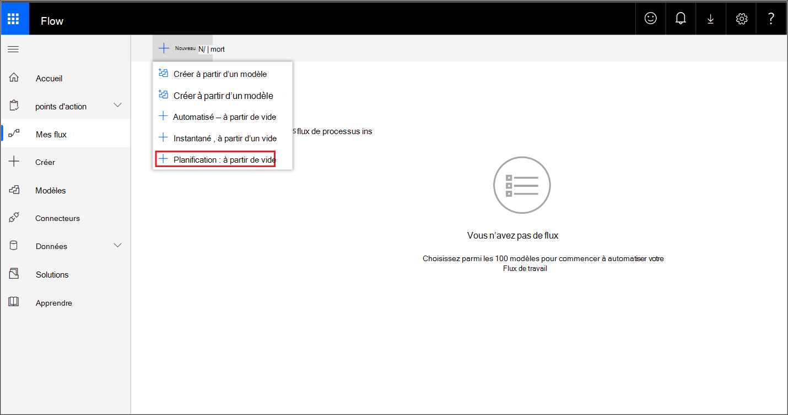

3. Créez un flux programmé.
   1. Entrez un nom de flux.
   2. Spécifiez le début et l’heure.
   3. Spécifiez la fréquence. Par exemple, toutes les 5 minutes.

    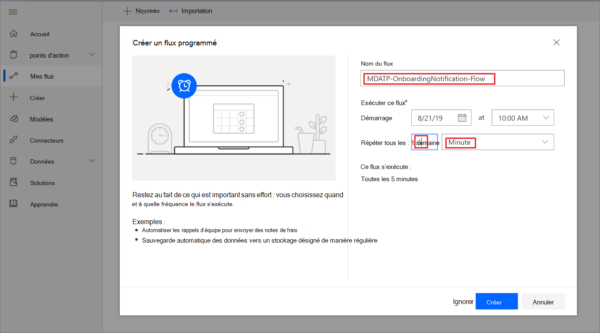

4. Sélectionnez le bouton + pour ajouter une nouvelle action. La nouvelle action sera une demande HTTP à l’API du centre de sécurité Defender for Endpoint. Vous pouvez également le remplacer par le « connecteur WDATP » prédéfait (action : « Ordinateurs - Obtenir la liste des ordinateurs »).

    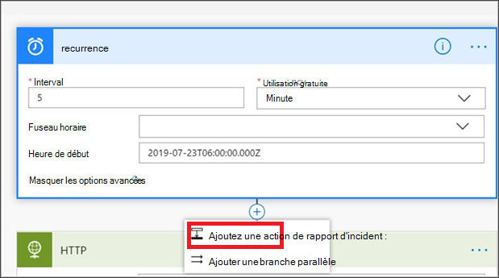

5. Entrez les champs HTTP suivants :

   - Méthode : « GET » comme valeur pour obtenir la liste des appareils.
   - URI : Entrez `https://api.securitycenter.microsoft.com/api/machines` .
   - Authentification : sélectionnez « Active Directory OAuth ».
   - Client : connectez-vous et accédez à Azure Active Directory > inscriptions d’application et obtenez la valeur https://portal.azure.com de l’ID de client. 
   - Public : `https://securitycenter.onmicrosoft.com/windowsatpservice\`
   - ID client : connectez-vous et accédez à Azure Active Directory >'inscription de l’application et obtenez la valeur https://portal.azure.com de l’ID client. 
   - Type d’informations d’identification : sélectionnez « Secret ».
   - Secret : connectez-vous et accédez à https://portal.azure.com **Azure Active Directory > inscriptions d’application** et obtenez la valeur de l’ID de client.

    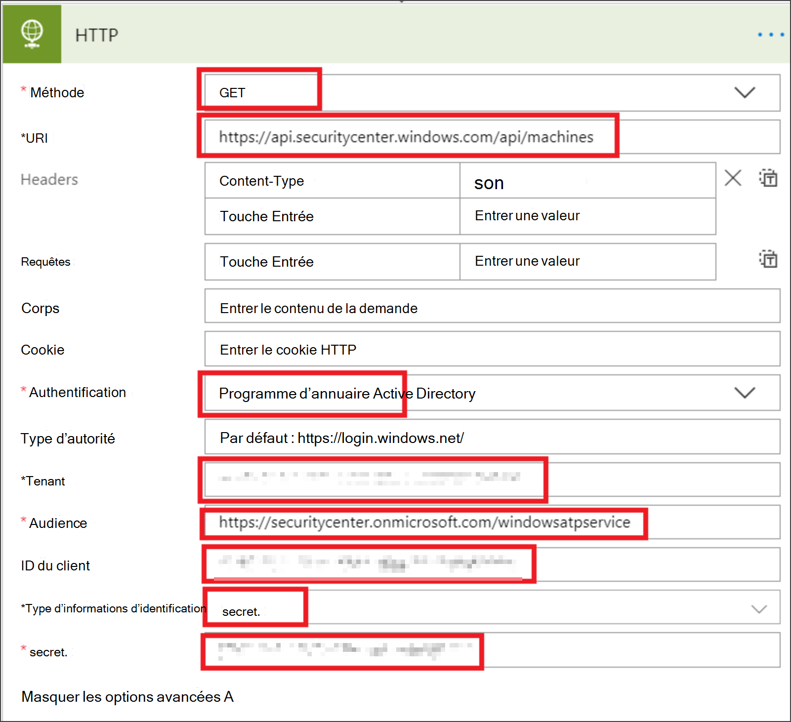

6. Ajoutez une nouvelle étape en sélectionnant Ajouter une **nouvelle action,** puis recherchez opérations de **données** et sélectionnez Analyse **JSON**.

    

7. Ajouter le corps dans **le champ** Contenu.

    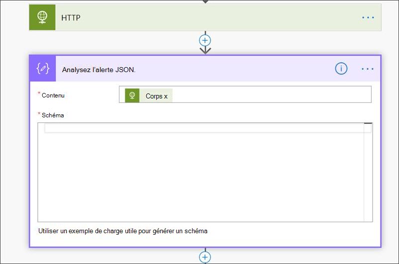

8. Sélectionnez **l’exemple de charge utile Utiliser pour générer un lien de** schéma.

    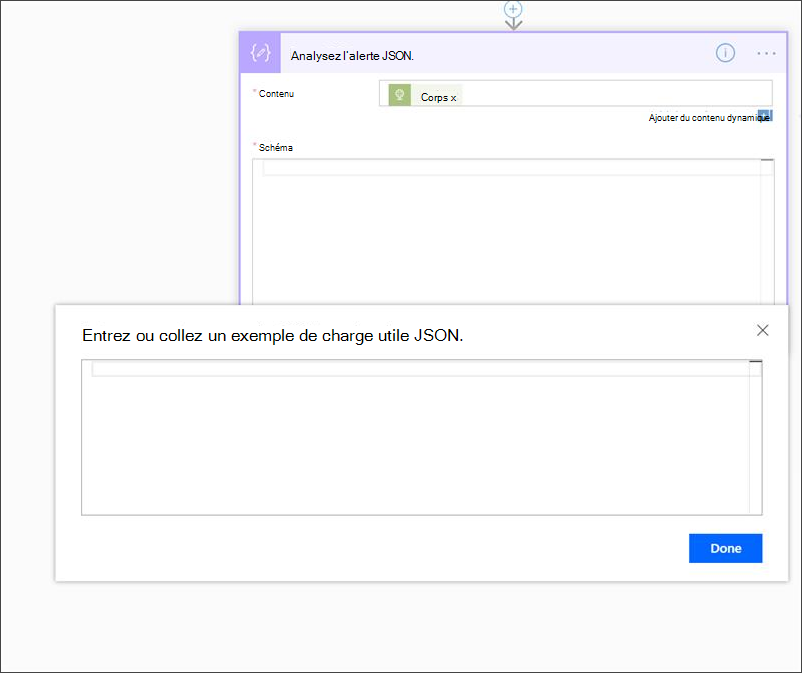

9. Copiez et collez l’extrait de code JSON suivant :

    ```json
    {
        "type": "object",
        "properties": {
            "@@odata.context": {
                "type": "string"
            },
            "value": {
                "type": "array",
                "items": {
                    "type": "object",
                    "properties": {
                        "id": {
                            "type": "string"
                        },
                        "computerDnsName": {
                            "type": "string"
                        },
                        "firstSeen": {
                            "type": "string"
                        },
                        "lastSeen": {
                            "type": "string"
                        },
                        "osPlatform": {
                            "type": "string"
                        },
                        "osVersion": {},
                        "lastIpAddress": {
                            "type": "string"
                        },
                        "lastExternalIpAddress": {
                            "type": "string"
                        },
                        "agentVersion": {
                            "type": "string"
                        },
                        "osBuild": {
                            "type": "integer"
                        },
                        "healthStatus": {
                            "type": "string"
                        },
                        "riskScore": {
                            "type": "string"
                        },
                        "exposureScore": {
                            "type": "string"
                        },
                        "aadDeviceId": {},
                        "machineTags": {
                            "type": "array"
                        }
                    },
                    "required": [
                        "id",
                        "computerDnsName",
                        "firstSeen",
                        "lastSeen",
                        "osPlatform",
                        "osVersion",
                        "lastIpAddress",
                        "lastExternalIpAddress",
                        "agentVersion",
                        "osBuild",
                        "healthStatus",
                        "rbacGroupId",
                        "rbacGroupName",
                        "riskScore",
                        "exposureScore",
                        "aadDeviceId",
                        "machineTags"
                    ]
                }
            }
        }
    }

    ```

10. Extrayez les valeurs de l’appel JSON et vérifiez si le ou les appareils intégrés sont / sont déjà inscrits dans la liste SharePoint par exemple :

    - Si oui, aucune notification ne sera déclenchée
    - Si non, enregistre le ou les nouveaux appareils intégrés dans la liste SharePoint et une notification est envoyée à l’administrateur de Defender for Endpoint

    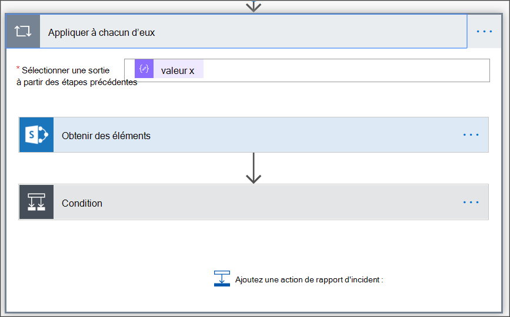

    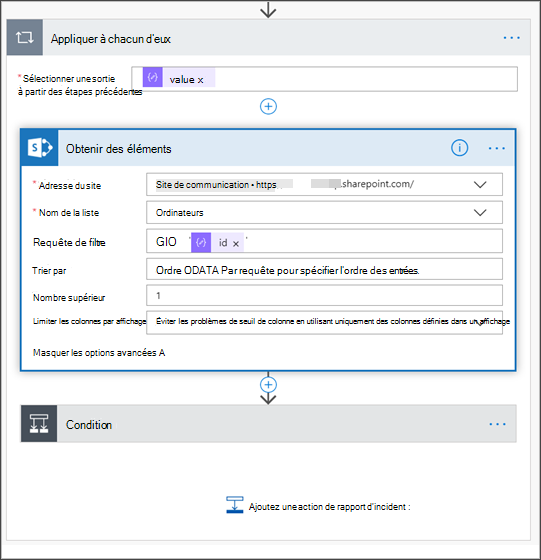

11. Under **Condition**, add the following expression: « length(body('Get_items')?[' value']) » et définissez la condition sur 0.

    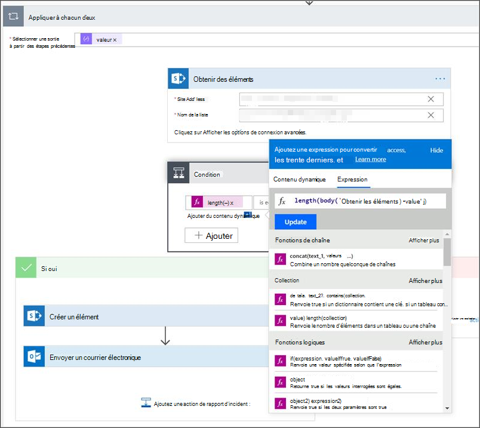
     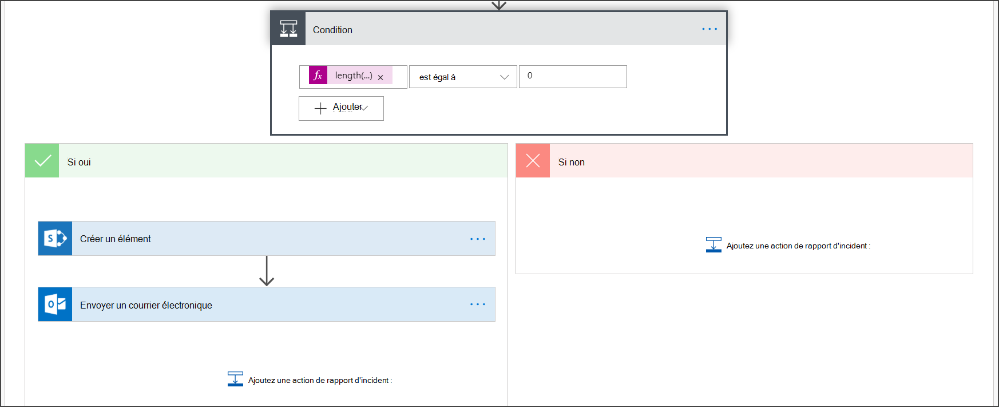
     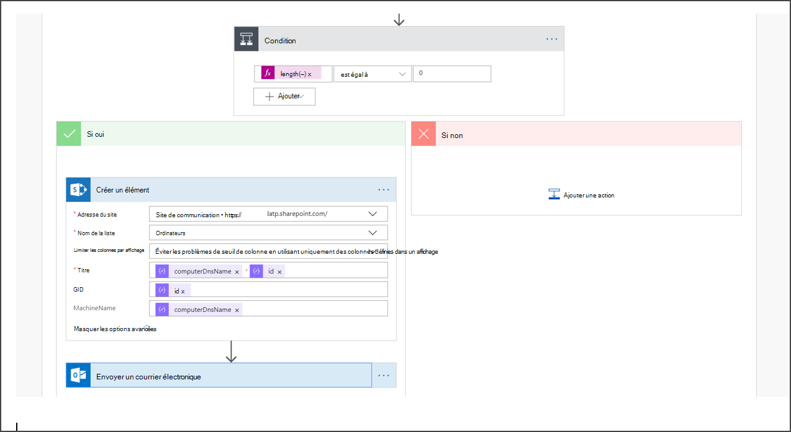
     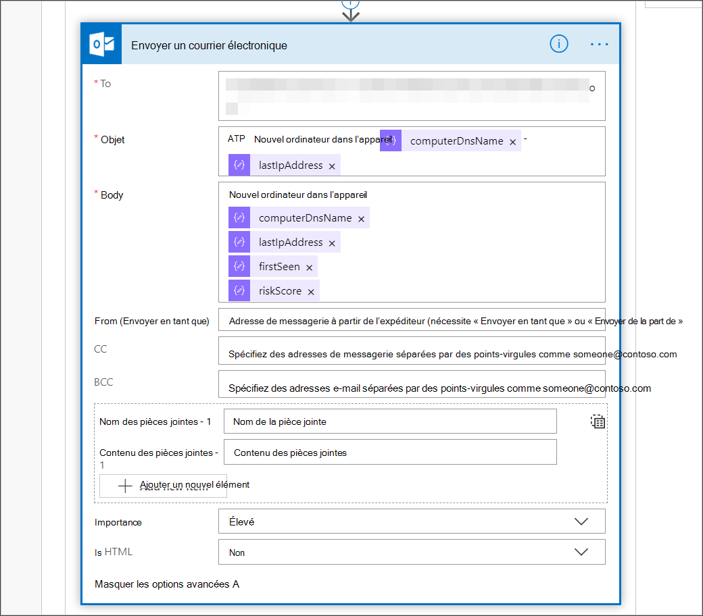

## <a name="alert-notification"></a>Notification d’alerte

L’image suivante est un exemple de notification par courrier électronique.

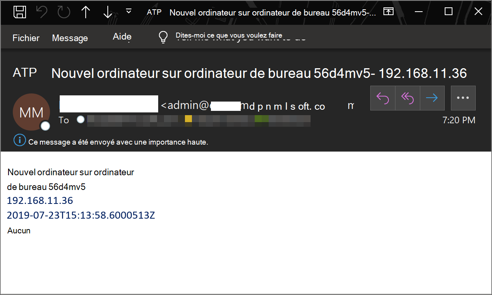

## <a name="tips"></a>Conseils

- Vous pouvez filtrer ici à l’aide de lastSeen uniquement :
  - Toutes les 60 min :
    - Prenez tous les appareils vus pour la dernière fois au cours des 7 derniers jours.

- Pour chaque appareil :
  - Si la dernière propriété vue se trouve sur l’intervalle d’une heure de [-7 jours, -7days + 60 minutes] -> alerte pour la possibilité d’interruption de l’utilisation.
  - Si le premier aperçu a lieu au cours de l’heure >'alerte d’intégration.

Dans cette solution, vous n’aurez pas d’alertes en double : il existe des locataires qui ont de nombreux appareils. L’obtention de tous ces appareils peut être très coûteuse et nécessiter une pagination.

Vous pouvez le fractionner en deux requêtes :

1. Pour laboarding, prenez uniquement cet intervalle à l’aide de la $filter OData et notifiez uniquement si les conditions sont remplies.
2. Prenez tous les appareils vus pour la dernière fois au cours de l’heure passée et vérifiez leur première propriété vue (si la première propriété vue se trouve au cours de l’heure passée, la dernière vue doit également être là).
