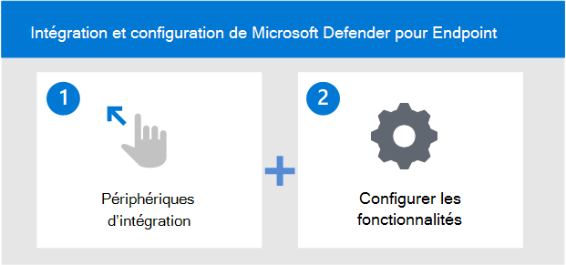

# Intégrer au service Microsoft Defender pour point de terminaison

[!INCLUDE [Microsoft 365 Defender rebranding](../../includes/microsoft-defender.md)]

**S’applique à :**
- [Microsoft Defender pour point de terminaison](https://go.microsoft.com/fwlink/p/?linkid=2154037)
- [Microsoft 365 Defender](https://go.microsoft.com/fwlink/?linkid=2118804)

> Vous voulez découvrir Microsoft Defender pour point de terminaison ? [Inscrivez-vous pour bénéficier d’un essai gratuit.](https://signup.microsoft.com/create-account/signup?products=7f379fee-c4f9-4278-b0a1-e4c8c2fcdf7e&ru=https://aka.ms/MDEp2OpenTrial?ocid=docs-wdatp-exposedapis-abovefoldlink)

Découvrez les différentes phases du déploiement de Microsoft Defender pour Endpoint et comment configurer les fonctionnalités au sein de la solution.

Voici les étapes à suivre pour déployer Defender pour Endpoint :

- Étape 1 : Intégrer des points de terminaison au service
- Étape 2 : Configurer les fonctionnalités

## Étape 1 : Intégrer des points de terminaison à l’aide de l’un des outils de gestion pris en charge

La [rubrique Planifier le](deployment-strategy.md) déploiement décrit les étapes générales à suivre pour déployer Defender pour Endpoint.

Regardez cette vidéo pour obtenir une vue d’ensemble rapide du processus d’intégration et en savoir plus sur les outils et méthodes disponibles.

> [!VIDEO https://www.microsoft.com/videoplayer/embed/RE4bGqr]

Après avoir identifié votre architecture, vous devez choisir la méthode de déploiement à utiliser. L’outil de déploiement que vous choisissez influence la façon dont vous intégrerez les points de terminaison au service.

### Options de l’outil d’intégration

Le tableau suivant répertorie les outils disponibles en fonction du point de terminaison que vous devez intégrer.

| Point de terminaison     | Options de l’outil                       |
|--------------|------------------------------------------|
| **Fenêtres**  |  [Script local (jusqu’à 10 appareils)](configure-endpoints-script.md)    [Stratégie de groupe](configure-endpoints-gp.md)    [Microsoft Endpoint Manager/ Gestionnaire de périphériques mobiles](configure-endpoints-mdm.md)   [Microsoft Endpoint Configuration Manager](configure-endpoints-sccm.md)   [Scripts VDI](configure-endpoints-vdi.md)   [Intégration à Microsoft Defender pour le cloud](azure-server-integration.md) |
| **MacOS**    | [Scripts locaux](mac-install-manually.md)   [Microsoft Endpoint Manager](mac-install-with-intune.md)   [JAMF Pro](mac-install-with-jamf.md)   [Gestion des appareils mobiles](mac-install-with-other-mdm.md) |
| **Serveur Linux** | [Script local](linux-install-manually.md)   [Sondent](linux-install-with-puppet.md)   [Ansible](linux-install-with-ansible.md)|
| **iOS**      | [Microsoft Endpoint Manager](ios-install.md)                                |
| **Android**  | [Microsoft Endpoint Manager](android-intune.md)               | 

## Étape 2 : Configurer les fonctionnalités
Après avoir intégré les points de terminaison, vous allez configurer les fonctionnalités. Le tableau suivant répertorie les composants que vous pouvez configurer. Choisissez les composants que vous souhaitez utiliser et supprimez ceux qui ne s’appliquent pas.

| Fonctionnalité | Description |
|-|-|
| [Endpoint Detection & Response (PEPT)](overview-endpoint-detection-response.md) | Les fonctionnalités de protection évolutive des points de terminaison de Defender for Endpoint fournissent des détections d’attaques avancées quasiment en temps réel et actionnables. Les analystes de la sécurité peuvent hiérarchiser efficacement les alertes, avoir une meilleure visibilité de l’étendue d’une faille et prendre des mesures correctives pour remédier aux menaces. |
| [Gestion & des menaces et des vulnérabilités (TVM)](next-gen-threat-and-vuln-mgt.md) | Threat & Vulnerability Management est un composant de Microsoft Defender pour endpoint et fournit aux administrateurs de sécurité et aux équipes d’opérations de sécurité une valeur unique, notamment : - Protection évolutive des points de terminaison en temps réel (PEPT ) informations corrélées avec les vulnérabilités des points de terminaison : contexte de vulnérabilité d’appareil précieux pendant les enquêtes d’incident : processus de correction intégrés via Microsoft Intune et Microsoft System Center Configuration Manager.  |
| [Protection de nouvelle génération (NGP)](microsoft-defender-antivirus-windows.md) | Antivirus Microsoft Defender est une solution anti-programme malveillant intégrée qui fournit une protection nouvelle génération pour les ordinateurs de bureau, les ordinateurs portables et les serveurs. L’antivirus Microsoft Defender inclut les éléments suivants :   -Protection cloud pour la détection et le blocage quasi instantanés des menaces nouvelles et émergentes. Tout comme l’apprentissage automatique et le système Intelligent Security Graph, la protection fournie par le cloud fait partie des technologies nouvelle génération intégrées à l’antivirus Microsoft Defender.    - Analyse toujours continue à l’aide de la surveillance avancée du comportement des fichiers et des processus et d’autres heuristiques (également appelée « protection en temps réel »).   - Mises à jour de protection dédiées basées sur l’apprentissage automatique, l’analyse humaine et automatisée du Big Data et la recherche approfondie de résistance aux menaces. |
| [Réduction de la surface d’attaque (ASR)](overview-attack-surface-reduction.md) | Les fonctionnalités de réduction de la surface d’attaque dans Microsoft Defender pour point de terminaison aident à protéger les appareils et les applications de l’organisation contre les menaces nouvelles et émergentes. |
| [Auto Investigation & Remediation (AIR)](automated-investigations.md) | Microsoft Defender pour le point de terminaison utilise des examens automatisés pour réduire considérablement le volume d’alertes qui doivent être examinées individuellement. La fonctionnalité d’investigation automatisée exploite divers algorithmes d’inspection et processus utilisés par les analystes (tels que les playbooks) pour examiner les alertes et prendre des mesures correctives immédiates pour résoudre les violations. Cela réduit considérablement les volumes d’alertes, ce qui permet aux experts en matière de sécurité de se concentrer sur des menaces plus sophistiquées et d’autres initiatives de grande valeur. |
| [Spécialistes des menaces Microsoft (MTE)](microsoft-threat-experts.md) | Spécialistes des menaces Microsoft est un service de recherche géré qui fournit des centres d’opérations de sécurité (SOC) avec une analyse et une surveillance de niveau expert pour les aider à s’assurer que les menaces critiques dans leurs environnements uniques ne sont pas manquées.      |

Après avoir intégré les points de terminaison, vous allez configurer les différentes fonctionnalités telles que protection évolutive des points de terminaison, la protection nouvelle génération et la réduction de la surface d’attaque.

## Exemples de déploiements

Dans ce guide de déploiement, nous allons vous guider tout au long de l’utilisation de deux outils de déploiement pour intégrer des points de terminaison et configurer des fonctionnalités.

Les outils de l’exemple de déploiement sont :

- [Intégration à l'aide de Microsoft Endpoint Configuration Manager](onboarding-endpoint-configuration-manager.md)
- [Intégration à l'aide de Microsoft Endpoint Manager](onboarding-endpoint-manager.md)

À l’aide des outils de déploiement mentionnés ci-dessus, vous serez guidé dans la configuration des fonctionnalités defender pour point de terminaison suivantes :

- Détection de point de terminaison et configuration de la réponse
- Configuration de la protection nouvelle génération
- Configuration de la réduction de la surface d’attaque

## Sujets connexes

- [Intégration à l'aide de Microsoft Endpoint Configuration Manager](onboarding-endpoint-configuration-manager.md)
- [Intégration à l'aide de Microsoft Endpoint Manager](onboarding-endpoint-manager.md)
- [Documents sécurisés dans Microsoft 365 E5](../office-365-security/safe-docs.md)
