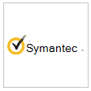

# Applications partenaires dans Microsoft Defender pour point de terminaison 

[!INCLUDE [Microsoft 365 Defender rebranding](../../includes/microsoft-defender.md)]

**S’applique à :**
- [Microsoft Defender pour point de terminaison](https://go.microsoft.com/fwlink/p/?linkid=2154037)
- [Microsoft 365 Defender](https://go.microsoft.com/fwlink/?linkid=2118804)

> Vous souhaitez découvrir Microsoft Defender pour le point de terminaison ? [Inscrivez-vous à un essai gratuit.](https://www.microsoft.com/microsoft-365/windows/microsoft-defender-atp?ocid=docs-wdatp-exposedapis-abovefoldlink)

Defender pour le point de terminaison prend en charge des applications tierces pour améliorer les fonctionnalités de détection, d’examen et d’intelligence contre les menaces de la plateforme.

La prise en charge de solutions tierces permet de rationaliser, d’intégrer et d’orchestrer davantage les défenses d’autres fournisseurs avec Microsoft Defender for Endpoint ; permettre aux équipes de sécurité de répondre efficacement mieux aux menaces modernes.

Microsoft Defender for Endpoint s’intègre de façon transparente aux solutions de sécurité existantes. L’intégration offre une intégration avec les solutions suivantes, telles que :

- SIEM
- Solutions de gestion des tickets et des services it
- Fournisseurs de services de sécurité gérés (MSSP)
- Ingestions et correspondances des indicateurs IoC
- Examen et correction automatisés des appareils en fonction des alertes externes
- Intégration avec les systèmes d’orchestration de sécurité et de réponse d’automatisation (CASER)

## Applications pris en charge

### Informations et analyses de sécurité

Logo |Nom du partenaire   | Description 
:---|:---|:---
| [Plateforme AttackIQ](https://go.microsoft.com/fwlink/?linkid=2103502) | La plateforme AttackIQ valide que Defender pour endpoint est configuré correctement en lançant des attaques continues en toute sécurité sur les ressources de production
| [AzureSentinel](https://go.microsoft.com/fwlink/?linkid=2135705) | Diffuser des alertes de Microsoft Defender pour point de terminaison dans Azure Sentinel 
 | [Cymulate](https://go.microsoft.com/fwlink/?linkid=2135574)| Corréler les résultats de Defender pour les points de terminaison avec des attaques simulées pour valider la détection précise et les actions de réponse efficaces
 | [Sécurité élastique](https://go.microsoft.com/fwlink/?linkid=2139303) | La sécurité élastique est une solution gratuite et ouverte pour la prévention, la détection et la réponse aux menaces
 | [IBM QRadar](https://go.microsoft.com/fwlink/?linkid=2113903) | Configurer IBM QRadar pour collecter les détections à partir de Defender for Endpoint 
 | [Micro Focus ArcSight](https://go.microsoft.com/fwlink/?linkid=2113548) | Utiliser Micro Focus ArcSight pour tirer Defender pour les détections de points de terminaison
 | [RSA NetWitness](https://go.microsoft.com/fwlink/?linkid=2118566) | Stream Defender for Endpoint Alerts to RSA NetWitness using Microsoft Graph Security API
 | [SafeBreach](https://go.microsoft.com/fwlink/?linkid=2114114)| Obtenir une visibilité sur les événements de sécurité de Point de terminaison Defender qui sont automatiquement corrélés avec les simulations SafeBreach
 | [Contrôle de vulnérabilité Skybox](https://go.microsoft.com/fwlink/?linkid=2127467) | Le contrôle de vulnérabilité Skybox coupe le bruit des gestion des vulnérabilités, en corrélant le contexte de l’entreprise, du réseau et des menaces pour découvrir vos vulnérabilités les plus risquées
 | [Splunk](https://go.microsoft.com/fwlink/?linkid=2129805) | Le module complémentaire Defender pour le point de terminaison permet aux utilisateurs splunk d’inger toutes les alertes et les informations de prise en charge pour leur Splunk
 | [XM Cyber](https://go.microsoft.com/fwlink/?linkid=2136700) | Hiérarchiser votre réponse à une alerte en fonction des facteurs de risque et des ressources de valeur élevée

### Orchestration et automatisation

Logo |Nom du partenaire   | Description 
:---|:---|:---
 | [CyberSponse CyOps](https://go.microsoft.com/fwlink/?linkid=2115943) | CyOps s’intègre à Defender for Endpoint pour automatiser les manuels de réponse aux incidents à haut débit des clients
 | [Risque delta ActiveEye](https://go.microsoft.com/fwlink/?linkid=2127468) | Le risque delta, l’un des principaux fournisseurs de services de sécurité et soc-as-a-Service, intègre Defender pour Endpoint à sa plateforme NATIVE DU CLOUD, ActiveEye.
 | [Demisto, une société de réseaux Palo Alto](https://go.microsoft.com/fwlink/?linkid=2108414) | Demisto s’intègre à Defender for Endpoint pour permettre aux équipes de sécurité d’orchestrer et d’automatiser la surveillance, l’enrichissement et la réponse de la sécurité des points de terminaison
 | [Microsoft Flow & fonctions Azure](https://go.microsoft.com/fwlink/?linkid=2114300) | Utiliser les connecteurs Defender pour les points de terminaison pour Azure Logic Apps & Microsoft Flow procédures de sécurité
 | [Rapid7 InsightConnect](https://go.microsoft.com/fwlink/?linkid=2116040) | InsightConnect s’intègre à Defender for Endpoint pour accélérer, rationaliser et intégrer vos processus de sécurité longs
 | [ServiceNow](https://go.microsoft.com/fwlink/?linkid=2135621) | Ing d’alertes dans la solution Opérations de sécurité ServiceNow basée sur l’intégration de l’API microsoft Graph
 | [Sous-groupe](https://go.microsoft.com/fwlink/?linkid=2113902) | Optimiser les fonctionnalités de réponse aux incidents en utilisant TogetherIng Et Defender pour Endpoint

### Veille contre les menaces

Logo |Nom du partenaire   | Description 
:---|:---|:---
 | [MISP (Malware Information Sharing Platform)](https://go.microsoft.com/fwlink/?linkid=2127543) | Intégrer des indicateurs de menace à partir de la plateforme de partage Open Source Threat Intelligence dans votre environnement Defender for Endpoint
 | [Réseaux Palo Alto](https://go.microsoft.com/fwlink/?linkid=2099582) | Enrich your endpoint protection by extending Autofocus and other threat feeds to Defender for Endpoint using MineMeld
 | [ThreatConnect](https://go.microsoft.com/fwlink/?linkid=2114115) | Alerte et/ou blocage de l’intelligence contre les menaces personnalisée à partir de playbooks ThreatConnect utilisant Defender pour les indicateurs de point de terminaison

### Sécurité réseau
Logo |Nom du partenaire   | Description 
:---|:---|:---
 | [Aruba ClearPass Policy Manager](https://go.microsoft.com/fwlink/?linkid=2127544) | S’assurer que Defender pour le point de terminaison est installé et mis à jour sur chaque point de terminaison avant d’autoriser l’accès au réseau
 | [Hexagone bleu pour le réseau](https://go.microsoft.com/fwlink/?linkid=2104613) | Blue Hexagon a créé la première plateforme d’apprentissage profond en temps réel du secteur pour la protection contre les menaces réseau
 | [CyberMDX](https://go.microsoft.com/fwlink/?linkid=2135620) | Cyber MDX intègre la visibilité complète des biens de santé, la prévention des menaces et le repose dans votre environnement Defender for Endpoint
 | [Protection GLOS](https://go.microsoft.com/fwlink/?linkid=2156763) | La protection FENS utilise la connaissance faisant autorité de l’infrastructure des attaquants pour protéger de manière proactive Microsoft Defender pour les points de terminaison des points de terminaison contre les cyberattaques
 |[Détection et réponse du réseau Vectra (NDR)](https://go.microsoft.com/fwlink/?linkid=866934)| Vectra applique une recherche de sécurité & ident de l’IA pour détecter les cyberattaques et y répondre en temps réel

### Multiplateforme
Logo |Nom du partenaire   | Description 
:---|:---|:---
| [Bitdefender](https://go.microsoft.com/fwlink/?linkid=860032)| Bitdefender GravityZone est une plateforme de protection de point de terminaison nouvelle génération en couches offrant une protection complète contre la gamme complète des cybermenaces sophistiquées
 | [Better Mobile](https://go.microsoft.com/fwlink/?linkid=2086214)| Solution MTD basée sur l’IA pour arrêter les menaces mobiles & hameçonnage. Navigation internet privée pour protéger la confidentialité des utilisateurs 
| [Corrata](https://go.microsoft.com/fwlink/?linkid=2081148) | Solution mobile : protéger vos appareils mobiles avec une visibilité et un contrôle granulaires de Corrata 
| [Point d’observation](https://go.microsoft.com/fwlink/?linkid=866935)| Obtenir la télémétrie Protection mobile contre les menaces de recherche pour les appareils mobiles Android et iOS
 | [Symantec Endpoint Protection Mobile](https://go.microsoft.com/fwlink/?linkid=2090992)| SEP Mobile permet aux entreprises de prévoir, détecter et prévenir les menaces et vulnérabilités de sécurité sur les appareils mobiles 
| [Zimperium](https://go.microsoft.com/fwlink/?linkid=2118044)|Étendre votre defender pour point de terminaison à iOS et Android avec Machine Learning protection contre les menaces mobiles basée sur Machine Learning mobile

## Autres intégrations

Logo |Nom du partenaire   | Description 
:---|:---|:---
| [Cyren Web Filter](https://go.microsoft.com/fwlink/?linkid=2108221)| Améliorer votre defender pour point de terminaison avec le filtrage web avancé
| [Morphisec](https://go.microsoft.com/fwlink/?linkid=2086215)| Fournit une protection avancée contre les menaces pour la protection avancée contre les menaces en déplacement. Intègre les données d’investigation directement dans les tableaux de bord du Centre de sécurité WD pour vous aider à hiérarchiser les alertes, à déterminer le score de risque de l’appareil et à visualiser la chronologie complète des attaques, y compris les informations de mémoire interne
| [CLOUD DE LA RESO](https://go.microsoft.com/fwlink/?linkid=862988)| Fournit des analyses d’investigation en direct à la demande à l’aide d’une base de signatures axée sur les menaces persistantes

## Intégration SIEM
Defender pour le point de terminaison prend en charge l’intégration SIEM par le biais de différentes méthodes. Cela peut inclure une interface système SIEM spécialisée avec des connecteurs standard, une API d’alerte générique activant des implémentations personnalisées et une API d’action activant la gestion de l’état des alertes.  Pour plus d’informations, voir [Activer l’intégration SIEM.](enable-siem-integration.md)

## Gestion des tickets et du service it 
L’intégration de solutions de gestion des tickets permet d’implémenter des processus de réponse manuelle et automatique. Defender pour le point de terminaison peut vous aider à créer automatiquement des tickets lorsqu’une alerte est générée et à résoudre les alertes lorsque les tickets sont fermés à l’aide de l’API d’alertes. 

## Intégration de l’orchestration de sécurité et de la réponse d’automatisation (CASER) 
Les solutions d’orchestration peuvent aider à créer des playbooks et à intégrer le modèle de données enrichi et les actions que defender pour les API de point de terminaison expose pour orchestrer des réponses, telles que la requête de données de périphérique, déclencher l’isolation de périphérique, bloquer/autoriser, résoudre une alerte, etc. 

## Corrélation d’alertes externes et examen et correction automatisés  
Defender pour le point de terminaison offre des fonctionnalités d’investigation et de correction automatisées uniques pour stimuler la réponse aux incidents à grande échelle.
  
L’intégration de la fonctionnalité d’examen et de réponse automatisée à d’autres solutions telles que les IDS et les pare-feu permet de résoudre les alertes et de minimiser les complexités autour de la corrélation de signal réseau et de périphérique, ce qui rationalise efficacement les actions d’examen et de correction des menaces sur les appareils.  

Les alertes externes peuvent être poussées vers Defender pour le point de terminaison. Ces alertes sont affichées côte à côte avec d’autres alertes basées sur l’appareil de Defender for Endpoint. Cette vue fournit un contexte complet de l’alerte et peut révéler l’intégralité d’une attaque.  

## Correspondance des indicateurs
Vous pouvez utiliser l’intelligence contre les menaces des fournisseurs et des agrégateurs pour maintenir et utiliser des indicateurs de compromission (IOCs).

Defender pour le point de terminaison vous permet d’intégrer ces solutions et d’agir sur les IoCs en corrélant la télémétrie enrichie pour créer des alertes.  Vous pouvez également utiliser des fonctionnalités de prévention et de réponse automatisée pour bloquer l’exécution et prendre des mesures correctives en cas de correspondance.

Defender pour le point de terminaison prend actuellement en charge la mise en correspondance et la correction ioc pour les indicateurs de fichier et réseau. Le blocage est pris en charge pour les indicateurs de fichier.  

## Prise en charge des plateformes non Windows web
Defender for Endpoint offre une expérience d’opérations de sécurité centralisée pour les plateformes Windows et non Windows, y compris les appareils mobiles. Vous pourrez voir les alertes de différents systèmes d’exploitation pris en charge dans le portail et mieux protéger le réseau de votre organisation. 
