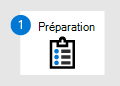

# Préparer le déploiement de Microsoft Defender pour point de terminaison

[!INCLUDE [Microsoft 365 Defender rebranding](../../includes/microsoft-defender.md)]

**S’applique à :**
- [Microsoft Defender pour point de terminaison Plan 2](https://go.microsoft.com/fwlink/p/?linkid=2154037)
- [Microsoft 365 Defender](https://go.microsoft.com/fwlink/?linkid=2118804)

> Vous voulez découvrir Microsoft Defender pour point de terminaison ? [Inscrivez-vous pour bénéficier d’un essai gratuit.](https://signup.microsoft.com/create-account/signup?products=7f379fee-c4f9-4278-b0a1-e4c8c2fcdf7e&ru=https://aka.ms/MDEp2OpenTrial?ocid=docs-wdatp-exposedapis-abovefoldlink)

Le déploiement de Defender pour endpoint est un processus en trois phases :

| Phase 1 : préparation| [Phase 2 : configuration](production-deployment.md)| [Phase 3 : intégration](onboarding.md)|
|---|---|---|
|*Vous êtes là !*|||

Vous êtes actuellement en phase de préparation.

La préparation est essentielle pour tout déploiement réussi. Dans cet article, vous serez guidé sur les points que vous devrez prendre en compte lorsque vous préparerez le déploiement de Defender pour Endpoint.

## Parties prenantes et approbation

La section suivante sert à identifier toutes les parties prenantes impliquées dans le projet et qui doivent approuver, réviser ou rester informées.

Ajoutez les parties prenantes au tableau ci-dessous selon le cas pour votre organisation.

- SO = Approuver le projet
- R = Examiner ce projet et fournir une entrée
- I = Informé de ce projet

 

****

|Nom|Role|Opération|
|---|---|---|
|Entrer un nom et un e-mail|Responsable de la sécurité des informations **(CISO)** Représentant exécutif qui sert de sponsor au sein de l’organisation *pour le déploiement de nouvelles technologies.*|SO|
|Entrer un nom et un e-mail|Responsable du Centre des opérations de cybersécurité **(CDOC)** Représentant de l’équipe CDOC responsable de la définition de la façon dont cette modification est alignée sur les processus de l’équipe des opérations de sécurité des *clients.*|SO|
|Entrer un nom et un e-mail|**Architecte de sécurité** Un représentant de l’équipe de sécurité responsable de la définition de la façon dont cette modification est alignée sur l’architecture de sécurité principale *de l’organisation.*|R|
|Entrer un nom et un e-mail|**Architecte de l’espace** de travail Un représentant de l’équipe en charge de la définition de la façon dont cette modification est alignée sur l’architecture de l’espace de travail *principal de l’organisation.*|R|
|Entrer un nom et un e-mail|**Analyste de sécurité** Représentant de l’équipe CDOC qui peut fournir des informations sur les fonctionnalités de détection, l’expérience utilisateur et l’utilité globale de ce changement du point de vue des *opérations de sécurité.*|I|
||||

## Environnement

Cette section permet de s’assurer que votre environnement est bien compris par les parties prenantes, ce qui permet d’identifier les dépendances potentielles et/ou les modifications requises dans les technologies ou les processus.

 

****

|Quoi|Description|
|---|---|
|Nombre de points de terminaison|Nombre total de points de terminaison par système d’exploitation.|
|Nombre de serveurs|Nombre total de serveurs par version du système d’exploitation.|
|Moteur de gestion|Nom et version du moteur de gestion (par exemple, System Center Configuration Manager Current Branch 1803).|
|Distribution CDOC|Structure CDOC de haut niveau (par exemple, niveau 1 externalisé à Contoso, niveau 2 et niveau 3 en interne distribué en Europe et en Asie).|
|Informations et événements de sécurité (SIEM)|Technologie SIEM en cours d’utilisation.|
|||

## Contrôle d'accès basé sur les rôles

Microsoft recommande d’utiliser le concept de privilèges minimum. Defender for Endpoint tire parti des rôles intégrés dans Azure Active Directory. Microsoft recommande de [passer en revue les différents rôles](/azure/active-directory/roles/permissions-reference) disponibles et de choisir celui qui vous permet de répondre à vos besoins pour chaque personnage de cette application. Certains rôles devront peut-être être temporairement appliqués et supprimés une fois le déploiement terminé.

 

****

|Personas|Rôles|Azure AD rôle (si nécessaire)|Affecter à|
|---|---|---|---|
|Administrateur de sécurité||||
|Analyste de sécurité||||
|Administrateur de point de terminaison||||
|Administrateur d’infrastructure||||
|Propriétaire/partie prenante de l’entreprise||||
|

Microsoft recommande [d’utiliser Privileged Identity Management](/azure/active-directory/active-directory-privileged-identity-management-configure) pour gérer vos rôles afin de fournir un audit, un contrôle et une révision d’accès supplémentaires pour les utilisateurs ayant des autorisations d’annuaire.

Defender pour le point de terminaison prend en charge deux façons de gérer les autorisations :

- **Gestion des autorisations de base**: définissez les autorisations en accès total ou en lecture seule. Les utilisateurs ayant des rôles d’administrateur général ou d Azure Active Directory de sécurité ont un accès total. Le rôle lecteur sécurité dispose d’un accès en lecture seule et n’accorde pas l’accès à l’affichage de l’inventaire des ordinateurs/appareils.

- Contrôle d’accès basé sur les rôles **:** définissez des autorisations granulaires en définissant des rôles, en attribuant des groupes d’utilisateurs Azure AD aux rôles et en accordant aux groupes d’utilisateurs l’accès aux groupes d’appareils. Pour plus d’informations. voir [Gérer l’accès au portail à l’aide du contrôle d’accès basé sur un rôle.](rbac.md)

Microsoft recommande d’utiliser le RBAC pour s’assurer que seuls les utilisateurs qui ont une justification professionnelle peuvent accéder à Defender for Endpoint.

Vous trouverez plus d’informations sur les instructions d’autorisation ici : Créez des rôles et attribuez le rôle à [un Azure Active Directory groupe.](/microsoft-365/security/defender-endpoint/user-roles#create-roles-and-assign-the-role-to-an-azure-active-directory-group)

Le tableau d’exemple suivant sert à identifier la structure du Centre des opérations de cybersécurité dans votre environnement qui vous aidera à déterminer la structure RBAC requise pour votre environnement.

 

****

|Niveau|Description|Autorisation requise|
|---|---|---|
|Niveau 1|**Équipe des opérations de sécurité locale/équipe informatique** 
 Cette équipe trie et examine généralement les alertes contenues dans leur géolocalisation et atteint le niveau 2 dans les cas où une correction active est nécessaire.||
|Niveau 2|**Équipe des opérations de sécurité régionales** 
 Cette équipe peut voir tous les appareils de leur région et effectuer des actions de correction.|Afficher les données|
|Niveau 3|**Équipe des opérations de sécurité globale** 
 Cette équipe est constituée d’experts en sécurité et est autorisée à voir et à effectuer toutes les actions à partir du portail.|Afficher les données 
 Alertes examen Actions de correction actives 
 Alertes examen Actions de correction actives 
 Gérer les paramètres système du portail 
 Gérer les paramètres de sécurité|
||||

## Ordre d’adoption

Dans de nombreux cas, les organisations auront des produits de sécurité de point de terminaison existants en place. Au minimum, chaque organisation doit être une solution antivirus. Toutefois, dans certains cas, une organisation peut également avoir déjà PEPT solution.

Historiquement, le remplacement de toute solution de sécurité était long et difficile à réaliser en raison des crochets étroits dans la couche d’application et les dépendances de l’infrastructure. Toutefois, defender pour point de terminaison étant intégré au système d’exploitation, il est désormais facile de remplacer des solutions tierces.

Choisissez le composant de Defender for Endpoint à utiliser et supprimez ceux qui ne s’appliquent pas. Le tableau ci-dessous indique l’ordre recommandé par Microsoft pour activer la suite de sécurité des points de terminaison.

 

****

|Composant|Description|Classement des commandes d’adoption|
|---|---|---|
|Endpoint Detection & Response (PEPT)|Les fonctionnalités de protection évolutive des points de terminaison de Defender for Endpoint fournissent des détections d’attaques avancées quasiment en temps réel et actionnables. Les analystes de la sécurité peuvent hiérarchiser efficacement les alertes, avoir une meilleure visibilité de l’étendue d’une faille et prendre des mesures correctives pour remédier aux menaces. 
 [En savoir plus.](/windows/security/threat-protection/windows-defender-atp/overview-endpoint-detection-response)|1|
|Gestion & des menaces et des vulnérabilités (TVM)|Threat & Vulnerability Management est un composant de Microsoft Defender pour endpoint et fournit aux administrateurs de sécurité et aux équipes d’opérations de sécurité une valeur unique, notamment : <ul><li>Informations sur la détection et la réponse au point de terminaison en temps réel (EDR) corrélées avec les vulnérabilités de point de terminaison</li><li>Contexte de vulnérabilité d’appareil précieux pendant les examens d’incident</li><li>Processus de correction intégrés via Microsoft Intune et Microsoft System Center Configuration Manager</li></ul> 
 [En savoir plus](https://techcommunity.microsoft.com/t5/Windows-Defender-ATP/Introducing-a-risk-based-approach-to-threat-and-vulnerability/ba-p/377845).|2|
|Protection de nouvelle génération (NGP)|Antivirus Microsoft Defender est une solution anti-programme malveillant intégrée qui fournit une protection nouvelle génération pour les ordinateurs de bureau, les ordinateurs portables et les serveurs. L’antivirus Microsoft Defender inclut les éléments suivants : <ul><li>Protection fournie par le cloud pour une détection et un blocage quasi instantanés des menaces nouvelles et émergentes. Tout comme l’apprentissage automatique et le système Intelligent Security Graph, la protection fournie par le cloud fait partie des technologies nouvelle génération intégrées à l’antivirus Microsoft Defender.</li><li>Analyse toujours continue à l’aide de la surveillance avancée du comportement des fichiers et des processus et d’autres heuristiques (également appelée « protection en temps réel »).</li><li>Mises à jour de la protection dédiées, fondées sur l’apprentissage automatique, l’analyse humaine et automatisée du Big Data, et des recherches approfondies sur la résistance aux menaces.</li></ul> 
 [En savoir plus](/windows/security/threat-protection/microsoft-defender-antivirus/microsoft-defender-antivirus-in-windows-10).|3|
|Réduction de la surface d’attaque (ASR)|Les fonctionnalités de réduction de la surface d’attaque dans Microsoft Defender pour point de terminaison aident à protéger les appareils et les applications de l’organisation contre les menaces nouvelles et émergentes.   [En savoir plus.](/windows/security/threat-protection/windows-defender-atp/overview-attack-surface-reduction)|4|
|Auto Investigation & Remediation (AIR)|Microsoft Defender pour le point de terminaison utilise des examens automatisés pour réduire considérablement le volume d’alertes qui doivent être examinées individuellement. La fonctionnalité d’investigation automatisée exploite divers algorithmes d’inspection et processus utilisés par les analystes (tels que les playbooks) pour examiner les alertes et prendre des mesures correctives immédiates pour résoudre les violations. Cela réduit considérablement les volumes d’alertes, ce qui permet aux experts en matière de sécurité de se concentrer sur des menaces plus sophistiquées et d’autres initiatives de grande valeur. 
 [En savoir plus.](/windows/security/threat-protection/windows-defender-atp/automated-investigations-windows-defender-advanced-threat-protection)|Non applicable|
|Spécialistes des menaces Microsoft (MTE)|Spécialistes des menaces Microsoft est un service de recherche géré qui fournit des centres d’opérations de sécurité (SOC) avec une analyse et une surveillance de niveau expert pour les aider à s’assurer que les menaces critiques dans leurs environnements uniques ne sont pas manquées. 
 [En savoir plus.](/windows/security/threat-protection/windows-defender-atp/microsoft-threat-experts)|Non applicable|

## Étape suivante

   [Phase 2 : configuration](production-deployment.md)

Configurer Microsoft Defender pour le déploiement de point de terminaison.
