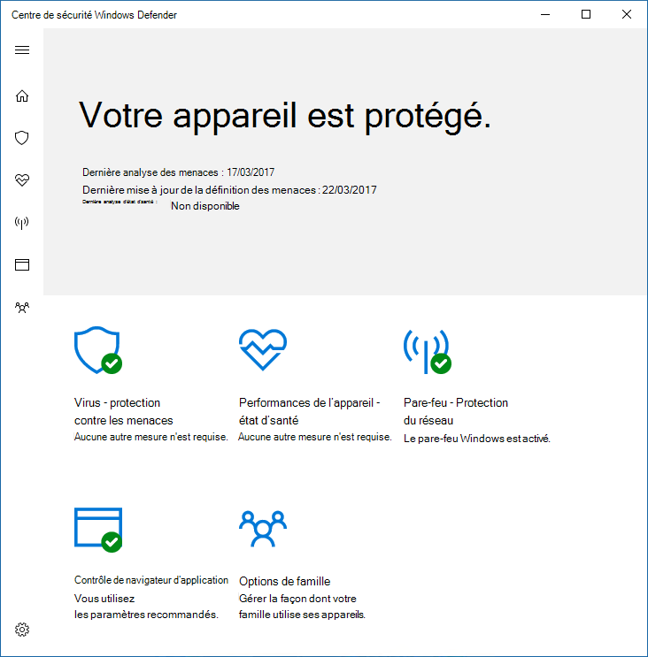
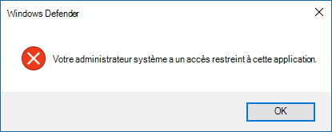

# Empêcher les utilisateurs de voir ou d'interagir avec l'interface utilisateur de l'Antivirus Microsoft Defender

[!INCLUDE [Microsoft 365 Defender rebranding](../../includes/microsoft-defender.md)]

**S’applique à :**

- [Microsoft Defender pour point de terminaison](/microsoft-365/security/defender-endpoint/)

Vous pouvez utiliser la stratégie de groupe pour empêcher les utilisateurs sur les points de terminaison de voir l'interface de l'Antivirus Microsoft Defender. Vous pouvez également les empêcher de mettre en pause les analyses.

## Masquer l'interface antivirus Microsoft Defender

Dans Windows 10, versions 1703, le masquage de l'interface masquera les notifications de l'Antivirus Microsoft Defender et empêchera l'apparition de la vignette de protection contre les menaces virus & dans l'application Sécurité Windows.

Avec le paramètre activé **:**

Avec le paramètre désactivé **ou** non configuré :

>[!NOTE]
>Le masquage de l'interface empêche également les notifications de l'Antivirus Microsoft Defender d'apparaître sur le point de terminaison. Les notifications de Microsoft Defender pour point de terminaison s'affichent toujours. Vous pouvez également configurer individuellement [les notifications qui apparaissent sur les points de terminaison](configure-notifications-microsoft-defender-antivirus.md)

Dans les versions antérieures de Windows 10, le paramètre masque l'interface Windows Defender client. Si l'utilisateur tente de l'ouvrir, il reçoit un avertissement signalant que l'administrateur système a un accès restreint à cette application.

## Utiliser une stratégie de groupe pour masquer l'interface de Microsoft Defender AV aux utilisateurs

1. Sur votre ordinateur de gestion des stratégies de groupe, ouvrez la [Console](/previous-versions/windows/desktop/gpmc/group-policy-management-console-portal)de gestion des stratégies de groupe, cliquez avec le bouton droit sur l'objet de stratégie de groupe à configurer, puis cliquez sur **Modifier.**

2. À **l'aide de l'Éditeur de gestion des stratégies de** groupe, go to **Computer configuration**.

3. Cliquez **sur Modèles d'administration.**

4. Développez l'arborescence **des composants Windows >'interface > client antivirus Microsoft Defender.**

5. Double-cliquez sur le **paramètre Activer le mode d'interface** utilisateur sans en-tête et définissez l'option sur **Activé.** Cliquez sur **OK**. 

Voir [Empêcher les utilisateurs de modifier localement](configure-local-policy-overrides-microsoft-defender-antivirus.md) les paramètres de stratégie pour plus d'options pour empêcher les utilisateurs de modifier la protection sur leurs PC.

## Empêcher les utilisateurs de mettre une analyse en pause

Vous pouvez empêcher les utilisateurs de mettre en pause les analyses, ce qui peut être utile pour vous assurer que les analyses programmées ou à la demande ne sont pas interrompues par les utilisateurs.

> [!NOTE]
> Ce paramètre n'est pas pris en charge sur Windows 10.

### Utiliser une stratégie de groupe pour empêcher les utilisateurs de mettre une analyse en pause

1. Sur votre ordinateur de gestion des stratégies de groupe, ouvrez la [Console](/previous-versions/windows/desktop/gpmc/group-policy-management-console-portal)de gestion des stratégies de groupe, cliquez avec le bouton droit sur l'objet de stratégie de groupe à configurer, puis cliquez sur **Modifier.**

2. À **l'aide de l'Éditeur de gestion des stratégies de** groupe, go to **Computer configuration**.

3. Cliquez **sur Modèles d'administration.**

4. Développez l'arborescence **des composants Windows**  >  **Analyse antivirus Microsoft Defender.**  >  

5. Double-cliquez sur le **paramètre Autoriser les utilisateurs à suspendre** l'analyse et définissez l'option **sur Désactivé.** Cliquez sur **OK**. 

## Articles connexes

- [Configurer les notifications qui apparaissent sur les points de terminaison](configure-notifications-microsoft-defender-antivirus.md)

- [Configurer l'interaction de l'utilisateur final avec l'Antivirus Microsoft Defender](configure-end-user-interaction-microsoft-defender-antivirus.md)

- [Antivirus Microsoft Defender dans Windows 10](microsoft-defender-antivirus-in-windows-10.md)