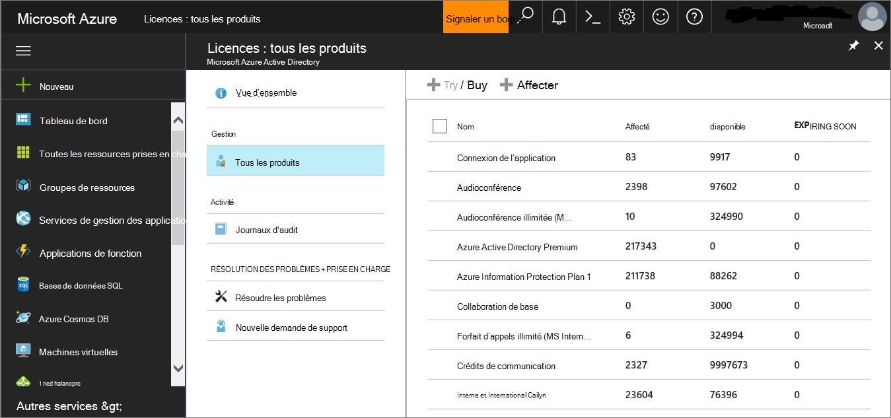
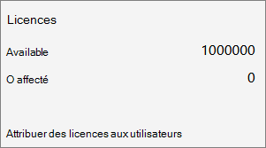
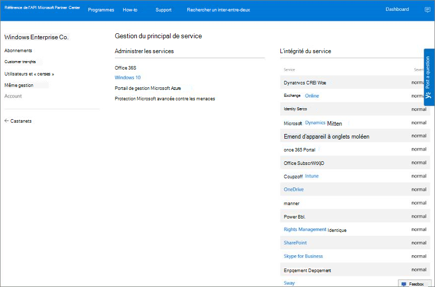

# <a name="set-up-microsoft-defender-for-endpoint-deployment"></a>Configurer Microsoft Defender pour le déploiement de point de terminaison

[!INCLUDE [Microsoft 365 Defender rebranding](../../includes/microsoft-defender.md)]


**S’applique à :**
- [Microsoft Defender pour point de terminaison](https://go.microsoft.com/fwlink/p/?linkid=2154037)
- [Microsoft 365 Defender](https://go.microsoft.com/fwlink/?linkid=2118804)

> Vous voulez découvrir Microsoft Defender pour point de terminaison ? [Inscrivez-vous pour bénéficier d’un essai gratuit.](https://signup.microsoft.com/create-account/signup?products=7f379fee-c4f9-4278-b0a1-e4c8c2fcdf7e&ru=https://aka.ms/MDEp2OpenTrial?ocid=docs-wdatp-exposedapis-abovefoldlink)

Le déploiement de Defender pour endpoint est un processus en trois phases :

|[](prepare-deployment.md)<br>[Phase 1 : préparation](prepare-deployment.md) | <br>Phase 2 : configuration | [](onboarding.md)<br>[Phase 3 : intégration](onboarding.md)|
|---|---|---|
||*Vous êtes là !*||

Vous êtes actuellement en phase de mise en place.

Dans ce scénario de déploiement, vous serez guidé dans les étapes suivantes :

- Validation des licences
- Configuration du client
- Configuration du réseau

> [!NOTE]
> Pour vous guider tout au long d’un déploiement classique, ce scénario couvre uniquement l’utilisation des Microsoft Endpoint Configuration Manager. Defender pour le point de terminaison prend en charge l’utilisation d’autres outils d’intégration, mais ne couvre pas ces scénarios dans le guide de déploiement. Pour plus d’informations, [voir Appareils intégrés à Microsoft Defender pour le point de terminaison.](onboard-configure.md)

## <a name="check-license-state"></a>Vérifier l’état de la licence

La vérification de l’état de la licence et si elle a été correctement mise en service peut être effectuée via le Centre d’administration ou via **le portail Microsoft Azure.**

1. Pour afficher vos licences, accédez au portail **Microsoft Azure et** accédez à la section [Microsoft Azure licences du portail.](https://portal.azure.com/#blade/Microsoft_AAD_IAM/LicensesMenuBlade/Products)

   

1. Vous pouvez également accéder au Centre d’administration pour accéder **aux** \> **abonnements de facturation.**

    Sur l’écran, vous verrez toutes les licences provisionées et leur état **actuel.**

    

## <a name="cloud-service-provider-validation"></a>Validation du fournisseur de services Cloud

Pour accéder aux licences qui sont provisionn es pour votre entreprise et pour vérifier l’état des licences, accédez au Centre d’administration.

1. À partir du **portail partenaire,** **sélectionnez Administrer les services > Office 365**.

2. En cliquant sur le **lien du portail** partenaire, l’option **Administrateur** de la part de s’ouvre et vous donne accès au Centre d’administration du client.

   

## <a name="tenant-configuration"></a>Configuration du client

L’intégration à Microsoft Defender pour le point de terminaison est facile. Dans le menu de navigation, sélectionnez n’importe quel élément sous la section Points de terminaison ou toute fonctionnalité Microsoft 365 Defender telle que les incidents, le chasse, le centre de mesures ou l’analyse des menaces pour lancer le processus d’intégration.

À partir d’un navigateur web, accédez au [centre Microsoft 365 sécurité.](https://security.microsoft.com)

## <a name="network-configuration"></a>Configuration du réseau

Si l’organisation n’exige pas que les points de terminaison utilisent un proxy pour accéder à Internet, ignorez cette section.

Le capteur Microsoft Defender pour point de terminaison requiert Microsoft Windows HTTP (WinHTTP) pour signaler les données du capteur et communiquer avec le service Microsoft Defender pour point de terminaison. Le capteur Microsoft Defender for Endpoint incorporé s’exécute dans le contexte système à l’aide du compte LocalSystem. Le capteur utilise les services Microsoft Windows HTTP Services (WinHTTP) pour activer la communication avec le service Cloud Microsoft Defender pour point de terminaison. Le paramètre de configuration WinHTTP est indépendant des paramètres de proxy de navigation Internet Windows Internet (WinINet) et ne peut découvrir un serveur proxy qu’à l’aide des méthodes de découverte suivantes :

- **Méthodes de découverte automatique**:
  - Proxy transparent
  - Protocole WPAD (Web Proxy Auto-Discovery Protocol)

  Si un proxy transparent ou un WPAD a été implémenté dans la topologie réseau, il n’est pas nécessaire de définir des paramètres de configuration spéciaux. Pour plus d’informations sur les exclusions d’URL de point de terminaison Microsoft Defender dans le proxy, consultez la section URL du [service](production-deployment.md#proxy-service-urls) proxy dans ce document pour obtenir la liste des URL permises ou sur configurer les paramètres de connectivité Internet et de proxy [d’appareil.](configure-proxy-internet.md#enable-access-to-microsoft-defender-for-endpoint-service-urls-in-the-proxy-server)

- **Configuration manuelle du proxy statique**:
  - Configuration basée sur le registre
  - WinHTTP configuré à l’aide de la commande netsh

    Convient uniquement aux ordinateurs de bureau dans une topologie stable (par exemple : un bureau dans un réseau d’entreprise derrière le même proxy).

### <a name="configure-the-proxy-server-manually-using-a-registry-based-static-proxy"></a>Configurer le serveur proxy manuellement en utilisant un proxy statique basé sur le registre

Configurez un proxy statique basé sur le Registre pour autoriser uniquement le capteur Microsoft Defender for Endpoint à signaler les données de diagnostic et à communiquer avec Microsoft Defender pour les services Endpoint si un ordinateur n’est pas autorisé à se connecter à Internet. Le proxy statique est configurable via une stratégie de groupe. La stratégie de groupe se trouve sous :

- Modèles d Windows de collecte de données et de builds d’aperçu des composants Configurez l’utilisation du proxy authentifié pour le service Expérience des utilisateurs connectés et \> \> \> télémétrie
- Définissez-le **sur Activé et** sélectionnez Désactiver **l’utilisation du proxy authentifié**

1. Ouvrez la console de gestion des stratégies de groupe.
2. Créez une stratégie ou modifiez une stratégie existante en fonction des pratiques organisationnelles.
3. Modifiez la stratégie de groupe et accédez à Modèles d’administration Windows Collection de données des composants et Builds d’aperçu Configurer l’utilisation du proxy authentifié pour le service Expériences des **\> utilisateurs connectés \> \>** et télémétrie.

   

4. Sélectionnez **Activé**.
5. Sélectionnez **Désactiver l’utilisation du proxy authentifié.**
6. Accédez à Modèles d’administration Windows collecte de données des composants et prévisualisation Permet de configurer les expériences utilisateur connectées **\> et la \> \> télémétrie.**

    

7. Sélectionnez **Activé**.
8. Entrez le **nom du serveur proxy.**

La stratégie définit deux valeurs de registre `TelemetryProxyServer` comme REG_SZ et `DisableEnterpriseAuthProxy` comme REG_DWORD sous la clé de registre `HKLM\Software\Policies\Microsoft\Windows\DataCollection`.

La valeur de Registre `TelemetryProxyServer` prend le format de chaîne suivant :

```text
<server name or ip>:<port>
```

Par exemple, 10.0.0.6:8080

Cette valeur de registre `DisableEnterpriseAuthProxy` doit être égale à 1.

### <a name="configure-the-proxy-server-manually-using-netsh-command"></a>Configurer le serveur proxy manuellement à l’aide de la commande netsh

Utiliser netsh pour configurer un proxy statique à l’échelle du système.

> [!NOTE]
>
> - Cela affectera toutes les applications, y compris les services Windows qui utilisent WinHTTP avec un proxy par défaut.
> - Les ordinateurs portables qui changent de topologie (par exemple, de bureau à domicile) ne fonctionneront pas correctement avec netsh. Utiliser la configuration statique du proxy basée sur le registre.

1. Ouvrez une invite de commandes avec élévation de privilèges :
    1. Accéder à **Démarrer** et taper **cmd**.
    1. Cliquez avec le bouton droit sur **Invite de commandes** et sélectionnez **Exécuter en tant qu'administrateur**.

2. Entrez la commande suivante et appuyez sur **Entrée** :

   ```PowerShell
   netsh winhttp set proxy <proxy>:<port>
   ```

   Par exemple : netsh winhttp initialiser proxy 10.0.0.6:8080

### <a name="proxy-configuration-for-down-level-devices"></a>Configuration du proxy pour les appareils de bas niveau

Down-Level comprennent les stations de travail Windows 7 SP1 et Windows 8.1, ainsi que Windows Server 2008 R2, Windows Server 2012, Windows Server 2012 R2 et les versions de Windows Server 2016 antérieures à Windows Server CB 1803. Le proxy de ces systèmes d’exploitation est configuré dans le cadre de l’Agent de gestion Microsoft pour gérer les communications entre le point de terminaison et Azure. Reportez-vous au Guide de déploiement rapide de l’agent de gestion Microsoft pour plus d’informations sur la configuration d’un proxy sur ces appareils.

### <a name="proxy-service-urls"></a>URL de service proxy

Les URL qui incluent v20 sont nécessaires uniquement si vous avez Windows 10, version 1803 ou Windows 11 périphériques. Par exemple, n’est nécessaire que si l’appareil est `us-v20.events.data.microsoft.com` Windows 10 version 1803 ou Windows 11.

Si un proxy ou un pare-feu bloque le trafic anonyme, comme le capteur Microsoft Defender pour point de terminaison se connecte à partir du contexte système, assurez-vous que le trafic anonyme est autorisé dans les URL répertoriées.

La feuille de calcul téléchargeable suivante répertorie les services et les URL associées à qui votre réseau doit pouvoir se connecter. Assurez-vous qu’il n’existe aucune règle de pare-feu ou de  filtrage réseau qui refuserait l’accès à ces URL, ou vous devrez peut-être créer une règle d’autoriser spécifiquement pour eux.

<br>

****

|Liste de feuilles de calcul de domaines|Description|
|---|---|
||Feuille de calcul d’enregistrements DNS spécifiques pour les emplacements de service, les emplacements géographiques et le système d’exploitation. <p> [Téléchargez la feuille de calcul ici.](https://download.microsoft.com/download/8/a/5/8a51eee5-cd02-431c-9d78-a58b7f77c070/mde-urls.xlsx)|
|

## <a name="next-step"></a>Étape suivante

 <br> [Phase 3 : Intégration :](onboarding.md)intégrer des appareils au service afin que le service Microsoft Defender pour point de terminaison puisse obtenir des données de capteur à partir de ces derniers.
