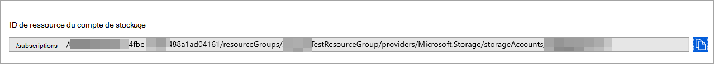
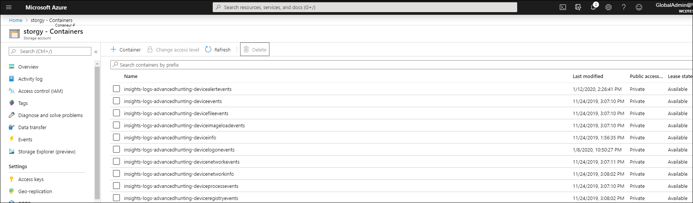

# <a name="configure-microsoft-defender-for-endpoint-to-stream-advanced-hunting-events-to-your-storage-account"></a>Configurer Microsoft Defender pour le point de terminaison pour diffuser des événements de recherche avancée vers Stockage compte

[!INCLUDE [Microsoft 365 Defender rebranding](../../includes/microsoft-defender.md)]


**S’applique à :**
- [Microsoft Defender pour point de terminaison](https://go.microsoft.com/fwlink/?linkid=2154037)

> Vous souhaitez faire l’expérience de Defender pour point de terminaison ? [Inscrivez-vous à un essai gratuit.](https://www.microsoft.com/microsoft-365/windows/microsoft-defender-atp?ocid=docs-wdatp-configuresiem-abovefoldlink) 

## <a name="before-you-begin"></a>Avant de commencer

1. Créez [un Stockage dans](/azure/storage/common/storage-account-overview) votre client.

2. Connectez-vous à votre client [Azure,](https://ms.portal.azure.com/)allez à Abonnements > Votre abonnement > fournisseurs de ressources **> s’inscrire à Microsoft.insights**.

## <a name="enable-raw-data-streaming"></a>Activer la diffusion en continu des données brutes

1. Connectez-vous [au portail Microsoft Defender pour points](https://securitycenter.windows.com) de terminaison en tant qu’administrateur * Administrateur **général** _ ou _*_Administrateur_ de sécurité **.

2. Go to [Data export settings page](https://securitycenter.windows.com/interoperability/dataexport) on Centre de sécurité Microsoft Defender.

3. Cliquez sur **Ajouter des paramètres d’exportation de données.**

4. Choisissez un nom pour vos nouveaux paramètres.

5. Choose **Forward events to stockage Azure**.

6. Tapez votre **ID Stockage de ressource de compte.** Pour obtenir votre ID de ressource de compte **Stockage,** go to your Stockage account page on [Azure portal](https://ms.portal.azure.com/) > properties tab > copy the text under Stockage account resource **ID:**

   

7. Choisissez les événements que vous souhaitez diffuser en continu, puis cliquez sur **Enregistrer.**

## <a name="the-schema-of-the-events-in-the-storage-account"></a>Schéma des événements dans le compte Stockage client

- Un conteneur d’objets blob est créé pour chaque type d’événement : 

  

- Le schéma de chaque ligne d’un objet blob est le JSON suivant : 

  ```
  {
          "time": "<The time WDATP received the event>"
          "tenantId": "<Your tenant ID>"
          "category": "<The Advanced Hunting table name with 'AdvancedHunting-' prefix>"
          "properties": { <WDATP Advanced Hunting event as Json> }
  }               
  ```

- Chaque objet blob contient plusieurs lignes.

- Chaque ligne contient le nom de l’événement, le moment où Defender pour le point de terminaison a reçu l’événement, le client qu’il appartient (vous recevez uniquement les événements de votre client) et l’événement au format JSON dans une propriété appelée « properties ».

- Pour plus d’informations sur le schéma des événements Microsoft Defender for Endpoint, consultez [la vue d’ensemble de la recherche avancée.](advanced-hunting-overview.md)

- Dans la recherche avancée, la table **DeviceInfo** comporte une colonne nommée **MachineGroup** qui contient le groupe de l’appareil. Ici, chaque événement est également décorée avec cette colonne. Pour plus [d’informations,](machine-groups.md) voir Groupes d’appareils.

## <a name="data-types-mapping"></a>Mappage des types de données

Pour obtenir les types de données pour nos propriétés d’événements, vous pouvez :

1. Connectez-vous [Centre de sécurité Microsoft Defender](https://securitycenter.windows.com) et allez à la [page Recherche avancée.](https://securitycenter.windows.com/hunting-package)

2. Exécutez la requête suivante pour obtenir le mappage des types de données pour chaque événement : 

   ```
   {EventType}
   | getschema
   | project ColumnName, ColumnType 
   ```

- Voici un exemple d’événement Device Info : 

  

## <a name="related-topics"></a>Voir aussi
- [Vue d’ensemble du chasse avancée](advanced-hunting-overview.md)
- [API de diffusion en continu microsoft Defender pour point de terminaison](raw-data-export.md)
- [Diffuser des événements Microsoft Defender for Endpoint vers votre compte de stockage Azure](raw-data-export-storage.md)
- [stockage Azure Documentation du compte](/azure/storage/common/storage-account-overview)