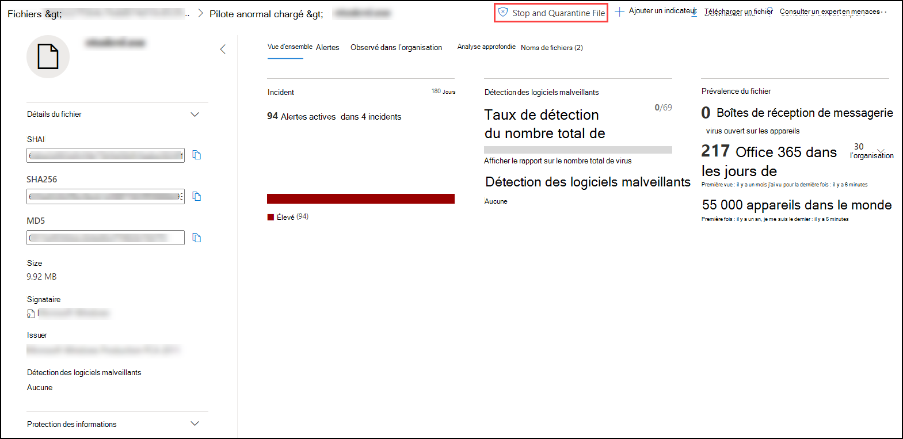
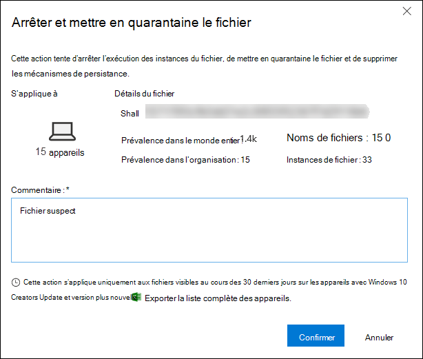
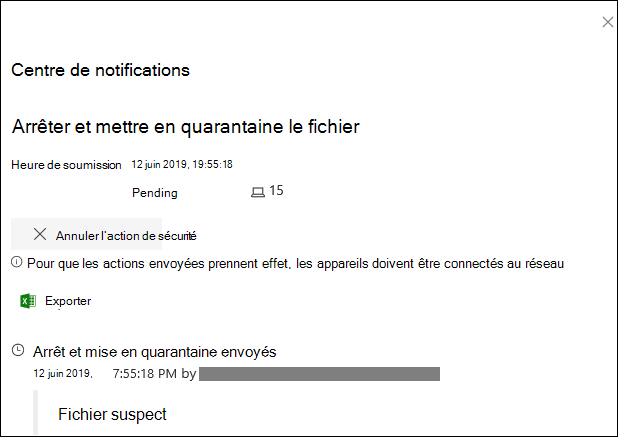
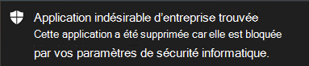
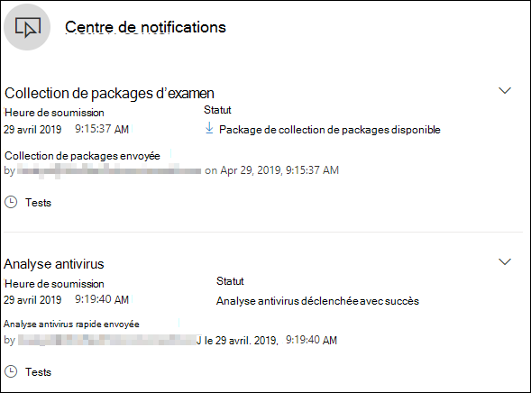
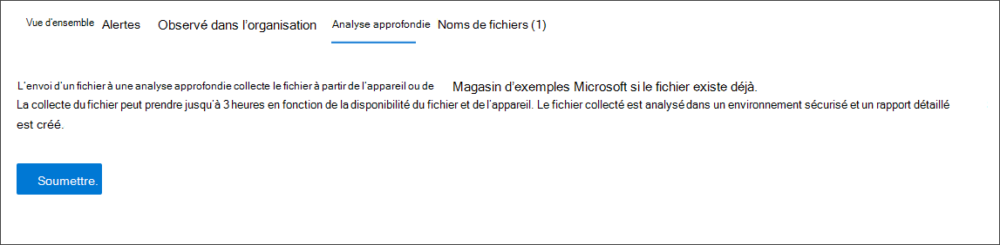
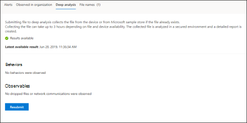

# <a name="take-response-actions-on-a-file"></a>Prendre des mesures de réponse sur un fichier

[!INCLUDE [Microsoft 365 Defender rebranding](../../includes/microsoft-defender.md)]


**S’applique à :**
- [Microsoft Defender pour point de terminaison](https://go.microsoft.com/fwlink/?linkid=2154037)

[!include[Prerelease information](../../includes/prerelease.md)]

> Vous souhaitez faire l’expérience de Defender for Endpoint ? [Inscrivez-vous à un essai gratuit.](https://www.microsoft.com/microsoft-365/windows/microsoft-defender-atp?ocid=docs-wdatp-responddile-abovefoldlink)

Répondez rapidement aux attaques détectées en arrêtant et en bloquant des fichiers ou en bloquant un fichier. Après avoir pris des mesures sur les fichiers, vous pouvez vérifier les détails de l’activité dans le centre de l’action.

Les actions de réponse sont disponibles sur la page de profil détaillée d’un fichier. Une fois sur cette page, vous pouvez basculer entre la nouvelle et l’ancienne mise en page en faisant basculer **la nouvelle page de fichier.** Le reste de cet article décrit la mise en page la plus nouvelle.

Les actions de réponse s’exécutent le long de la partie supérieure de la page de fichiers et incluent :

- Arrêter et mettre en quarantaine le fichier
- Ajouter un indicateur
- Télécharger un fichier
- Consulter un expert en menaces
- Centre de notifications

Vous pouvez également soumettre des fichiers pour analyse approfondie, afin d’exécuter le fichier dans un bac à sable (sandbox) cloud sécurisé. Une fois l’analyse terminée, vous obtenez un rapport détaillé qui fournit des informations sur le comportement du fichier. Vous pouvez soumettre des fichiers pour analyse approfondie et lire les rapports passés en sélectionnant **l’onglet Analyse** approfondie. Il se trouve sous les cartes d’informations de fichier.

Certaines actions nécessitent certaines autorisations. Le tableau suivant décrit l’action que certaines autorisations peuvent prendre sur les fichiers exécutables portables (PE) et non PE :

| Autorisation             | Fichiers PE | Fichiers non PE |
| :--------------------- | :------: | :----------: |
| Afficher les données              |     X    |       X      |
| Examen des alertes   | &#x2611; |       X      |
| Base de la réponse en direct    |     X    |       X      |
| Réponse en direct avancée | &#x2611; |   &#x2611;   |

Pour plus d’informations sur les rôles, voir Créer et gérer des rôles pour le contrôle [d’accès basé sur les rôles.](user-roles.md)

## <a name="stop-and-quarantine-files-in-your-network"></a>Arrêter et mettre en quarantaine des fichiers dans votre réseau

Vous pouvez contenir une attaque dans votre organisation en arrêtant le processus malveillant et en mettre en quarantaine le fichier là où il a été observé.

> [!IMPORTANT]
> Vous pouvez uniquement prendre cette action si :
>
> - L’appareil sur qui vous exécutez l’action exécute Windows 10, version 1703 ou ultérieure
> - Le fichier n’appartient pas aux éditeurs tiers de confiance ou n’est pas signé par Microsoft
> - L’Antivirus Microsoft Defender doit au moins être en cours d’exécution en mode passif. Pour plus d’informations, [voir Compatibilité de l’Antivirus Microsoft Defender.](https://docs.microsoft.com/windows/security/threat-protection/microsoft-defender-antivirus/microsoft-defender-antivirus-compatibility)

**L’action** Arrêter et mettre en quarantaine le fichier inclut l’arrêt des processus en cours d’exécution, la mise en quarantaine des fichiers et la suppression de données persistantes telles que les clés de Registre.

Cette action prend effet sur les appareils avec Windows 10, version 1703 ou ultérieure, où le fichier a été observé au cours des 30 derniers jours.

> [!NOTE]
> Vous pourrez restaurer le fichier à partir de la quarantaine à tout moment.

### <a name="stop-and-quarantine-files"></a>Arrêter et mettre en quarantaine des fichiers

1. Sélectionnez le fichier que vous souhaitez arrêter et mettre en quarantaine. Vous pouvez sélectionner un fichier dans l’un des affichages suivants ou utiliser la zone de recherche :

   - **Alertes :** cliquez sur les liens correspondants dans la description ou les détails de la chronologie de l’artefact
   - **Zone de recherche** : **sélectionnez Fichier** dans le menu déroulant et entrez le nom du fichier

   > [!NOTE]
   > L’action d’arrêt et de mise en quarantaine du fichier est limitée à un maximum de 1 000 appareils. Pour arrêter un fichier sur un plus grand nombre d’appareils, voir [Ajouter un indicateur pour bloquer ou autoriser un fichier.](#add-indicator-to-block-or-allow-a-file)

2. Go to the top bar and select **Stop and Quarantine File**.

   

3. Spécifiez une raison, puis sélectionnez **Confirmer**.

   

   Le centre de données affiche les informations de soumission :
   
   

   - **Heure de soumission** : indique quand l’action a été envoyée.
   - **Réussite** : indique le nombre d’appareils sur lequel le fichier a été arrêté et mis en quarantaine.
   - **Échec :** indique le nombre d’appareils sur lequel l’action a échoué et des détails sur l’échec.
   - **En attente** : indique le nombre d’appareils dont le fichier n’a pas encore été arrêté et mis en quarantaine. Cela peut prendre du temps lorsque l’appareil est hors connexion ou n’est pas connecté au réseau.

4. Sélectionnez l’un des indicateurs d’état pour afficher plus d’informations sur l’action. Par exemple, **sélectionnez Échec pour** voir où l’action a échoué.

**Notification sur l’utilisateur de l’appareil**:</br>
Lorsque le fichier est supprimé d’un appareil, la notification suivante s’affiche :



Dans la chronologie de l’appareil, un nouvel événement est ajouté pour chaque appareil où un fichier a été arrêté et mis en quarantaine.

Un avertissement s’affiche avant l’implémentation de l’action pour les fichiers largement utilisés dans l’ensemble d’une organisation. Il s’agit de vérifier que l’opération est prévue.

## <a name="restore-file-from-quarantine"></a>Restaurer le fichier de mise en quarantaine

Vous pouvez récupérer et supprimer un fichier de la quarantaine si vous avez déterminé qu’il est propre après un examen. Exécutez la commande suivante sur chaque appareil sur lequel le fichier a été mis en quarantaine.

1. Ouvrez une invite de ligne de commande avec élévation de niveaux sur l’appareil :

   1. Accéder à **Démarrer** et taper _cmd_.

   1. Cliquez avec le bouton droit **sur Invite de** commandes et **sélectionnez Exécuter en tant qu’administrateur.**

2. Entrez la commande suivante, puis appuyez sur **Entrée**:

   ```powershell
   “%ProgramFiles%\Windows Defender\MpCmdRun.exe” –Restore –Name EUS:Win32/CustomEnterpriseBlock –All
   ```

> [!NOTE]
> Dans certains scénarios, **threatName** peut apparaître comme : EUS:Win32/CustomEnterpriseBlock!cl.
>
> Defender for Endpoint restaure tous les fichiers bloqués personnalisés qui ont été mis en quarantaine sur cet appareil au cours des 30 derniers jours.

> [!IMPORTANT]
> Un fichier mis en quarantaine comme menace réseau potentielle peut ne pas être récupérable. Si un utilisateur tente de restaurer le fichier après sa mise en quarantaine, il se peut que ce fichier ne soit pas accessible. Cela peut être dû au fait que le système n’a plus d’informations d’identification réseau pour accéder au fichier. En règle générale, cela est le résultat d’une connexion temporaire à un système ou à un dossier partagé et les jetons d’accès ont expiré.

## <a name="download-or-collect-file"></a>Télécharger ou collecter un fichier

La sélection **du fichier de téléchargement** dans les actions de réponse vous permet de télécharger une archive .zip locale protégée par mot de passe contenant votre fichier. Un volant s’affiche où vous pouvez enregistrer la raison du téléchargement du fichier et définir un mot de passe.

Par défaut, vous ne pourrez pas télécharger les fichiers en quarantaine.


### <a name="collect-files"></a>Collecter des fichiers

Si un fichier n’est pas déjà stocké par Microsoft Defender pour le point de terminaison, vous ne pouvez pas le télécharger. Au lieu de cela, vous verrez un **bouton** Collecter le fichier au même emplacement. Si un fichier n’a pas été vu dans l’organisation au cours des 30 derniers **jours,** le fichier de collecte est désactivé.
> [!Important]
> Un fichier mis en quarantaine comme menace réseau potentielle peut ne pas être récupérable. Si un utilisateur tente de restaurer le fichier après sa mise en quarantaine, il se peut que ce fichier ne soit pas accessible. Cela peut être dû au fait que le système n’a plus d’informations d’identification réseau pour accéder au fichier. En règle générale, cela est le résultat d’une connexion temporaire à un système ou à un dossier partagé et les jetons d’accès ont expiré.

## <a name="add-indicator-to-block-or-allow-a-file"></a>Ajouter un indicateur pour bloquer ou autoriser un fichier

Empêcher toute propagation supplémentaire d’une attaque dans votre organisation en interdit les fichiers potentiellement malveillants ou les programmes malveillants suspects. Si vous connaissez un fichier exécutable portable (PE) potentiellement malveillant, vous pouvez le bloquer. Cette opération l’empêche d’être lue, écrite ou exécutée sur les appareils de votre organisation.

> [!IMPORTANT]
>
> - Cette fonctionnalité est disponible si votre organisation utilise l’Antivirus Microsoft Defender et si la protection cloud est activée. Pour plus d’informations, [voir Manage cloud-delivered protection](https://docs.microsoft.com/windows/security/threat-protection/microsoft-defender-antivirus/deploy-manage-report-microsoft-defender-antivirus).
>
> - La version du client anti-programme malveillant doit être 4.18.1901.x ou version ultérieure.
> - Cette fonctionnalité est conçue pour empêcher le téléchargement de programmes malveillants (ou de fichiers potentiellement malveillants) à partir du web. Il prend actuellement en charge les fichiers exécutables portables (PE), y compris les fichiers _.exe_ et _.dll._ La couverture sera étendue au fil du temps.
> - Cette action de réponse est disponible pour les appareils sur Windows 10, version 1703 ou ultérieure.
> - La fonction autoriser ou bloquer ne peut pas être effectuée sur les fichiers si la classification du fichier existe sur le cache de l’appareil avant l’action autoriser ou bloquer.

> [!NOTE]
> Le fichier PE doit se trouver dans la chronologie de l’appareil pour que vous soyez en mesure d’agir.
>
> Il peut y avoir quelques minutes de latence entre le moment où l’action est prise et le fichier réel bloqué.

### <a name="enable-the-block-file-feature"></a>Activer la fonctionnalité bloquer les fichiers

Pour commencer à bloquer des fichiers, vous devez d’abord activer la fonctionnalité Bloquer ou [autoriser dans  ](advanced-features.md) paramètres.
### <a name="allow-or-block-file"></a>Autoriser ou bloquer un fichier

Lorsque vous ajoutez un hachage d’indicateur pour un fichier, vous pouvez choisir de lancer une alerte et de bloquer le fichier chaque fois qu’un appareil de votre organisation tente de l’exécuter.

Les fichiers automatiquement bloqués par un indicateur ne s’afficheront pas dans le centre de l’action du fichier, mais les alertes resteront visibles dans la file d’attente des alertes.

Pour plus [d’informations sur](manage-indicators.md) le blocage et l’augmentation des alertes sur les fichiers, voir gérer les indicateurs.

Pour arrêter le blocage d’un fichier, supprimez l’indicateur. Vous pouvez le faire via l’action **Modifier l’indicateur** sur la page de profil du fichier. Cette action sera visible à la  même position que l’action Ajouter un indicateur, avant que vous n’ajoutiez l’indicateur.

Vous pouvez également modifier les indicateurs à partir de la page **Paramètres,** sous **Indicateurs**  >  **de règles.** Les indicateurs sont répertoriés dans cette zone par le hachage de leur fichier.

## <a name="consult-a-threat-expert"></a>Consulter un expert en menaces

Consultez un expert microsoft en matière de menaces pour obtenir plus d’informations sur un appareil potentiellement compromis ou déjà compromis. Les experts microsoft en matière de menaces sont impliqués directement à partir du Centre de sécurité Microsoft Defender pour obtenir une réponse précise et opportune. Les experts fournissent des informations sur un appareil potentiellement compromis et vous aident à comprendre les menaces complexes et les notifications d’attaque ciblée. Ils peuvent également fournir des informations sur les alertes ou un contexte d’intelligence des menaces que vous voyez sur votre tableau de bord du portail.

Pour [plus d’informations, consultez un Expert en](https://docs.microsoft.com/microsoft-365/security/defender-endpoint/configure-microsoft-threat-experts#consult-a-microsoft-threat-expert-about-suspicious-cybersecurity-activities-in-your-organization) menaces Microsoft.

## <a name="check-activity-details-in-action-center"></a>Vérifier les détails de l’activité dans le centre de données

Le **centre de données fournit** des informations sur les actions qui ont été entreprises sur un appareil ou un fichier. Vous pouvez afficher les détails suivants :

- Collection de packages d’examen
- Analyse antivirus
- Restriction d’application
- Isolation de l’appareil

Tous les autres détails connexes sont également affichés, tels que la date/l’heure de soumission, l’utilisateur qui envoie l’envoi, et si l’action a réussi ou échoué.



## <a name="deep-analysis"></a>Analyse approfondie

Les enquêtes sur la cybersécurité sont généralement déclenchées par une alerte. Les alertes sont liées à un ou plusieurs fichiers observés qui sont souvent nouveaux ou inconnus. La sélection d’un fichier vous permet d’afficher l’affichage des fichiers dans lequel vous pouvez voir les métadonnées du fichier. Pour enrichir les données liées au fichier, vous pouvez envoyer le fichier pour analyse approfondie.

La fonctionnalité d’analyse approfondie exécute un fichier dans un environnement cloud sécurisé et entièrement instrumenté. Les résultats de l’analyse approfondie montrent les activités du fichier, les comportements observés et les artefacts associés, tels que les fichiers supprimés, les modifications du Registre et la communication avec les fai.
L’analyse approfondie prend actuellement en charge l’analyse complète des fichiers exécutables portables (notamment les fichiers _.exe_ et _.dll)._

L’analyse approfondie d’un fichier prend plusieurs minutes. Une fois l’analyse de fichier terminée, l’onglet Analyse approfondie se met à jour pour afficher un résumé et la date et l’heure des derniers résultats disponibles.

Le résumé de l’analyse approfondie inclut une liste des comportements *observés,* dont certains peuvent indiquer une activité malveillante, et des éléments *observables,* y compris les IP contactés et les fichiers créés sur le disque. Si rien n’est trouvé, ces sections afficheront un bref message.

Les résultats d’une analyse approfondie sont en correspondance avec les informations sur les menaces et les correspondances génèrent des alertes appropriées.

Utilisez la fonctionnalité d’analyse approfondie pour examiner les détails d’un fichier, généralement lors d’un examen d’une alerte ou pour toute autre raison pour laquelle vous suspectez un comportement malveillant. Cette fonctionnalité est disponible dans **l’onglet Analyse** approfondie, sur la page de profil du fichier.<br/>
<br/>

> [!VIDEO https://www.microsoft.com/en-us/videoplayer/embed/RE4aAYy?rel=0]

**L’envoi** pour analyse approfondie est activé lorsque le fichier est disponible dans la collection d’exemples principal Defender for Endpoint, ou s’il a été observé sur un appareil Windows 10 qui prend en charge l’envoi à une analyse approfondie.

> [!NOTE]
> Seuls les fichiers de Windows 10 peuvent être collectés automatiquement.

Vous pouvez également soumettre un exemple via le portail du Centre de sécurité [Microsoft](https://www.microsoft.com/security/portal/submission/submit.aspx) si le  fichier n’a pas été observé sur un appareil Windows 10 et attendre que le bouton Envoyer pour une analyse approfondie soit disponible.

> [!NOTE]
> En raison des flux de traitement principal dans le portail centre de sécurité Microsoft, il peut y avoir jusqu’à 10 minutes de latence entre l’envoi de fichier et la disponibilité de la fonctionnalité d’analyse approfondie dans Defender pour le point de terminaison.

Lorsque l’exemple est collecté, Defender pour point de terminaison exécute le fichier dans un environnement sécurisé. Il crée ensuite un rapport détaillé des comportements observés et des artefacts associés, tels que les fichiers déposés sur les appareils, la communication avec les fai et les modifications du Registre.

### <a name="submit-files-for-deep-analysis"></a>Envoyer des fichiers pour analyse approfondie

1. Sélectionnez le fichier que vous souhaitez soumettre pour une analyse approfondie. Vous pouvez sélectionner ou rechercher un fichier dans l’un des affichages suivants :

    - Alertes : sélectionnez les liens de fichier dans **la description** ou **les détails** dans la chronologie de l’artefact
    - **Liste des appareils** : sélectionnez les liens de fichiers dans la **section Description** **ou Détails** de **l’appareil dans l’organisation**
    - Zone de recherche : **sélectionnez Fichier** dans le menu déroulant et entrez le nom du fichier

2. Dans **l’onglet Analyse approfondie** de l’affichage de fichier, sélectionnez **Envoyer.**

   

   > [!NOTE]
   > Seuls les fichiers PE sont pris en charge, y compris les fichiers _.exe_ et _.dll._

Une barre de progression s’affiche et fournit des informations sur les différentes étapes de l’analyse. Vous pouvez ensuite afficher le rapport une fois l’analyse effectuée.

> [!NOTE]
> Selon la disponibilité de l’appareil, la durée de collecte des échantillons peut varier. Il existe un délai d'3 heures pour la collecte d’exemples. La collecte échoue et l’opération est abandonnée si aucun appareil Windows 10 en ligne n’est signalé à ce moment-là. Vous pouvez soumettre de nouveau des fichiers pour une analyse approfondie afin d’obtenir des données récentes sur le fichier.

### <a name="view-deep-analysis-reports"></a>Afficher des rapports d’analyse approfondie

Consultez le rapport d’analyse approfondie fourni pour afficher des informations plus détaillées sur le fichier que vous avez envoyé. Cette fonctionnalité est disponible dans le contexte de l’affichage de fichier.

Vous pouvez afficher le rapport complet qui fournit des détails sur les sections suivantes :

- Behaviors
- Observables

Les détails fournis peuvent vous aider à déterminer s’il existe des indications d’une attaque potentielle.

1. Sélectionnez le fichier que vous avez soumis pour analyse approfondie.
2. Sélectionnez **l’onglet Analyse** approfondie. S’il existe des rapports précédents, le résumé du rapport s’affiche dans cet onglet.

    

#### <a name="troubleshoot-deep-analysis"></a>Résoudre les problèmes d’analyse approfondie

Si vous êtes face à un problème lors de la tentative d’soumission d’un fichier, essayez chacune des étapes de dépannage suivantes.

1. Assurez-vous que le fichier en question est un fichier PE. Les fichiers PE ont généralement des extensions _.exe_ ou _.dll_ (programmes ou applications exécutables).
2. Assurez-vous que le service a accès au fichier, qu’il existe toujours et qu’il n’a pas été endommagé ou modifié.
3. Patientez quelques minutes et essayez de soumettre à nouveau le fichier. La file d’attente est peut-être pleine ou une erreur de communication ou de connexion temporaire s’est produite.
4. Si la stratégie de collection d’exemples n’est pas configurée, le comportement par défaut consiste à autoriser la collecte d’échantillons. Si elle est configurée, vérifiez que le paramètre de stratégie autorise la collecte d’exemples avant de soumettre à nouveau le fichier. Lorsque l’exemple de collection est configuré, vérifiez la valeur de Registre suivante :

    ```powershell
    Path: HKLM\SOFTWARE\Policies\Microsoft\Windows Advanced Threat Protection
    Name: AllowSampleCollection
    Type: DWORD
    Hexadecimal value :
      Value = 0 – block sample collection
      Value = 1 – allow sample collection
    ```

1. Modifiez l’unité d’organisation via la stratégie de groupe. Pour plus d’informations, [voir Configurer avec la stratégie de groupe.](configure-endpoints-gp.md)
1. Si ces étapes ne résolvent pas le problème, contactez [winatp@microsoft.com](mailto:winatp@microsoft.com).

## <a name="related-topics"></a>Voir aussi

- [Prendre des mesures de réponse sur un appareil](respond-machine-alerts.md)
- [Examiner des fichiers](investigate-files.md)
