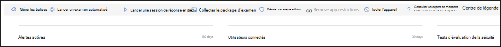
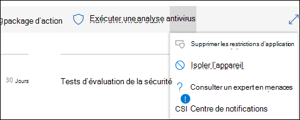
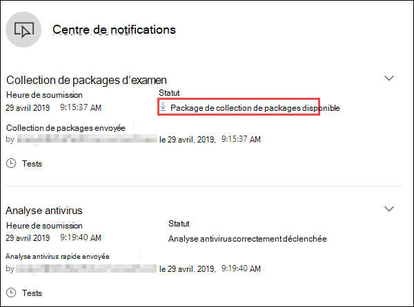
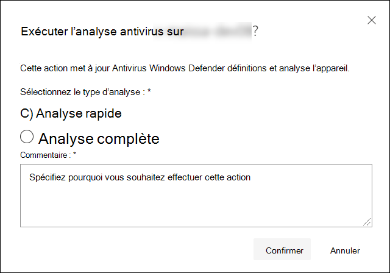
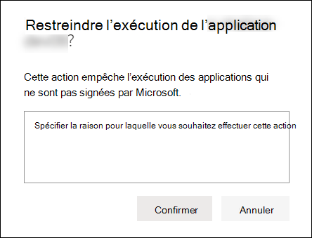
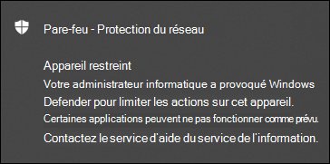
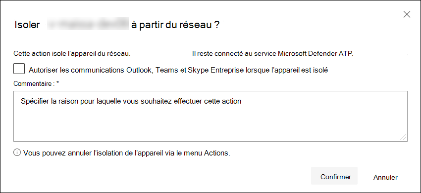
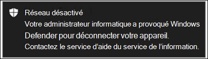

# Prendre des mesures de réponse sur un appareil

[!INCLUDE [Microsoft 365 Defender rebranding](../../includes/microsoft-defender.md)]

**S’applique à :**
- [Microsoft Defender pour point de terminaison](https://go.microsoft.com/fwlink/?linkid=2154037)

>Vous souhaitez faire l’expérience de Defender pour point de terminaison ? [Inscrivez-vous à un essai gratuit.](https://www.microsoft.com/microsoft-365/windows/microsoft-defender-atp?ocid=docs-wdatp-respondmachine-abovefoldlink) 

Répondez rapidement aux attaques détectées en isolant les appareils ou en collectant un package d’enquête. Après avoir pris des mesures sur les appareils, vous pouvez vérifier les détails de l’activité dans le centre de l’action.

Les actions de réponse s’exécutent le long de la partie supérieure d’une page d’appareil spécifique et incluent :

- Gérer les balises
- Lancer un examen automatisé
- Lancer une session de réponse en direct
- Collecter le package d’examen
- Exécuter une analyse antivirus
- Restreindre l’exécution de l’application
- Isoler l’appareil
- Consulter un expert en menaces
- Centre de notifications

 Vous pouvez trouver des pages d’appareil à partir de l’une des vues suivantes :

- **Tableau de bord Opérations de sécurité** : sélectionnez un nom d’appareil dans la carte Appareils à risque.
- **File d’attente des alertes** : sélectionnez le nom de l’appareil à côté de l’icône de l’appareil dans la file d’attente des alertes.
- **Liste des appareils** : sélectionnez l’en-tête du nom de l’appareil dans la liste des appareils.
- **Zone de recherche** : sélectionnez l’appareil dans le menu déroulant et entrez le nom de l’appareil.

>[!IMPORTANT]
> - Ces actions de réponse sont uniquement disponibles pour les appareils sur Windows 10, version 1703 ou ultérieure. 
> - Pour les plateformes autres que Windows, les fonctionnalités de réponse (telles que l’isolation de l’appareil) dépendent des fonctionnalités tierces.

## Gérer les balises

Ajoutez ou gérez des balises pour créer une affiliation à un groupe logique. Les balises de périphériques permettent un mappage correct du réseau, ce qui vous permet d’attacher différentes balises pour capturer le contexte et activer la création de listes dynamiques dans le cadre d’un incident.

Pour plus d’informations sur le marquage des appareils, voir [Créer et gérer des balises d’appareil.](machine-tags.md)

## Lancer un examen automatisé

Vous pouvez démarrer une nouvelle enquête automatisée à usage général sur l’appareil si nécessaire. Pendant l’exécution d’un examen, toute autre alerte générée à partir de l’appareil est ajoutée à un examen automatisé en cours jusqu’à ce que l’examen soit terminé. En outre, si la même menace est vue sur d’autres appareils, ces appareils sont ajoutés à l’examen.

Pour plus d’informations sur les enquêtes automatisées, voir [Vue d’ensemble des enquêtes automatisées.](automated-investigations.md)

## Lancer une session de réponse en direct

La réponse en direct est une fonctionnalité qui vous permet d’accéder instantanément à un appareil à l’aide d’une connexion Shell distante. Vous avez ainsi la puissance d’un travail d’examen approfondi et d’actions de réponse immédiates pour contenir rapidement des menaces identifiées , en temps réel.

La réponse dynamique est conçue pour améliorer les enquêtes en vous permettant de collecter des données d’investigation, d’exécuter des scripts, d’envoyer des entités suspectes pour analyse, de corriger les menaces et de chercher de manière proactive les menaces émergentes.

Pour plus d’informations sur la réponse en direct, voir [Examiner les entités sur les appareils à l’aide de la réponse en direct.](live-response.md)

## Collecter un package d’examen à partir d’appareils

Dans le cadre du processus d’examen ou de réponse, vous pouvez collecter un package d’enquête à partir d’un appareil. En collectant le package d’examen, vous pouvez identifier l’état actuel de l’appareil et mieux comprendre les outils et techniques utilisés par l’attaquant.

Pour télécharger le package (fichier Zip) et examiner les événements qui se sont produits sur un appareil

1. Sélectionnez **Collecter le package d’examen** à partir de la ligne des actions de réponse en haut de la page de l’appareil.
2. Spécifiez dans la zone de texte la raison pour laquelle vous souhaitez effectuer cette action. Sélectionnez **Confirmer**.
3. Le fichier zip est téléchargé

Autre solution :

1. Sélectionnez **le centre de réponse** dans la section Actions de réponse de la page de l’appareil.

    

3. Dans le volant du centre de l’action, sélectionnez **package de collection de packages disponible** pour télécharger le fichier zip.
  
    

Le package contient les dossiers suivants :

| Folder | Description |
|:---|:---------|
|Autoruns | Contient un ensemble de fichiers qui représentent chacun le contenu du Registre d’un point d’entrée de démarrage automatique connu (ASEP) pour vous aider à identifier la persistance de l’attaquant sur l’appareil.    
<b>REMARQUE :</b> Si la clé de Registre est in trouvée, le fichier contient le message suivant : « ERREUR : Le système n’a pas pu trouver la clé de Registre ou la valeur spécifiée. »
                                                                                                                                |
|Programmes installés | Ceci . Le fichier CSV contient la liste des programmes installés qui peuvent vous aider à identifier ce qui est actuellement installé sur l’appareil. Pour plus d’informations, [voir Win32_Product classe.](https://go.microsoft.com/fwlink/?linkid=841509)                                                                                  |
|Connexions réseau | Ce dossier contient un ensemble de points de données liés aux informations de connectivité qui peuvent vous aider à identifier la connectivité aux URL suspectes, l’infrastructure de commande et de contrôle (C&C) de l’attaquant, tout mouvement latéral ou les connexions distantes.   - ActiveNetConnections.txt : affiche les statistiques de protocole et les connexions réseau TCP/IP actuelles. Permet de rechercher une connectivité suspecte d’un processus.    - Arp.txt : affiche les tables de cache ARP (Address Resolution Protocol) actuelles pour toutes les interfaces.    Le cache ARP peut révéler des hôtes supplémentaires sur un réseau qui ont été compromis ou des systèmes suspects sur le réseau qui ont pu être utilisés pour exécuter une attaque interne.   - DnsCache.txt - Affiche le contenu du cache du programme de résolution du client DNS, qui inclut les entrées préchargées à partir du fichier Hosts local et les enregistrements de ressource récemment obtenus pour les requêtes de nom résolues par l’ordinateur. Cela peut vous aider à identifier les connexions suspectes.    - IpConfig.txt : affiche la configuration TCP/IP complète pour toutes les cartes. Les adaptateurs peuvent représenter des interfaces physiques, telles que des cartes réseau installées, ou des interfaces logiques, telles que des connexions d’accès à des appels.    - FirewallExecutionLog.txt et pfirewall.log                                                                                  |
| Fichiers de préréférion| Les fichiers Windows Prefetch sont conçus pour accélérer le processus de démarrage de l’application. Il peut être utilisé pour suivre tous les fichiers récemment utilisés dans le système et rechercher des traces pour les applications qui ont pu être supprimées, mais qui se trouvent toujours dans la liste des fichiers de préréférion.    - Dossier de préréférion : contient une copie des fichiers de préréférion à partir de `%SystemRoot%\Prefetch` . REMARQUE : il est suggéré de télécharger une visionneuse de fichiers de préréférion pour afficher les fichiers de préréférion.    - PrefetchFilesList.txt : contient la liste de tous les fichiers copiés qui peuvent être utilisés pour suivre s’il y a eu des échecs de copie dans le dossier de préréférion.                                                                                                      |
| Processus| Contient un . Fichier CSV répertoriant les processus en cours d’exécution, ce qui permet d’identifier les processus en cours d’exécution sur l’appareil. Cela peut être utile lors de l’identification d’un processus suspect et de son état.                                                                                                                                                                                                       |
| Tâches programmées| Contient un . Fichier CSV répertoriant les tâches programmées, qui peuvent être utilisées pour identifier les routines exécutées automatiquement sur un appareil choisi afin de rechercher du code suspect qui a été définie pour s’exécuter automatiquement.                                                                                                                                                                                                      |
| Journal des événements de sécurité| Contient le journal des événements de sécurité, qui contient les enregistrements de l’activité de connexion ou de connexion, ou d’autres événements liés à la sécurité spécifiés par la stratégie d’audit du système.   
<b>REMARQUE :</b> Ouvrez le fichier journal des événements à l’aide de l’Observateur d’événements.
                                                                                    |
| Services| Contient un . Fichier CSV qui répertorie les services et leurs états.                                                                                      |
| Sessions SMB (Windows Server Message Block) | Répertorie l’accès partagé aux fichiers, imprimantes et ports série, ainsi que les communications diverses entre les nodes sur un réseau. Cela peut aider à identifier l’exfiltration des données ou les mouvements latérals.    Contient des fichiers pour SMBInboundSessions et SMBOutboundSession.    
<b>REMARQUE :</b> S’il n’existe aucune session (entrante ou sortante), vous obtenez un fichier texte qui vous indique qu’aucune session SMB n’a été trouvée.
                                                                                                                          |
| Informations système| Contient un fichier SystemInformation.txt qui répertorie les informations système telles que la version du système d’exploitation et les cartes réseau.                                                                                     |
| Répertoires temporaires| Contient un ensemble de fichiers texte qui répertorie les fichiers situés dans %Temp% pour chaque utilisateur du système.    Cela peut aider à suivre les fichiers suspects qu’un attaquant a peut-être déposés sur le système.    
<b>REMARQUE :</b> Si le fichier contient le message suivant : « Le système ne peut pas trouver le chemin d’accès spécifié », cela signifie qu’il n’existe pas de répertoire temporaire pour cet utilisateur, et peut-être parce que l’utilisateur ne s’est pas connecté au système.
                                                                                                                                         |
| Utilisateurs et groupes| Fournit une liste de fichiers qui représentent chacun un groupe et ses membres.                                                                                                                   |
|WdSupportLogs| Fournit les MpCmdRunLog.txt et MPSupportFiles.cab     
<b>REMARQUE :</b> Ce dossier sera créé uniquement sur Windows 10, version 1709 ou ultérieure avec le déploiement de mise à jour de février 2020 ou une installation plus récente :  Win10 1709 (RS3) Build 16299.1717 : [KB4537816](https://support.microsoft.com/en-us/help/4537816/windows-10-update-kb4537816)   Win10 1803 (RS4) Build 17134.1345 : [KB4537795](https://support.microsoft.com/en-us/help/4537795/windows-10-update-kb4537795)   Win10 1809 (RS5) Build 17763.1075 : [KB4537818](https://support.microsoft.com/en-us/help/4537818/windows-10-update-kb4537818)   Win10 1903/1909 (19h1/19h2) Builds 18362.693 et 18363.693 : [KB4535996](https://support.microsoft.com/en-us/help/4535996/windows-10-update-kb4535996) 
                                                                                                                    |
| CollectionSummaryReport.xls| Ce fichier est un résumé de la collection de packages d’enquête, il contient la liste des points de données, la commande utilisée pour extraire les données, l’état d’exécution et le code d’erreur en cas d’échec. Vous pouvez utiliser ce rapport pour savoir si le package inclut toutes les données attendues et identifier s’il y a eu des erreurs. |

## Exécuter l’analyse de l’Antivirus Microsoft Defender sur les appareils

Dans le cadre du processus d’examen ou de réponse, vous pouvez lancer à distance une analyse antivirus pour identifier et corriger les programmes malveillants qui peuvent être présents sur un appareil compromis.

>[!IMPORTANT]
>- Cette action est disponible pour les appareils sur Windows 10, version 1709 ou ultérieure.
>- Une analyse de l’Antivirus Microsoft Defender (Microsoft Defender AV) peut s’exécuter avec d’autres solutions antivirus, que Microsoft Defender AV soit ou non la solution antivirus active. L’Antivirus Microsoft Defender peut être en mode passif. Pour plus d’informations, [voir Compatibilité de l’Antivirus Microsoft Defender.](https://docs.microsoft.com/windows/security/threat-protection/microsoft-defender-antivirus/microsoft-defender-antivirus-compatibility.md)

Un que vous avez sélectionné Exécuter **l’analyse antivirus**, sélectionnez le type d’analyse que vous souhaitez exécuter (rapide ou complet) et ajoutez un commentaire avant de confirmer l’analyse.

Le centre de données affiche les informations d’analyse et la chronologie de l’appareil inclut un nouvel événement, reflétant qu’une action d’analyse a été envoyée sur l’appareil. Les alertes De l’Antivirus Microsoft Defender reflètent toutes les détections qui ont été détectées pendant l’analyse.

>[!NOTE]
>Lors du déclenchement d’une analyse à l’aide de l’action de réponse Defender pour le point de terminaison, la valeur « ScanAvgCPULoadFactor » de l’antivirus Microsoft Defender s’applique et limite l’impact de l’analyse sur le processeur.  Si ScanAvgCPULoadFactor n’est pas configuré, la valeur par défaut est une limite de charge processeur maximale de 50 % pendant une analyse. 
>Pour plus d’informations, [voir configure-advanced-scan-types-microsoft-defender-antivirus](https://docs.microsoft.com/windows/security/threat-protection/microsoft-defender-antivirus/configure-advanced-scan-types-microsoft-defender-antivirus).

## Restreindre l’exécution de l’application

En plus de contenir une attaque en arrêtant les processus malveillants, vous pouvez également verrouiller un appareil et empêcher l’exécution de tentatives ultérieures de programmes potentiellement malveillants.

>[!IMPORTANT]
> - Cette action est disponible pour les appareils sur Windows 10, version 1709 ou ultérieure.
> - Cette fonctionnalité est disponible si votre organisation utilise l’Antivirus Microsoft Defender.
> - Cette action doit respecter les formats de stratégie d Windows Defender’intégrité du code application Control et les exigences de signature. Pour plus d’informations, voir [Formats de stratégie d’intégrité du code et signature.](https://docs.microsoft.com/windows/device-security/device-guard/requirements-and-deployment-planning-guidelines-for-device-guard#code-integrity-policy-formats-and-signing)

Pour empêcher l’exécution d’une application, une stratégie d’intégrité du code est appliquée qui autorise uniquement l’exécution des fichiers s’ils sont signés par un certificat émis par Microsoft. Cette méthode de restriction permet d’empêcher une personne malveillante de contrôler des appareils compromis et d’effectuer d’autres activités malveillantes.

>[!NOTE]
>Vous serez en mesure d’annuler la restriction d’exécution des applications à tout moment. Le bouton sur la page de l’appareil change pour dire Supprimer les restrictions d’application, puis vous appliquez les mêmes **étapes** que la restriction de l’exécution de l’application.

Une fois que vous avez sélectionné Restreindre l’exécution **d’application** sur la page de l’appareil, tapez un commentaire et sélectionnez **Confirmer**. Le centre de données affiche les informations d’analyse et la chronologie de l’appareil inclut un nouvel événement.

**Notification sur l’utilisateur de l’appareil**: 
Lorsqu’une application est restreinte, la notification suivante s’affiche pour informer l’utilisateur qu’une application n’est pas en cours d’exécution :

## Isoler les appareils du réseau

Selon la gravité de l’attaque et la sensibilité de l’appareil, vous souhaitez peut-être isoler l’appareil du réseau. Cette action peut aider à empêcher l’attaquant de contrôler l’appareil compromis et d’effectuer d’autres activités telles que l’exfiltration des données et le mouvement latéral.

>[!IMPORTANT]
>- L’isolation complète est disponible pour les appareils sur Windows 10, version 1703.
>- L’isolation sélective est disponible pour les appareils sur Windows 10, version 1709 ou ultérieure.

Cette fonctionnalité d’isolation de périphérique déconnecte l’appareil compromis du réseau tout en conservant la connectivité au service Defender for Endpoint, qui continue de surveiller l’appareil.

Sur Windows 10, version 1709 ou ultérieure, vous aurez un contrôle supplémentaire sur le niveau d’isolation réseau. Vous pouvez également choisir d’activer la connectivité Outlook, Microsoft Teams et Skype Entreprise (c’est-à-dire une « isolation sélective »).

>[!NOTE]
>Vous pourrez à tout moment reconnecter l’appareil au réseau. Le bouton sur la page de l’appareil change pour dire Libérer **de l’isolation,** puis vous prenez les mêmes mesures que l’isolation de l’appareil.

Une fois que vous avez sélectionné **Isoler l’appareil** sur la page de l’appareil, tapez un commentaire, puis sélectionnez **Confirmer**. Le centre de données affiche les informations d’analyse et la chronologie de l’appareil inclut un nouvel événement.

>[!NOTE]
>L’appareil reste connecté au service Defender for Endpoint même s’il est isolé du réseau. Si vous avez choisi d’activer la communication Outlook et Skype Entreprise, vous serez en mesure de communiquer avec l’utilisateur pendant que l’appareil est isolé.

**Notification sur l’utilisateur de l’appareil**: 
Lorsqu’un appareil est isolé, la notification suivante s’affiche pour informer l’utilisateur que l’appareil est isolé du réseau :

## Consulter un expert en menaces

Vous pouvez consulter un expert microsoft en matière de menaces pour obtenir plus d’informations sur un appareil potentiellement compromis ou déjà compromis. Les experts microsoft en matière de menaces peuvent être impliqués directement à partir du Centre de sécurité Microsoft Defender pour obtenir une réponse précise et rapide. Les experts fournissent des informations non seulement sur un appareil potentiellement compromis, mais également pour mieux comprendre les menaces complexes, les notifications d’attaque ciblées que vous recevez, ou si vous avez besoin d’informations supplémentaires sur les alertes ou d’un contexte d’intelligence des menaces que vous voyez sur votre tableau de bord du portail.

Pour [plus d’informations, consultez un Expert en](https://docs.microsoft.com/microsoft-365/security/defender-endpoint/configure-microsoft-threat-experts#consult-a-microsoft-threat-expert-about-suspicious-cybersecurity-activities-in-your-organization) menaces Microsoft.

## Vérifier les détails de l’activité dans le centre de données

Le **centre de données fournit** des informations sur les actions qui ont été entreprises sur un appareil ou un fichier. Vous pourrez afficher les détails suivants :

- Collection de packages d’examen
- Analyse antivirus
- Restriction d’application
- Isolation de l’appareil

Tous les autres détails connexes sont également affichés, par exemple, date/heure de soumission, utilisateur d’envoi et si l’action a réussi ou échoué.

## Rubrique connexe
- [Prendre des mesures de réponse sur un fichier](respond-file-alerts.md)
- [Inaccuracy de rapport](https://docs.microsoft.com/microsoft-365/security/defender-endpoint/tvm-security-recommendation#report-inaccuracy)
