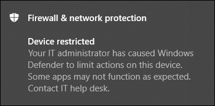

# Prendre des mesures de réponse sur un appareil

[!INCLUDE [Microsoft 365 Defender rebranding](../../includes/microsoft-defender.md)]

**S’applique à :**
- [Microsoft Defender pour point de terminaison](https://go.microsoft.com/fwlink/?linkid=2154037)

>Vous voulez faire l’expérience de Defender for Endpoint ? [Inscrivez-vous à un essai gratuit.](https://www.microsoft.com/microsoft-365/windows/microsoft-defender-atp?ocid=docs-wdatp-respondmachine-abovefoldlink) 

Réagissez rapidement aux attaques détectées en isolant des dispositifs ou en recueillant un ensemble d’enquêtes. Après avoir pris des mesures sur les appareils, vous pouvez vérifier les détails de l’activité sur le centre d’action.

Les actions de réponse s’exécutent en haut d’une page d’appareil spécifique et incluent :

- Gérer des balises
- Ouvrir une enquête automatisée
- Lancer la session de réponse en direct
- Collecter un package d’examen
- Exécuter une analyse antivirus
- Restreindre l’exécution des applications
- Isolatez le dispositif
- Consulter un spécialiste des menaces
- Centre de notifications

 Vous pouvez trouver des pages d’appareil à partir de l’une des vues suivantes :

- **Tableau de bord des opérations** de sécurité - Sélectionnez un nom d’appareil à partir de la carte Périphériques à risque.
- **File d’attente d’alertes** - Sélectionnez le nom de l’appareil à côté de l’icône de l’appareil à partir de la file d’attente des alertes.
- **Liste des périphériques** - Sélectionnez le titre du nom de l’appareil à partir de la liste des périphériques.
- **Boîte de recherche** - Sélectionnez l’appareil à partir du menu drop-down et entrez le nom de l’appareil.

>[!IMPORTANT]
> - Ces actions de réponse ne sont disponibles que pour les appareils Windows 10, version 1703 ou plus tard. 
> - Pour les plates-formes Windows non-développement, les capacités de réponse (telles que l’isolement de l’appareil) dépendent des capacités tierces.

## Gérer des balises

Ajouter ou gérer des balises pour créer une affiliation de groupe logique. Les balises d’appareil s’appuient sur une cartographie correcte du réseau, vous permettant d’attacher différentes balises pour capturer le contexte et d’activer la création de liste dynamique dans le cadre d’un incident.

Pour plus d’informations sur le marquage des périphériques, voir [Créer et gérer les balises de périphériques](machine-tags.md).

## Ouvrir une enquête automatisée

Vous pouvez commencer une nouvelle enquête automatisée à usage général sur l’appareil si nécessaire. Pendant qu’une enquête est en cours, toute autre alerte générée à partir de l’appareil sera ajoutée à une enquête automatisée en cours jusqu’à ce que cette enquête soit terminée. En outre, si la même menace est visible sur d’autres appareils, ces appareils sont ajoutés à l’enquête.

Pour plus d’informations sur les enquêtes automatisées, voir [Aperçu des enquêtes automatisées](automated-investigations.md).

## Lancer la session de réponse en direct

La réponse en direct est une capacité qui vous donne un accès instantané à un appareil en utilisant une connexion shell distante. Cela vous donne le pouvoir de faire un travail d’enquête approfondi et de prendre des mesures d’intervention immédiates pour contenir rapidement les menaces identifiées — en temps réel.

La réponse en direct est conçue pour améliorer les enquêtes en vous permettant de collecter des données médico-légales, d’exécuter des scripts, d’envoyer des entités suspectes pour analyse, d’assainir les menaces et de traquer de manière proactive les menaces émergentes.

Pour plus d’informations sur la réponse en direct, voir [Enquêter sur les entités sur les appareils utilisant la réponse en direct](live-response.md).

## Recueillir le paquet d’enquête à partir d’appareils

Dans le cadre du processus d’enquête ou d’intervention, vous pouvez collecter un paquet d’enquête à partir d’un appareil. En recueillant le paquet d’enquête, vous pouvez identifier l’état actuel de l’appareil et mieux comprendre les outils et les techniques utilisés par l’attaquant.

Pour télécharger le paquet (fichier Zip) et enquêter sur les événements qui se sont produits sur un appareil

1. Sélectionnez **Collecter le paquet** d’enquête à partir de la ligne d’actions de réponse en haut de la page de l’appareil.
2. Spécifiez dans la boîte de texte pourquoi vous souhaitez effectuer cette action. Sélectionner **Confirmer**.
3. Le fichier zip téléchargera

Autre voie:

1. Sélectionnez **Le centre d’action** de la section actions de réponse de la page périphérique.

    

3. Dans le fly-out du centre d’action, **sélectionnez le package de collecte package** disponible pour télécharger le fichier zip.
  
    

Le paquet contient les dossiers suivants :

| Dossier | Description |
|:---|:---------|
|Autoruns | Contient un ensemble de fichiers qui représentent chacun le contenu du registre d’un point d’entrée de démarrage automatique connu (ASEP) pour aider à identifier la persistance de l’attaquant sur l’appareil.    
<b>REMARQUE:</b> Si la clé du registre n’est pas trouvée, le fichier contiendra le message suivant : « ERREUR : le système n’a pas été en mesure de trouver la clé ou la valeur du registre spécifiée ».
                                                                                                                                |
|Programmes installés | Ce .CSV contient la liste des programmes installés qui peuvent aider à identifier ce qui est actuellement installé sur l’appareil. Pour plus d’informations, [Win32_Product classe](https://go.microsoft.com/fwlink/?linkid=841509).                                                                                  |
|Connexions réseau | Ce dossier contient un ensemble de points de données liés aux informations de connectivité qui peuvent aider à identifier la connectivité aux URL suspectes, à l’infrastructure de commande et de contrôle de l’attaquant (C&C), à tout mouvement latéral ou à toute connexion distante.   - ActiveNetConnections.txt – Affiche les statistiques du protocole et les connexions réseau TCP/IP actuelles. Offre la possibilité de rechercher une connectivité suspecte effectuée par un processus.    - Arp.txt – Affiche les tableaux de cache du protocole de résolution d’adresse (ARP) actuels pour toutes les interfaces.    Le cache ARP peut révéler des hôtes supplémentaires sur un réseau qui ont été compromis ou des systèmes suspects sur le réseau qui auraient pu être utilisés pour exécuter une attaque interne.   - DnsCache.txt - Affiche le contenu du cache resolver client DNS, qui inclut les deux entrées préchargées à partir du fichier Hôtes locaux et les enregistrements de ressources récemment obtenus pour les requêtes de nom résolues par l’ordinateur. Cela peut aider à identifier les connexions suspectes.    - IpConfig.txt – Affiche la configuration TCP/IP complète pour tous les adaptateurs. Les adaptateurs peuvent représenter des interfaces physiques, telles que des adaptateurs réseau installés, ou des interfaces logiques, telles que les connexions commutées.    - FirewallExecutionLog.txt et pfirewall.log                                                                                  |
| Fichiers Prefetch| Windows Les fichiers Prefetch sont conçus pour accélérer le processus de démarrage de l’application. Il peut être utilisé pour suivre tous les fichiers récemment utilisés dans le système et trouver des traces pour les applications qui pourraient avoir été supprimés, mais peut encore être trouvé dans la liste des fichiers prefetch.    - Dossier Prefetch - Contient une copie des fichiers prefetch de `%SystemRoot%\Prefetch` . REMARQUE : Il est suggéré de télécharger une visionneuse de fichiers préfaisable pour afficher les fichiers préfaisables.    - PrefetchFilesList.txt - Contient la liste de tous les fichiers copiés qui peuvent être utilisés pour suivre s’il y avait des échecs de copie dans le dossier prefetch.                                                                                                      |
| Processus| Contient un fichier .CSV liste des processus en cours d’exécution, ce qui permet d’identifier les processus actuels en cours d’exécution sur l’appareil. Cela peut être utile lors de l’identification d’un processus suspect et de son état.                                                                                                                                                                                                       |
| Tâches planifiées| Contient un fichier .CSV liste des tâches planifiées, qui peut être utilisé pour identifier les routines effectuées automatiquement sur un appareil choisi pour rechercher du code suspect qui a été configuré pour s’exécuter automatiquement.                                                                                                                                                                                                      |
| Journal des événements de sécurité| Contient le journal des événements de sécurité, qui contient des enregistrements de connexion ou d’activité de logout, ou d’autres événements liés à la sécurité spécifiés par la stratégie d’audit du système.   
<b>REMARQUE:</b> Ouvrez le fichier journal des événements à l’aide de la visionneuse d’événements.
                                                                                    |
| Services| Contient un fichier .CSV qui répertorie les services et leurs états.                                                                                      |
| Windows Sessions server message block (SMB) | Répertorie l’accès partagé aux fichiers, imprimantes et ports en série et les communications diverses entre nœuds sur un réseau. Cela peut aider à identifier l’exfiltration des données ou le mouvement latéral.    Contient des fichiers pour SMBInboundSessions et SMBOutboundSession.    
<b>REMARQUE:</b> S’il n’y a pas de sessions (entrantes ou sortantes), vous obtiendrez un fichier texte qui vous indique qu’il n’y a pas de sessions PME trouvées.
                                                                                                                          |
| System Information| Contient un fichier SystemInformation.txt qui répertorie les informations système telles que la version OS et les cartes réseau.                                                                                     |
| Annuaires Temp| Contient un ensemble de fichiers texte qui répertorie les fichiers situés en %Temp% pour chaque utilisateur du système.    Cela peut aider à suivre les fichiers suspects qu’un attaquant peut avoir laissé tomber sur le système.    
<b>REMARQUE:</b> Si le fichier contient le message suivant : « Le système ne peut pas trouver le chemin spécifié », cela signifie qu’il n’y a pas d’annuaire temporaire pour cet utilisateur, et peut-être parce que l’utilisateur ne s’est pas connecté au système.
                                                                                                                                         |
| Utilisateurs et groupes| Fournit une liste de fichiers qui représentent chacun un groupe et ses membres.                                                                                                                   |
|WdSupportLogs| Fournit le MpCmdRunLog.txt et MPSupportFiles.cab     
<b>REMARQUE:</b> Ce dossier ne sera créé que sur Windows 10, version 1709 ou plus tard avec février 2020 mise à jour rollup ou plus récemment installé:  Win10 1709 (RS3) Construire 16299.1717 : [KB4537816](https://support.microsoft.com/en-us/help/4537816/windows-10-update-kb4537816)   Win10 1803 (RS4) Construire 17134.1345 : [KB4537795](https://support.microsoft.com/en-us/help/4537795/windows-10-update-kb4537795)   Win10 1809 (RS5) Construire 17763.1075 : [KB4537818](https://support.microsoft.com/en-us/help/4537818/windows-10-update-kb4537818)   Win10 1903/1909 (19h1/19h2) Construit 18362.693 et 18363.693 : [KB4535996](https://support.microsoft.com/en-us/help/4535996/windows-10-update-kb4535996) 
                                                                                                                    |
| CollectionSummaryReport.xls| Ce fichier est un résumé de la collecte du paquet d’enquête, il contient la liste des points de données, la commande utilisée pour extraire les données, l’état d’exécution et le code d’erreur en cas de défaillance. Vous pouvez utiliser ce rapport pour suivre si le paquet inclut toutes les données attendues et identifier s’il y a eu des erreurs. |

## Exécutez Antivirus Microsoft Defender scan sur les appareils

Dans le cadre du processus d’enquête ou de réponse, vous pouvez lancer à distance une analyse antivirus pour aider à identifier et à corriger les logiciels malveillants qui pourraient être présents sur un appareil compromis.

>[!IMPORTANT]
>- Cette action est disponible pour les appareils sur Windows 10, version 1709 ou plus tard.
>- Un Antivirus Microsoft Defender (Microsoft Defender AV) peut fonctionner aux côtés d’autres solutions antivirus, que Microsoft Defender AV soit la solution antivirus active ou non. Microsoft Defender AV peut être en mode Passif. Pour plus d’informations, [consultez Antivirus Microsoft Defender compatibilité](https://docs.microsoft.com/windows/security/threat-protection/microsoft-defender-antivirus/microsoft-defender-antivirus-compatibility.md).

Celui que vous avez **sélectionné Exécuter l’analyse antivirus**, sélectionnez le type de numérisation que vous souhaitez exécuter (rapide ou complet) et ajouter un commentaire avant de confirmer l’analyse.

Le centre d’action affichera les informations d’analyse et la chronologie de l’appareil comprendra un nouvel événement, reflétant qu’une action d’analyse a été soumise sur l’appareil. Les alertes Microsoft Defender AV refléteront toutes les détections qui ont fait surface pendant l’analyse.

>[!NOTE]
>Lorsque vous déclenchez une analyse à l’aide de Defender pour l’action de réponse Endpoint, la valeur antivirus « ScanAvgCPULoadFactor » de Microsoft Defender s’applique toujours et limite l’impact CPU de l’analyse.  Si ScanAvgCPULoadFactor n’est pas configuré, la valeur par défaut est une limite de charge CPU maximale de 50% lors d’une analyse. 
>Pour plus d’informations, [voir configure-advanced-scan-types-microsoft-defender-antivirus](https://docs.microsoft.com/windows/security/threat-protection/microsoft-defender-antivirus/configure-advanced-scan-types-microsoft-defender-antivirus).

## Restreindre l’exécution des applications

En plus de contenir une attaque en arrêtant les processus malveillants, vous pouvez également verrouiller un périphérique et empêcher les tentatives ultérieures de programmes potentiellement malveillants de s’exécuter.

>[!IMPORTANT]
> - Cette action est disponible pour les appareils sur Windows 10, version 1709 ou plus tard.
> - Cette fonctionnalité est disponible si votre organisation utilise Antivirus Microsoft Defender.
> - Cette action doit répondre aux exigences de stratégie Windows Defender’intégrité du code d’application et aux exigences de signature. Pour plus d’informations, consultez les [formats de stratégie d’intégrité du Code et la signature](https://docs.microsoft.com/windows/device-security/device-guard/requirements-and-deployment-planning-guidelines-for-device-guard#code-integrity-policy-formats-and-signing).

Pour empêcher l’exécution d’une application, une stratégie d’intégrité du code est appliquée qui ne permet aux fichiers de s’exécuter que s’ils sont signés par un certificat délivré par Microsoft. Cette méthode de restriction peut aider à empêcher un attaquant de contrôler les périphériques compromis et d’effectuer d’autres activités malveillantes.

>[!NOTE]
>Vous serez en mesure d’inverser la restriction de l’exécution des applications à tout moment. Le bouton de la page de l’appareil changera pour dire Supprimer les **restrictions de l’application,** puis vous prenez les mêmes mesures que la restriction de l’exécution de l’application.

Une fois que vous avez sélectionné **Restreindre l’exécution de l’application** sur la page de l’appareil, tapez un commentaire et **sélectionnez Confirmer**. Le centre d’action affichera les informations d’analyse et la chronologie de l’appareil comprendra un nouvel événement.

**Notification sur l’utilisateur de l’appareil**: 
Lorsqu’une application est restreinte, la notification suivante s’affiche pour informer l’utilisateur qu’une application est interdite d’exécution :

## Isoler les appareils du réseau

Selon la gravité de l’attaque et la sensibilité de l’appareil, vous pouvez isoler l’appareil du réseau. Cette action peut aider à empêcher l’attaquant de contrôler l’appareil compromis et d’effectuer d’autres activités telles que l’exfiltration des données et le mouvement latéral.

>[!IMPORTANT]
>- L’isolement complet est disponible pour les appareils Windows 10, version 1703.
>- L’isolement sélectif est disponible pour les appareils Windows 10, version 1709 ou plus tard.
>- Lors de l’isolement d’un périphérique, seuls certains processus et destinations sont autorisés. Par conséquent, les appareils qui se trouvent derrière un tunnel VPN complet ne seront pas en mesure d’atteindre le Microsoft Defender pour le service cloud Endpoint après l’isolement de l’appareil. Nous vous recommandons d’utiliser un VPN à tunnel partagé pour Microsoft Defender pour Endpoint et Antivirus Microsoft Defender trafic basé sur la protection basé sur le cloud.

Cette fonction d’isolation de périphérique déconnecte l’appareil compromis du réseau tout en conservant la connectivité au service Defender for Endpoint, qui continue de surveiller l’appareil.

Sur Windows 10, version 1709 ou plus tard, vous aurez un contrôle supplémentaire sur le niveau d’isolement du réseau. Vous pouvez également choisir d’activer Outlook, Microsoft Teams et Skype Entreprise connectivité (alias « isolement sélectif »).

>[!NOTE]
>Vous serez en mesure de reconnecter l’appareil au réseau à tout moment. Le bouton sur la page de l’appareil va changer pour dire **Libération de l’isolement**, puis vous prenez les mêmes mesures que l’isolement de l’appareil.

Une fois que vous avez sélectionné **isolate device** sur la page de l’appareil, tapez un commentaire et sélectionnez **Confirmer**. Le centre d’action affichera les informations d’analyse et la chronologie de l’appareil comprendra un nouvel événement.

>[!NOTE]
>L’appareil restera connecté au service Defender for Endpoint même s’il est isolé du réseau. Si vous avez choisi d’activer Outlook et Skype Entreprise communication, alors vous serez en mesure de communiquer avec l’utilisateur pendant que l’appareil est isolé.

**Notification sur l’utilisateur de l’appareil**: 
Lorsqu’un périphérique est isolé, la notification suivante s’affiche pour informer l’utilisateur que l’appareil est isolé du réseau :

## Consulter un spécialiste des menaces

Vous pouvez consulter un expert microsoft threat pour plus d’informations concernant un appareil potentiellement compromis ou déjà compromis. Spécialistes des menaces Microsoft peuvent être engagés directement à partir de l’intérieur de la Centre de sécurité Microsoft Defender pour une réponse rapide et précise. Les experts fournissent des informations non seulement sur un périphérique potentiellement compromis, mais aussi pour mieux comprendre les menaces complexes, les notifications d’attaque ciblées que vous obtenez, ou si vous avez besoin de plus d’informations sur les alertes, ou un contexte de renseignement sur les menaces que vous voyez sur votre tableau de bord portail.

Consultez [un expert microsoft threat pour plus](https://docs.microsoft.com/microsoft-365/security/defender-endpoint/configure-microsoft-threat-experts#consult-a-microsoft-threat-expert-about-suspicious-cybersecurity-activities-in-your-organization) de détails.

## Vérifier les détails de l’activité dans le Centre de notifications

Le **centre d’action** fournit des informations sur les actions qui ont été prises sur un appareil ou un fichier. Vous pourrez consulter les détails suivants :

- Collecte de trousses d’enquête
- Analyse antivirus
- Restriction d’application
- Isolation de l’appareil

Tous les autres détails connexes sont également affichés, par exemple, la date/heure de soumission, la soumission de l’utilisateur et si l’action a réussi ou échoué.

## Rubrique connexe
- [Prendre des mesures de réponse sur un fichier](respond-file-alerts.md)
- [Inexactitude du rapport](https://docs.microsoft.com/microsoft-365/security/defender-endpoint/tvm-security-recommendation#report-inaccuracy)
