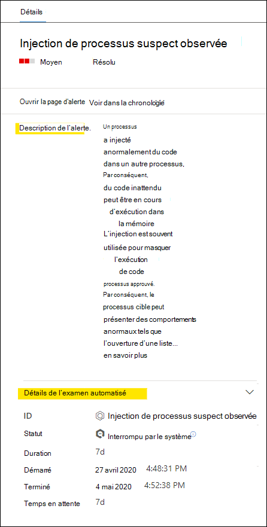

# Passer en revue les alertes dans Microsoft Defender pour le point de terminaison

[!INCLUDE [Microsoft 365 Defender rebranding](../../includes/microsoft-defender.md)]

**S’applique à :**
- [Microsoft Defender pour point de terminaison Plan 2](https://go.microsoft.com/fwlink/p/?linkid=2154037)

> Vous souhaitez faire l’expérience de Defender for Endpoint ? [Inscrivez-vous pour bénéficier d’un essai gratuit.](https://signup.microsoft.com/create-account/signup?products=7f379fee-c4f9-4278-b0a1-e4c8c2fcdf7e&ru=https://aka.ms/MDEp2OpenTrial?ocid=docs-wdatp-managealerts-abovefoldlink)

La page d’alerte dans Microsoft Defender pour le point de terminaison fournit un contexte complet à l’alerte, en combinant les signaux d’attaque et les alertes associées à l’alerte sélectionnée, pour créer un article d’alerte détaillé.

Triez rapidement, examinez et prenez des mesures efficaces sur les alertes qui affectent votre organisation. Comprendre pourquoi ils ont été déclenchés et leur impact à partir d’un seul emplacement. En savoir plus dans cette vue d’ensemble.

> [!VIDEO https://www.microsoft.com/videoplayer/embed/RE4yiO5]

## Mise en place d’une alerte

Si vous sélectionnez le nom d’une alerte dans Defender pour le point de terminaison, vous serez sur sa page d’alerte. Sur la page d’alerte, toutes les informations s’afficheront dans le contexte de l’alerte sélectionnée. Chaque page d’alerte se compose de 4 sections :

1. **Le titre de l’alerte** affiche le nom de l’alerte et est là pour vous rappeler quelle alerte a démarré votre enquête en cours, indépendamment de ce que vous avez sélectionné sur la page.
2. [**Les ressources affectées répertorient**](#review-affected-assets) les cartes d’appareils et d’utilisateurs affectés par cette alerte qui peuvent être cliquées pour plus d’informations et d’actions.
3. **L’article d’alerte** affiche toutes les entités liées à l’alerte, interconnectées par une arborescence. L’alerte dans le titre est celle qui est sélectionnée lorsque vous vous pointez pour la première fois sur la page de votre alerte sélectionnée. Les entités dans l’article d’alerte sont ex expandables et cliquables, pour fournir des informations supplémentaires et accélérer la réponse en vous permettant d’agir directement dans le contexte de la page d’alerte. Utilisez l’article d’alerte pour lancer votre enquête. Découvrez comment examiner [les alertes dans Microsoft Defender pour le point de terminaison](/microsoft-365/security/defender-endpoint/investigate-alerts).
4. Le **volet d’informations** affiche d’abord les détails de l’alerte sélectionnée, ainsi que les détails et les actions associés à cette alerte. Si vous sélectionnez l’une des ressources ou entités affectées dans l’article d’alerte, le volet d’informations change pour fournir des informations contextuelles et des actions pour l’objet sélectionné.

Notez l’état de détection de votre alerte.

- Interdit : la tentative d’action suspecte a été évitée. Par exemple, un fichier n’a pas été écrit sur le disque ou exécuté.

  

- Bloqué : un comportement suspect a été exécuté, puis bloqué. Par exemple, un processus a été exécuté, mais comme il a par la suite présenté des comportements suspects, le processus a été interrompu.

  

- Détecté : une attaque a été détectée et est éventuellement toujours active.

  

Vous pouvez ensuite consulter les *détails* de l’enquête automatisée dans le volet d’informations de votre alerte pour voir quelles actions ont déjà été entreprises, ainsi que lire la description de l’alerte pour les actions recommandées.

Les autres informations disponibles dans le volet d’informations à l’ouverture de l’alerte incluent les techniques MITRE, la source et des détails contextuels supplémentaires.

## Passer en revue les biens affectés

La sélection d’un appareil ou d’une carte utilisateur dans les sections ressources affectées bascule vers les détails de l’appareil ou de l’utilisateur dans le volet d’informations.

- **Pour les appareils**, le volet d’informations affiche des informations sur l’appareil lui-même, telles que Domaine, Système d’exploitation et IP. Les alertes actives et les utilisateurs connectés sur cet appareil sont également disponibles. Vous pouvez prendre des mesures immédiates en isolant l’appareil, en limitant l’exécution de l’application ou en exécutant une analyse antivirus. Vous pouvez également collecter un package d’enquête, lancer une enquête automatisée ou vous rendre sur la page de l’appareil pour l’examiner du point de vue de l’appareil.

   

- Pour les utilisateurs **, le** volet d’informations affiche des informations détaillées sur l’utilisateur, telles que le nom SAM et le SID de l’utilisateur, ainsi que les types d’accès effectués par cet utilisateur, ainsi que les alertes et incidents qui lui sont associés. Vous pouvez sélectionner *Ouvrir la page utilisateur pour* poursuivre l’examen du point de vue de cet utilisateur.

   

## Voir aussi

- [Afficher et organiser la file d’attente des incidents](view-incidents-queue.md)
- [Enquêter sur des incidents](investigate-incidents.md)
- [Gérer les incidents](manage-incidents.md)
