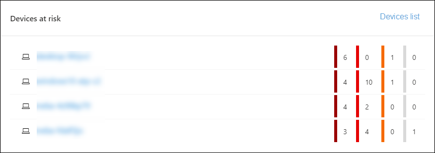
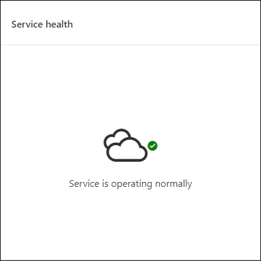

# Centre de sécurité Microsoft Defender Tableau de bord opérations de sécurité

[!INCLUDE [Microsoft 365 Defender rebranding](../../includes/microsoft-defender.md)]

**S’applique à :**
- [Microsoft Defender pour point de terminaison](https://go.microsoft.com/fwlink/?linkid=2154037)

> Vous voulez découvrir Microsoft Defender pour point de terminaison ? [Inscrivez-vous pour bénéficier d’un essai gratuit.](https://www.microsoft.com/microsoft-365/windows/microsoft-defender-atp?ocid=docs-wdatp-secopsdashboard-abovefoldlink)

Le **tableau de bord Opérations de** sécurité est l’endroit protection évolutive des points de terminaison fonctionnalités de sécurité sont à l’écran. Il fournit une vue d’ensemble de l’endroit où les détections ont été détectées et met en évidence les cas où des actions de réponse sont nécessaires.

Le tableau de bord affiche une capture instantanée des éléments ci-dessous :

- Alertes actives
- Appareils à risque
- État du capteur
- L’intégrité du service
- Rapports quotidiens sur les appareils
- Examens automatisés actifs
- Statistiques d’enquêtes automatisées
- Utilisateurs à risque
- Activités suspectes

Vous pouvez explorer et examiner les alertes et les appareils pour déterminer rapidement si, où et quand des activités suspectes se sont produites dans votre réseau pour vous aider à comprendre le contexte dans lequel elles sont apparues.

À partir du **tableau de bord Opérations** de sécurité, vous verrez des événements agrégés pour faciliter l’identification d’événements ou de comportements significatifs sur un appareil. Vous pouvez également descendre dans les événements granulaires et les indicateurs de bas niveau.

Il dispose également de vignettes cliquables qui donnent des indications visuelles sur l’état d’état général de votre organisation. Chaque vignette ouvre une vue détaillée de la vue d’ensemble correspondante.

## Alertes actives

Vous pouvez afficher le nombre global d’alertes actives des 30 derniers jours de votre réseau à partir de la vignette. Les alertes sont regroupées en **nouveautés** **et en cours.**

Chaque groupe est sous-classé selon les niveaux de gravité d’alerte correspondants. Cliquez sur le nombre d’alertes à l’intérieur de chaque anneau d’alerte pour afficher un affichage trié de la file d’attente de cette catégorie **(nouveau** ou **en cours).**

Pour plus d’informations, voir [la vue d’ensemble des alertes.](alerts-queue.md)

Chaque ligne inclut une catégorie de gravité d’alerte et une brève description de l’alerte. Vous pouvez cliquer sur une alerte pour afficher sa vue détaillée. Pour plus d’informations, [consultez La vue d’ensemble](investigate-alerts.md) de Microsoft Defender pour les alertes de point de terminaison et [les alertes.](alerts-queue.md)

## Appareils à risque

Cette vignette affiche la liste des appareils avec le plus grand nombre d’alertes actives. Le nombre total d’alertes pour chaque appareil est affiché dans un cercle en regard du nom de l’appareil, puis classé par niveaux de gravité à l’extrémité de la vignette (placez le pointage sur chaque barre de gravité pour voir son étiquette).

Cliquez sur le nom de l’appareil pour voir les détails de cet appareil. Pour plus d’informations, consultez la liste Examiner les appareils dans la liste [Microsoft Defender pour les appareils de point de terminaison.](investigate-machines.md)

Vous pouvez également cliquer sur **La** liste Appareils en haut de la vignette pour passer directement à la liste **Appareils,** triée par le nombre d’alertes actives. Pour plus d’informations, consultez la liste Examiner les appareils dans la liste [Microsoft Defender pour les appareils de point de terminaison.](investigate-machines.md)

## Appareils avec des problèmes de capteur

La **vignette Appareils avec problèmes** de capteur fournit des informations sur la capacité de chaque appareil à fournir des données de capteur au service Microsoft Defender for Endpoint. Il indique le nombre d’appareils qui nécessitent une attention particulière et vous aide à identifier les appareils problématiques.

Deux indicateurs d’état fournissent des informations sur le nombre d’appareils qui ne sont pas correctement signalés au service :

- **Mal configuré :** ces appareils peuvent partiellement signaler des données de capteur au service Microsoft Defender for Endpoint et peuvent avoir des erreurs de configuration qui doivent être corrigées.
- **Inactif**: appareils qui ont cessé de signaler au service Microsoft Defender for Endpoint pendant plus de sept jours au cours du mois précédent.

Lorsque vous cliquez sur l’un des groupes, vous êtes dirigé vers la liste des appareils, filtré en fonction de votre choix. Pour plus d’informations, voir [Vérifier l’état du capteur](check-sensor-status.md) et examiner les [appareils.](investigate-machines.md)

## L’intégrité du service

La **vignette d’état** du service vous informe si le service est actif ou s’il existe des problèmes.

Pour plus d’informations sur l’état du service, voir [Vérifier l’état du service Microsoft Defender pour Endpoint.](service-status.md)

## Rapports quotidiens sur les appareils

La **vignette Rapports quotidiens sur** les appareils affiche un graphique à barres qui représente le nombre d’appareils signalant quotidiennement au cours des 30 derniers jours. Pointez sur des barres individuelles sur le graphique pour voir le nombre exact d’appareils signalant des rapports chaque jour.

## Examens automatisés actifs

Vous pouvez afficher le nombre global d’enquêtes automatisées des 30 derniers jours de votre réseau à partir de la **vignette Enquêtes automatisées actives.** Les examens sont regroupés en **action en attente,** en attente **d’appareil** et en **cours d’exécution.**

## Statistiques d’enquêtes automatisées

Cette vignette affiche les statistiques relatives aux enquêtes automatisées au cours des sept derniers jours. Il indique le nombre d’enquêtes terminées, le nombre d’enquêtes correctement corrigés, le temps en attente moyen d’un examen à lancer, le temps moyen de correction d’une alerte, le nombre d’alertes examinées et le nombre d’heures d’automatisation enregistrées à partir d’un examen manuel classique. 

Vous pouvez cliquer sur **Examens** **automatisés,** **Examens corrigés et Alertes examinées** pour accéder à la page **Enquêtes,** filtrée par catégorie appropriée. Cela vous permet d’obtenir une répartition détaillée des enquêtes en contexte.

## Utilisateurs à risque

La vignette affiche la liste des comptes d’utilisateurs avec les alertes les plus actives et le nombre d’alertes visibles sur les alertes élevées, moyennes ou faibles. 

Cliquez sur le compte d’utilisateur pour voir les détails sur le compte d’utilisateur. Pour plus d’informations, [voir Examiner un compte d’utilisateur.](investigate-user.md)

> Vous voulez découvrir Microsoft Defender pour point de terminaison ? [Inscrivez-vous pour bénéficier d’un essai gratuit.](https://www.microsoft.com/microsoft-365/windows/microsoft-defender-atp?ocid=docs-wdatp-secopsdashboard-belowfoldlink)

## Voir aussi

- [Comprendre le portail Microsoft Defender pour les points de terminaison](use.md)
- [Vue d’ensemble du portail](portal-overview.md)
- [Afficher le tableau de bord gestion & des menaces et des vulnérabilités](tvm-dashboard-insights.md)
- [Afficher le tableau de bord Analyse des menaces et prendre les mesures de prévention recommandées](threat-analytics.md)
