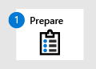

# Basculer vers Microsoft Defender pour le point de terminaison - Phase 3 : Intégration

**S’applique à :**
- [Microsoft Defender pour point de terminaison](https://go.microsoft.com/fwlink/p/?linkid=2154037)
- [Microsoft 365 Defender](https://go.microsoft.com/fwlink/?linkid=2118804)

|  [Phase 1 : préparation](switch-to-microsoft-defender-prepare.md) |  [Phase 2 : configuration](switch-to-microsoft-defender-setup.md) |  Phase 3 : intégration |
|--|--|--|
|| |*Vous êtes là !* |

**Bienvenue dans la phase 3 du [passage à Defender pour Point de terminaison.](switch-to-microsoft-defender-migration.md#the-migration-process)** Cette phase de migration comprend les étapes suivantes :

1. [Intégrer des appareils à Defender pour le point de terminaison.](#onboard-devices-to-microsoft-defender-for-endpoint)
2. [Exécutez un test de détection.](#run-a-detection-test)
3. [Confirmez que Antivirus Microsoft Defender est en mode passif sur vos points de terminaison.](#confirm-that-microsoft-defender-antivirus-is-in-passive-mode-on-your-endpoints)
4. [Obtenir les mises à jour Antivirus Microsoft Defender](#get-updates-for-microsoft-defender-antivirus).
5. [Désinstallez votre solution non-Microsoft.](#uninstall-your-non-microsoft-solution)
6. [Assurez-vous que Defender pour le point de terminaison fonctionne correctement.](#make-sure-defender-for-endpoint-is-working-correctly)

## Intégrer des appareils à Microsoft Defender pour point de terminaison

1. Go to the Microsoft 365 Defender portal ( [https://security.microsoft.com](https://security.microsoft.com) ) and sign in.

2. Choisissez **Paramètres** \> **l’intégration des points de** \> **terminaison** (sous **Gestion des appareils).**

3. Dans la **liste Sélectionner le système d’exploitation pour démarrer le** processus d’intégration, sélectionnez un système d’exploitation.

4. Sous **Méthode de déploiement,** sélectionnez une option. Suivez les liens et invites pour intégrer les appareils de votre organisation. Vous avez besoin d’aide ? Voir [méthodes d’intégration](#onboarding-methods) (dans cet article).

> [!NOTE]
> Si un problème se produit lors de l’intégration, voir Résoudre les problèmes d’intégration de Microsoft Defender pour les [points de terminaison.](troubleshoot-onboarding.md) Cet article explique comment résoudre les problèmes d’intégration et les erreurs courantes sur les points de terminaison.

### Méthodes d’intégration

Les méthodes de déploiement varient en fonction du système d’exploitation et des méthodes préférées. Le tableau suivant répertorie les ressources pour vous aider à intégrer Defender pour Endpoint :

|Systèmes d’exploitation  |Méthodes  |
|---------|---------|
|Windows 10 ou ultérieure  Windows Server 2019 ou une ultérieure  Windows Serveur, version 1803 ou ultérieure  Windows Server 2012 R2 et 2016  [[1](#fn1)]  |   [Script local (jusqu’à 10 appareils)](configure-endpoints-script.md)     [Stratégie de groupe](configure-endpoints-gp.md)  [Microsoft Endpoint Configuration Manager](configure-endpoints-sccm.md)  [Microsoft Endpoint Manager/ Gestion des périphériques mobiles (Intune)](configure-endpoints-mdm.md)     [Scripts VDI](configure-endpoints-vdi.md)    **REMARQUE**: un script local convient pour une preuve de concept, mais ne doit pas être utilisé pour le déploiement de production. Pour un déploiement de production, nous vous recommandons d’utiliser la stratégie de groupe, Microsoft Endpoint Configuration Manager ou Intune.
|Windows Server 2008 R2 SP1 | [Microsoft Monitoring Agent (MMA)](onboard-downlevel.md#install-and-configure-microsoft-monitoring-agent-mma) ou [Azure Defender](/azure/security-center/security-center-wdatp)    **REMARQUE**: Microsoft Monitoring Agent est désormais l’agent Azure Log Analytics. Pour en savoir plus, consultez la vue [d’ensemble de l’agent Log Analytics.](/azure/azure-monitor/platform/log-analytics-agent)  
|Windows 8.1 Entreprise  Windows 8.1 Professionnel  Windows 7 SP1 Pro  Windows 7 SP1| [Microsoft Monitoring Agent (MMA)](onboard-downlevel.md)    **REMARQUE**: Microsoft Monitoring Agent est désormais l’agent Azure Log Analytics. Pour en savoir plus, consultez la vue [d’ensemble de l’agent Log Analytics.](/azure/azure-monitor/platform/log-analytics-agent)  
| macOS : 11.3.1 (Big Sur) 10.15 (Îles) 10.14 (Mojave) | [Script local](mac-install-manually.md)  [Microsoft Endpoint Manager](mac-install-with-intune.md)  [JamF Pro](mac-install-with-jamf.md)  [Gestion des appareils mobiles](mac-install-with-other-mdm.md)   |
| Linux : RHEL 7.2+ CentOS Linux 7.2+ Ubuntu 16 LTS ou un LTS supérieur SLES 12+ Debian 9+ Oracle Linux 7.2 |  [Script local](linux-install-manually.md)    [Sondent](linux-install-with-puppet.md)    [Ansible](linux-install-with-ansible.md)|  
| iOS | [Microsoft Endpoint Manager](ios-install.md)     |
|Android  | [Microsoft Endpoint Manager](android-intune.md)               | 

(<a id="fn1">1</a>) Windows Server 2016 et Windows Server 2012 R2 doivent être intégrés à l’aide des instructions des serveurs Windows [intégrés.](configure-server-endpoints.md#windows-server-2012-r2-and-windows-server-2016)

## Exécuter un test de détection

Pour vérifier que vos appareils intégrés sont correctement connectés à Defender for Endpoint, vous pouvez exécuter un test de détection.

  

|Système d’exploitation|Aide|
|---|---|
|Windows 10 ou ultérieure  Windows Server 2022  Windows Server 2019  Windows Serveur, version 1803 ou ultérieure  Windows Server 2016  Windows Server 2012 R2|Voir [Exécuter un test de détection.](run-detection-test.md)  Visitez le site de démonstration Defender for Endpoint () et essayez un ou <https://demo.wd.microsoft.com> plusieurs des scénarios. Par exemple, essayez le scénario de démonstration **de la protection** livrée par le cloud.|
|macOS :  11.3.1 (Big Sur) 10.15 (Îles) 10.14 (Mojave)|Téléchargez et utilisez l’application CASER sur <https://aka.ms/mdatpmacosdiy> .    Pour plus d’informations, [voir Defender pour point de terminaison sur macOS.](microsoft-defender-endpoint-mac.md)|
|Linux :  RHEL 7.2+ CentOS Linux 7.2+ Ubuntu 16 LTS ou un LTS supérieur SLES 12+ Debian 9+ Oracle Linux 7.2|1. Exécutez la commande suivante et recherchez un résultat **de 1**: `mdatp health --field real_time_protection_enabled` .  2. Ouvrez une fenêtre Terminal et exécutez la commande suivante `curl -o ~/Downloads/eicar.com.txt https://www.eicar.org/download/eicar.com.txt` :  3. Exécutez la commande suivante pour lister les menaces détectées : `mdatp threat list` .  Pour plus d’informations, [voir Defender for Endpoint sur Linux.](microsoft-defender-endpoint-linux.md)|

## Vérifier que Antivirus Microsoft Defender est en mode passif sur vos points de terminaison

Maintenant que vos points de terminaison ont été intégrés à Defender pour le point de terminaison, l’étape suivante consiste à vous assurer que Antivirus Microsoft Defender est en cours d’exécution en mode passif. Vous pouvez utiliser l’une des méthodes suivantes, comme décrit dans le tableau suivant :

  

|Méthode|Procédure|
|---|---|
|Invite de commandes|1. Sur un Windows, ouvrez l’invite de commandes.  2. `sc query windefend` Tapez, puis appuyez sur Entrée.  3. Examinez les résultats pour vérifier que Antivirus Microsoft Defender est en cours d’exécution en mode passif.|
|PowerShell|1. Sur un appareil Windows, ouvrez Windows PowerShell en tant qu’administrateur.  2. Exécutez l’cmdlet PowerShell suivante `Get-MpComputerStatus|select AMRunningMode` : .   3. Examinez les résultats. Vous devriez voir **le mode passif**.|
|Sécurité Windows application|1. Sur un appareil Windows, ouvrez l’Sécurité Windows’application.  2. Sélectionnez **Protection contre & virus**.  3. Under **Qui’s protecting me?** select **Manage providers**.  4. Dans la page **Fournisseurs de sécurité,** sous **Antivirus,** recherchez Antivirus Microsoft Defender **est désactivé.**|
|Gestionnaire des tâches|1. Sur un appareil Windows, ouvrez l’application Gestionnaire des tâches.  2. Sélectionnez **l’onglet Détails.** Recherchez **lesMsMpEng.exe** dans la liste.|

> [!NOTE]
> Vous pouvez voir *Antivirus Windows Defender* de Antivirus Microsoft Defender *dans* certaines versions de Windows.
> Pour en savoir plus sur le mode passif et le mode actif, voir plus d’informations sur [Antivirus Microsoft Defender états.](microsoft-defender-antivirus-compatibility.md#more-details-about-microsoft-defender-antivirus-states)

### Définir Antivirus Microsoft Defender sur Windows Server en mode passif manuellement

Pour définir Antivirus Microsoft Defender en mode passif sur Windows Server, version 1803 ou plus récente, ou Windows Server 2019 ou Windows Server 2022, suivez les étapes suivantes :

1. Ouvrez l’Éditeur du Registre, puis accédez à :

   `Computer\HKEY_LOCAL_MACHINE\SOFTWARE\Policies\Microsoft\Windows Advanced Threat Protection`.

2. Modifiez (ou créez) une entrée DWORD appelée **ForceDefenderPassiveMode** et spécifiez les paramètres suivants :
   - Définissez la valeur DWORD sur **1**.
   - Sous **Base,** **sélectionnez Hexadécimal**.

> [!NOTE]
> Vous pouvez utiliser d’autres méthodes pour définir la clé de Registre, telles que les suivantes :
>
> - [Préférence de stratégie de groupe](/previous-versions/windows/it-pro/windows-server-2012-R2-and-2012/dn581922(v=ws.11))
> - [Outil d’objet de stratégie de groupe local](/windows/security/threat-protection/security-compliance-toolkit-10#what-is-the-local-group-policy-object-lgpo-tool)
> - [Un package dans Configuration Manager](/mem/configmgr/apps/deploy-use/packages-and-programs)

### Démarrer Antivirus Microsoft Defender sur Windows Server 2016

Si vous utilisez Windows Server 2016, vous de devez démarrer Antivirus Microsoft Defender manuellement. Vous pouvez effectuer cette tâche à l’aide de l’cmdlet PowerShell `mpcmdrun.exe -wdenable` sur l’appareil.

## Obtenir les mises à jour de Antivirus Microsoft Defender

Maintenir Antivirus Microsoft Defender à jour est essentiel pour garantir que vos appareils disposent des dernières technologies et fonctionnalités nécessaires pour se protéger contre les nouveaux programmes malveillants et les nouvelles techniques d’attaque, même si Antivirus Microsoft Defender s’exécute en mode passif. (Voir [Antivirus Microsoft Defender compatibilité.)](microsoft-defender-antivirus-compatibility.md)

Il existe deux types de mises à jour liées à la mise Antivirus Microsoft Defender jour :

- Mises à jour de l’intelligence de la sécurité
- Mises à jour de produit

Pour obtenir vos mises à jour, suivez les instructions de la Antivirus Microsoft Defender mises à jour [et appliquez les lignes de base.](manage-updates-baselines-microsoft-defender-antivirus.md)

## Désinstaller votre solution non-Microsoft

Si, à ce stade, vous avez :

- Les appareils de votre organisation ont été intégrés à Defender for Endpoint, et
- Antivirus Microsoft Defender est installé et activé,

Ensuite, l’étape suivante consiste à désinstaller votre solution de protection anti-programme malveillant, antivirus et point de terminaison non-Microsoft. Lorsque vous désinstallez votre solution non Microsoft, Antivirus Microsoft Defender passe du mode passif au mode actif. Dans la plupart des cas, cela se produit automatiquement.

Pour obtenir de l’aide sur la désinstallation de votre solution non-Microsoft, contactez son équipe de support technique.

## Assurez-vous que Defender pour le point de terminaison fonctionne correctement

Maintenant que vous avez intégré Defender pour le point de terminaison et que vous avez désinstallé votre ancienne solution non-Microsoft, l’étape suivante consiste à vous assurer que Defender pour le point de terminaison fonctionne correctement. Une bonne façon d’effectuer cette tâche consiste à visiter le site de démonstration defender pour point de terminaison ( [https://demo.wd.microsoft.com](https://demo.wd.microsoft.com) ). Essayez un ou plusieurs scénarios de démonstration sur cette page, y compris au moins les scénarios suivants :

- Protection fournie par le cloud
- Applications potentiellement indésirables (PUA)
- Protection du réseau (NP)

## Étapes suivantes

**Félicitations**! Vous avez terminé votre [migration vers Defender pour endpoint](switch-to-microsoft-defender-migration.md#the-migration-process)!

- [Visitez votre tableau de bord des opérations](security-operations-dashboard.md) de sécurité dans le portail Microsoft 365 Defender ( [https://security.microsoft.com](https://security.microsoft.com) ).
- [Gérer Defender pour le point de terminaison, après la migration.](manage-atp-post-migration.md)
