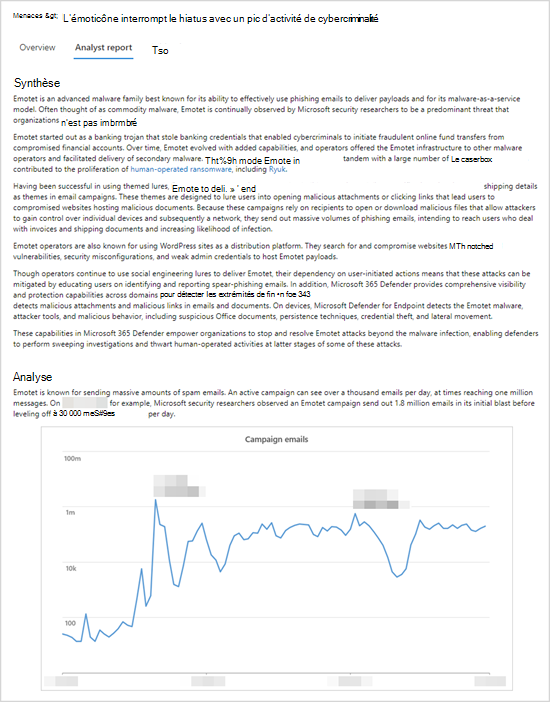

# Rapport d’analyste dans l’analyse des menaces

[!INCLUDE [Microsoft 365 Defender rebranding](../../includes/microsoft-defender.md)]

**S’applique à :**
- [Microsoft Defender for Endpoint Plan 2](https://go.microsoft.com/fwlink/?linkid=2154037)
- [Microsoft 365 Defender](https://go.microsoft.com/fwlink/?linkid=2118804)

> Vous voulez découvrir Microsoft Defender pour point de terminaison ? [Inscrivez-vous pour bénéficier d’un essai gratuit.](https://signup.microsoft.com/create-account/signup?products=7f379fee-c4f9-4278-b0a1-e4c8c2fcdf7e&ru=https://aka.ms/MDEp2OpenTrial?ocid=docs-wdatp-exposedapis-abovefoldlink)

Chaque [rapport d’analyse des](threat-analytics.md) menaces inclut des sections dynamiques et une section écrite complète appelée rapport _d’analyste._ Pour accéder à cette section, ouvrez le rapport sur la menace de suivi et sélectionnez **l’onglet Rapport d’analyste.**

_Section Rapport d’analyste d’un rapport d’analyse des menaces_

## Analyser le rapport d’analyste

Chaque section du rapport d’analyste est conçue pour fournir des informations actionnables. Bien que les rapports varient, la plupart des rapports incluent les sections décrites dans le tableau suivant.

 

****

|Section Rapport|Description|
|---|---|
|Résumé exécutif|Vue d’ensemble de la menace, y compris la première fois qu’elle a été vue, ses motivations, les événements notables, les cibles principales et des outils et techniques distincts. Vous pouvez utiliser ces informations pour évaluer plus en détail comment hiérarchiser la menace dans le contexte de votre secteur d’activité, de votre emplacement géographique et de votre réseau.|
|Analyse|Informations techniques sur les menaces, y compris les détails d’une attaque et la façon dont les attaquants peuvent utiliser une nouvelle technique ou une nouvelle surface d’attaque|
|Techniques MITRE ATT&CK observées|Mapilation des techniques observées avec l’infrastructure [d’attaque CK&ATT MITRE](https://attack.mitre.org/)|
|[Atténuations](#apply-additional-mitigations)|Recommandations qui peuvent arrêter ou réduire l’impact de la menace. Cette section inclut également les atténuations qui ne sont pas suivis dynamiquement dans le cadre du rapport d’analyse des menaces.|
|[Détails de la détection](#understand-how-each-threat-can-be-detected)|Détections spécifiques et génériques fournies par les solutions de sécurité Microsoft qui peuvent faire surface de l’activité ou des composants associés à la menace.|
|[Repérage avancé](#find-subtle-threat-artifacts-using-advanced-hunting)|[Requêtes de recherche avancées pour](advanced-hunting-overview.md) identifier de manière proactive l’activité potentielle des menaces. La plupart des requêtes sont fournies pour compléter les détections, en particulier pour localiser des composants ou des comportements potentiellement malveillants qui n’ont pas pu être évalués dynamiquement comme malveillants.|
|Références|Publications Microsoft et tierces référencés par les analystes lors de la création du rapport. Le contenu de l’analyse des menaces est basé sur des données validées par des chercheurs Microsoft. Les informations provenant de sources tierces accessibles au public sont clairement identifiées en tant que telles.|
|Journal des modifications|L’heure de publication du rapport et les modifications importantes apportées au rapport.|
|

## Appliquer des atténuations supplémentaires

L’analyse des menaces suit dynamiquement [l’état des mises à jour de sécurité et des configurations sécurisées.](threat-analytics.md#mitigations-review-list-of-mitigations-and-the-status-of-your-devices) Ces informations sont disponibles sous la mesure des graphiques et des tableaux sous **l’onglet Atténuations.**

En plus de ces atténuations suivies, le rapport d’analyste traite également des atténuations qui ne sont _pas_ surveillées dynamiquement. Voici quelques exemples d’atténuations importantes qui ne sont pas suivis dynamiquement :

- Bloquer les e-mails avec _des pièces jointes .lnk_ ou d’autres types de fichiers suspects
- Randomiser les mots de passe d’administrateur local
- Informer les utilisateurs finaux sur le hameçonnage et d’autres vecteurs de menace
- Activer des règles de [réduction de la surface d’attaque spécifiques](attack-surface-reduction.md)

Bien que vous pouvez utiliser l’onglet **Atténuations** pour évaluer votre posture de sécurité par rapport à une menace, ces recommandations vous permet de prendre des mesures supplémentaires pour améliorer votre posture de sécurité. Lisez attentivement toutes les instructions d’atténuation du rapport d’analyste et appliquez-les dès que possible.

## Comprendre comment chaque menace peut être détectée

Le rapport d’analyste fournit également les détections des fonctionnalités Antivirus Microsoft Defender et _protection évolutive des points de terminaison_ (PEPT).

### Détections antivirus

Ces détections sont disponibles sur les appareils [sur](/windows/security/threat-protection/microsoft-defender-antivirus/microsoft-defender-antivirus-in-windows-10) Antivirus Microsoft Defender de données. Lorsque ces détections se produisent sur des appareils qui ont été intégrés à Microsoft Defender pour endpoint, elles déclenchent également des alertes qui allument les graphiques dans le rapport.

> [!NOTE]
> Le rapport d’analyste répertorie également les **détections génériques** qui peuvent identifier un large éventail de menaces, en plus des composants ou comportements spécifiques à la menace de suivi. Ces détections génériques ne sont pas reflétées dans les graphiques.

### Alertes de détection et de réponse (PEPT) de point de terminaison

PEPT alertes sont élevées pour les appareils [intégrés à Microsoft Defender pour le point de terminaison.](onboard-configure.md) Ces alertes s’appuient généralement sur les signaux de sécurité collectés par le capteur Microsoft Defender for Endpoint et d’autres fonctionnalités de point de terminaison (antivirus, protection réseau, protection contre la falsification) qui servent de sources de signal puissantes.

À l’exemple de la liste des détections antivirus, certaines alertes PEPT sont conçues pour indicateurs génériques d’un comportement suspect qui n’est peut-être pas associé à la menace détectée. Dans ce cas, le rapport identifie clairement l’alerte comme « générique » et n’influence aucun graphique du rapport.

## Rechercher des artefacts de menace discrets à l’aide de la recherche avancée

Bien que les détections vous permettent d’identifier et d’arrêter automatiquement la menace de suivi, de nombreuses activités d’attaque laissent des traces subtiles qui nécessitent une inspection supplémentaire. Certaines activités d’attaque présentent des comportements qui peuvent également être normaux, de sorte que leur détection dynamique peut entraîner un bruit opérationnel, voire des faux positifs.

[Le repérage avancé](advanced-hunting-overview.md) fournit une interface de requête basée sur le langage de requête Kusto qui simplifie la recherche d’indicateurs discrets de l’activité des menaces. Il vous permet également d’surfacer des informations contextuelles et de vérifier si les indicateurs sont connectés à une menace.

Les requêtes de recherche avancées dans les rapports d’analyste ont été examinées par les analystes Microsoft et sont prêtes à être exécutés dans l’éditeur de requête [de recherche avancée.](https://securitycenter.windows.com/advanced-hunting) Vous pouvez également utiliser les requêtes pour créer des règles de [détection personnalisées](custom-detection-rules.md) qui déclenchent des alertes pour les correspondances futures.

## Rubriques connexes

- [Vue d’ensemble des analyses de menaces](threat-analytics.md)
- [Rechercher de manière proactive les menaces avec le recherche avancée](advanced-hunting-overview.md)
- [Règles de détection personnalisée](custom-detection-rules.md)
- 