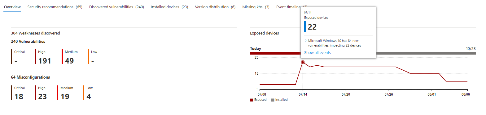

# Chronologie des événements - Gestion des menaces et des vulnérabilités

[!INCLUDE [Microsoft 365 Defender rebranding](../../includes/microsoft-defender.md)]

**S’applique à :**
- [Microsoft Defender pour point de terminaison](https://go.microsoft.com/fwlink/?linkid=2154037)
- [Microsoft 365 Defender](https://go.microsoft.com/fwlink/?linkid=2118804)

> Vous voulez découvrir Microsoft Defender pour point de terminaison ? [Inscrivez-vous pour bénéficier d’un essai gratuit.](https://signup.microsoft.com/create-account/signup?products=7f379fee-c4f9-4278-b0a1-e4c8c2fcdf7e&ru=https://aka.ms/MDEp2OpenTrial?ocid=docs-wdatp-portaloverview-abovefoldlink)

La chronologie des événements est un flux d’actualités sur les risques qui vous permet d’interpréter la façon dont le risque est introduit dans l’organisation par le biais de nouvelles vulnérabilités ou de nouvelles exploitations. Vous pouvez afficher les événements qui peuvent avoir un impact sur les risques de votre organisation. Par exemple, vous pouvez trouver de nouvelles vulnérabilités qui ont été introduites, des vulnérabilités qui sont devenues exploitables, des exploits ajoutés à un kit d’exploitation, et bien plus encore.

La chronologie des événements indique également l’histoire de votre [score](tvm-exposure-score.md) d’exposition et du score de sécurité [Microsoft](tvm-microsoft-secure-score-devices.md) pour les appareils afin que vous pouvez déterminer la cause des modifications importantes. Les événements peuvent avoir un impact sur vos appareils ou votre score pour les appareils. Réduisez votre exposition en résribuant ce qui doit être corrigé en fonction des recommandations de sécurité [prioritaires.](tvm-security-recommendation.md)

> [!TIP]
> Pour obtenir des e-mails sur les nouveaux événements de vulnérabilité, voir Configurer les notifications par courrier électronique de vulnérabilité [dans Microsoft Defender pour le point de terminaison](configure-vulnerability-email-notifications.md)

## Accéder à la page Chronologie des événements

Il existe également trois points d’entrée du [tableau Gestion des menaces et des vulnérabilités de bord :](tvm-dashboard-insights.md)

- **Carte de score d’exposition de** l’organisation : pointez sur les points d’événement dans le graphique « Score d’exposition au fil du temps », puis sélectionnez « Voir tous les événements de ce jour ». Les événements représentent des vulnérabilités logicielles.
- **Score de sécurité Microsoft pour les** appareils : pointez sur les points d’événement dans le graphique « Votre score pour les appareils au fil du temps », puis sélectionnez « Voir tous les événements de ce jour ». Les événements représentent de nouvelles évaluations de configuration.
- **Carte événements principales**: sélectionnez « Afficher plus » en bas du tableau des événements supérieurs. La carte affiche les trois événements les plus importants au cours des 7 derniers jours. Les événements avec impact peuvent inclure si l’événement affecte un grand nombre d’appareils ou s’il s’agit d’une vulnérabilité critique.

### Graphiques du score d’exposition et du niveau de sécurité Microsoft pour les appareils

Dans le tableau Gestion des menaces et des vulnérabilités tableau de bord, pointez sur le graphique score d’exposition pour afficher les principaux événements de vulnérabilité logicielle de ce jour qui ont eu un impact sur vos appareils. Pointez sur le graphique Score de sécurité Microsoft pour les appareils pour afficher les nouvelles évaluations de configuration de la sécurité qui affectent votre score.

Si aucun événement n’affecte vos appareils ou votre score pour les appareils, aucun ne s’affiche.

 
 

### Descendre dans les événements de ce jour

Si vous **sélectionnez Afficher tous les** événements de ce jour, vous pouvez vous rendre sur la page chronologie des événements avec une plage de dates personnalisée pour ce jour.

Sélectionnez **Plage personnalisée** pour modifier la plage de dates en une autre plage personnalisée ou une plage de temps pré-définie.

## Vue d’ensemble de la chronologie des événements

Dans la page Chronologie des événements, vous pouvez afficher toutes les informations nécessaires relatives à un événement.

Fonctionnalités :

- Personnaliser les colonnes
- Filtrer par type d’événement ou pourcentage d’appareils touchés
- Afficher 30, 50 ou 100 éléments par page

Les deux grands nombres en haut de la page indiquent le nombre de nouvelles vulnérabilités et de vulnérabilités exploitables, et non d’événements. Certains événements peuvent avoir plusieurs vulnérabilités et d’autres peuvent avoir plusieurs événements.

### Colonnes

- **Date**: mois, jour, année
- **Événement**: événement impactant, y compris le composant, le type et le nombre d’appareils touchés
- **Composant associé :** logiciel
- **Appareils touchés à l’origine**: nombre et pourcentage d’appareils touchés lorsque cet événement s’est produit à l’origine. Vous pouvez également filtrer d’après le pourcentage d’appareils touchés à l’origine, par rapport au nombre total d’appareils.
- **Appareils actuellement touchés**: nombre actuel et pourcentage d’appareils impactés par cet événement. Vous pouvez trouver ce champ en sélectionnant **Personnaliser les colonnes.**
- **Types**: reflètent les événements horodatés qui ont un impact sur le score. Elles peuvent être filtrées.
  - Exploit ajouté à un kit d’exploitation
  - Exploit a été vérifié
  - Nouvelle exploitation publique
  - Nouvelle vulnérabilité
  - Nouvelle évaluation de la configuration
- **Tendance des scores :** tendance du score d’exposition

### Icônes

Les icônes suivantes s’affiche en plus des événements :

-  Nouvelle exploitation publique
-  Nouvelle vulnérabilité publiée
-  Exploit trouvé dans exploit kit
-  Exploit vérifié

### Accès à un événement spécifique

Une fois que vous avez sélectionné un événement, un flyout s’affiche avec une liste des détails et des CV actuels qui affectent vos appareils. Vous pouvez afficher d’autres CV ou consulter la recommandation associée.

La flèche sous « tendance de score » vous permet de déterminer si cet événement a potentiellement augmenté ou réduit le score d’exposition de votre organisation. Un score d’exposition plus élevé signifie que les appareils sont plus vulnérables à l’exploitation.

À partir de là, sélectionnez Go **to related security recommendation** view the recommendation that addresses the new software vulnerability in the security [recommendations page](tvm-security-recommendation.md). Après avoir lu la description et les détails de la vulnérabilité dans la recommandation de sécurité, vous pouvez envoyer une demande de correction et suivre la demande dans la [page de correction.](tvm-remediation.md)

## Afficher les chronologies des événements dans les pages logicielles

Pour ouvrir une page de logiciels, sélectionnez un > sélectionnez le nom du logiciel avec lien hypertexte (comme Visual Studio 2017) dans la section intitulée « Composant associé » dans le volant. [En savoir plus sur les pages logicielles](tvm-software-inventory.md#software-pages)

Une page complète s’affiche avec tous les détails d’un logiciel spécifique. Pointez avec la souris sur le graphique pour voir la chronologie des événements pour ce logiciel spécifique.

Accédez à l’onglet Chronologie des événements pour afficher tous les événements liés à ce logiciel. Vous pouvez également voir les recommandations de sécurité, les vulnérabilités découvertes, les appareils installés et la distribution des versions.

## Voir aussi

- [Vue d’ensemble gestion des vulnérabilités menaces et gestion des vulnérabilités menaces](next-gen-threat-and-vuln-mgt.md)
- [Tableau de bord](tvm-dashboard-insights.md)
- [Score d'exposition](tvm-exposure-score.md)
- [Recommandations de sécurité](tvm-security-recommendation.md)
- [Corriger des vulnérabilités](tvm-remediation.md)
- [Inventaire des logiciels](tvm-software-inventory.md)
