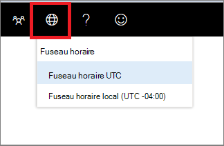

# Paramètres de fuseau horaire du Centre de sécurité Microsoft Defender

[!INCLUDE [Microsoft 365 Defender rebranding](../../includes/microsoft-defender.md)]

**S’applique à :**
- [Microsoft Defender pour point de terminaison](https://go.microsoft.com/fwlink/p/?linkid=2154037)

>Vous souhaitez découvrir Microsoft Defender pour le point de terminaison ? [Inscrivez-vous à un essai gratuit.](https://www.microsoft.com/microsoft-365/windows/microsoft-defender-atp?ocid=docs-wdatp-settings-abovefoldlink)

Utilisez **l’icône 1** des paramètres de fuseau horaire du menu Fuseau horaire pour configurer le fuseau horaire et  licence.

## Paramètres de fuseau horaire
L’aspect du temps est important dans l’évaluation et l’analyse des cyberattaques perçues et réelles.

Les enquêtes cyberforensiques s’appuient souvent sur des horodatés pour rassembler la séquence d’événements. Il est important que votre système reflète les paramètres de fuseau horaire corrects.

Microsoft Defender pour le point de terminaison peut afficher le temps universel coordonné (UTC) ou l’heure locale.

Votre paramètre de fuseau horaire actuel s’affiche dans le menu Microsoft Defender pour le point de terminaison. Vous pouvez modifier le fuseau horaire affiché dans le menu **Fuseau** horaire.

.

### Fuseau horaire UTC
Microsoft Defender pour le point de terminaison utilise l’heure UTC par défaut.

La définition du fuseau horaire De Microsoft Defender pour le point de terminaison sur UTC affiche tous les timestamps système (alertes, événements, etc.) en UTC pour tous les utilisateurs. Cela peut aider les analystes de sécurité travaillant à différents endroits dans le monde à utiliser les mêmes horodatés lors de l’étude des événements.

### Fuseau horaire local
Vous pouvez choisir que Microsoft Defender pour le point de terminaison utilise les paramètres de fuseau horaire local. Toutes les alertes et événements s’affichent à l’aide de votre fuseau horaire local.

Le fuseau horaire local est pris à partir des paramètres régionaux de votre appareil. Si vous modifiez vos paramètres régionaux, le fuseau horaire de Microsoft Defender for Endpoint change également. Le choix de ce paramètre signifie que les timestamps affichés dans Microsoft Defender pour Endpoint seront alignés sur l’heure locale pour tous les utilisateurs de Microsoft Defender pour Endpoint. Les analystes situés dans différents emplacements globaux voient désormais les alertes De Microsoft Defender pour point de terminaison en fonction de leurs paramètres régionaux.

Choisir d’utiliser l’heure locale peut être utile si les analystes se trouvent dans un emplacement unique. Dans ce cas, il peut être plus facile de corréler les événements à l’heure locale, par exemple, lorsqu’un utilisateur local a cliqué sur un lien de courrier suspect.

### Définir le fuseau horaire
Le fuseau horaire De Microsoft Defender pour le point de terminaison est définie par défaut sur UTC.
La définition du fuseau horaire modifie également les heures de tous les affichages de Microsoft Defender pour les points de terminaison.
Pour définir le fuseau horaire :

1. Cliquez sur **l’icône 3** des paramètres de fuseau horaire du menu  horaire.
2. Sélectionnez **l’indicateur UTC** de fuseau horaire.
3. Sélectionnez **le fuseau horaire UTC** ou votre fuseau horaire local, par exemple -7:00.

### Paramètres régionaux
Pour appliquer différents formats de date pour Microsoft Defender pour le point de terminaison, utilisez les paramètres régionaux pour Internet Explorer (IE) et Microsoft Edge (Edge). Si vous utilisez un autre navigateur tel que Google Chrome, suivez les étapes requises pour modifier les paramètres d’heure et de date de ce navigateur. 

**Internet Explorer (IE) et Microsoft Edge**

IE et Microsoft  Edge utilisent les paramètres de région configurés dans l’option **Horloges,** Langue et Région du Panneau de configuration. 

#### Problèmes connus avec les formats régionaux

**Formats de date et d’heure** 
Il existe des problèmes connus avec les formats d’heure et de date. Si vous configurez vos paramètres régionaux dans d’autres formats que les formats pris en charge, le portail risque de ne pas refléter correctement vos paramètres.

Les formats de date et d’heure suivants sont pris en charge :
- Format de date MM/j j/aaie
- Date format jd/MM/a
- Format d’heure hh:mm:ss (format 12 heures)

Les formats de date et d’heure suivants ne sont actuellement pas pris en charge :
- Format de date aay-MM-j j j j
- Date format dd-MMM-yy
- Format de date j/MM/aa
- Format de date MM/j/j/aa
- Format de date avec yy. Affiche uniquement yyyy.
- Format d’heure HH:mm:ss (format 24 heures)

**Symbole décimal utilisé dans les nombres** 
Le symbole décimal utilisé est toujours un point, même si une virgule est sélectionnée dans les paramètres de **format** Nombres dans les **paramètres** de région. Par exemple, 15 500 000 sont affichés en tant que 15,5 000.

