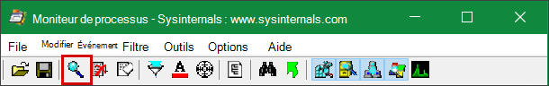
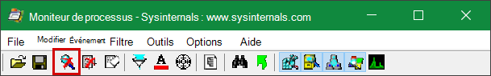
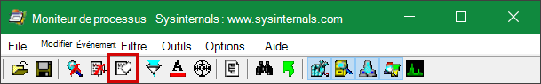
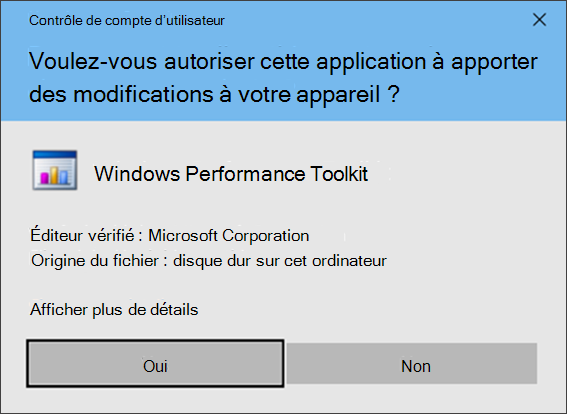
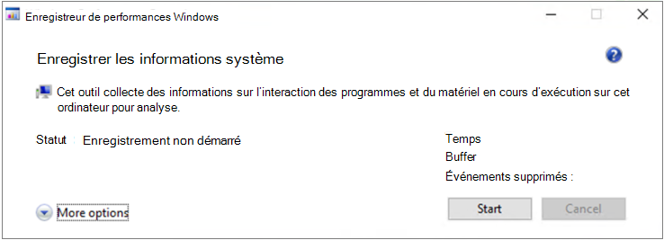
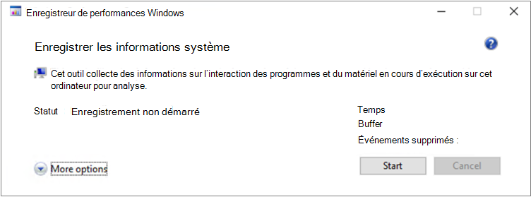

# <a name="troubleshoot-performance-issues-related-to-real-time-protection"></a>Résoudre les problèmes de performances liés à la protection en temps réel


[!INCLUDE [Microsoft 365 Defender rebranding](../../includes/microsoft-defender.md)]


**S’applique à :**

- [Microsoft Defender pour point de terminaison](https://go.microsoft.com/fwlink/p/?linkid=2146631)

Si votre système présente des problèmes élevés d’utilisation du processeur ou de performances liés au service de protection en temps réel dans Microsoft Defender pour le point de terminaison, vous pouvez soumettre un ticket au support Microsoft. Suivez les étapes de [collecte Antivirus Microsoft Defender données de diagnostic.](collect-diagnostic-data.md)

En tant qu’administrateur, vous pouvez également résoudre ces problèmes vous-même.

Tout d’abord, vous pouvez vérifier si le problème est dû à un autre logiciel. Consultez [La vérification auprès du fournisseur pour les exclusions antivirus.](#check-with-vendor-for-antivirus-exclusions)

Dans le cas contraire, vous pouvez identifier les logiciels associés au problème de performances identifié en suivant les étapes de la procédure d’analyse du [journal de protection Microsoft.](#analyze-the-microsoft-protection-log)

Vous pouvez également fournir des journaux supplémentaires à votre soumission au support Microsoft en suivant les étapes ci-après :

- [Capturer les journaux de processus à l’aide du Moniteur de processus](#capture-process-logs-using-process-monitor)
- [Capturer les journaux de performances à l’aide Windows Enregistreur de performances](#capture-performance-logs-using-windows-performance-recorder)

## <a name="check-with-vendor-for-antivirus-exclusions"></a>Consulter le fournisseur pour les exclusions antivirus

Si vous pouvez facilement identifier les logiciels qui affectent les performances du système, allez à la base de connaissances ou au centre de support du fournisseur de logiciels. Recherchez s’ils ont des recommandations sur les exclusions antivirus. Si le site web du fournisseur ne les a pas, vous pouvez ouvrir un ticket de support avec lui et lui demander d’en publier un.

Nous recommandons aux éditeurs de logiciels de suivre les différentes directives de Partenariat avec le secteur [afin de minimiser les faux positifs.](https://www.microsoft.com/security/blog/2018/08/16/partnering-with-the-industry-to-minimize-false-positives/) Le fournisseur peut soumettre ses logiciels via le portail [Microsoft Defender Security Intelligence (MDSI).](https://www.microsoft.com/wdsi/filesubmission?persona=SoftwareDeveloper)

## <a name="analyze-the-microsoft-protection-log"></a>Analyser le journal de protection Microsoft

Dans **MPLog-xxxxxxxx-xxxxxx.log,** vous pouvez trouver les informations d’impact sur les performances estimées de l’exécution de logiciels en tant *qu’EstimatedImpact*:

`Per-process counts:ProcessImageName: smsswd.exe, TotalTime: 6597, Count: 1406, MaxTime: 609, MaxTimeFile: \Device\HarddiskVolume3\_SMSTaskSequence\Packages\WQ1008E9\Files\FramePkg.exe, EstimatedImpact: 65%`

|Nom du champ|Description|
|---|---|
|ProcessImageName|Nom de l’image de processus|
|TotalTime|Durée cumulée en millisecondes passées dans les analyses des fichiers accessibles par ce processus|
|Compte|Nombre de fichiers analysés accédés par ce processus|
|MaxTime|Durée en millisecondes de l’analyse unique la plus longue d’un fichier accessible par ce processus|
|MaxTimeFile|Chemin d’accès au fichier accessible par ce processus pour lequel l’analyse la plus longue `MaxTime` de la durée a été enregistrée|
|EstimatedImpact|Le pourcentage de temps passé dans les analyses pour les fichiers accédés par ce processus en dehors de la période pendant laquelle ce processus a connu une activité d’analyse|

Si l’impact sur les performances est élevé, essayez d’ajouter le processus aux exclusions chemin/processus en suivant les étapes de configuration et de validation des [exclusions](collect-diagnostic-data.md)pour Antivirus Microsoft Defender analyses .

Si l’étape précédente ne résout pas le problème, [](#capture-process-logs-using-process-monitor) vous pouvez collecter plus d’informations via le Moniteur de processus ou l’enregistreur de performances [Windows](#capture-performance-logs-using-windows-performance-recorder) dans les sections suivantes.

## <a name="capture-process-logs-using-process-monitor"></a>Capturer les journaux de processus à l’aide du Moniteur de processus

Process Monitor (ProcMon) est un outil d’analyse avancé qui peut afficher les processus en temps réel. Vous pouvez l’utiliser pour capturer le problème de performances tel qu’il se produit.

1. Téléchargez [process monitor v3.60 dans](/sysinternals/downloads/procmon) un dossier tel que `C:\temp` .

2. Pour supprimer la marque du fichier du web :
    1. Cliquez avec le **bouton droitProcessMonitor.zip** puis sélectionnez **Propriétés.**
    1. Sous *l’onglet Général,* recherchez *Sécurité.*
    1. Cochez la case en **regard de Débloquer.**
    1. Sélectionnez **Appliquer**.

    

3. Dézipez le fichier de `C:\temp` sorte que le chemin d’accès du dossier soit `C:\temp\ProcessMonitor` .

4. Copiez **ProcMon.exe** sur Windows client ou Windows serveur que vous dépannagez.

5. Avant d’utiliser ProcMon, assurez-vous que toutes les autres applications non liées au problème d’utilisation élevée du processeur sont fermées. Cela permet de réduire le nombre de processus à vérifier.

6. Vous pouvez lancer ProcMon de deux manières.
    1. Cliquez avec le **bouton droitProcMon.exe** **sélectionnez Exécuter en tant qu’administrateur.**

        Étant donné que la journalisation démarre automatiquement, sélectionnez l’icône de loupe pour arrêter la capture actuelle ou utilisez le raccourci clavier **Ctrl+E**.

        

        Pour vérifier que vous avez arrêté la capture, vérifiez si l’icône en forme de loupe apparaît maintenant avec un X rouge.

        

        Ensuite, pour effacer la capture précédente, sélectionnez l’icône de gomme.

        

        Vous pouvez également utiliser le raccourci clavier **Ctrl+X**.

    2. La deuxième consiste à exécuter la ligne de **commande en** tant qu’administrateur, puis à partir du chemin d’accès du moniteur de processus, exécutez :

        

        ```console
        Procmon.exe /AcceptEula /Noconnect /Profiling
        ```

        > [!TIP]
        > Faites en sorte que la fenêtre ProcMon soit aussi petite que possible lors de la capture des données afin que vous pouvez facilement démarrer et arrêter le suivi.
        >
        > 

7. Après avoir suivi l’une des procédures de l’étape 6, vous verrez ensuite une option pour définir des filtres. Sélectionnez **OK**. Vous pouvez toujours filtrer les résultats une fois la capture terminée.

    

8. Pour démarrer la capture, sélectionnez de nouveau l’icône de loupe.

9. Reproduisez le problème.

    > [!TIP]
    > Attendez que le problème soit entièrement reproduit, puis notez l’timestamp au début du suivi.

10. Une fois que vous avez deux à quatre minutes d’activité de processus pendant la condition d’utilisation élevée du processeur, arrêtez la capture en sélectionnant l’icône de loupe.

11. Pour enregistrer la capture avec un nom unique et au format .pml, sélectionnez **Fichier,** puis **Enregistrer...**. Veillez à sélectionner les boutons d’radio **Tous les événements** et **le format PML (Native Process Monitor Format).**

    

12. Pour un meilleur suivi, modifiez le chemin d’accès par `C:\temp\ProcessMonitor\LogFile.PML` défaut de l’endroit `C:\temp\ProcessMonitor\%ComputerName%_LogFile_MMDDYEAR_Repro_of_issue.PML` suivant :
    - `%ComputerName%` est le nom de l’appareil
    - `MMDDYEAR` est le mois, le jour et l’année
    - `Repro_of_issue` est le nom du problème que vous essayez de reproduire

    > [!TIP]
    > Si vous avez un système de travail, vous souhaitez peut-être obtenir un exemple de journal à comparer.

13. Zip the .pml file and submit it to Microsoft support.

## <a name="capture-performance-logs-using-windows-performance-recorder"></a>Capturer les journaux de performances à l’aide Windows Enregistreur de performances

Vous pouvez utiliser Windows enregistreur de performances (WPR) pour inclure des informations supplémentaires dans votre soumission au support Microsoft. WPR est un outil d’enregistrement puissant qui crée le suivi des événements pour Windows enregistrements.

WPR fait partie du Kit de déploiement et d’évaluation Windows (Windows ADK) et peut être téléchargé à partir du téléchargement et de l’installation du [kit Windows ADK.](/windows-hardware/get-started/adk-install) Vous pouvez également le télécharger dans le cadre du Kit de développement logiciel Windows 10 sur [Windows 10 SDK](https://developer.microsoft.com/windows/downloads/windows-10-sdk/).

Vous pouvez utiliser l’interface utilisateur WPR en suivant les étapes de capture des journaux de performances à l’aide de [l’interface utilisateur WPR.](#capture-performance-logs-using-the-wpr-ui)

Vous pouvez également utiliser l’outil en ligne de commande *wpr.exe*, qui est disponible dans Windows 8 et versions ultérieures en suivant les étapes de capture des journaux de performances à l’aide de [l’CLI WPR.](#capture-performance-logs-using-the-wpr-cli)

### <a name="capture-performance-logs-using-the-wpr-ui"></a>Capturer les journaux de performances à l’aide de l’interface utilisateur WPR

> [!TIP]
> Si vous avez plusieurs appareils sur lesquels le problème se produit, utilisez celui qui a la plus grande quantité de RAM.

1. Téléchargez et installez WPR.

2. Sous *kits Windows,* cliquez avec le bouton droit sur **Windows Enregistreur de performances.**

    

    Sélectionnez **plus**. Sélectionnez **Exécuter en tant qu’administrateur.**

3. Lorsque la boîte de dialogue Contrôle de compte d’utilisateur s’affiche, sélectionnez **Oui**.

    

4. Ensuite, téléchargez le [profil d’analyse microsoft Defender pour point](https://github.com/YongRhee-MDE/Scripts/blob/master/MDAV.wprp) de terminaison et enregistrez-le dans un dossier tel que `MDAV.wprp` `C:\temp` .

5. Dans la boîte de dialogue WPR, sélectionnez **Plus d’options.**

    

6. Sélectionnez **Ajouter des profils...** et accédez au chemin d’accès du `MDAV.wprp` fichier.

7. Après cela, vous devriez voir un nouveau profil sous Mesures *personnalisées nommées* Analyse du point de terminaison *Microsoft Defender* en dessous.

    

    >[!WARNING]
    >Si votre serveur Windows 64 Go de RAM ou plus, utilisez la mesure personnalisée `Microsoft Defender for Endpoint analysis for large servers` au lieu de `Microsoft Defender for Endpoint analysis` . Dans le cas contraire, votre système pourrait consommer une quantité élevée de mémoires ou de mémoires tampons de pool non pagyés, ce qui peut entraîner une instabilité du système. Vous pouvez choisir les profils à ajouter en **développez l’analyse des ressources.**
    Ce profil personnalisé fournit le contexte nécessaire pour une analyse approfondie des performances.

8. Pour utiliser le profil d’analyse détaillée de la mesure personnalisée Microsoft Defender pour point de terminaison dans l’interface utilisateur WPR :

    1. Assurez-vous qu’aucun profil n’est sélectionné dans les groupes *de tri* de premier niveau, Analyse *des* ressources et *Analyse de* scénario.
    2. Sélectionnez **mesures personnalisées**.
    3. Sélectionnez **Microsoft Defender pour l’analyse des points de terminaison.**
    4. Sélectionnez **Détaillé sous** *Niveau* détail.
    5. Sélectionnez **Fichier ou** **Mémoire en** mode Journalisation.

    > [!IMPORTANT]
    > Vous devez sélectionner *Fichier* pour utiliser le mode de journalisation des fichiers si le problème de performances peut être reproduit directement par l’utilisateur. La plupart des problèmes relèvent de cette catégorie. Toutefois, si l’utilisateur ne peut pas reproduire directement le problème mais  qu’il peut facilement le remarquer une fois le problème se produit, l’utilisateur doit sélectionner Mémoire pour utiliser le mode de journalisation de la mémoire. Cela permet de s’assurer que le journal de suivi n’est pas excessivement insérable en raison du temps de longue durée.

9. Vous êtes maintenant prêt à collecter des données. Quittez toutes les applications qui ne sont pas pertinentes pour reproduire le problème de performances. Vous pouvez sélectionner **les options Masquer pour** que l’espace occupé par la fenêtre WPR reste petit.

    

    > [!TIP]
    > Essayez de démarrer le suivi à un nombre entier de secondes. Par exemple, 01:30:00. Cela facilitera l’analyse des données. Essayez également d’assurer le suivi de l’timestamp du moment exact où le problème est reproduit.

10. Sélectionnez **Démarrer**.

    

11. Reproduisez le problème.

    > [!TIP]
    > Conservez la collecte de données au plus cinq minutes. Deux à trois minutes sont une bonne plage, car un grand nombre de données sont collectées.

12. Sélectionnez **Enregistrer**.

    

13. Remplissez **Type dans une description détaillée** du problème : avec des informations sur le problème et la façon dont vous avez reproduit le problème.

    

    1. Sélectionnez **Nom de fichier :** pour déterminer l’endroit où votre fichier de suivi sera enregistré. Par défaut, il 1.is enregistré dans `%user%\Documents\WPR Files\` .
    1. Sélectionnez **Enregistrer**.

14. Patientez pendant la fusion du suivi.

    

15. Une fois le suivi enregistré, sélectionnez **Ouvrir le dossier.**

    

    Incluez à la fois le fichier et le dossier dans votre soumission au support Microsoft.

    

### <a name="capture-performance-logs-using-the-wpr-cli"></a>Capturer les journaux de performances à l’aide de l’CLI WPR

L’outil en ligne *dewpr.exe* fait partie du système d’exploitation en commençant par Windows 8. Pour collecter un suivi WPR à l’aide de l’outil en ligne de wpr.exe :

1. Téléchargez **[le profil d’analyse](https://github.com/YongRhee-MDE/Scripts/blob/master/MDAV.wprp)** De Microsoft Defender pour point de terminaison pour le suivi des performances vers un fichier nommé dans un `MDAV.wprp` répertoire local tel que `C:\traces` .

2. Cliquez avec  le bouton droit sur l’icône Menu Démarrer et sélectionnez **Windows PowerShell (administrateur)** ou l’invite de commandes **(Administrateur)** pour ouvrir une fenêtre d’invite de commandes d’administration.

3. Lorsque la boîte de dialogue Contrôle de compte d’utilisateur s’affiche, sélectionnez **Oui**.

4. À l’invite avec élévation de droits, exécutez la commande suivante pour démarrer un suivi des performances de Microsoft Defender for Endpoint :

    ```console
    wpr.exe -start C:\traces\MDAV.wprp!WD.Verbose -filemode
    ```

    > [!WARNING]
    > Si votre serveur Windows dispose de 64 Go ou de RAM ou plus, utilisez des profils et non des profils `WDForLargeServers.Light` `WDForLargeServers.Verbose` `WD.Light` `WD.Verbose` et, respectivement. Dans le cas contraire, votre système pourrait consommer une quantité élevée de mémoires ou de mémoires tampons de pool non pagyés, ce qui peut entraîner une instabilité du système.

5. Reproduisez le problème.

    > [!TIP]
    > Conservez la collecte de données au plus cinq minutes.  Selon le scénario, deux à trois minutes sont une bonne plage, car un grand nombre de données sont collectées.

6. À l’invite avec élévation de niveau élevé, exécutez la commande suivante pour arrêter le suivi des performances, en vous assurez de fournir des informations sur le problème et la façon dont vous avez reproduit le problème :

    ```console
    wpr.exe -stop merged.etl "Timestamp when the issue was reproduced, in HH:MM:SS format" "Description of the issue" "Any error that popped up"
    ```

7. Patientez jusqu’à ce que le suivi soit fusionné.

8. Incluez à la fois le fichier et le dossier dans votre soumission au support Microsoft.

## <a name="see-also"></a>Voir aussi

- [Collecter des Antivirus Microsoft Defender de diagnostic](collect-diagnostic-data.md)
- [Configurer et valider des exclusions pour Antivirus Microsoft Defender analyses](configure-exclusions-microsoft-defender-antivirus.md)
