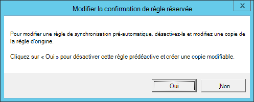

# <a name="troubleshoot-onboarding-issues-related-to-security-management-for-microsoft-defender-for-endpoint"></a>Résoudre les problèmes d’intégration liés à la gestion de la sécurité pour Microsoft Defender pour le point de terminaison 

[!INCLUDE [Microsoft 365 Defender rebranding](../../includes/microsoft-defender.md)]


**S’applique à :**

- [Gérer Microsoft Defender pour le point de terminaison sur les appareils avec Microsoft Endpoint Manager](/mem/intune/protect/mde-security-integration)
- [Microsoft Defender pour point de terminaison](https://go.microsoft.com/fwlink/?linkid=2154037)
- [Microsoft 365 Defender](https://go.microsoft.com/fwlink/?linkid=2118804)

La gestion de la sécurité pour Microsoft Defender pour le point de terminaison est une fonctionnalité pour les appareils qui ne sont pas gérés par un Microsoft Endpoint Manager, qu’il s’Microsoft Intune ou Microsoft Endpoint Configuration Manager , pour recevoir des configurations de sécurité pour Microsoft Defender pour le point de terminaison directement à partir Endpoint Manager.
Pour plus d’informations sur la gestion de la sécurité pour Microsoft Defender pour le point de [terminaison,](/mem/intune/protect/mde-security-integration)voir Gérer Microsoft Defender pour le point de terminaison sur les appareils Microsoft Endpoint Manager .

Pour obtenir des instructions sur la gestion de la sécurité pour Microsoft Defender pour l’intégration de point de [terminaison,](security-config-management.md) voir Microsoft Defender pour endpoint Security Configuration Management

Cette intégration de bout en bout est conçue pour être sans friction et ne nécessite pas d’entrée de l’utilisateur. Toutefois, si vous rencontrez des problèmes lors de l’intégration, vous pouvez afficher et résoudre les erreurs au sein de la plateforme Microsoft Defender for Endpoint.

> [!NOTE]
> Si vous avez des problèmes avec le flux d’intégration pour les nouveaux appareils, examinez les conditions préalables de [Microsoft Defender for Endpoint](/mem/intune/protect/mde-security-integration#prerequisites) et assurez-vous que les instructions d’intégration sont suivies.

Pour plus d’informations sur l’analyseur client, voir [Troubleshoot sensor health using Microsoft Defender for Endpoint Client Analyzer](/microsoft-365/security/defender-endpoint/overview-client-analyzer).

## <a name="registering-domain-joined-computers-with-azure-active-directory"></a>Inscription d’ordinateurs joints à un domaine Azure Active Directory
Pour inscrire correctement les appareils Azure Active Directory, vous devez vous assurer que :

- Les ordinateurs peuvent s’authentifier auprès du contrôleur de domaine 
- Les ordinateurs ont accès aux ressources Microsoft suivantes à partir du réseau de votre organisation :
  - https://enterpriseregistration.windows.net
  - https://login.microsoftonline.com
  - https://device.login.microsoftonline.com
- Azure AD connexion est configurée pour synchroniser les objets ordinateur. Par défaut, les O de l’ordinateur sont Azure AD’étendue de synchronisation de connexion. Si les objets ordinateur appartiennent à des unités d’organisation spécifiques, configurez les unités d’organisation pour qu’elles se synchronisent Azure AD Connecter. Pour en savoir plus sur la synchronisation des objets ordinateur à l’Azure AD Connecter, voir Filtrage basé sur l’unité [d’organisation.](/azure/active-directory/hybrid/how-to-connect-sync-configure-filtering#organizational-unitbased-filtering)

> [!IMPORTANT]
> Azure AD connexion ne synchronise pas les Windows Server 2012'ordinateur R2. Si vous devez les inscrire auprès de Azure AD for Security Management for Microsoft Defender for Endpoint, vous devez personnaliser la règle de synchronisation Azure AD connect pour inclure ces objets ordinateur dans l’étendue de synchronisation. Consultez [les instructions d’application de la règle de jointage d’ordinateur dans Azure Active Directory Connecter]().

> [!NOTE]
> Pour terminer correctement le flux d’intégration et indépendamment du système d’exploitation d’un appareil, l’état Azure Active Directory d’un appareil peut changer en fonction de l’état initial des appareils :<br>
>
> |      État de démarrage de l’appareil     |      Nouvel état de l’appareil     |
> |---|---|
> |     Déjà AADJ ou HAADJ    |     Reste tel qu’il est    |
> |     Non joint à AADJ ou hybrid Azure Active Directory Join (HAADJ) + Domain    |     L’appareil est HAADJ’d    |
> |     Non joint au domaine AADJ ou HAADJ + Non joint au domaine    |     L’appareil est AADJ’d    |
>
> Où AADJ représente Azure Active Directory Joint et HAADJ représente hybrid Azure Active Directory joint.

## <a name="troubleshoot-errors-from-the-microsoft-defender-for-endpoint-portal"></a>Résoudre les erreurs du portail Microsoft Defender pour les points de terminaison


Par le biais du portail Microsoft Defender pour points de terminaison, les administrateurs de sécurité peuvent désormais résoudre les problèmes de gestion de la sécurité pour Microsoft Defender pour l’intégration de point de terminaison. 


Dans **les points de terminaison >'inventaire** des appareils, la colonne Géré par a été ajoutée au filtre par canal de gestion (par exemple, MEM). 


:::image type="content" alt-text="Image de la page d’inventaire des appareils" source="./images/device-inventory-mde-error.png":::

Pour voir la liste de tous les appareils qui ont échoué au processus d’intégration de la gestion de la sécurité de Microsoft Defender for Endpoint, filtrez le tableau par **MDE-Error**.

Dans la liste, sélectionnez un appareil spécifique pour voir les détails de résolution des problèmes dans le panneau latéral, pointant vers la cause première de l’erreur et la documentation correspondante.


:::image type="content" alt-text="Image de la page d’inventaire des appareils filtrée" source="./images/secconfig-mde-error.png":::


## <a name="run-microsoft-defender-for-endpoint-client-analyzer-on-windows"></a>Exécutez Microsoft Defender for Endpoint Client Analyzer sur Windows 

Pensez à l’exécution de l’Analyseur de clients sur les points de terminaison dont la gestion de la sécurité pour Microsoft Defender pour le flux d’intégration des points de terminaison échoue. Pour plus d’informations sur l’analyseur client, voir [Troubleshoot sensor health using Microsoft Defender for Endpoint Client Analyzer](overview-client-analyzer.md).

Le fichier de sortie de l’analyseur client (MDE Client Analyzer Results.htm) peut fournir des informations de dépannage clés :

- Vérifiez que le système d’exploitation de l’appareil est dans l’étendue de la gestion de la sécurité pour microsoft Defender pour le flux d’intégration de point de terminaison dans la section **Détails généraux de l’appareil**
- Vérifiez que l’appareil s’est inscrit Azure Active Directory dans les détails de la **gestion de la configuration de l’appareil**

    

Dans la section **Résultats détaillés** du rapport, l’analyseur de clients fournit également des instructions actionnables.

> [!TIP]
> Assurez-vous que la section Résultats détaillés du rapport n’inclut pas les « erreurs » et veillez à passer en revue tous les messages d’avertissement.

Par exemple, dans le cadre du flux d’intégration gestion de la sécurité, il est nécessaire que l’ID de client Azure Active Directory dans votre client Microsoft Defender pour point de terminaison corresponde à l’ID de client SCP qui apparaît dans la section **Détails** de la gestion de la configuration des appareils des rapports. S’il est pertinent, la sortie du rapport recommande d’effectuer cette vérification.


## <a name="general-troubleshooting"></a>Résolution des problèmes généraux

Si vous n’avez pas pu identifier l’appareil intégré dans AAD ou MEM et que vous n’avez pas reçu d’erreur lors de l’inscription, la vérification de la clé de Registre peut fournir des informations de dépannage `Computer\\HKEY\_LOCAL\_MACHINE\\SOFTWARE\\Microsoft\\SenseCM\\EnrollmentStatus` supplémentaires.  

:::image type="content" alt-text="Image de l’état d’inscription." source="images/enrollment-status.png":::

Le tableau suivant répertorie les erreurs et les instructions sur les opérations à essayer/vérifier afin de résoudre l’erreur. Notez que la liste des erreurs n’est pas complète et est basée sur les erreurs courantes/courantes rencontrées par les clients dans le passé :

| Code d'erreur                    | État de l’inscription                     | Actions de l’administrateur                                                                                                                                                                                                                                                                                                                                                                                                                                                                                                                                   |
|-------------------------------|---------------------------------------|---------------------------------------------------------------------------------------------------------------------------------------------------------------------------------------------------------------------------------------------------------------------------------------------------------------------------------------------------------------------------------------------------------------------------------------------------------------------------------------------------------------------------------------------------------|
| ``5-9``,``11-12``, ``26-33``  |Erreur générale                          |L’appareil a été correctement intégré à Microsoft Defender pour le point de terminaison. Toutefois, une erreur s’est produite dans le flux de gestion de la configuration de la sécurité. Cela peut être dû au fait que l’appareil ne respecte pas les conditions [préalables pour microsoft Defender pour le canal de gestion des points de terminaison.](security-config-management.md) [L’exécution de l’analyseur de](https://aka.ms/BetaMDEAnalyzer) client sur l’appareil peut aider à identifier la cause première du problème. Si cela ne vous aide pas, contactez le support technique.   |
| ``13-14``,``20``,``24``,``25``|Problème de connectivité                     |L’appareil a été correctement intégré à Microsoft Defender pour le point de terminaison. Toutefois, une erreur s’est produite dans le flux de gestion de la configuration de la sécurité, ce qui peut être dû à un problème de connectivité. Vérifiez que les points [Azure Active Directory et Microsoft Endpoint Manager sont](security-config-management.md#connectivity-requirements) ouverts dans votre pare-feu.                                                                                       |
| ``10``,``42``                 |Échec général de la jointisation hybride            |L’appareil a été correctement intégré à Microsoft Defender pour le point de terminaison. Toutefois, une erreur s’est produite dans le flux de gestion de la configuration de la sécurité et le système d’exploitation n’a pas réussi à effectuer la jointisation hybride. Utilisez [la résolution des problèmes Azure Active Directory joints à un](/azure/active-directory/devices/troubleshoot-hybrid-join-windows-current) système d’exploitation pour résoudre les problèmes de jointage hybride au niveau du système d’exploitation.                                                                                                                               |
| ``15``                        |Insématisation du client                        |L’appareil a été correctement intégré à Microsoft Defender pour le point de terminaison. Toutefois, une erreur s’est produite dans le flux de gestion de la configuration de la sécurité, car votre ID de client Microsoft Defender pour point de terminaison ne correspond pas à votre ID Azure Active Directory client. Assurez-vous que l’ID Azure Active Directory client de votre client Defender for Endpoint correspond à l’ID de client dans l’entrée SCP de votre domaine. Pour plus d’informations, résolution des problèmes d’intégration liés à la gestion de la [sécurité pour Microsoft Defender pour le point de terminaison.](troubleshoot-security-config-mgt.md)|
| ``16``,``17``                 |Erreur hybride : point de connexion de service|L’appareil a été correctement intégré à Microsoft Defender pour le point de terminaison. Toutefois, l’enregistrement SCP (Service Connection Point) n’est pas configuré correctement et l’appareil n’a pas pu être joint Azure AD. Cela peut être dû au fait que le SCP est configuré pour rejoindre Enterprise DRS. Assurez-vous que l’enregistrement SCP pointe vers AAD et que SCP est configuré selon les meilleures pratiques. Pour plus d’informations, [voir Configurer un point de connexion de service.](/azure/active-directory/devices/hybrid-azuread-join-manual#configure-a-service-connection-point)                                                      |
| ``18``                        |Erreur de certificat                      |L’appareil a été correctement intégré à Microsoft Defender pour le point de terminaison. Toutefois, une erreur s’est produite dans le flux de gestion de la configuration de la sécurité en raison d’une erreur de certificat d’appareil. Le certificat d’appareil appartient à un autre client. Vérifiez que les meilleures pratiques sont respectées lors de la création [de profils de certificats de confiance.](/mem/intune/protect/certificates-trusted-root#create-trusted-certificate-profiles)                                                                                                    |
| ``36``                        |Erreur d’API LDAP                         |L’appareil a été correctement intégré à Microsoft Defender pour le point de terminaison. Toutefois, une erreur s’est produite dans le flux de gestion de la configuration de la sécurité. Vérifiez la topologie réseau et assurez-vous que l’API LDAP est disponible pour effectuer des demandes de joints hybrides.     |
| ``37``                        |Problème de synchronisation sur site                  |L’appareil a été correctement intégré à Microsoft Defender pour le point de terminaison. Toutefois, une erreur s’est produite dans le flux de gestion de la configuration de la sécurité. Veuillez réessayer plus tard. Si cela ne vous aide pas, voir Résoudre les problèmes de synchronisation d’objets [Azure AD Connecter synchronisation.](/azure/active-directory/hybrid/tshoot-connect-objectsync)|
| ``38``,``41``                 |Erreur DNS                              |L’appareil a été correctement intégré à Microsoft Defender pour le point de terminaison. Toutefois, une erreur s’est produite dans le flux de gestion de la configuration de la sécurité en raison d’une erreur DNS. Vérifiez les paramètres de connexion Internet et/ou DNS sur l’appareil. Les paramètres DNS non valides peuvent être du côté de la station de travail. Active Directory vous oblige à utiliser le DNS de domaine pour fonctionner correctement (et non l’adresse du routeur). Pour plus d’informations, voir Résoudre les problèmes d’intégration liés à la gestion de la [sécurité pour Microsoft Defender pour endpoint.](troubleshoot-security-config-mgt.md)             |
| ``40``                        |Problème de synchronisation de l’horloge                       |L’appareil a été correctement intégré à Microsoft Defender pour le point de terminaison. Toutefois, une erreur s’est produite dans le flux de gestion de la configuration de la sécurité. Vérifiez que l’horloge est correctement définie et synchronisée sur l’appareil sur lequel l’erreur se produit.    |

## <a name="azure-active-directory-runtime-troubleshooting"></a>Azure Active Directory résolution des problèmes d’runtime

### <a name="azure-active-directory-runtime"></a>Azure Active Directory Runtime  

Le principal mécanisme de dépannage Azure Active Directory Runtime (AADRT) consiste à collecter des suivis de débogage. Azure Active Directory Runtime sur Windows utilise le fournisseur ETW avec **l’ID bd67e65c-9cc2-51d8-7399-0bb9899e75c1**. Les suivis ETW doivent être capturés avec la reproduction de l’échec (par exemple, en cas d’échec de jointure, les suivis doivent être activés pendant la durée couvrant les appels aux API AADRT pour effectuer la jointure).  

Consultez ci-dessous une erreur type dans le journal AADRT et comment la lire :


À partir des informations du message, il est possible dans la plupart des cas de comprendre quelle erreur s’est produite, quelle API Win32 a renvoyée l’erreur (le cas échéant), quelle URL (le cas échéant) a été utilisée et quelle erreur d’API runtime AAD a été rencontrée. 
  
 

## <a name="instructions-for-applying-computer-join-rule-in-aad-connect"></a>Instructions pour l’application d’une règle de jointage d’ordinateur dans AAD Connecter 

Pour la gestion de la sécurité de Microsoft Defender pour le point de terminaison sur les ordinateurs joints au domaine Windows Server 2012 R2, une mise à jour de la règle de synchronisation Azure AD Connecter « In from AD-Computer Join » est nécessaire. Pour ce faire, clonez et modifiez la règle, ce qui désactive la règle d’origine « Entrée à partir d’AD - Jointage d’ordinateur ». Azure AD Connecter par défaut offre cette expérience pour apporter des modifications aux règles intégrées.

> [!NOTE]
>Ces modifications doivent être appliquées sur le serveur sur lequel AAD Connecter est en cours d’exécution. Si plusieurs instances de AAD Connecter sont déployées, ces modifications doivent être appliquées à toutes les instances.

1. Ouvrez l’application Éditeur de règles de synchronisation à partir du menu Démarrer. Dans la liste des règles, recherchez la règle nommée In à partir **d’AD – Computer Join**. **Prenez note de la valeur dans la colonne « Priorité » pour cette règle.** 

    

2. Avec la **règle Entrée à partir d’AD – Joint** de l’ordinateur en surbrillant, sélectionnez **Modifier**. Dans la **boîte de dialogue Modifier la confirmation de** règle réservée, sélectionnez **Oui.** 

   

3. La **fenêtre Modifier la règle de synchronisation entrante** s’affiche. Mettez à jour la description de la règle pour Windows Server 2012R2 sera synchronisé à l’aide de cette règle. Laissez toutes les autres options inchangées à l’exception de la valeur De priorité. Entrez une valeur de priorité supérieure à la valeur de la règle d’origine (comme indiqué dans la liste des règles).  

   

4. Sélectionnez **Trois fois** suivants. Cela permet d’accéder à la section « Transformations » de la règle. Ne modifiez pas les sections « Filtre d’portée » et « Règles de jointage » de la règle. La section « Transformations » doit maintenant être affichée.

    

5. Faites défiler jusqu’au bas de la liste des transformations. Recherchez la transformation de **l’attribut cloudFiltered.** Dans la boîte de texte de la colonne **Source,** sélectionnez tout le texte (Contrôle-A) et supprimez-le. La boîte de texte doit maintenant être vide. 

6. Collez le contenu de la nouvelle règle dans la boîte de texte. 


    ```command
    IIF(
      IsNullOrEmpty([userCertificate])
      || 
      (
        (InStr(UCase([operatingSystem]),"WINDOWS") > 0)
        && 
        (Left([operatingSystemVersion],2) = "6.")
        &&
        (Left([operatingSystemVersion],3) <> "6.3")
      )
      ||
      (
        (Left([operatingSystemVersion],3) = "6.3") 
        &&
        (InStr(UCase([operatingSystem]),"WINDOWS") > 0)
        &&
        With(
          $validCerts,
          Where(
            $c, 
            [userCertificate], 
            IsCert($c) && CertNotAfter($c) > Now() && RegexIsMatch(CertSubject($c), "CN=[{]*" & StringFromGuid([objectGUID]) & "[}]*", "IgnoreCase")),
          Count($validCerts) = 0)
      ),
      True,
      NULL
    )

    ```

7.  Sélectionnez **Enregistrer** pour enregistrer la nouvelle règle.

## <a name="related-topic"></a>Rubrique connexe
- [Gérer Microsoft Defender pour le point de terminaison sur les appareils avec Microsoft Endpoint Manager](/mem/intune/protect/mde-security-integration)
