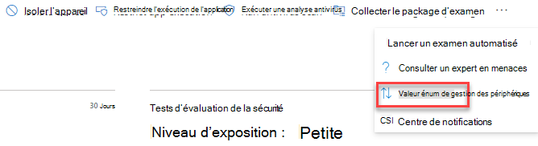

# Attribuer une valeur d'appareil : gestion des menaces et des vulnérabilités

[!INCLUDE [Microsoft 365 Defender rebranding](../../includes/microsoft-defender.md)]

**S’applique à :**

- [Microsoft Defender pour point de terminaison](https://go.microsoft.com/fwlink/?linkid=2154037)
- [Gestion des menaces et des vulnérabilités](next-gen-threat-and-vuln-mgt.md)
- [Microsoft 365 Defender](https://go.microsoft.com/fwlink/?linkid=2118804)

> Vous souhaitez découvrir Microsoft Defender pour le point de terminaison ? [Inscrivez-vous à un essai gratuit.](https://www.microsoft.com/microsoft-365/windows/microsoft-defender-atp?ocid=docs-wdatp-portaloverview-abovefoldlink)

[!include[Prerelease information](../../includes/prerelease.md)]

La définition de la valeur d'un appareil vous permet de différencier les priorités des ressources. La valeur de l'appareil est utilisée pour incorporer le risque d'exposition d'un bien individuel dans le calcul du score d'exposition de la gestion des menaces et des vulnérabilités. Les appareils affectés en tant que « valeur élevée » recevront plus de poids.

Vous pouvez également utiliser [l'API définir la valeur de l'appareil.](set-device-value.md)

Options de valeur d'appareil :

- Faible
- Normal (valeur par défaut)
- Élevé

Exemples d'appareils à attribuer à une valeur élevée :

- Contrôleurs de domaine, Active Directory
- Appareils connectés à Internet
- Périphériques VIP
- Appareils hébergeant des services de production internes/externes

## Choisir la valeur de l'appareil

1. Accédez à n'importe quelle page d'appareil. L'endroit le plus simple est de consulter l'inventaire des appareils.

2. Sélectionnez **la valeur de** l'appareil à trois points près de la barre d'actions en haut de la page.

    

3. Un volant s'affiche avec la valeur actuelle de l'appareil et sa valeur. Examinez la valeur de l'appareil et choisissez celle qui convient le mieux à votre appareil.

## Impact de la valeur de l'appareil sur votre score d'exposition

Le score d'exposition est une moyenne pondérée sur tous les appareils. Si vous avez des groupes d'appareils, vous pouvez également filtrer le score par groupe d'appareils.

- Les appareils normaux ont un poids de 1
- Les appareils à faible valeur ont un poids de 0,75
- Les appareils à valeur élevée ont un poids de NumberOfAssets / 10.
    - Si vous avez 100 appareils, chaque appareil à valeur élevée aura un poids de 10 (100/10)

## Voir aussi

- [Vue d'ensemble de la gestion des menaces et des vulnérabilités](next-gen-threat-and-vuln-mgt.md)
- [Score d'exposition](tvm-exposure-score.md)
- [API](next-gen-threat-and-vuln-mgt.md#apis)