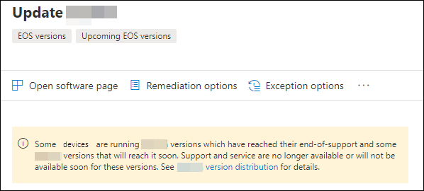

# Planifier les versions logicielles et logicielles de fin de prise en charge avec Gestion des menaces et des vulnérabilités

[!INCLUDE [Microsoft 365 Defender rebranding](../../includes/microsoft-defender.md)]

**S’applique à :**

- [Microsoft Defender pour point de terminaison](https://go.microsoft.com/fwlink/?linkid=2154037)
- [La gestion des menaces et des vulnérabilités](next-gen-threat-and-vuln-mgt.md)
- [Microsoft 365 Defender](https://go.microsoft.com/fwlink/?linkid=2118804)

> Vous voulez découvrir Microsoft Defender pour point de terminaison ? [Inscrivez-vous pour bénéficier d’un essai gratuit.](https://signup.microsoft.com/create-account/signup?products=7f379fee-c4f9-4278-b0a1-e4c8c2fcdf7e&ru=https://aka.ms/MDEp2OpenTrial?ocid=docs-wdatp-portaloverview-abovefoldlink)

EOS (End-of-support), également appelé end-of-life (EOL), pour les versions logicielles ou logicielles signifie qu’ils ne seront plus pris en charge ou pris en charge et ne recevront pas de mises à jour de sécurité. Lorsque vous utilisez des versions logicielles ou logicielles avec prise en charge terminée, vous exposez votre organisation aux vulnérabilités de sécurité, aux risques juridiques et financiers.

Il est essentiel que les administrateurs informatiques et de sécurité travaillent ensemble et s’assurent que l’inventaire logiciel de l’organisation est configuré pour obtenir des résultats optimaux, une conformité et un écosystème réseau sain. Ils doivent examiner les options de suppression ou de remplacement des applications qui ont atteint les versions de fin de prise en charge et de mise à jour qui ne sont plus pris en charge. Il est préférable de créer et d’implémenter un **plan** avant la fin des dates de support.

>[!NOTE]
> La fonctionnalité de fin de prise en charge est actuellement disponible uniquement pour Windows produits.

## Rechercher des versions logicielles ou logicielles qui ne sont plus pris en charge

1. Dans le menu Gestion des menaces et des vulnérabilités, accédez aux [**recommandations de sécurité.**](tvm-security-recommendation.md)
2. Go to the **Filters** panel and look for the tags section. Sélectionnez une ou plusieurs des options de balise EOS. Ensuite, **appliquez**.

    

3. Vous verrez une liste de recommandations relatives aux logiciels dont la prise en charge est terminée, aux versions logicielles qui sont en fin de prise en charge ou aux versions dont la prise en charge sera prochainement terminée. Ces balises sont également visibles dans la page [d’inventaire](tvm-software-inventory.md) logiciel.

    

## Liste des versions et des dates

Pour afficher la liste des versions qui ont atteint la fin de la prise en charge, ou qui ont pris fin ou bientôt prise en charge, ainsi que ces dates, suivez les étapes ci-dessous :

1. Un message s’affiche dans le volant de recommandations de sécurité pour les logiciels dont les versions ont atteint la fin de la prise en charge ou qui arriveront bientôt à la fin du support.

    

2. Sélectionnez **le lien de distribution** de version pour aller à la page d’accès au logiciel. Vous pouvez y voir une liste filtrée de versions avec des balises les identifiant comme fin de support ou fin de support à venir.

    

3. Sélectionnez l’une des versions du tableau à ouvrir. Par exemple, version 10.0.18362.1. Un volant s’affiche à la date de fin du support.

    

Une fois que vous avez identifié les logiciels et les versions logicielles vulnérables en raison de leur statut de fin de support, vous devez décider s’il faut les mettre à jour ou les supprimer de votre organisation. Cela réduit l’exposition de votre organisation aux vulnérabilités et aux menaces persistantes avancées.

## Sujets connexes

- [Vue d’ensemble gestion des vulnérabilités menaces et gestion des vulnérabilités menaces](next-gen-threat-and-vuln-mgt.md)
- [Recommandations de sécurité](tvm-security-recommendation.md)
- [Inventaire des logiciels](tvm-software-inventory.md)
