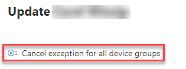
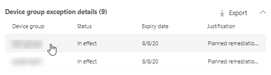

# Créer et afficher des exceptions pour les recommandations de sécurité - Gestion des menaces et des vulnérabilités

[!INCLUDE [Microsoft 365 Defender rebranding](../../includes/microsoft-defender.md)]

**S’applique à :**

- [Microsoft Defender pour point de terminaison](https://go.microsoft.com/fwlink/?linkid=2154037)
- [Menaces et gestion des vulnérabilités](next-gen-threat-and-vuln-mgt.md)
- [Microsoft 365 Defender](https://go.microsoft.com/fwlink/?linkid=2118804)

> Vous voulez découvrir Microsoft Defender pour point de terminaison ? [Inscrivez-vous pour bénéficier d’un essai gratuit.](https://signup.microsoft.com/create-account/signup?products=7f379fee-c4f9-4278-b0a1-e4c8c2fcdf7e&ru=https://aka.ms/MDEp2OpenTrial?ocid=docs-wdatp-portaloverview-abovefoldlink)

En remplacement d’une demande de correction lorsqu’une recommandation n’est pas pertinente pour le moment, vous pouvez créer des exceptions pour les recommandations. Si votre organisation dispose de groupes d’appareils, vous serez en mesure d’étenduer l’exception à des groupes d’appareils spécifiques. Des exceptions peuvent être créées pour les groupes d’appareils sélectionnés ou pour tous les groupes d’appareils passés et présents.

Lorsqu’une exception est créée pour une recommandation, la recommandation n’est pas active avant la fin de la durée de l’exception. L’état de recommandation change en **Exception complète ou** Exception **partielle** (par groupe d’appareils).

## Autorisations

Seuls les utilisateurs ayant des autorisations de « gestion des exceptions » peuvent gérer les exceptions (y compris la création ou l’annulation). [En savoir plus sur les rôles RBAC.](user-roles.md)

## Créer une exception

Sélectionnez une recommandation de sécurité pour la création d’une exception, puis sélectionnez **Options d’exception** et remplissez le formulaire.

### Exception par groupe d’appareils

Appliquez l’exception à tous les groupes d’appareils actuels ou choisissez des groupes d’appareils spécifiques. Les groupes d’appareils futurs ne seront pas inclus dans l’exception. Les groupes d’appareils qui ont déjà une exception ne sont pas affichés dans la liste. Si vous sélectionnez uniquement certains groupes d’appareils, l’état de recommandation change de « actif » à « exception partielle ». L’état est « exception complète » si vous sélectionnez tous les groupes d’appareils.

#### Affichages filtrés

Si vous avez filtré par groupe d’appareils sur l’une des pages Gestion des menaces et des vulnérabilités, seuls vos groupes d’appareils filtrés apparaîtront en tant qu’options.

Il s’agit du bouton à filtrer par groupe d’appareils sur l’une Gestion des menaces et des vulnérabilités pages suivantes :

Affichage des exceptions avec groupes d’appareils filtrés :

#### Grand nombre de groupes d’appareils

Si votre organisation compte plus de 20 groupes d’appareils, sélectionnez **Modifier** en plus de l’option de groupe d’appareils filtré.

Un volant s’affiche où vous pouvez rechercher et choisir les groupes d’appareils que vous souhaitez inclure. Sélectionnez l’icône de coche sous Recherche pour tout vérifier/décocher.

### Exceptions globales

Si vous avez des autorisations d’administrateur général, vous pourrez créer et annuler une exception globale. Elle affecte tous **les** groupes d’appareils actuels et futurs de votre organisation, et seul un utilisateur ayant des autorisations similaires peut le modifier. L’état de recommandation va changer de « actif » à « exception complète ».

Voici quelques éléments à garder à l’esprit :

- Si une recommandation fait l’objet d’une exception globale, les exceptions nouvellement créées pour les groupes d’appareils sont suspendues jusqu’à ce que l’exception globale ait expiré ou ait été annulée. Après ce point, les nouvelles exceptions de groupe d’appareils entreront en vigueur jusqu’à leur expiration.
- Si une recommandation a déjà des exceptions pour des groupes d’appareils spécifiques et qu’une exception globale est créée, l’exception de groupe d’appareils est suspendue jusqu’à son expiration ou l’exception globale est annulée avant son expiration.

### Justification

Sélectionnez votre justification pour l’exception que vous devez déposer au lieu de corriger la recommandation de sécurité en question. Remplissez le contexte de justification, puis définissez la durée de l’exception.

La liste suivante détaille les justifications des options d’exception :

- **Contrôle tiers** - Un produit ou un logiciel tiers répond déjà à cette recommandation : le choix de ce type de justification réduit votre score d’exposition et augmente votre score de sécurité car votre risque est réduit
- **Atténuation de** remplacement : un outil interne répond déjà à cette recommandation : le choix de ce type de justification réduit votre score d’exposition et augmente votre score de sécurité car votre risque est réduit
- **Risque accepté :** pose un risque faible et/ou l’implémentation de la recommandation est trop coûteuse
- **Correction planifiée (grâce)** : déjà planifiée mais en attente d’exécution ou d’autorisation

## Afficher toutes les exceptions

Accédez à **l’onglet Exceptions** dans la page **Correction.** Vous pouvez filtrer par justification, type et état.

 Sélectionnez une exception pour ouvrir un volant avec plus de détails. Les exceptions par groupe d’appareils auront une liste de chaque groupe d’appareils couvert par l’exception, que vous pouvez exporter. Vous pouvez également afficher la recommandation associée ou annuler l’exception.

## Comment annuler une exception

Pour annuler une exception, accédez à **l’onglet Exceptions** dans la page **Correction.** Sélectionnez l’exception.

Pour annuler l’exception pour tous les groupes d’appareils ou pour une exception globale, sélectionnez l’exception Annuler pour tous les groupes **d’appareils.** Vous pourrez uniquement annuler les exceptions pour les groupes d’appareils pour qui vous avez des autorisations.

### Annuler l’exception pour un groupe d’appareils spécifique

Sélectionnez le groupe d’appareils spécifique pour annuler l’exception. Un volant s’affiche pour le groupe d’appareils, et vous pouvez sélectionner **l’exception Annuler.**

## Afficher l’impact après application des exceptions

Dans la page Sécurité Recommandations,  sélectionnez Personnaliser les colonnes et cochez les cases pour les appareils exposés **(après les exceptions)** et **l’impact (après les exceptions).**

La colonne appareils exposés (après les exceptions) affiche les autres appareils qui sont encore exposés aux vulnérabilités après l’application des exceptions. Les justifications d’exception qui affectent l’exposition incluent « contrôle tiers » et « atténuation de remplacement ». D’autres justifications ne réduisent pas l’exposition d’un appareil et sont toujours considérées comme exposées.

L’impact (après les exceptions) indique l’impact restant sur le score d’exposition ou le score sécurisé après l’application des exceptions. Les justifications d’exception qui affectent les scores incluent « contrôle tiers » et « atténuation alternative ». D’autres justifications ne réduisent pas l’exposition d’un appareil, de sorte que le score d’exposition et le score de sécurité ne changent pas.

## Rubriques connexes

- [Vue d’ensemble gestion des vulnérabilités menaces et gestion des vulnérabilités menaces](next-gen-threat-and-vuln-mgt.md)
- [Corriger des vulnérabilités](tvm-remediation.md)
- [Recommandations de sécurité](tvm-security-recommendation.md)
- [Score d'exposition](tvm-exposure-score.md)
- [Niveau de sécurité Microsoft pour les appareils](tvm-microsoft-secure-score-devices.md)
