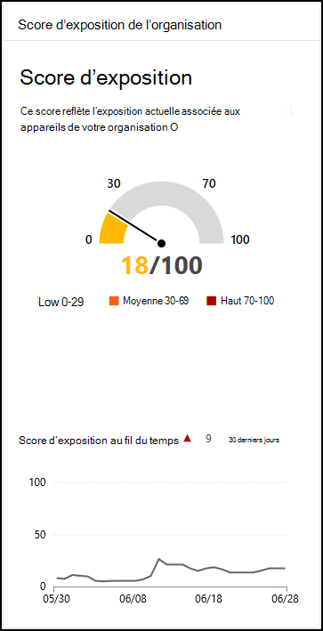

# Score d’exposition : Gestion des menaces et des vulnérabilités

[!INCLUDE [Microsoft 365 Defender rebranding](../../includes/microsoft-defender.md)]

**S’applique à :**

- [Microsoft Defender pour point de terminaison](https://go.microsoft.com/fwlink/?linkid=2154037)
- [Menaces et gestion des vulnérabilités](next-gen-threat-and-vuln-mgt.md)
- [Microsoft 365 Defender](https://go.microsoft.com/fwlink/?linkid=2118804)

>Vous souhaitez découvrir Microsoft Defender pour le point de terminaison ? [Inscrivez-vous à un essai gratuit.](https://www.microsoft.com/microsoft-365/windows/microsoft-defender-atp?ocid=docs-wdatp-portaloverview-abovefoldlink)

Votre score d’exposition est visible dans le tableau de bord Gestion des vulnérabilités [menaces](tvm-dashboard-insights.md) du Centre de sécurité Microsoft Defender. Il reflète la vulnérabilité de votre organisation aux menaces de cybersécurité. Un faible score d’exposition signifie que vos appareils sont moins vulnérables à l’exploitation.

- Comprenez et identifiez rapidement les informations de haut niveau concernant l’état de la sécurité dans votre organisation.
- Détecter et répondre aux domaines qui nécessitent une investigation ou une action pour améliorer l’état actuel.
- Communiquer avec les homologues et la direction sur l’impact des efforts de sécurité.

La carte vous donne une vue générale de la tendance de votre score d’exposition au fil du temps. Les pics du graphique vous donnent une indication visuelle d’une exposition à une menace de cybersécurité élevée que vous pouvez examiner plus en détail.

## Mode de fonctionnement

Le score d’exposition est décomposé selon les niveaux suivants :

- 0 à 29 : score d’exposition faible
- 30 à 69 : score d’exposition moyen
- 70–100 : score d’exposition élevé

Vous pouvez résoudre les problèmes en vous basant sur des [recommandations](tvm-security-recommendation.md) de sécurité prioritaires pour réduire le score d’exposition. Chaque logiciel présente des faiblesses qui sont transformées en recommandations et hiérarchisées en fonction des risques pour l’organisation.

## Réduire l’exposition aux menaces et vulnérabilités

Réduire l’exposition aux menaces et vulnérabilités en remédiant aux [recommandations de sécurité.](tvm-security-recommendation.md) Faites le plus d’impact sur votre score d’exposition en remédiant aux recommandations de sécurité les plus importantes, qui peuvent être vues dans [le tableau de bord Gestion des menaces et des vulnérabilités.](tvm-dashboard-insights.md)

## Voir aussi

- [Vue d’ensemble gestion des vulnérabilités menaces et gestion des vulnérabilités menaces](next-gen-threat-and-vuln-mgt.md)
- [Niveau de sécurité Microsoft pour les appareils](tvm-microsoft-secure-score-devices.md)
- [Recommandations de sécurité](tvm-security-recommendation.md)
- [Chronologie des événements](threat-and-vuln-mgt-event-timeline.md)
