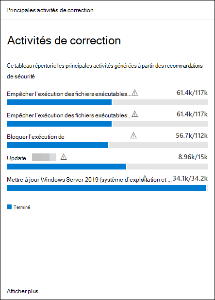

# Corriger les vulnérabilités à l’Gestion des menaces et des vulnérabilités

[!INCLUDE [Microsoft 365 Defender rebranding](../../includes/microsoft-defender.md)]

**S’applique à :**
- [Microsoft Defender pour point de terminaison](https://go.microsoft.com/fwlink/?linkid=2154037)
- [Menaces et gestion des vulnérabilités](next-gen-threat-and-vuln-mgt.md)
- [Microsoft 365 Defender](https://go.microsoft.com/fwlink/?linkid=2118804)

> Vous voulez découvrir Microsoft Defender pour point de terminaison ? [Inscrivez-vous pour bénéficier d’un essai gratuit.](https://signup.microsoft.com/create-account/signup?products=7f379fee-c4f9-4278-b0a1-e4c8c2fcdf7e&ru=https://aka.ms/MDEp2OpenTrial?ocid=docs-wdatp-portaloverview-abovefoldlink)

## Demander la correction

La Gestion des menaces et des vulnérabilités microsoft Defender pour point de terminaison permet de combler le vide entre les administrateurs de sécurité et les administrateurs informatiques via le flux de travail de demande de correction. Les administrateurs de sécurité comme vous pouvez demander à l’administrateur informatique de corriger une vulnérabilité à partir des **pages** de recommandations de sécurité vers Intune.

### Activer Microsoft Intune connexion

Pour utiliser cette fonctionnalité, activez vos Microsoft Intune connexions. Dans le portail Microsoft 365 Defender, accédez **à Paramètres**  >  **fonctionnalités**  >  **générales avancées.** Faites défiler vers le bas et **recherchez Microsoft Intune connexion.** Par défaut, le basculement est désactivé. Activer votre **Microsoft Intune de** **connexion.**

**Remarque**: si la connexion Intune est activée, vous pouvez créer une tâche de sécurité Intune lors de la création d’une demande de correction. Cette option n’apparaît pas si la connexion n’est pas définie.

Pour [plus d’informations, voir Utiliser Intune](/intune/atp-manage-vulnerabilities) pour corriger les vulnérabilités identifiées par Microsoft Defender pour endpoint.

### Étapes de la demande de correction

1. Go to the threat and **Vulnerability management** navigation menu in the Microsoft 365 Defender portal, and select **Recommandations** [**Security recommendations**](tvm-security-recommendation.md).

2. Sélectionnez une recommandation de sécurité pour qui vous souhaitez demander des corrections, puis sélectionnez **Options de correction.**

3. Remplissez le formulaire, y compris ce pour quoi vous demandez des corrections, les groupes d’appareils applicables, la priorité, la date d’échéance et les notes facultatives.
    1. Si vous choisissez l’option de correction « Attention requise », la sélection d’une date d’échéance n’est pas disponible, car il n’existe aucune action spécifique.

4. Sélectionnez **Envoyer une demande.** L’envoi d’une demande de correction crée un élément d’activité de correction dans Gestion des menaces et des vulnérabilités, qui peut être utilisé pour surveiller la progression de la correction pour cette recommandation. Cela ne déclenche pas de correction ou n’applique aucune modification aux appareils.

5. Informez votre administrateur informatique de la nouvelle demande et demandez-lui de se connecter à Intune pour approuver ou rejeter la demande et démarrer un déploiement de package.

6. Go to the [**Remediation**](tvm-remediation.md) page to view the status of your remediation request.

Si vous souhaitez vérifier la façon dont le ticket s’affiche dans Intune, voir Utiliser [Intune](/intune/atp-manage-vulnerabilities) pour corriger les vulnérabilités identifiées par Microsoft Defender pour endpoint pour plus d’informations.

>[!NOTE]
>Si votre demande implique de corriger plus de 10 000 appareils, nous ne pouvons envoyer que 10 000 appareils pour correction à Intune.

Une fois les faiblesses de cybersécurité de votre organisation identifiées et mappées aux [recommandations](tvm-security-recommendation.md)de sécurité actionnables, commencez à créer des tâches de sécurité. Vous pouvez créer des tâches par le biais de l’intégration Microsoft Intune où les tickets de correction sont créés.

Diminuez l’exposition de votre organisation contre les vulnérabilités et augmentez votre configuration de sécurité en remédiant aux recommandations de sécurité.

## Afficher vos activités de correction

Lorsque vous envoyez une demande de correction à partir de la page Recommandations en matière de sécurité, une activité de correction est lancé. Une tâche de sécurité qui peut être suivi dans la **page** de correction Gestion des menaces et des vulnérabilités et un ticket de correction est créé dans Microsoft Intune.

Si vous avez choisi l’option de correction « Attention requise », il n’y aura aucune barre de progression, état du ticket ou date d’échéance, car il n’existe aucune action réelle que nous pouvons surveiller.

Une fois que vous êtes dans la page Correction, sélectionnez l’activité de correction à afficher. Vous pouvez suivre les étapes de correction, suivre l’avancement, afficher la recommandation associée, exporter vers CSV ou marquer comme terminé.

:::image type="content" source="../../media/remediation-flyouteolswnew.png" lightbox="../../media/remediation-flyouteolswnew.png" alt-text="Exemple de page de correction, avec une activité de correction sélectionnée, et le volant de cette activité répertoriant la description, les outils de gestion des services informatiques et des appareils, et la correction des périphériques":::

>[!NOTE]
> Il existe une période de rétention de 180 jours pour les activités de correction terminées. Pour que la page de correction continue de s’exécuter de façon optimale, l’activité de correction sera supprimée 6 mois après sa fin.

### Terminé par colonne

Suivre qui a fermé l’activité de correction avec la colonne « Terminé par » dans la page Correction.

- **Adresse e-mail**: adresse de messagerie de la personne qui a effectué manuellement la tâche
- **Confirmation du** système : la tâche a été effectuée automatiquement (tous les appareils corrigés)
- **N/A**: les informations ne sont pas disponibles, car nous ne savons pas comment cette tâche plus ancienne a été achevée

:::image type="content" alt-text="Créé par et terminé par des colonnes de deux lignes. Une ligne terminée par un exemple de message électronique, l’autre ligne indique la confirmation du système." source="images/tvm-completed-by.png":::

### Principales activités de correction dans le tableau de bord

Afficher les **principales activités de correction dans** le tableau de bord de gestion des menaces et des [ **vulnérabilités.**](tvm-dashboard-insights.md) Sélectionnez l’une des entrées pour aller à la page **Correction.** Vous pouvez marquer l’activité de correction comme terminée une fois que l’équipe d’administration informatique a corrigé la tâche.

## Articles connexes

- [Vue d’ensemble gestion des vulnérabilités menaces et gestion des vulnérabilités menaces](next-gen-threat-and-vuln-mgt.md)
- [Tableau de bord](tvm-dashboard-insights.md)
- [Recommandations de sécurité](tvm-security-recommendation.md)