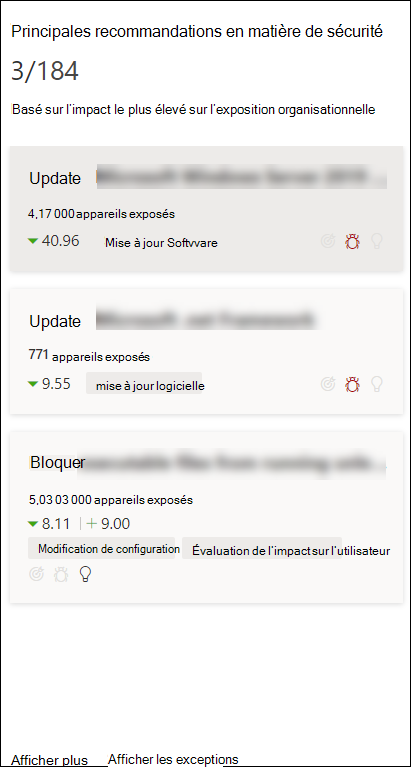
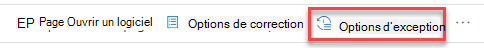
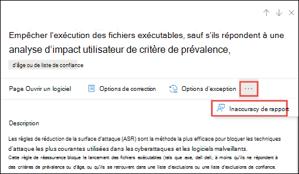

# Recommandations en matière de sécurité : gestion des menaces et des vulnérabilités

[!INCLUDE [Microsoft 365 Defender rebranding](../../includes/microsoft-defender.md)]

**S’applique à :**

- [Microsoft Defender pour point de terminaison](https://go.microsoft.com/fwlink/?linkid=2154037)
- [Gestion des menaces et des vulnérabilités](next-gen-threat-and-vuln-mgt.md)
- [Microsoft 365 Defender](https://go.microsoft.com/fwlink/?linkid=2118804)

>Vous souhaitez découvrir Microsoft Defender pour le point de terminaison ? [Inscrivez-vous à un essai gratuit.](https://www.microsoft.com/microsoft-365/windows/microsoft-defender-atp?ocid=docs-wdatp-portaloverview-abovefoldlink)

Les faiblesses de cybersécurité identifiées dans votre organisation sont mappées à des recommandations de sécurité actionnables et hiérarchisées par leur impact. Les recommandations hiérarchisées permettent de raccourcir le temps d'atténuation ou de correction des vulnérabilités et de stimuler la conformité.

Chaque recommandation de sécurité inclut des étapes de correction actionnables. Pour faciliter la gestion des tâches, vous pouvez également envoyer la recommandation à l'aide de Microsoft Intune et de Microsoft Endpoint Configuration Manager. Lorsque le paysage des menaces change, la recommandation change également lorsqu'elle collecte en permanence des informations à partir de votre environnement.

>[!TIP]
>Pour obtenir des e-mails sur les nouveaux événements de vulnérabilité, voir Configurer les notifications par courrier électronique de vulnérabilité [dans Microsoft Defender pour le point de terminaison](configure-vulnerability-email-notifications.md)

## Mode de fonctionnement

Chaque appareil de l'organisation est marqué en fonction de trois facteurs importants pour aider les clients à se concentrer sur les bonnes choses au bon moment.

- **Menace** : caractéristiques des vulnérabilités et des exploits dans les appareils et l'historique des violations de votre organisation. En fonction de ces facteurs, les recommandations de sécurité indiquent les liens correspondants vers les alertes actives, les campagnes contre les menaces en cours et leurs rapports analytiques sur les menaces correspondants.

- **Probabilité de violation** : posture de sécurité et résilience de votre organisation contre les menaces

- **Valeur commerciale** : ressources de votre organisation, processus critiques et propriétés intellectuelles

## Accéder à la page Recommandations en matière de sécurité

Accédez à la page Recommandations de sécurité de différentes manières :

- Menu de navigation de gestion des menaces et des vulnérabilités dans le [Centre de sécurité Microsoft Defender](portal-overview.md)
- Principales recommandations en matière de sécurité dans le tableau de bord de gestion des [menaces et des vulnérabilités](tvm-dashboard-insights.md)

Affichez les recommandations de sécurité associées aux endroits suivants :

- Page de logiciels
- Page Appareil

### Menu de navigation

Go to the threat and vulnerability management navigation menu and select **Security recommendations**. La page contient une liste de recommandations de sécurité pour les menaces et les vulnérabilités trouvées dans votre organisation.

### Principales recommandations en matière de sécurité dans le tableau de bord de gestion des menaces et des vulnérabilités

Dans un jour donné en tant qu'administrateur  de la sécurité, vous pouvez consulter le tableau de bord de gestion des menaces et des vulnérabilités pour voir votre [score](tvm-exposure-score.md) d'exposition côte à côte avec votre degré de sécurisation Microsoft pour les [appareils.](tvm-microsoft-secure-score-devices.md) L'objectif est **de** réduire l'exposition  de votre organisation contre les vulnérabilités et d'augmenter la sécurité des appareils de votre organisation afin d'être plus résiliente contre les attaques contre les menaces de cybersécurité. La liste des recommandations de sécurité les plus importantes peut vous aider à atteindre cet objectif.

Les principales recommandations en matière de sécurité présentent les opportunités d'amélioration prioritaires en fonction des facteurs importants mentionnés dans la section précédente : menace, probabilité de violation et valeur. La sélection d'une recommandation vous permet d'accès à la page recommandations de sécurité avec plus de détails.

## Vue d'ensemble des recommandations de sécurité

Afficher les recommandations, le nombre de faiblesses trouvées, les composants associés, les informations sur les menaces, le nombre d'appareils exposés, l'état, le type de correction, les activités de correction, l'impact sur votre score d'exposition et le score de sécurité Microsoft pour les appareils, ainsi que les balises associées.

La couleur du graphique **des appareils exposés** change à mesure que la tendance change. Si le nombre d'appareils exposés augmente, la couleur passe en rouge. En cas de diminution du nombre d'appareils exposés, la couleur du graphique change en vert.

>[!NOTE]
>La gestion des menaces et des vulnérabilités affiche les appareils qui étaient utilisés il y a **30** jours. Ceci est différent du reste de Microsoft Defender pour point de terminaison, où si un appareil n'a pas été utilisé pendant plus de 7 jours, il présente l'état « Inactif ».

### Icônes

Les icônes utiles peuvent également attirer rapidement votre attention sur :
-  alertes actives possibles
-  exploits publics associés
-  informations sur les recommandations

### Explorer les options de recommandation de sécurité

Sélectionnez la recommandation de sécurité que vous souhaitez examiner ou traiter.

Dans le volant, vous pouvez choisir l'une des options suivantes :

- **Page Ouvrir un logiciel** : ouvrez la page du logiciel pour obtenir plus de contexte sur le logiciel et la façon dont il est distribué. Les informations peuvent inclure le contexte des menaces, les recommandations associées, les faiblesses découvertes, le nombre d'appareils exposés, les vulnérabilités découvertes, les noms et les détails des appareils sur lequel le logiciel est installé et la distribution des versions.

- [**Options de**](tvm-remediation.md) correction : envoyez une demande de correction pour ouvrir un ticket dans Microsoft Intune pour que votre administrateur informatique le sélectionne et l'adresse. Suivre l'activité de correction dans la page Correction.

- [**Options d'exception**](tvm-exception.md) : soumettre une exception, fournir une justification et définir la durée de l'exception si vous ne pouvez pas encore résoudre le problème.

>[!NOTE]
>Lorsqu'une modification logicielle est réalisée sur un appareil, il faut généralement 2 heures pour que les données soient reflétées dans le portail de sécurité. Toutefois, cela peut parfois prendre plus de temps. Les modifications de configuration peuvent prendre entre 4 et 24 heures.

### Examiner les modifications apportées à l'exposition ou à l'impact de l'appareil

S'il y a une augmentation importante du nombre d'appareils exposés ou une forte augmentation de l'impact sur le score d'exposition de votre organisation et le score de sécurité Microsoft pour les appareils, cette recommandation de sécurité vaut la peine d'être étudier.

1. Sélectionnez la page Recommandation **et Ouvrir le logiciel**
2. Sélectionnez **l'onglet Chronologie** des événements pour afficher tous les événements qui ont un impact sur ce logiciel, tels que les nouvelles vulnérabilités ou les nouvelles exploitations publiques. [En savoir plus sur la chronologie des événements](threat-and-vuln-mgt-event-timeline.md)
3. Décider comment faire face à l'augmentation ou à l'exposition de votre organisation, par exemple envoyer une demande de correction

## Demander la correction

La fonctionnalité de correction de la gestion des menaces et des vulnérabilités relie les administrateurs informatiques et de sécurité par le biais du flux de travail de demande de correction. Les administrateurs de sécurité comme vous pouvez demander à l'administrateur informatique de corriger une vulnérabilité à partir de la **page** recommandations de sécurité vers Intune. [En savoir plus sur les options de correction](tvm-remediation.md)

### Comment demander des corrections

Sélectionnez une recommandation de sécurité pour qui vous souhaitez demander des corrections, puis sélectionnez **Options de correction.** Remplissez le formulaire et sélectionnez **Envoyer la demande.** Go to the [**Remediation**](tvm-remediation.md) page to view the status of your remediation request. [En savoir plus sur la demande de correction](tvm-remediation.md#request-remediation)

## Fichier d'exception

En remplacement d'une demande de correction lorsqu'une recommandation n'est pas pertinente pour le moment, vous pouvez créer des exceptions pour les recommandations. [En savoir plus sur les exceptions](tvm-exception.md)

Seuls les utilisateurs ayant des autorisations de « gestion des exceptions » peuvent ajouter des exceptions. [En savoir plus sur les rôles RBAC.](user-roles.md)

Lorsqu'une exception est créée pour une recommandation, elle n'est plus active. L'état de recommandation change en **Exception complète ou** Exception **partielle** (par groupe d'appareils).

### Comment créer une exception

Sélectionnez une recommandation de sécurité pour la création d'une exception, puis sélectionnez **Options d'exception.**  

Remplissez le formulaire et soumettez-le. Pour afficher toutes vos exceptions (actuelles et passées), accédez à la [page](tvm-remediation.md) Correction sous le menu Gestion des vulnérabilités des menaces **&** et sélectionnez l'onglet **Exceptions.** En savoir plus sur la création d'une [exception](tvm-exception.md#create-an-exception)

## Report inaccuracy

Vous pouvez signaler un faux positif lorsque vous voyez des informations de recommandation de sécurité vagues, inexactes, incomplètes ou déjà corrigés.

1. Ouvrez la recommandation sécurité.

2. Sélectionnez les trois points en dehors de la recommandation de sécurité que vous souhaitez signaler, puis sélectionnez **L'imprécision du rapport.**

    

3. Dans le volet de menu volant, sélectionnez la catégorie d'imprécision dans le menu déroulant, remplissez votre adresse e-mail et les détails concernant l'imprécision.

4. Sélectionnez **Envoyer**. Vos commentaires sont immédiatement envoyés aux experts en gestion des menaces et des vulnérabilités.

## Articles connexes

- [Vue d'ensemble de la gestion des menaces et des vulnérabilités](next-gen-threat-and-vuln-mgt.md)
- [Tableau de bord](tvm-dashboard-insights.md)
- [Score d'exposition](tvm-exposure-score.md)
- [Niveau de sécurité Microsoft pour les appareils](tvm-microsoft-secure-score-devices.md)
- [Corriger des vulnérabilités](tvm-remediation.md)
- [Créer et afficher des exceptions pour les recommandations de sécurité](tvm-exception.md)
- [Chronologie des événements](threat-and-vuln-mgt-event-timeline.md)
