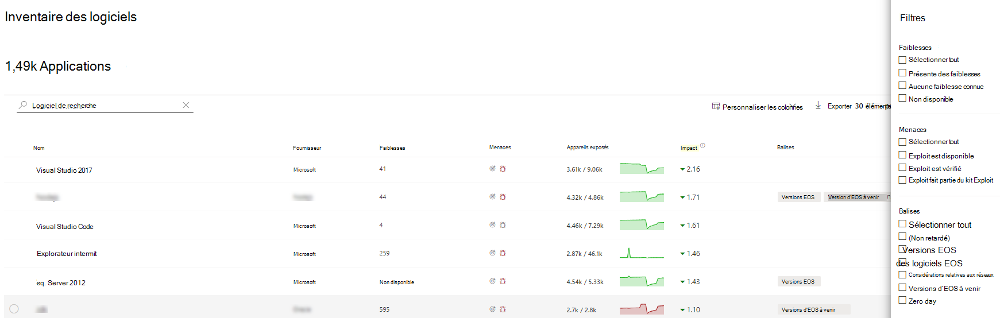
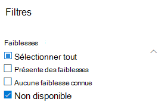
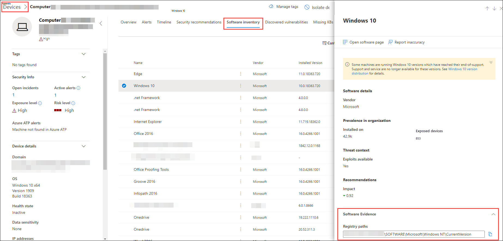

# Inventaire logiciel : gestion des menaces et des vulnérabilités

[!INCLUDE [Microsoft 365 Defender rebranding](../../includes/microsoft-defender.md)]

**S’applique à :**
- [Microsoft Defender pour point de terminaison](https://go.microsoft.com/fwlink/?linkid=2154037)
- [Gestion des menaces et des vulnérabilités](next-gen-threat-and-vuln-mgt.md)
- [Microsoft 365 Defender](https://go.microsoft.com/fwlink/?linkid=2118804)

>Vous souhaitez faire l'expérience de Defender pour point de terminaison ? [Inscrivez-vous à un essai gratuit.](https://www.microsoft.com/microsoft-365/windows/microsoft-defender-atp?ocid=docs-wdatp-portaloverview-abovefoldlink)

L'inventaire logiciel dans la gestion des menaces et des vulnérabilités est une liste des logiciels connus de votre organisation avec les énumérations officielles de plateforme [commune (CPE).](https://nvd.nist.gov/products/cpe) Les produits logiciels sans CPE officiel n'ont pas de vulnérabilités publiées. Il inclut également des détails tels que le nom du fournisseur, le nombre de faiblesses, les menaces et le nombre d'appareils exposés.

## Mode de fonctionnement

Dans le domaine de la découverte, nous tirent parti du même ensemble de signaux qui est responsable de l'évaluation de la détection et de la vulnérabilité dans Microsoft Defender pour les fonctionnalités de détection et de réponse des points de [terminaison.](overview-endpoint-detection-response.md)

Dans la mesure où il s'agit d'un temps réel, en quelques minutes, vous verrez des informations de vulnérabilité lors de leur découverte. Le moteur prend automatiquement des informations à partir de plusieurs flux de sécurité. En fait, vous verrez si un logiciel particulier est connecté à une campagne contre les menaces en direct. Il fournit également un lien vers un rapport d'analyse des menaces dès qu'il est disponible.

## Accéder à la page Inventaire logiciel

Accédez à la page  Inventaire logiciel en sélectionnant Inventaire logiciel dans le menu de navigation de gestion des menaces et des vulnérabilités dans le Centre de [sécurité Microsoft Defender.](portal-overview.md)

Afficher les logiciels sur des appareils spécifiques dans les pages des appareils individuels à partir de la [liste des appareils.](machines-view-overview.md)

>[!NOTE]
>Si vous recherchez des logiciels à l'aide de la recherche globale de Microsoft Defender for Endpoint, veillez à placer un trait de soulignement au lieu d'un espace. Par exemple, pour obtenir les meilleurs résultats de recherche, vous devez écrire « windows_10 » au lieu de « Windows 10 ».

## Vue d'ensemble de l'inventaire logiciel

La **page** Inventaire logiciel s'ouvre avec une liste des logiciels installés dans votre réseau, y compris le nom du fournisseur, les faiblesses trouvées, les menaces qui y sont associées, les appareils exposés, l'impact sur le score d'exposition et les balises.

Vous pouvez filtrer l'affichage liste en fonction des faiblesses trouvées dans le logiciel, des menaces qui lui sont associées et des balises telles que si le logiciel a atteint la fin de la prise en charge.

Sélectionnez le logiciel que vous souhaitez examiner. Un panneau volant s'ouvre avec une vue plus compacte des informations sur la page. Vous pouvez soit approfondir l'examen et sélectionner la page Ouvrir **un** logiciel, soit signaler toute incohérence technique en sélectionnant **l'imprécision du rapport.**

### Logiciel non pris en charge

Les logiciels qui ne sont actuellement pas pris en charge par & gestion des vulnérabilités peuvent être présents dans la page Inventaire logiciel. Étant donné qu'il n'est pas pris en charge, seules des données limitées seront disponibles. Filtrez selon les logiciels non pris en place avec l'option « Non disponible » dans la section « Faiblesse ».

Ce qui suit indique qu'un logiciel n'est pas pris en charge :

- Le champ Faiblesses indique « Non disponible »
- Le champ Appareils exposés affiche un tiret
- Texte d'information ajouté dans le panneau latéral et dans la page du logiciel
- La page logicielle ne contient pas les recommandations de sécurité, les vulnérabilités découvertes ou les sections de chronologie des événements

Actuellement, les produits sans CPE ne sont pas affichés dans la page d'inventaire logiciel, uniquement dans l'inventaire logiciel au niveau de l'appareil.

## Inventaire logiciel sur les appareils

Dans le panneau de navigation du Centre de sécurité Microsoft Defender, allez dans la liste **[Appareils.](machines-view-overview.md)** Sélectionnez le nom d'un appareil pour ouvrir la  page de l'appareil (tel que Computer1), puis sélectionnez l'onglet Inventaire logiciel pour voir la liste de tous les logiciels connus présents sur l'appareil. Sélectionnez une entrée de logiciel spécifique pour ouvrir le volant avec plus d'informations.

Les logiciels peuvent être visibles au niveau de l'appareil même s'ils ne sont actuellement pas pris en charge par la gestion des menaces et des vulnérabilités. Toutefois, seules des données limitées seront disponibles. Vous savez si le logiciel n'est pas pris en compte, car il indique « Non disponible » dans la colonne « Faiblesse ».

Les logiciels sans CPE peuvent également s'afficher sous cet inventaire logiciel spécifique à cet appareil.

### Preuve logicielle

Voir la preuve de l'endroit où nous avons détecté un logiciel spécifique sur un appareil à partir du Registre, du disque ou des deux. Vous pouvez le trouver sur n'importe quel appareil dans l'inventaire logiciel de l'appareil.

Sélectionnez un nom de logiciel pour ouvrir le volant et recherchez la section appelée « Preuve logicielle ».

## Pages logicielles

Vous pouvez afficher les pages logicielles de différentes manières :

- Page d'inventaire > sélectionnez un nom de logiciel > **page** Sélectionner un logiciel ouvert dans le volant
- [Page Recommandations en matière](tvm-security-recommendation.md) de sécurité > sélectionner une recommandation > **page** Sélectionner un logiciel ouvert dans le volant
- Page chronologie des [événements](threat-and-vuln-mgt-event-timeline.md) > Sélectionnez un > Sélectionnez le nom du logiciel avec lien hypertexte (comme Visual Studio 2017) dans la section intitulée « Composant associé » dans le volant

 Une page complète s'affiche avec tous les détails d'un logiciel spécifique et les informations suivantes :

- Panneau latéral avec des informations sur le fournisseur, la prévalence du logiciel dans l'organisation (y compris le nombre d'appareils sur lesquels il est installé et les appareils exposés qui ne sont pas corrigés), si et exploit est disponible et impact sur votre score d'exposition.
- Visualisations de données montrant le nombre et la gravité des vulnérabilités et des mauvaises configurations. En outre, les graphiques avec le nombre d'appareils exposés.
- Onglets affichant des informations telles que :
    - Recommandations de sécurité correspondantes pour les faiblesses et vulnérabilités identifiées.
    - Cv nommés des vulnérabilités découvertes.
    - Les appareils sur qui le logiciel est installé (ainsi que le nom de l'appareil, le domaine, le système d'exploitation, et bien plus encore).
    - Liste des versions des logiciels (y compris le nombre d'appareils sur lesquels la version est installée, le nombre de vulnérabilités découvertes et les noms des appareils installés).

    

## Report inaccuracy

Signalez un faux positif lorsque vous voyez des informations vagues, inexactes ou incomplètes. Vous pouvez également signaler les recommandations de sécurité qui ont déjà été corrigés.

1. Ouvrez le programme volant sur la page Inventaire logiciel.
2. Select **Report inaccuracy**.
3. Dans le volet de menu volant, sélectionnez la catégorie imprécise dans le menu déroulant, remplissez votre adresse e-mail et des détails sur l'imprécision.
4. Sélectionnez **Envoyer**. Vos commentaires sont immédiatement envoyés aux experts en gestion des menaces et des vulnérabilités.

## Articles connexes

- [Vue d'ensemble de la gestion des menaces et des vulnérabilités](next-gen-threat-and-vuln-mgt.md)
- [Recommandations de sécurité](tvm-security-recommendation.md)
- [Chronologie des événements](threat-and-vuln-mgt-event-timeline.md)
- [Afficher et organiser la liste Microsoft Defender pour les appareils de point de terminaison](machines-view-overview.md)
