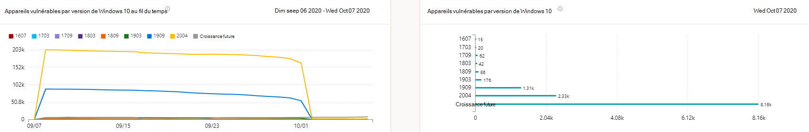

# Rapport sur les appareils vulnérables : Gestion des menaces et des vulnérabilités

[!INCLUDE [Microsoft 365 Defender rebranding](../../includes/microsoft-defender.md)]

**S’applique à :**

- [Microsoft Defender pour point de terminaison](https://go.microsoft.com/fwlink/?linkid=2154037)
- [Menaces et gestion des vulnérabilités](next-gen-threat-and-vuln-mgt.md)
- [Microsoft 365 Defender](https://go.microsoft.com/fwlink/?linkid=2118804)

> Vous voulez découvrir Microsoft Defender pour point de terminaison ? [Inscrivez-vous pour bénéficier d’un essai gratuit.](https://signup.microsoft.com/create-account/signup?products=7f379fee-c4f9-4278-b0a1-e4c8c2fcdf7e&ru=https://aka.ms/MDEp2OpenTrial?ocid=docs-wdatp-portaloverview-abovefoldlink)

Le rapport présente des graphiques et des graphiques à barres avec des tendances d’appareils vulnérables et des statistiques actuelles. L’objectif est que vous compreniez le bruit et l’étendue de l’exposition de votre appareil.

Accédez au rapport dans le portail Microsoft 365 Defender en accédant à **Rapports > les appareils vulnérables**

Il existe deux colonnes :

- Tendances (au fil du temps). Peut afficher les 30 derniers jours, 3 mois, 6 mois ou une plage de dates personnalisée.
- État (informations actuelles)

**Filtre**: vous pouvez filtrer les données par niveaux de gravité de vulnérabilité, disponibilité d’exploitation, âge de vulnérabilité, plateforme du système d’exploitation, version Windows 10 Windows 11 ou groupe d’appareils.

**Exploration :** s’il existe un aperçu que vous souhaitez explorer plus en détail, sélectionnez le graphique à barres approprié pour afficher une liste filtrée d’appareils dans la page d’inventaire des appareils. À partir de là, vous pouvez exporter la liste.

## Graphiques de niveau de gravité

Chaque appareil est compté une seule fois en fonction de la vulnérabilité la plus grave trouvée sur cet appareil.

:::image type="content" alt-text="Graphique des niveaux de gravité de vulnérabilité actuels de l’appareil et graphique montrant les niveaux au fil du temps." source="images/tvm-report-severity.png" lightbox="images/tvm-report-severity.png":::

## Exploiter les graphiques de disponibilité

Chaque appareil est compté une seule fois en fonction du niveau d’exploitation connu le plus élevé.

:::image type="content" alt-text="Un graphique de la disponibilité actuelle de l’exploitation des appareils et un graphique montrant la disponibilité au fil du temps." source="images/tvm-report-exploit-availability.png" lightbox="images/tvm-report-exploit-availability.png":::

## Graphiques de l’âge de vulnérabilité

Chaque appareil est compté une seule fois sous la date de publication de la vulnérabilité la plus ancienne. Les vulnérabilités plus anciennes ont plus de chances d’être exploitées.

:::image type="content" alt-text="Graphique de l’âge actuel de vulnérabilité de l’appareil et graphique montrant l’âge au fil du temps." source="images/tvm-report-age.png" lightbox="images/tvm-report-age.png":::

## Appareils vulnérables par graphiques de plateforme de système d’exploitation

Nombre d’appareils sur chaque système d’exploitation exposés en raison de vulnérabilités logicielles.

:::image type="content" alt-text="Un graphique des appareils vulnérables actuels par plateforme de système d’exploitation et un graphique montrant les appareils vulnérables par les plateformes de système d’exploitation au fil du temps." source="images/tvm-report-os.png" lightbox="images/tvm-report-os.png":::

## Appareils vulnérables en Windows graphiques de version

Nombre d’appareils sur chaque version Windows 10 ou Windows 11 qui sont exposés en raison d’applications ou de système d’exploitation vulnérables.

lightbox="images/tvm-report-version.png »:::

## Rubriques connexes

- [Vue d’ensemble gestion des vulnérabilités menaces et gestion des vulnérabilités menaces](next-gen-threat-and-vuln-mgt.md)
- [Recommandations de sécurité](tvm-security-recommendation.md)
