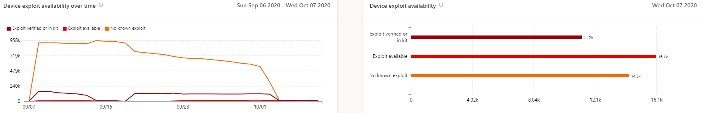

# Rapport sur les appareils vulnérables : gestion des menaces et des vulnérabilités

[!INCLUDE [Microsoft 365 Defender rebranding](../../includes/microsoft-defender.md)]

**S’applique à :**

- [Microsoft Defender pour point de terminaison](https://go.microsoft.com/fwlink/?linkid=2154037)
- [Gestion des menaces et des vulnérabilités](next-gen-threat-and-vuln-mgt.md)
- [Microsoft 365 Defender](https://go.microsoft.com/fwlink/?linkid=2118804)

>Vous souhaitez découvrir Microsoft Defender pour le point de terminaison ? [Inscrivez-vous à un essai gratuit.](https://www.microsoft.com/microsoft-365/windows/microsoft-defender-atp?ocid=docs-wdatp-portaloverview-abovefoldlink)

Le rapport présente des graphiques et des graphiques à barres avec des tendances d'appareils vulnérables et des statistiques actuelles. L'objectif est que vous compreniez le bruit et l'étendue de l'exposition de votre appareil. 

Accédez au rapport dans le Centre de sécurité Microsoft Defender en accédant à **Rapports > les appareils vulnérables**

Il existe deux colonnes :

- Tendances (au fil du temps). Peut afficher les 30 derniers jours, 3 mois, 6 mois ou une plage de dates personnalisée.
- Aujourd'hui (informations actuelles)

**Filtre**: vous pouvez filtrer les données par niveaux de gravité de vulnérabilité, disponibilité d'exploitation, âge de vulnérabilité, plateforme du système d'exploitation, version de Windows 10 ou groupe d'appareils.

**Exploration :** s'il existe un aperçu que vous souhaitez explorer plus en détail, sélectionnez le graphique à barres approprié pour afficher une liste filtrée d'appareils dans la page d'inventaire des appareils. À partir de là, vous pouvez exporter la liste.

## Graphiques de niveau de gravité

Chaque appareil est compté une seule fois en fonction de la vulnérabilité la plus grave trouvée sur cet appareil.

## Exploiter les graphiques de disponibilité

Chaque appareil est compté une seule fois en fonction du niveau d'exploitation connu le plus élevé.

## Graphiques de l'âge de vulnérabilité

Chaque appareil est compté une seule fois sous la date de publication de la vulnérabilité la plus ancienne. Les vulnérabilités plus anciennes ont plus de chances d'être exploitées.

## Appareils vulnérables par graphiques de plateforme de système d'exploitation

Nombre d'appareils sur chaque système d'exploitation exposés en raison de vulnérabilités logicielles.

## Appareils vulnérables par graphiques de version de Windows 10

Nombre d'appareils sur chaque version de Windows 10 exposés en raison d'applications ou de systèmes d'exploitation vulnérables.

## Voir aussi

- [Vue d'ensemble de la gestion des menaces et des vulnérabilités](next-gen-threat-and-vuln-mgt.md)
- [Recommandations de sécurité](tvm-security-recommendation.md)
