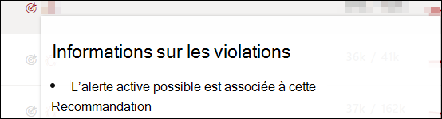
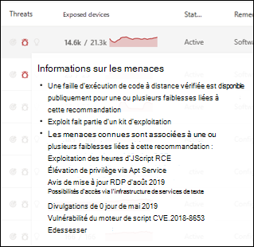
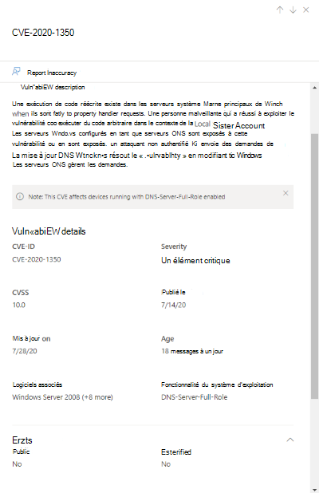
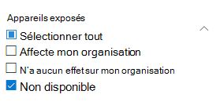
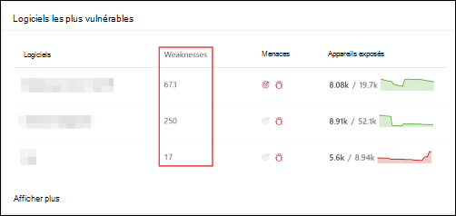
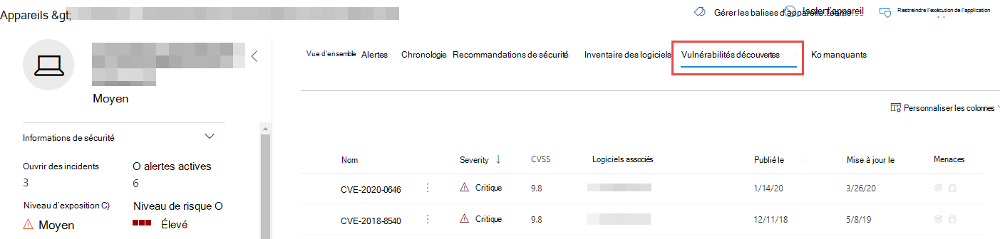
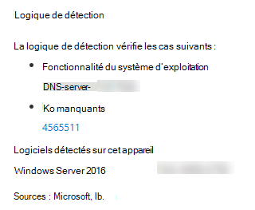

# Vulnérabilités dans mon organisation : gestion des menaces et des vulnérabilités

[!INCLUDE [Microsoft 365 Defender rebranding](../../includes/microsoft-defender.md)]

**S’applique à :**
- [Microsoft Defender pour point de terminaison](https://go.microsoft.com/fwlink/?linkid=2154037)
- [Gestion des menaces et des vulnérabilités](next-gen-threat-and-vuln-mgt.md)
- [Microsoft 365 Defender](https://go.microsoft.com/fwlink/?linkid=2118804)

>Vous souhaitez découvrir Microsoft Defender pour le point de terminaison ? [Inscrivez-vous à un essai gratuit.](https://www.microsoft.com/microsoft-365/windows/microsoft-defender-atp?ocid=docs-wdatp-portaloverview-abovefoldlink)

La gestion des menaces et des vulnérabilités utilise les mêmes signaux dans Defender pour la protection des points de terminaison pour analyser et détecter les vulnérabilités.

La page **Faiblesses** répertorie les vulnérabilités logicielles que vos appareils sont exposés en répertoriant l’ID CVE (Common Vulnerabilities and Exposures). Vous pouvez également afficher la gravité, la notation des vulnérabilités courantes (CVSS), la prévalence dans votre organisation, la violation correspondante, les informations sur les menaces, etc.

>[!NOTE]
>Si aucun ID CVE officiel n’est affecté à une vulnérabilité, le nom de la vulnérabilité est attribué par la gestion des menaces et des vulnérabilités.

>[!TIP]
>Pour obtenir des e-mails sur les nouveaux événements de vulnérabilité, voir Configurer les notifications par courrier électronique de vulnérabilité [dans Microsoft Defender pour endpoint](configure-vulnerability-email-notifications.md)

## Accéder à la page Faiblesses

Accédez à la page Faiblesses de différentes manières :

- Sélection des **faiblesses dans le** menu de navigation de gestion des menaces et des vulnérabilités dans le Centre de [sécurité Microsoft Defender](portal-overview.md)
- Recherche globale

### Menu de navigation

Go to the threat and vulnerability management navigation menu and select **Weaknesses** to open the list of CVEs.

### Vulnérabilités dans la recherche globale

1. Go to the global search drop-down menu.
2. Sélectionnez **Vulnérabilité et** clé dans l’ID CVE (Common Vulnerabilities and Exposures) que vous recherchez, puis sélectionnez l’icône de recherche. La page **Faiblesses** s’ouvre avec les informations CVE que vous recherchez.

3. Sélectionnez la CVE pour ouvrir un panneau volant avec plus d’informations, notamment la description de la vulnérabilité, les détails, les informations sur les menaces et les appareils exposés.

Pour voir le reste des vulnérabilités dans la page **Faiblesses,** tapez CVE, puis sélectionnez rechercher.

## Vue d’ensemble des faiblesses

Corriger les vulnérabilités des appareils exposés afin de réduire les risques pour vos ressources et votre organisation. Si la **colonne Appareils** exposés affiche 0, cela signifie que vous n’êtes pas en danger.

### Informations sur les violations et les menaces

Affichez les informations sur les violations et menaces associées dans la colonne **Menace** lorsque les icônes sont colorées en rouge.

 >[!NOTE]
 > Toujours hiérarchiser les recommandations associées aux menaces en cours. Ces recommandations sont marquées avec l’icône d’informations sur les menaces  et l’icône d’informations sur la violation, dessin  .  

L’icône Informations sur les violations est mise en surbrillant si une vulnérabilité est trouvée dans votre organisation.

L’icône Informations sur les menaces est mise en évidence si la vulnérabilité trouvée dans votre organisation est associée à des exploits. Le pointage sur l’icône indique si la menace fait partie d’un kit d’exploitation ou est connectée à des campagnes avancées persistantes ou à des groupes d’activités spécifiques. Lorsqu’il est disponible, il existe un lien vers un rapport d’analyse des menaces avec les actualités sur l’exploitation zéro jour, les divulgations ou les conseils de sécurité associés.  

### Obtenir des informations sur les vulnérabilités

Si vous sélectionnez une CVE, un panneau volant s’ouvre avec plus d’informations telles que la description de la vulnérabilité, les détails, les informations sur les menaces et les appareils exposés.

- La catégorie « Fonctionnalité du système d’exploitation » est affichée dans les scénarios pertinents
- Vous pouvez passer à la recommandation de sécurité associée pour chaque CVE avec appareil exposé

 

### Logiciel non pris en charge

Les VC pour les logiciels qui ne sont actuellement pas pris en charge par la gestion des menaces & des vulnérabilités sont toujours présents dans la page Faiblesses. Étant donné que le logiciel n’est pas pris en charge, seules des données limitées seront disponibles.

Les informations sur l’appareil exposé ne seront pas disponibles pour les VC avec des logiciels non pris en cas de non-gestion. Filtrez en sélectionnant l’option « Non disponible » dans la section « Appareils exposés ».

 

## Afficher les entrées CVE (Common Vulnerabilities and Exposures) à d’autres endroits

### Logiciels les plus vulnérables dans le tableau de bord

1. Go to the [threat and vulnerability management dashboard](tvm-dashboard-insights.md) and scroll down to the Top vulnerable **software** widget. Vous verrez le nombre de vulnérabilités trouvées dans chaque logiciel, ainsi que des informations sur les menaces et une vue d’exposition de haut niveau de l’appareil au fil du temps.

    

2. Sélectionnez le logiciel que vous souhaitez examiner pour aller à une page d’exercice.
3. Sélectionnez **l’onglet Vulnérabilités découvertes.**
4. Sélectionnez la vulnérabilité que vous souhaitez examiner pour plus d’informations sur les détails de la vulnérabilité

    

### Découvrir les vulnérabilités dans la page d’appareil

Afficher les informations sur les faiblesses associées dans la page de l’appareil.

1. Go to the Microsoft Defender Security Center navigation menu bar, then select the device icon. La page **Liste des périphériques** s’ouvre.
2. Dans la page **Liste des** appareils, sélectionnez le nom de l’appareil que vous souhaitez examiner.

    

3. La page de l’appareil s’ouvre avec des détails et des options de réponse pour l’appareil que vous souhaitez examiner.
4. Sélectionnez **vulnérabilités découvertes.**

    

5. Sélectionnez la vulnérabilité que vous souhaitez examiner pour ouvrir un panneau volant avec les détails CVE, tels que : description de la vulnérabilité, informations sur les menaces et logique de détection.

#### Logique de détection CVE

Comme pour la preuve logicielle, nous montrons maintenant la logique de détection que nous avons appliquée sur un appareil afin de l’afficher comme vulnérable. La nouvelle section est appelée « Logique de détection » (dans toute vulnérabilité détectée dans la page de l’appareil) et affiche la logique et la source de détection.

La catégorie « Fonctionnalité du système d’exploitation » est également affichée dans les scénarios pertinents. Une CVE affecterait les appareils qui exécutent un système d’exploitation vulnérable uniquement si un composant de système d’exploitation spécifique est activé. Supposons que Windows Server 2019 présente une vulnérabilité dans son composant DNS. Avec cette nouvelle fonctionnalité, nous n’attacherons cette CVE qu’aux appareils Windows Server 2019 avec la fonctionnalité DNS activée dans leur système d’exploitation.

## Inaccuracy de rapport

Signalez un faux positif lorsque vous voyez des informations vagues, inexactes ou incomplètes. Vous pouvez également signaler les recommandations de sécurité qui ont déjà été corrigés.

1. Ouvrez la CVE sur la page Faiblesses.
2. Select **Report inaccuracy** and a flyout pane will open.
3. Sélectionnez la catégorie d’imprécision dans le menu déroulant et remplissez votre adresse e-mail et les détails d’imprécision.
4. Sélectionnez **Envoyer**. Vos commentaires sont immédiatement envoyés aux experts en gestion des menaces et des vulnérabilités.

## Articles connexes

- [Vue d’ensemble de la gestion des menaces et des vulnérabilités](next-gen-threat-and-vuln-mgt.md)
- [Recommandations de sécurité](tvm-security-recommendation.md)
- [Inventaire des logiciels](tvm-software-inventory.md)
- [Informations sur le tableau de bord](tvm-dashboard-insights.md)
- [Afficher et organiser la liste Microsoft Defender pour les appareils de point de terminaison](machines-view-overview.md)
