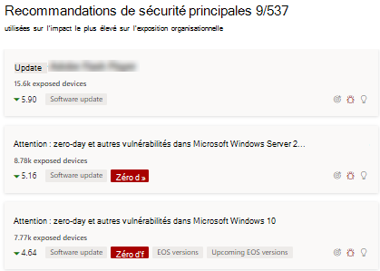
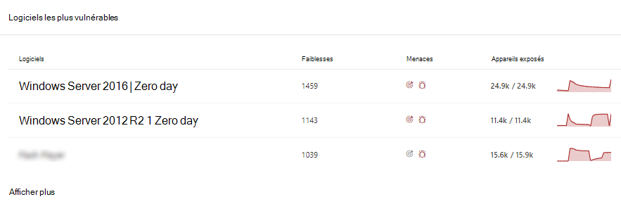
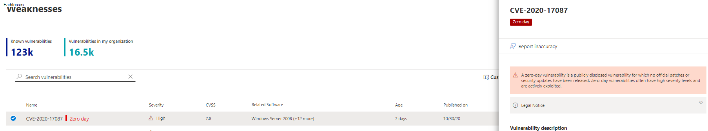
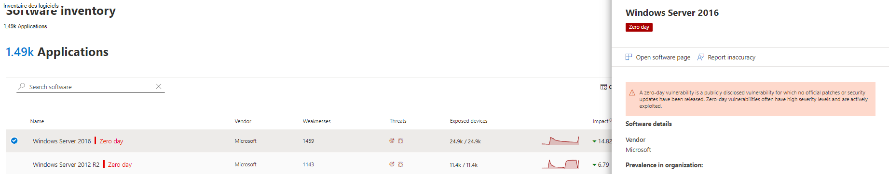
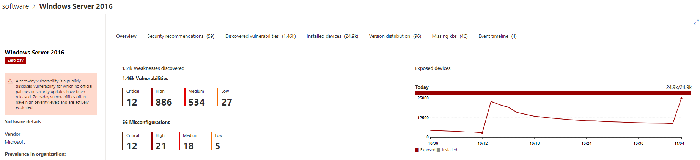
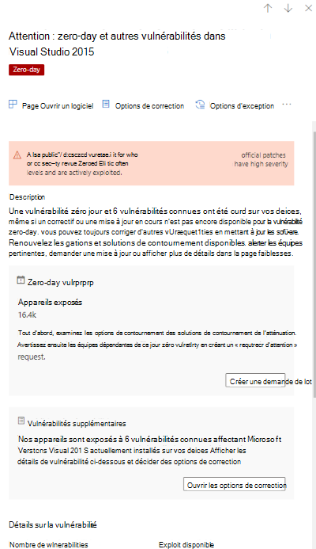
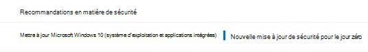

# Atténuer les vulnérabilités du jour zéro : gestion des menaces et des vulnérabilités

[!INCLUDE [Microsoft 365 Defender rebranding](../../includes/microsoft-defender.md)]

**S’applique à :**

- [Microsoft Defender pour point de terminaison](https://go.microsoft.com/fwlink/?linkid=2154037)
- [Gestion des menaces et des vulnérabilités](next-gen-threat-and-vuln-mgt.md)
- [Microsoft 365 Defender](https://go.microsoft.com/fwlink/?linkid=2118804)

>Vous souhaitez découvrir Microsoft Defender pour le point de terminaison ? [Inscrivez-vous à un essai gratuit.](https://www.microsoft.com/microsoft-365/windows/microsoft-defender-atp?ocid=docs-wdatp-portaloverview-abovefoldlink)

Une vulnérabilité « zero-day » est une vulnérabilité publiquement divulguée pour laquelle aucune mise à jour de sécurité ou correctifs officiels n’a été publié. Les vulnérabilités du jour zéro ont souvent des niveaux de gravité élevés et sont activement exploitées.

La gestion des menaces et des vulnérabilités affiche uniquement les vulnérabilités du jour zéro dont elle dispose d’informations.

## Trouver des informations sur les vulnérabilités du jour zéro

Une fois qu’une vulnérabilité zéro jour a été trouvée, les informations à ce sujet sont transmises via les expériences suivantes dans le Centre de sécurité Microsoft Defender.

### Tableau de bord de gestion des menaces et des vulnérabilités

Recherchez des recommandations avec une balise « zero-day » dans la carte « Recommandations de sécurité les plus importantes ».

Recherchez les principaux logiciels avec la balise « zero-day » dans la carte « Logiciels les plus vulnérables ».

### Page Faiblesses

Recherchez la vulnérabilité nommée « zero-day » ainsi qu’une description et des détails.

- Si un ID CVE est affecté à cette vulnérabilité, vous verrez l’étiquette « zero-day » en regard du nom CVE.

- Si aucun ID CVE n’est affecté à cette vulnérabilité, vous la trouverez sous un nom interne temporaire qui ressemble à « TVM-XXXX-XXXX ». Le nom sera mis à jour une fois qu’un ID CVE officiel a été affecté, mais le nom interne précédent peut toujours être recherché et trouvé dans le panneau latéral.

### Page Inventaire logiciel

Recherchez les logiciels avec la balise « zero-day ». Filtrez par la balise « zero day » pour voir uniquement les logiciels avec des vulnérabilités zero-day.

### Page de logiciels

Recherchez une balise zero-day pour chaque logiciel affecté par la vulnérabilité zero-day.

### Page Recommandations en matière de sécurité

Affichez des suggestions claires sur les options de correction et d’atténuation, y compris les solutions de contournement si elles existent. Filtrez par balise « zero day » pour voir uniquement les recommandations de sécurité concernant les vulnérabilités « zero-day ».

S’il existe un logiciel avec une vulnérabilité zéro jour et des vulnérabilités supplémentaires à résoudre, vous recevrez une recommandation sur toutes les vulnérabilités.

## Résoudre les vulnérabilités du jour zéro

Go to the security recommendation page and select a recommendation with a zero-day. Un flyout s’ouvre avec des informations sur le jour zéro et d’autres vulnérabilités pour ce logiciel.

Il y aura un lien vers les options d’atténuation et les solutions de contournement si elles sont disponibles. Les solutions de contournement peuvent aider à réduire les risques posés par cette vulnérabilité zero-day jusqu’à ce qu’un correctif ou une mise à jour de sécurité puisse être déployé.

Ouvrez les options de correction et choisissez le type d’attention. Une option de correction « attention requise » est recommandée pour les vulnérabilités du jour zéro, dans la mesure où une mise à jour n’a pas encore été publiée. Vous ne pourrez pas sélectionner une date d’échéance, car aucune action spécifique n’est à effectuer. S’il existe des vulnérabilités plus anciennes pour ce logiciel que vous souhaitez mettre à jour, vous pouvez remplacer l’option de correction « Attention requise » et choisir « mettre à jour ».

## Suivre les activités de correction du jour zéro

Go to the threat and vulnerability management [Remediation](tvm-remediation.md) page to view the remediation activity item. Si vous avez choisi l’option de correction « Attention requise », il n’y aura aucune barre de progression, état du ticket ou date d’échéance, car il n’existe aucune action réelle que nous pouvons surveiller. Vous pouvez filtrer par type de correction, tel que « mise à jour logicielle » ou « attention requise », pour voir tous les éléments d’activité dans la même catégorie.

## Correction des vulnérabilités du jour zéro

Lorsqu’un correctif est publié pour le jour zéro, la recommandation est modifiée en « Mise à jour » et une étiquette bleue en plus de celle-ci indique « Nouvelle mise à jour de sécurité pour le jour zéro ». Il ne sera plus considérer comme un jour zéro, la balise « zero-day » sera supprimée de toutes les pages.

## Articles connexes

- [Vue d’ensemble de la gestion des menaces et des vulnérabilités](next-gen-threat-and-vuln-mgt.md)
- [Tableau de bord](tvm-dashboard-insights.md)
- [Recommandations de sécurité](tvm-security-recommendation.md)
- [Inventaire des logiciels](tvm-software-inventory.md)
- [Vulnérabilités dans mon organisation](tvm-weaknesses.md)
