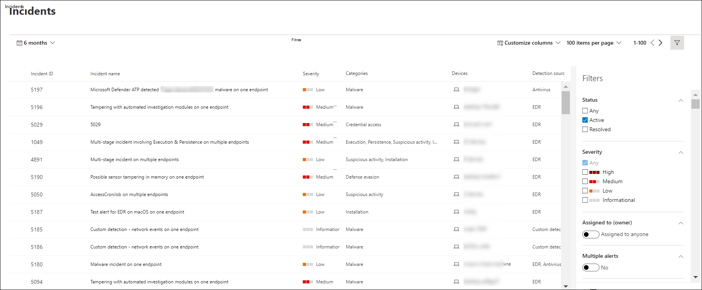

# Afficher et organiser la file d’attente d’incidents Microsoft Defender pour point de terminaison

[!INCLUDE [Microsoft 365 Defender rebranding](../../includes/microsoft-defender.md)]

**S’applique à :**
- [Microsoft Defender pour point de terminaison](https://go.microsoft.com/fwlink/?linkid=2154037)
- [Microsoft 365 Defender](https://go.microsoft.com/fwlink/?linkid=2118804)

> Vous souhaitez faire l’expérience de Defender pour point de terminaison ? [Inscrivez-vous pour bénéficier d’un essai gratuit.](https://signup.microsoft.com/create-account/signup?products=7f379fee-c4f9-4278-b0a1-e4c8c2fcdf7e&ru=https://aka.ms/MDEp2OpenTrial?ocid=docs-wdatp-pullalerts-abovefoldlink)

La **file d’attente Incidents** affiche un ensemble d’incidents qui ont été signalés à partir d’appareils de votre réseau. Elle vous aide à trier les incidents afin de hiérarchiser et de créer une décision de réponse cyber-sécurité.

Par défaut, la file d’attente affiche les incidents observés au cours des 30 derniers jours, le plus récent s’affichant en haut de la liste, ce qui vous aide à voir les incidents les plus récents en premier.

Plusieurs options s’offrent à vous pour personnaliser l’affichage de file d’attente Incidents. 

Dans la barre de navigation supérieure, vous pouvez :
- Personnaliser des colonnes pour ajouter ou supprimer des colonnes 
- Modifier le nombre d’éléments à afficher par page
- Sélectionner les éléments à afficher par page
- Sélectionner par lots les incidents à affecter 
- Naviguer entre les pages
- Appliquer des filtres

## Trier et filtrer la file d’attente des incidents
Vous pouvez appliquer les filtres suivants pour limiter la liste des incidents et obtenir une vue plus centrée.

### Severity

Gravité de l’incident | Description
:---|:---
Élevé  (Rouge) | Menaces souvent associées à des menaces avancées persistantes (APT). Ces incidents indiquent un risque élevé en raison de la gravité des dommages qu’ils peuvent causer sur les appareils.
Moyenne  (Orange) | Menaces rarement observées dans l’organisation, telles que la modification anormale du Registre, l’exécution de fichiers suspects et les comportements observés typiques des phases d’attaque.
Faible  (Jaune) | Menaces associées à des programmes malveillants et à des outils de piratage répandus qui n’indiquent pas nécessairement une menace avancée ciblant l’organisation.
Informatif  (Gris) | Les incidents d’information peuvent ne pas être considérés comme dangereux pour le réseau, mais ils peuvent être utiles pour assurer le suivi.

## Affectée à
Vous pouvez choisir de filtrer la liste en sélectionnant ceux qui vous sont affectés ou ceux qui vous sont affectés.

### Catégorie
Les incidents sont classés en fonction de la description de l’étape à laquelle se trouve la chaîne de mise à jour de la cybersécurité. Cette vue permet à l’analyste de menaces de déterminer la priorité, l’urgence et la stratégie de réponse correspondante à déployer en fonction du contexte.

### Statut
Vous pouvez choisir de limiter la liste des incidents affichés en fonction de leur état pour identifier ceux qui sont actifs ou résolus.

### Confidentialité des données
Utilisez ce filtre pour afficher les incidents qui contiennent des étiquettes de sensibilité.

## Nommage d’incident

Pour comprendre l’étendue de l’incident en un coup d’œil, les noms des incidents sont générés automatiquement en fonction des attributs d’alerte tels que le nombre de points de terminaison affectés, les utilisateurs affectés, les sources de détection ou les catégories.

Par exemple : incident en plusieurs étapes sur plusieurs points de *terminaison signalés par plusieurs sources.*

> [!NOTE]
> Les incidents qui existaient avant le déploiement de la dénomination automatique des incidents conserveront leur nom.

## Voir aussi
- [File d’attente des incidents](/microsoft-365/security/defender-endpoint/view-incidents-queue)
- [Gérer des incidents](manage-incidents.md)
- [Examiner des incidents](investigate-incidents.md)

