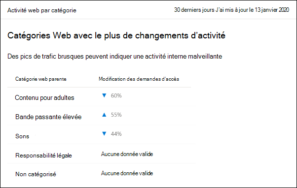
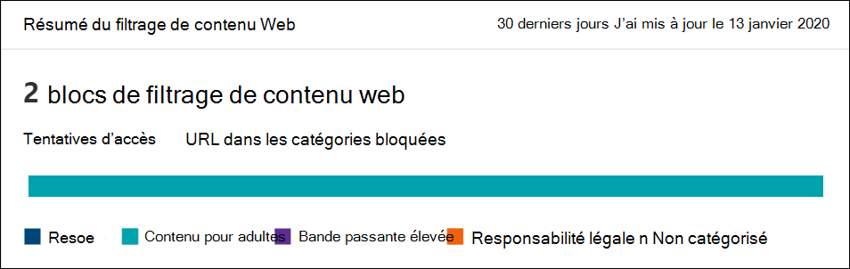
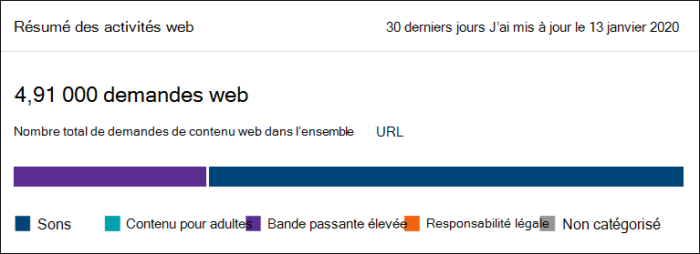

# Filtrage du contenu web

[!INCLUDE [Microsoft 365 Defender rebranding](../../includes/microsoft-defender.md)]

**S’applique à :**
- [Microsoft Defender pour point de terminaison](https://go.microsoft.com/fwlink/p/?linkid=2154037)
- [Microsoft 365 Defender](https://go.microsoft.com/fwlink/?linkid=2118804)

> [!IMPORTANT]
> **Le filtrage de contenu Web est actuellement en prévisualisation publique** 
> Cette préversion est fournie sans contrat de niveau de service et n’est pas recommandée pour les charges de travail de production. Certaines fonctionnalités peuvent ne pas être prises en charge ou avoir des fonctionnalités limitées.
> Pour plus d’informations, consultez [fonctionnalités en préversion de Microsoft Defender pour point de terminaison](preview.md).

> [!TIP]
> Vous voulez découvrir Microsoft Defender pour point de terminaison ? [Inscrivez-vous pour bénéficier d’un essai gratuit.](https://signup.microsoft.com/create-account/signup?products=7f379fee-c4f9-4278-b0a1-e4c8c2fcdf7e&ru=https://aka.ms/MDEp2OpenTrial?ocid=docs-wdatp-main-abovefoldlink&rtc=1)

Le filtrage de contenu Web fait partie des fonctionnalités de [protection Web](web-protection-overview.md) de Microsoft Defender pour point de terminaison. Il permet à votre organisation de suivre et de contrôler l’accès aux sites web en fonction de leurs catégories de contenu. La plupart de ces sites web, bien qu’ils ne soient pas malveillants, peuvent être problématiques en raison des réglementations de conformité, de l’utilisation de la bande passante ou d’autres problèmes.

Configurez des stratégies sur vos groupes d’appareils pour bloquer certaines catégories. Le blocage d’une catégorie empêche les utilisateurs au sein de groupes d’appareils spécifiés d’accéder aux URL associées à la catégorie. Pour toute catégorie qui n’est pas bloquée, les URL sont automatiquement auditées. Vos utilisateurs peuvent accéder aux URL sans interruption, et vous allez collecter des statistiques d’accès pour vous aider à créer une décision de stratégie plus personnalisée. Vos utilisateurs voient une notification de blocage si un élément de la page qu’ils voient appelle une ressource bloquée.

Le filtrage de contenu Web est disponible sur les principaux navigateurs web, avec des blocs exécutés par Windows Defender SmartScreen (Microsoft Edge) et la Protection du réseau (Chrome, Firefox, Firefox et Opera). Pour plus d’informations sur la prise en charge des navigateurs, consultez la section conditions préalables.

Récapitulatif des avantages :

- Les utilisateurs ne peuvent pas accéder aux sites web dans les catégories bloquées, qu’ils naviguent en local ou en de suite
- Votre équipe de sécurité peut déployer facilement des stratégies sur des groupes d’utilisateurs à l’aide de groupes d’appareils définis dans les paramètres de contrôle d’accès basés sur les [rôles Microsoft Defender](/microsoft-365/security/defender-endpoint/rbac) for Endpoint
- Votre équipe de sécurité peut accéder aux rapports web dans le même emplacement central, avec une visibilité sur les blocs réels et l’utilisation du web

## Conditions requises

Avant d’essayer cette fonctionnalité, assurez-vous que vous disposez des conditions suivantes :

- Windows 10 Entreprise E5, Microsoft 365 E5, Microsoft 365 E5 Sécurité, Microsoft 365 E3 + Microsoft 365 E5 Sécurité ou la licence autonome Microsoft Defender pour endpoint. 
- Accès à Microsoft 365 Defender portail ( https://security.microsoft.com) .
- Appareils exécutant Windows 10 mise à jour anniversaire (version 1607) ou version ultérieure avec la dernière mise à jour MoCAMP.
- Windows Defender SmartScreen et protection du réseau activés.

## Expérience utilisateur

L’expérience de blocage pour les navigateurs tiers pris en charge est fournie par la Protection du réseau, qui fournit un message au niveau du système pour avertir l’utilisateur d’une connexion bloquée. Pour une expérience plus conviviale dans le navigateur, envisagez d’utiliser Microsoft Edge.

## Traitement des données

Les données sont stockées dans la région sélectionnée dans le cadre de vos paramètres de gestion des données [de Microsoft Defender for Endpoint.](data-storage-privacy.md) Vos données ne quitteront pas le centre de données dans cette région. En outre, vos données ne seront partagées avec aucun tiers, y compris nos fournisseurs de données.

## Activer le filtrage de contenu web

Dans le menu de navigation de gauche, sélectionnez **Paramètres** points de terminaison  >  **fonctionnalités**  >    >  **générales avancées**. Faites défiler vers le bas jusqu’à ce que vous voyez l’entrée pour le **filtrage de contenu Web.** Basculez sur Les préférences **d’on** et **d’enregistrer.**

### Configurer des stratégies de filtrage de contenu web

Les stratégies de filtrage de contenu Web spécifient les catégories de site bloquées pour les groupes d’appareils. Pour gérer les stratégies, go to **Paramètres**  >  **Endpoints**  >  **Web content filtering** (under **Rules**).

Utilisez le filtre pour localiser les stratégies qui contiennent certaines catégories bloquées ou qui sont appliquées à des groupes d’appareils spécifiques.

### Créer une stratégie

Pour ajouter une nouvelle stratégie :

1. Sélectionnez **Ajouter une** stratégie sur la page **de filtrage de** contenu Web **dans Paramètres**.

2. Spécifiez un nom.

3. Sélectionnez les catégories à bloquer. Utilisez l’icône développer pour développer entièrement chaque catégorie parent et sélectionner des catégories de contenu web spécifiques.

4. Spécifiez l’étendue de la stratégie. Sélectionnez les groupes d’appareils pour spécifier où appliquer la stratégie. Seuls les appareils des groupes d’appareils sélectionnés ne pourront pas accéder aux sites web dans les catégories sélectionnées.

5. Examinez le résumé et enregistrez la stratégie. L’actualisation de la stratégie peut prendre jusqu’à 2 heures pour s’appliquer à vos appareils sélectionnés.

> [!NOTE]
> - Vous pouvez déployer une stratégie sans sélectionner de catégorie sur un groupe d’appareils. Cette action crée une stratégie d’audit uniquement pour vous aider à comprendre le comportement des utilisateurs avant de créer une stratégie de blocage.
> - Si vous supprimez une stratégie ou modifiez des groupes d’appareils en même temps, cela peut entraîner un retard dans le déploiement de la stratégie.
> - Le blocage de la catégorie « Non catégorisé » peut entraîner des résultats inattendus et inattendus.  

### Autoriser des sites web spécifiques

Il est possible de remplacer la catégorie bloquée dans le filtrage de contenu web pour autoriser un site unique en créant une stratégie d’indicateur personnalisée. La stratégie d’indicateur personnalisé va prendre le pas sur la stratégie de filtrage de contenu web lorsqu’elle est appliquée au groupe d’appareils en question.

1. Créez un indicateur personnalisé dans le portail Microsoft 365 Defender en allant à Paramètres URL des indicateurs de points de  >    >    >  **terminaison/Ajouter**  >  **un élément de domaine.**

2. Entrez le domaine du site.

3. Définissez l’action de stratégie sur **Autoriser**.  

### Catégories de litige

Si vous rencontrez un domaine qui a été classé de manière incorrecte, vous pouvez la disputer directement à partir du portail. 

Pour disputer la catégorie d’un domaine, accédez à **Reports**  >  **Web Protection** Web Content  >  **Filtering Details**  >  **Domains**. Sous l’onglet Domaines des rapports de filtrage de contenu Web, vous verrez des ellipses à côté de chacun des domaines. Pointez sur ces ellipses et sélectionnez **Catégorie litige.**

Un panneau s’ouvre où vous pouvez sélectionner la priorité et ajouter des détails supplémentaires, tels que la catégorie suggérée pour la recatégorisation. Une fois que vous avez terminé le formulaire, sélectionnez **Envoyer.** Notre équipe examine la demande dans un jour ou deux. Pour un déblocage immédiat, créez un [indicateur d’autoriser personnalisé.](indicator-ip-domain.md)

### Recherche de catégorie d’URL

Pour déterminer la catégorie d’un site web, vous pouvez utiliser la fonction de recherche d’URL disponible sur le portail Microsoft 365 Defender ( sous https://security.microsoft.com) **Endpoints**  >  **Search**. Dans les résultats de recherche d’URL, la catégorie de filtrage de contenu web apparaît sous **URL/Détails du domaine.** Les administrateurs peuvent également s’en prendre à la catégorie du domaine directement à partir de cette page, comme illustré dans l’image suivante. Si le résultat de catégorie n’est pas affiché, l’URL n’est pas actuellement affectée à une catégorie de filtrage de contenu web existante.

## Cartes et détails de filtrage de contenu Web

Sélectionnez **Reports** Web Protection pour afficher les cartes avec des informations sur le filtrage de contenu  >   web et la protection contre les menaces web. Les cartes suivantes fournissent des informations récapitulatifs sur le filtrage de contenu web.

### Activité web par catégorie

Cette carte répertorie les catégories de contenu web parent avec la plus grande augmentation ou diminution du nombre de tentatives d’accès. Comprendre les changements majeurs dans les modèles d’activité web dans votre organisation depuis les 30 derniers jours, 3 mois ou 6 derniers mois. Sélectionnez un nom de catégorie pour afficher plus d’informations.

Au cours des 30 premiers jours d’utilisation de cette fonctionnalité, il se peut que votre organisation ne dispose pas de suffisamment de données pour afficher ces informations.

### Carte récapitulatif du filtrage du contenu Web

Cette carte affiche la distribution des tentatives d’accès bloqué entre les différentes catégories de contenu web parent. Sélectionnez l’une des barres de couleur pour afficher plus d’informations sur une catégorie web parente spécifique.

### Carte récapitulatif des activités web

Cette carte affiche le nombre total de demandes de contenu web dans toutes les URL.

### Afficher les détails de la carte

Vous pouvez accéder aux **détails du rapport** pour chaque carte en sélectionnant une ligne de tableau ou une barre de couleur dans le graphique de la carte. La page de détails du rapport pour chaque carte contient des données statistiques complètes sur les catégories de contenu web, les domaines de site web et les groupes d’appareils.

- **Catégories Web :** répertorie les catégories de contenu web qui ont connu des tentatives d’accès dans votre organisation. Sélectionnez une catégorie spécifique pour ouvrir un volant de synthèse.

- **Domaines :** répertorie les domaines web qui ont été accédés ou bloqués dans votre organisation. Sélectionnez un domaine spécifique pour afficher des informations détaillées sur ce domaine.

- **Groupes d’appareils**: répertorie tous les groupes d’appareils qui ont généré une activité web dans votre organisation

Utilisez le filtre de plage de temps en haut à gauche de la page pour sélectionner une période. Vous pouvez également filtrer les informations ou personnaliser les colonnes. Sélectionnez une ligne pour ouvrir un volet volant avec encore plus d’informations sur l’élément sélectionné.

## Erreurs et problèmes

### Limitations et problèmes connus dans cette prévisualisation

- Seul Microsoft Edge est pris en charge si la configuration du système d’exploitation de votre appareil est Server (**cmd**  >  **Systeminfo**  >  **OS Configuration**). La protection du réseau est uniquement prise en charge en mode Inspect sur les appareils serveur, qui est responsable de la sécurisation du trafic sur les navigateurs tiers pris en charge.

- Les appareils non signés auront des données incorrectes affichées dans le rapport. Dans le tableau croisé dynamique Des groupes d’appareils **détails** du rapport, vous pouvez voir  >   une ligne avec un champ Groupe de périphériques vide. Ce groupe contient vos appareils non signés avant qu’ils ne sont placés dans votre groupe spécifié. Le rapport de cette ligne peut ne pas contenir un nombre précis d’appareils ou de nombres d’accès.

- Les rapports de filtrage de contenu Web sont actuellement limités à l’affichage des 5 000 premiers enregistrements. Par exemple, le rapport Domaines affiche uniquement un maximum des 5 000 principaux domaines pour une requête de filtre donnée, le cas échéant. 

- [Vue d’ensemble de la protection web](web-protection-overview.md)
- [Protection contre les menaces web](web-threat-protection.md)
- [Surveiller la sécurité web](web-protection-monitoring.md)
- [Répondre aux menaces web](web-protection-response.md)
- [Conditions requises pour la protection du réseau](web-content-filtering.md)
