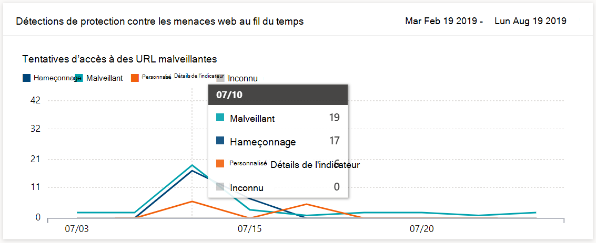
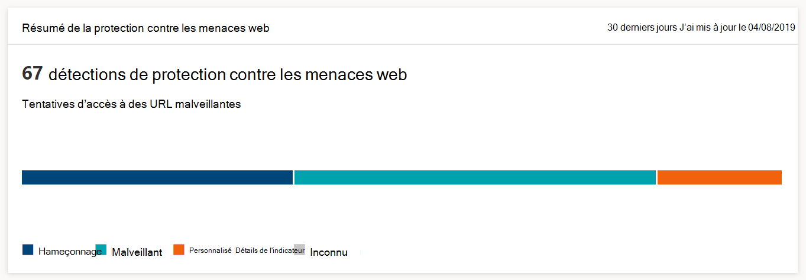

# Surveiller la sécurité de navigation web

[!INCLUDE [Microsoft 365 Defender rebranding](../../includes/microsoft-defender.md)]

**S’applique à :**
- [Microsoft Defender pour point de terminaison](https://go.microsoft.com/fwlink/p/?linkid=2154037)
- [Microsoft 365 Defender](https://go.microsoft.com/fwlink/?linkid=2118804)

>Vous souhaitez découvrir Microsoft Defender pour le point de terminaison ? [Inscrivez-vous à un essai gratuit.](https://www.microsoft.com/microsoft-365/windows/microsoft-defender-atp?ocid=docs-wdatp-main-abovefoldlink&rtc=1)

La protection Web vous permet de surveiller la sécurité de navigation web de votre organisation via des rapports sous Rapports > **protection Web** dans le Centre de sécurité Microsoft Defender. Le rapport contient des cartes qui fournissent des statistiques sur la détection des menaces web.

- Détections de protection contre les **menaces web** au fil du temps : cette carte tendance affiche le nombre de menaces web détectées par type au cours de la période sélectionnée (30 derniers jours, 3 derniers mois, 6 derniers mois)
 
    

- **Résumé de la protection** contre les menaces web : cette carte affiche le nombre total de détections de menaces web au cours des 30 derniers jours, montrant la répartition entre les différents types de menaces web. La sélection d’une tranche ouvre la liste des domaines qui ont été trouvés avec des sites web malveillants ou indésirables.

    

>[!Note]
>La réflexion d’un bloc dans les cartes ou la liste de domaines peut prendre jusqu’à 12 heures.

## Types de menaces web

La protection web classe les sites web malveillants et indésirables comme :

- **Hameçonnage :** sites web qui contiennent des formulaires web usurpés et d’autres mécanismes de hameçonnage conçus pour leurre les utilisateurs à divulguer des informations d’identification et d’autres informations sensibles
- **Malveillant :** sites web hébergeant des programmes malveillants et du code d’exploitation
- **Indicateur personnalisé** : sites web dont vous avez ajouté les URL ou les domaines à votre liste d’indicateurs personnalisés [pour](manage-indicators.md) le blocage

## Afficher la liste des domaines

Sélectionnez une catégorie de menaces web spécifique dans la carte **récapitulative de la protection web** contre les menaces pour ouvrir la page **Domaines.** Cette page affiche la liste des domaines de cette catégorie de menaces. La page fournit les informations suivantes pour chaque domaine :

- **Nombre d’accès** : nombre de demandes d’URL dans le domaine
- **Blocs :** nombre de fois que les demandes ont été bloquées
- **Tendance d’accès** : changement du nombre de tentatives d’accès
- **Catégorie de menace** : type de menace web
- **Appareils** : nombre d’appareils avec tentatives d’accès

Sélectionnez un domaine pour afficher la liste des périphériques qui ont tenté d’accéder aux URL de ce domaine et la liste des URL.

## Voir aussi

- [Vue d’ensemble de la protection Web](web-protection-overview.md)
- [Filtrage de contenu Web](web-content-filtering.md)
- [Protection contre les menaces web](web-threat-protection.md)
- [Répondre aux menaces web](web-protection-response.md)
