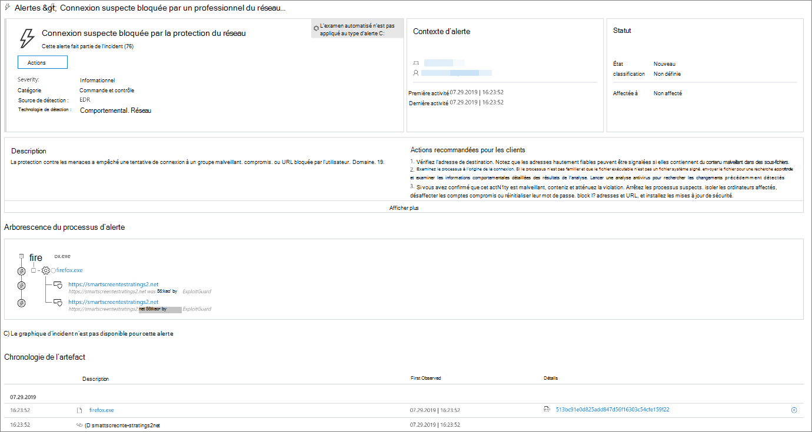
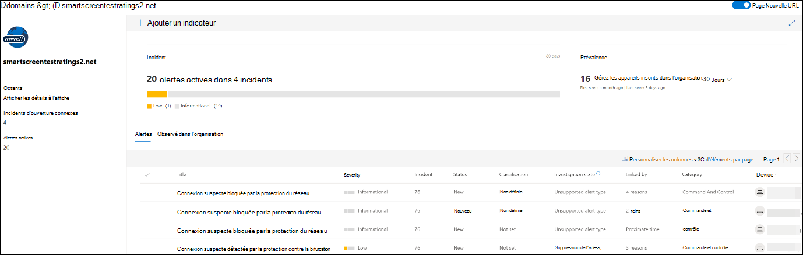
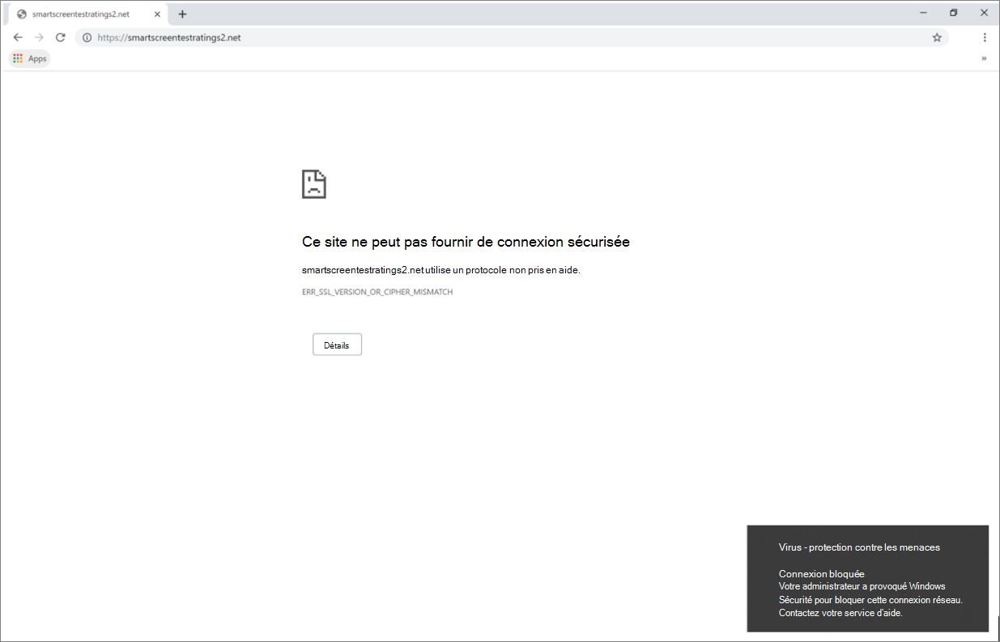

# Répondre aux menaces web

[!INCLUDE [Microsoft 365 Defender rebranding](../../includes/microsoft-defender.md)]

**S’applique à :**
- [Microsoft Defender pour point de terminaison](https://go.microsoft.com/fwlink/p/?linkid=2154037)
- [Microsoft 365 Defender](https://go.microsoft.com/fwlink/?linkid=2118804)

> Vous voulez découvrir Microsoft Defender pour point de terminaison ? [Inscrivez-vous pour bénéficier d’un essai gratuit.](https://signup.microsoft.com/create-account/signup?products=7f379fee-c4f9-4278-b0a1-e4c8c2fcdf7e&ru=https://aka.ms/MDEp2OpenTrial?ocid=docs-wdatp-main-abovefoldlink&rtc=1)

La protection web dans Microsoft Defender pour point de terminaison vous permet d’examiner et de répondre efficacement aux alertes liées aux sites web et sites web malveillants dans votre liste d’indicateurs personnalisés.

## Afficher les alertes contre les menaces web

Microsoft Defender pour le point de terminaison génère les [alertes suivantes](manage-alerts.md) pour les activités web malveillantes ou suspectes :

- **Connexion suspecte bloquée par** la protection réseau : cette alerte est générée lorsqu’une  tentative d’accès à un site web malveillant ou à un site web dans votre liste d’indicateurs personnalisés est arrêtée par la protection réseau en *mode* blocage
- **Connexion suspecte** détectée par la protection réseau : cette alerte est générée lorsqu’une tentative d’accès à un site web malveillant ou à un site web dans votre liste d’indicateurs personnalisés est détectée par la protection réseau en mode *audit* uniquement

Chaque alerte fournit les informations suivantes :

- Appareil qui a tenté d’accéder au site web bloqué
- Application ou programme utilisé pour envoyer la demande web
- URL ou URL malveillante dans la liste des indicateurs personnalisés
- Actions recommandées pour les répondeurs

> [!NOTE]
> Pour réduire le volume d’alertes, Microsoft Defender pour point de terminaison consolide les détections de menaces web pour le même domaine sur le même appareil chaque jour en une seule alerte. Une seule alerte est générée et comptabilisée dans le rapport [de protection web.](web-protection-monitoring.md)

## Inspecter les détails du site web

Vous pouvez approfondir l’analyse en sélectionnant l’URL ou le domaine du site web dans l’alerte. Une page sur cette URL ou ce domaine particulier s’ouvre avec différentes informations, notamment :

- Appareils qui ont tenté d’accéder au site web
- Incidents et alertes liés au site web
- Fréquence d’utilisation du site web dans les événements de votre organisation

    

[En savoir plus sur les pages d’URL ou d’entité de domaine](investigate-domain.md)

## Inspecter l’appareil

Vous pouvez également vérifier l’appareil qui a tenté d’accéder à une URL bloquée. La sélection du nom de l’appareil sur la page d’alerte ouvre une page avec des informations complètes sur l’appareil.

[En savoir plus sur les pages d’entité d’appareil](investigate-machines.md)

## Navigateur web et notifications Windows pour les utilisateurs finaux

Avec la protection web dans Microsoft Defender pour point de terminaison, vos utilisateurs finaux ne pourront pas visiter des sites web malveillants ou indésirables à l’aide de Microsoft Edge ou d’autres navigateurs. Étant donné que le blocage est effectué par la [protection](network-protection.md)réseau, une erreur générique s’est produite à partir du navigateur web. Ils voient également une notification de Windows.

 *Menace web bloquée sur Microsoft Edge*

 *Menace web bloquée sur Chrome*

## Rubriques connexes

- [Vue d’ensemble de la protection web](web-protection-overview.md)
- [Filtrage du contenu web](web-content-filtering.md)
- [Protection contre les menaces web](web-threat-protection.md)
- [Surveiller la sécurité web](web-protection-monitoring.md)
