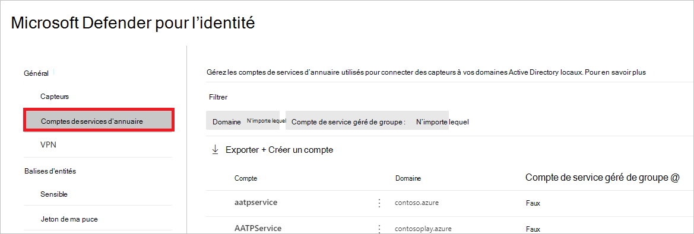
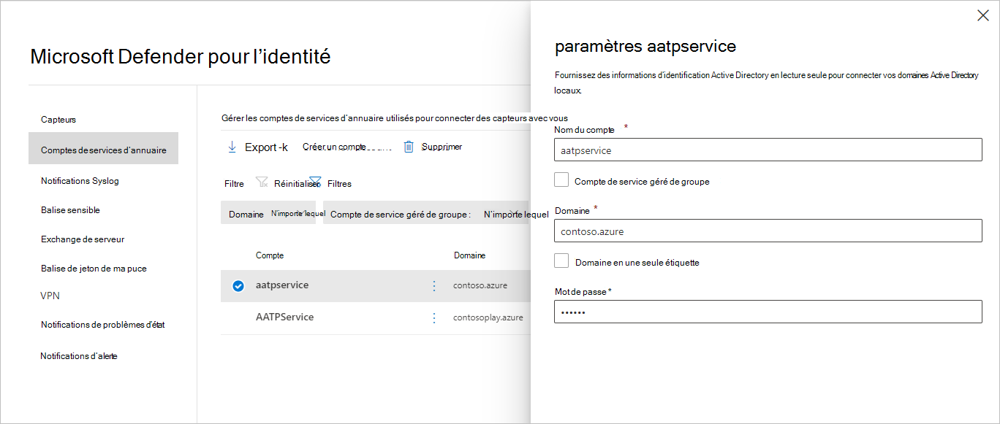
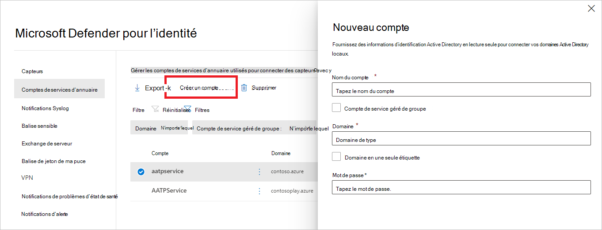

# Compte Microsoft Defender pour les services d’annuaire d’identités dans Microsoft 365 Defender

**S’applique à :**

- Microsoft 365 Defender
- Defender pour l’identité

Cet article explique comment configurer le compte [Microsoft Defender for Identity](/defender-for-identity) Directory Services dans [Microsoft 365 Defender](/microsoft-365/security/defender/overview-security-center).

>[!IMPORTANT]
>Dans le cadre de la convergence avec Microsoft 365 Defender, certaines options et détails ont changé par rapport à leur emplacement dans le portail Defender for Identity. Veuillez lire les détails ci-dessous pour découvrir où trouver les fonctionnalités connues et nouvelles.

## Configurer le compte des services d’annuaire

Pour connecter le [capteur](sensor-health.md#add-a-sensor) à vos domaines Active Directory, vous devez configurer les comptes des services d’annuaire.

1. In [Microsoft 365 Defender](https://security.microsoft.com/), go to **Paramètres** and then **Identities**.

    

1. Sélectionnez **des comptes de service d’annuaire.** Vous verrez quels comptes sont associés à quels domaines.

    

1. Si vous sélectionnez un compte, un volet s’ouvre avec les paramètres de ce compte.

    

1. Pour ajouter un nouveau compte  de services d’annuaire, sélectionnez Créer un compte et remplissez le nom de **compte,** le domaine **et** le mot de **passe.** Vous pouvez également choisir s’il s’agit d’un compte de **service** géré de groupe (gMSA) et s’il appartient à un **domaine d’étiquette unique.**

    

1. Sélectionnez **Enregistrer**.

## Voir aussi

- [Paramètres et l’état du capteur Microsoft Defender pour l’identité](sensor-health.md)
