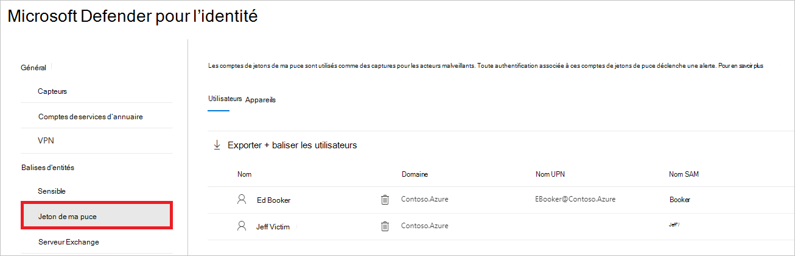

# Balises d’entité Defender pour Identity dans Microsoft 365 Defender

**S’applique à :**

- Microsoft 365 Defender
- Defender pour l’identité

Cet article explique comment appliquer [Microsoft Defender pour Identity](/defender-for-identity) balises d’entité dans [Microsoft 365 Defender](/microsoft-365/security/defender/overview-security-center).

>[!IMPORTANT]
>Dans le cadre de la convergence avec Microsoft 365 Defender, certaines options et détails ont changé à partir de leur emplacement dans le portail Defender pour Identity. Lisez les détails ci-dessous pour découvrir où trouver les fonctionnalités familières et nouvelles.

## Balises d'entités

Dans Microsoft 365 Defender, vous pouvez définir trois types de balises d’entité Defender pour Identity : **balises sensibles**, **balises Honeytoken** et **balises de serveur Exchange**.

Pour définir ces balises, dans <a href="https://go.microsoft.com/fwlink/p/?linkid=2077139" target="_blank">Microsoft 365 Defender</a>, accédez aux **paramètres**, puis aux **identités**.

:::image type="content" source="../../media/defender-identity/settings-identities.png" alt-text="Option Identités sous la colonne Nom dans la page Paramètres" lightbox="../../media/defender-identity/settings-identities.png":::

Les paramètres de balise s’affichent sous **balises d’entité**.

:::image type="content" source="../../media/defender-identity/tag-settings.png" alt-text="Volet Balises d’entité" lightbox="../../media/defender-identity/tag-settings.png":::

Pour définir chaque type de balise, suivez les instructions ci-dessous.

## Balises sensibles

La **balise Sensible** est utilisée pour identifier les ressources à valeur élevée. Le chemin de mouvement latéral s’appuie également sur l’état de sensibilité d’une entité. Certaines entités sont considérées comme sensibles automatiquement par Defender pour Identity. Pour obtenir la liste de ces ressources, consultez [Les entités sensibles](/defender-for-identity/manage-sensitive-honeytoken-accounts#sensitive-entities).

Vous pouvez également marquer manuellement les utilisateurs, les appareils ou les groupes comme sensibles.

1. Sélectionnez **Sensible**. Vous verrez ensuite les utilisateurs, **appareils** et **groupes** **sensibles existants**.

   :::image type="content" source="../../media/defender-identity/sensitive-entities.png" alt-text="Onglet Appareils dans l’élément de menu Entités sensibles" lightbox="../../media/defender-identity/sensitive-entities.png":::

1. Sous chaque catégorie, sélectionnez **Balise...** pour baliser ce type d’entité. Par exemple, sous **Groupes**, sélectionnez **Groupes de balises.** Un volet s’ouvre avec les groupes que vous pouvez sélectionner pour baliser. Pour rechercher un groupe, entrez son nom dans la zone de recherche.

   :::image type="content" source="../../media/defender-identity/add-groups.png" alt-text="Option permettant d’ajouter un groupe" lightbox="../../media/defender-identity/add-groups.png":::

1. Sélectionnez votre groupe, puis cliquez sur **Ajouter une sélection.**

   :::image type="content" source="../../media/defender-identity/add-selection.png" alt-text="Option Ajouter une sélection" lightbox="../../media/defender-identity/add-selection.png":::

## Balises Honeytoken

Les entités Honeytoken sont utilisées comme pièges pour les acteurs malveillants. Toute authentification associée à ces entités honeytoken déclenche une alerte.

Vous pouvez étiqueter des utilisateurs ou des appareils avec la balise **Honeytoken** de la même façon que vous étiquetez les comptes sensibles.

1. Sélectionnez **Honeytoken**. Vous verrez ensuite les utilisateurs et **appareils** honeytoken **existants**.

    

1. Sous chaque catégorie, sélectionnez **Balise...** pour baliser ce type d’entité. Par exemple, sous **Utilisateurs**, sélectionnez **Étiqueter les utilisateurs.** Un volet s’ouvre avec les groupes que vous pouvez sélectionner pour baliser. Pour rechercher un groupe, entrez son nom dans la zone de recherche.

   :::image type="content" source="../../media/defender-identity/add-users.png" alt-text="Option permettant d’ajouter des utilisateurs" lightbox="../../media/defender-identity/add-users.png":::

1. Sélectionnez votre utilisateur, puis cliquez sur **Ajouter une sélection.**

   :::image type="content" source="../../media/defender-identity/add-selected-user.png" alt-text="Option permettant d’ajouter un utilisateur sélectionné" lightbox="../../media/defender-identity/add-selected-user.png":::

## Balises de serveur Exchange

Defender pour Identity considère les serveurs Exchange comme des ressources de grande valeur et les balise automatiquement comme **sensibles**. Vous pouvez également marquer manuellement les appareils en tant que serveurs Exchange.

1. Sélectionnez **serveur Exchange**. Vous verrez ensuite les appareils existants étiquetés avec la balise **de serveur Exchange** .

   :::image type="content" source="../../media/defender-identity/exchange-servers.png" alt-text="Élément de menu du serveur Exchange" lightbox="../../media/defender-identity/exchange-servers.png":::

1. Pour marquer un appareil en tant que serveur Exchange, sélectionnez **Baliser les appareils**.  Un volet s’ouvre avec les appareils que vous pouvez sélectionner pour baliser. Pour rechercher un appareil, entrez son nom dans la zone de recherche.

   :::image type="content" source="../../media/defender-identity/add-devices.png" alt-text="Option permettant d’ajouter un appareil" lightbox="../../media/defender-identity/add-devices.png":::

1. Sélectionnez votre appareil, puis cliquez sur **Ajouter une sélection.**

   :::image type="content" source="../../media/defender-identity/select-device.png" alt-text="Sélection d’un appareil" lightbox="../../media/defender-identity/select-device.png":::

## Voir aussi

- [Gérer les alertes de sécurité Defender pour Identity](manage-security-alerts.md)
