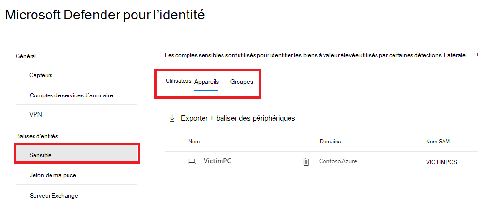

# Balises d’entité Defender for Identity dans Microsoft 365 Defender

**S’applique à :**

- Microsoft 365 Defender
- Defender pour l’identité

Cet article explique comment appliquer des [balises d’entité d’identité Microsoft Defender](/defender-for-identity) [dans Microsoft 365 Defender](/microsoft-365/security/defender/overview-security-center).

>[!IMPORTANT]
>Dans le cadre de la convergence avec Microsoft 365 Defender, certaines options et détails ont changé par rapport à leur emplacement dans le portail Defender pour l’identité. Veuillez lire les détails ci-dessous pour découvrir où trouver les fonctionnalités connues et nouvelles.

## Balises d'entités

Dans Microsoft 365 Defender, vous pouvez définir trois types de balises d’entité Defender pour l’identité : les balises sensibles, les balises **Honeytoken** et les balises **Exchange serveur.**

Pour définir ces balises, dans [Microsoft 365 Defender](https://security.microsoft.com/), allez à **Paramètres** puis **Identités**.

Les paramètres de balise apparaissent sous les **balises d’entité.**

Pour définir chaque type de balise, suivez les instructions ci-dessous.

## Balises sensibles

La **balise Sensitive permet** d’identifier les ressources à valeur élevée. Le chemin de déplacement latéral repose également sur l’état de sensibilité d’une entité. Certaines entités sont considérées comme sensibles automatiquement par Defender for Identity. Pour obtenir la liste de ces biens, voir [Entités sensibles.](/defender-for-identity/manage-sensitive-honeytoken-accounts#sensitive-entities)

Vous pouvez également marquer manuellement les utilisateurs, les appareils ou les groupes comme sensibles.

1. Sélectionnez **Sensible**. Vous verrez ensuite les **utilisateurs,** périphériques et groupes sensibles **existants.** 

    

1. Sous chaque catégorie, **sélectionnez Balise...** pour baliser ce type d’entité. Par exemple, sous **Groupes,** sélectionnez **Groupes de balises.** Un volet s’ouvre avec les groupes que vous pouvez sélectionner pour baliser. Pour rechercher un groupe, entrez son nom dans la zone de recherche.

    

1. Sélectionnez votre groupe, puis cliquez sur **Ajouter une sélection.**

    

## Balises Honeytoken

Les entités honeytoken sont utilisées comme des captures pour les acteurs malveillants. Toute authentification associée à ces entités honeytoken déclenche une alerte.

Vous pouvez marquer des utilisateurs ou des appareils avec la balise **Honeytoken** de la même façon que vous balisez des comptes sensibles.

1. Sélectionnez **Honeytoken**. Vous verrez ensuite les utilisateurs et appareils « honeytoken **»** **existants.**

    

1. Sous chaque catégorie, **sélectionnez Balise...** pour baliser ce type d’entité. Par exemple, sous **Utilisateurs,** sélectionnez **Utilisateurs de balise.** Un volet s’ouvre avec les groupes que vous pouvez sélectionner pour baliser. Pour rechercher un groupe, entrez son nom dans la zone de recherche.

    

1. Sélectionnez votre utilisateur, puis cliquez sur **Ajouter une sélection.**

    

## Exchange balises de serveur

Defender for Identity considère les serveurs Exchange comme des ressources à valeur élevée et les balise automatiquement comme **sensibles.** Vous pouvez également marquer manuellement les appareils comme Exchange serveurs.

1. Sélectionnez **Exchange serveur.** Vous verrez ensuite les appareils existants étiquetés avec la **balise Exchange serveur.**

    

1. Pour baliser un appareil en tant que serveur Exchange, sélectionnez **Appareils de balise.**  Un volet s’ouvre avec les appareils que vous pouvez sélectionner pour baliser. Pour rechercher un appareil, entrez son nom dans la zone de recherche.

    

1. Sélectionnez votre appareil, puis cliquez sur **Ajouter une sélection.**

    

## Voir aussi

- [Gérer les alertes de sécurité De Defender pour l’identité](manage-security-alerts.md)
