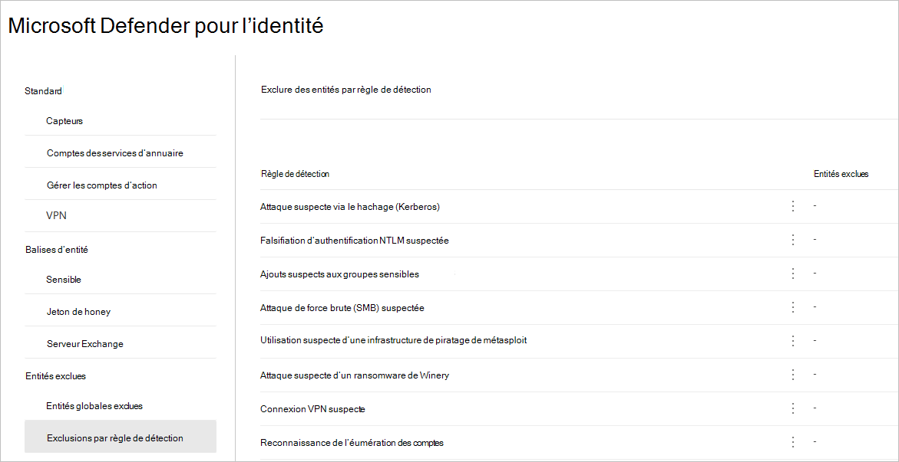
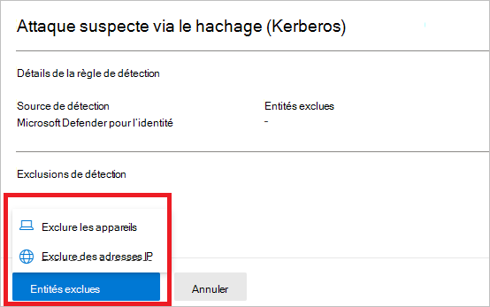
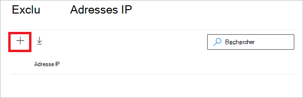
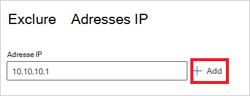
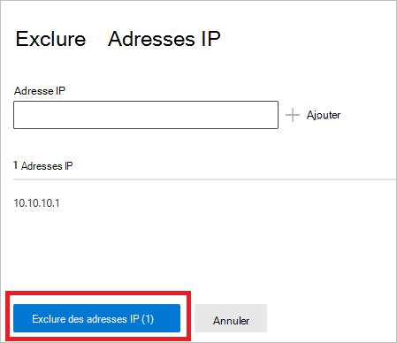
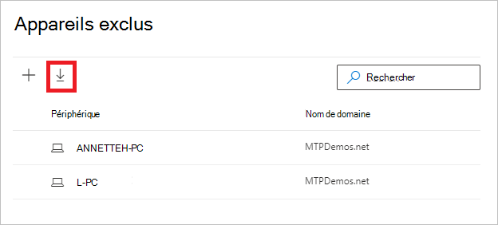
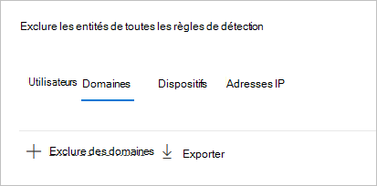
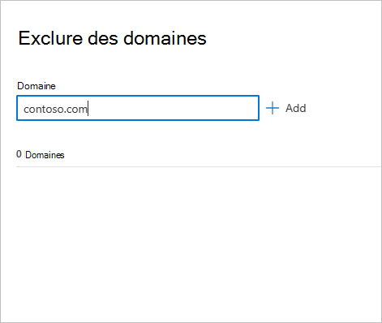
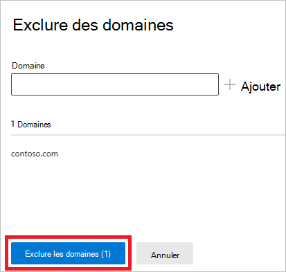
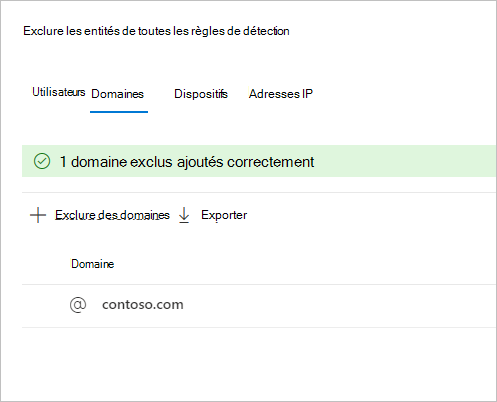

# Configurer Defender pour les exclusions de détection d’identité dans Microsoft 365 Defender (aperçu)

**S’applique à :**

- Microsoft 365 Defender
- Defender pour l’identité

Cet article explique comment configurer Microsoft Defender pour les exclusions de détection [d’identité](/defender-for-identity) [dans Microsoft 365 Defender](/microsoft-365/security/defender/overview-security-center).

> [!IMPORTANT]
> Dans le cadre de la convergence avec Microsoft 365 Defender, certaines options et détails ont changé par rapport à leur emplacement dans le portail Defender for Identity. Veuillez lire les détails ci-dessous pour découvrir où trouver les fonctionnalités connues et nouvelles.

[!INCLUDE [Product long](includes/product-long.md)] permet l’exclusion d’adresses IP, d’ordinateurs, de domaines ou d’utilisateurs spécifiques d’un certain nombre de détections.

Par exemple, une alerte **de reconnaissance DNS** peut être déclenchée par un scanneur de sécurité qui utilise DNS comme mécanisme d’analyse. La création d’une exclusion permet à Defender for Identity d’ignorer ces scanneurs et de réduire les faux positifs.

>[!NOTE]
>Parmi les domaines les plus courants avec une communication suspecte sur les alertes [DNS](/defender-for-identity/exfiltration-alerts#suspicious-communication-over-dns-external-id-2031) ouvertes sur ces domaines, nous avons observé les domaines les plus exclus de l’alerte par les clients. Ces domaines sont ajoutés à la liste d’exclusions par défaut, mais vous avez la possibilité de les supprimer facilement.

## Comment ajouter des exclusions de détection

1. In [Microsoft 365 Defender](https://security.microsoft.com/), go to **Paramètres** and then **Identities**.

    

1. Vous verrez ensuite les **entités exclues** dans le menu de gauche.

    

Vous pouvez ensuite définir des exclusions par deux méthodes : **exclusions par** règle de détection et entités **exclues globales**.

## Exclusions par règle de détection

1. Dans le menu de gauche, sélectionnez **Exclusions par règle de détection.** Vous verrez une liste de règles de détection.

    

1. Pour chaque détection que vous souhaitez configurer, vous devez suivre les étapes suivantes :

    1. Sélectionnez la règle. Vous pouvez rechercher des détections à l’aide de la barre de recherche. Une fois sélectionné, un volet s’ouvre avec les détails de la règle de détection.

        

    1. Pour ajouter une exclusion, sélectionnez le bouton **Entités exclues,** puis choisissez le type d’exclusion. Différentes entités exclues sont disponibles pour chaque règle. Elles incluent les utilisateurs, les appareils, les domaines et les adresses IP. Dans cet exemple, les choix possibles sont **Exclure des appareils** et **Exclure des adresses IP.**

        

    1. Après avoir choisi le type d’exclusion, vous pouvez ajouter l’exclusion. Dans le volet qui s’ouvre, sélectionnez le **+** bouton pour ajouter l’exclusion.

        

    1. Ajoutez ensuite l’entité à exclure. Sélectionnez **+ Ajouter** pour ajouter l’entité à la liste.

        

    1. Sélectionnez **Ensuite Exclure les adresses IP** (dans cet exemple) pour terminer l’exclusion.

        

    1. Une fois que vous avez ajouté des exclusions, vous pouvez exporter la liste ou supprimer les exclusions en revenant au bouton **Entités exclues.** Dans cet exemple, nous avons renvoyé à **Exclure les appareils**. Pour exporter la liste, sélectionnez la flèche vers le bas.

        

    1. Pour supprimer une exclusion, sélectionnez-la et sélectionnez l’icône corbeille.

        

## Entités exclues globales

Vous pouvez désormais également configurer des exclusions par des entités **exclues globales.** Les exclusions globales vous permettent de définir certaines entités (adresses IP, sous-réseaux, périphériques ou domaines) à exclure de toutes les détections de Defender for Identity. Par exemple, si vous excluez un appareil, il s’applique uniquement aux détections qui ont une identification d’appareil dans le cadre de la détection.

1. Dans le menu de gauche, sélectionnez **Entités exclues globales.** Vous verrez les catégories d’entités que vous pouvez exclure.

    

1. Choisissez un type d’exclusion. Dans cet exemple, nous avons sélectionné **Exclure des domaines.**

    

1. Un volet s’ouvre et vous permet d’ajouter un domaine à exclure. Ajoutez le domaine que vous souhaitez exclure.

    

1. Le domaine est ajouté à la liste. Sélectionnez **Exclure des domaines** pour terminer l’exclusion.

    

1. Vous verrez ensuite le domaine dans la liste des entités à exclure de toutes les règles de détection. Vous pouvez exporter la liste ou supprimer les entités en les sélectionnant et en cliquant sur **le bouton** Supprimer.

    

## Articles associés

- [Gérer les alertes de sécurité De Defender pour l’identité](manage-security-alerts.md)
