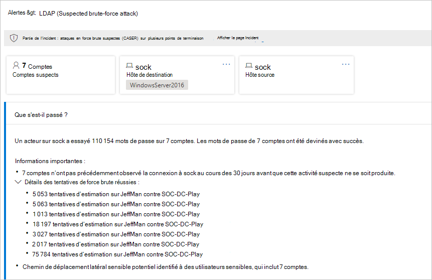
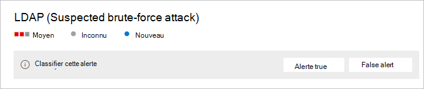
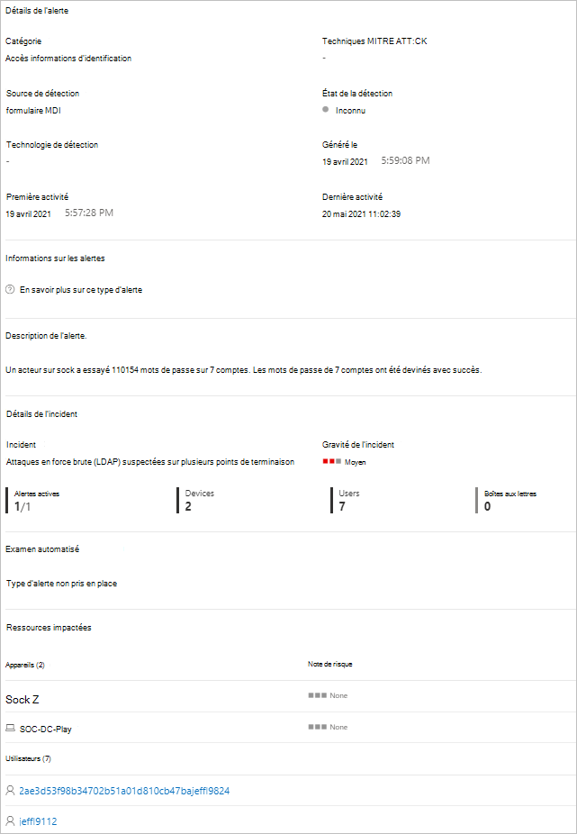
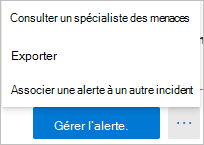

# Alertes de sécurité Defender for Identity dans Microsoft 365 Defender

**S’applique à :**

- Microsoft 365 Defender
- Defender pour l’identité

Cet article explique les principes de base de l’utilisation des alertes de sécurité [Microsoft Defender pour](/defender-for-identity) l’identité dans [Microsoft 365 Defender](/microsoft-365/security/defender/overview-security-center).

Les alertes Defender pour l’identité sont intégrées en Microsoft 365 Defender avec un format de page d’alerte d’identité dédié.  Il s’agit de la première étape du parcours d’introduction de l’expérience [Microsoft Defender pour l’identité](/defender-for-identity/defender-for-identity-in-microsoft-365-defender)complète dans Microsoft 365 Defender .

La nouvelle page d’alerte d’identité offre aux clients Microsoft Defender for Identity un meilleur enrichissement de signal entre domaines et de nouvelles fonctionnalités de réponse automatisée aux identités. Il garantit que vous restez sécurisé et contribue à améliorer l’efficacité de vos opérations de sécurité.

L’un des avantages de l’examen des alertes via [Microsoft 365 Defender](/microsoft-365/security/defender/microsoft-365-defender) est que les alertes Microsoft Defender pour l’identité sont davantage corrélées avec les informations obtenues à partir de chacun des autres produits de la suite. Ces alertes améliorées sont cohérentes avec les autres formats Microsoft 365 Defender d’alerte provenant de [Microsoft Defender](/microsoft-365/security/office-365-security) pour Office 365 et Microsoft Defender pour le point [de terminaison.](/microsoft-365/security/defender-endpoint) La nouvelle page élimine efficacement la nécessité d’accéder à un autre portail de produits pour examiner les alertes associées à l’identité.

Les alertes provenant de Defender for Identity peuvent désormais déclencher les fonctionnalités d’investigation et de réponse automatisées [(AIR)](/microsoft-365/security/defender/m365d-autoir) de Microsoft 365 Defender, notamment la correction automatique des alertes et l’atténuation des outils et processus qui peuvent contribuer à l’activité suspecte.

> [!IMPORTANT]
> Dans le cadre de la convergence avec Microsoft 365 Defender, certaines options et détails ont changé par rapport à leur emplacement dans le portail Defender pour l’identité. Veuillez lire les détails ci-dessous pour découvrir où trouver les fonctionnalités connues et nouvelles.

## Passer en revue les alertes de sécurité

Les alertes sont accessibles à partir de plusieurs emplacements, y compris la page **Alertes,** la page **Incidents,** les pages des appareils individuels **et** à partir de la page **de** recherche avancée. Dans cet exemple, nous allons passer en revue la **page Alertes.**

In <a href="https://go.microsoft.com/fwlink/p/?linkid=2077139" target="_blank">Microsoft 365 Defender</a>, go to **Incidents & alerts** and then to **Alerts**.

Pour voir les alertes de Defender pour l’identité, dans le haut à droite, sélectionnez **Filtre,** puis sous Sources de **service,** sélectionnez **Microsoft Defender pour** l’identité, puis sélectionnez **Appliquer**:

Les alertes sont affichées avec des informations dans les **colonnes suivantes** **:** Nom de l’alerte , **Balises**, **Gravité** **,** État de l’enquête , État , **Catégorie**, **Source** de détection **,** Ressources impactées , Première activité et Dernière **activité**. 

## Gérer des alertes

Si vous cliquez sur le nom **de** l’alerte pour l’une des alertes, vous allez sur la page avec des détails sur l’alerte. Dans le volet gauche, vous verrez un résumé de ce **qui s’est passé**:

Au-dessus de la zone Ce **qui s’est** passé se sont des boutons pour les **comptes,** l’hôte **de destination** et l’hôte **source** de l’alerte. Pour d’autres alertes, vous pouvez voir des boutons pour plus d’informations sur les hôtes supplémentaires, les comptes, les adresses IP, les domaines et les groupes de sécurité. Sélectionnez l’une d’elles pour obtenir plus de détails sur les entités impliquées.

Dans le volet droit, vous verrez les détails de **l’alerte.** Vous pouvez y voir plus de détails et effectuer plusieurs tâches :

- **Classifier cette alerte** : vous pouvez ici désigner cette alerte comme alerte **True** ou **False**

    

- **État de l’alerte** - Dans **Définir la classification,** vous pouvez classer l’alerte comme **True** ou **False**. Dans **Assigné à**, vous pouvez affecter l’alerte à vous-même ou la désattribuer.

    

- **Détails** de l’alerte : sous **Détails** de l’alerte, vous trouverez plus d’informations sur l’alerte spécifique, suivez un lien vers la documentation sur le type d’alerte, consultez l’incident auquel l’alerte est associée, examinez les enquêtes automatisées liées à ce type d’alerte et consultez les appareils et les utilisateurs touchés.

    

- **Commentaires &'historique** : vous pouvez ajouter vos commentaires à l’alerte et consulter l’historique de toutes les actions associées à l’alerte.

    

- **Gérer l’alerte** : si vous sélectionnez **Gérer** l’alerte, vous allez dans un volet qui vous permettra de modifier les :
  - **État** : vous pouvez choisir **Nouveau,** **Résolu** ou **En cours**.
  - **Classification** : vous pouvez choisir une **alerte True ou** **False.**
  - **Commentaire** : vous pouvez ajouter un commentaire sur l’alerte.

    Si vous sélectionnez les trois points à côté de Gérer l’alerte, vous pouvez consulter un **expert** en **menaces,** exporter l’alerte vers un fichier Excel ou établir un lien vers **un autre incident.**

    

    > [!NOTE]
    > Dans le Excel, deux liens sont désormais disponibles : Afficher dans **Microsoft Defender** pour l’identité et **l’affichage dans Microsoft 365 Defender**. Chaque lien vous permet d’être sur le portail approprié et d’y fournir des informations sur l’alerte.

## Voir aussi

- [Examiner les alertes dans Microsoft 365 Defender](../defender/investigate-alerts.md)
