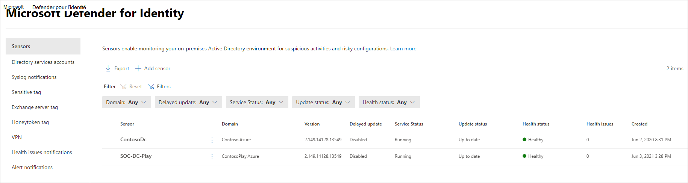
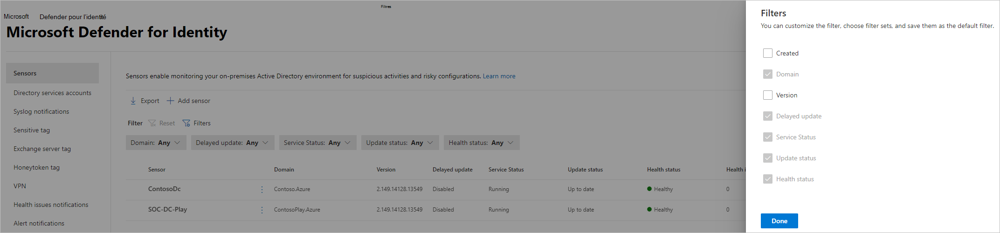

# Microsoft Defender pour Identity l’intégrité et les paramètres du capteur dans Microsoft 365 Defender

**S’applique à :**

- Microsoft 365 Defender
- Defender pour l’identité

Cet article explique comment configurer et surveiller des capteurs [Microsoft Defender pour Identity](/defender-for-identity) dans [Microsoft 365 Defender](/microsoft-365/security/defender/overview-security-center).

>[!IMPORTANT]
>Dans le cadre de la convergence avec Microsoft 365 Defender, certaines options et détails ont changé à partir de leur emplacement dans le portail Defender pour Identity. Lisez les détails ci-dessous pour découvrir où trouver les fonctionnalités familières et nouvelles.

## Afficher les paramètres et l’état du capteur Defender pour Identity

1. Dans <a href="https://go.microsoft.com/fwlink/p/?linkid=2077139" target="_blank">Microsoft 365 Defender</a>, accédez aux **paramètres**, puis **aux identités**.

   :::image type="content" source="../../media/defender-identity/settings-identities.png" alt-text="Option d’identités dans la page Paramètres" lightbox="../../media/defender-identity/settings-identities.png":::

1. Sélectionnez la page **Capteurs** , qui affiche tous vos capteurs Defender pour Identity. Pour chaque capteur, vous verrez son nom, son appartenance au domaine, le numéro de version, si les mises à jour doivent être retardées, l’état du service, l’état de mise à jour, l’état d’intégrité, le nombre de problèmes d’intégrité et la date de création du capteur.

    

    >[!NOTE]
    >Dans le portail Defender pour Identity, les paramètres du capteur et les informations d’intégrité se trouvaient à des emplacements distincts. Notez que dans Microsoft 365 Defender ils sont maintenant sur la même page.

1. Si vous sélectionnez **Filtres**, vous pouvez choisir les filtres qui seront disponibles. Ensuite, avec chaque filtre, vous pouvez choisir les capteurs à afficher.

    

    :::image type="content" source="../../media/defender-identity/filtered-sensor.png" alt-text="Capteur filtré" lightbox="../../media/defender-identity/filtered-sensor.png":::

1. Si vous sélectionnez l’un des capteurs, un volet s’affiche avec des informations sur le capteur et son état d’intégrité.

    

1. Si vous sélectionnez l’un des problèmes d’intégrité, vous obtenez un volet contenant plus de détails à leur sujet. Si vous choisissez un problème fermé, vous pouvez le rouvrir à partir d’ici.

   :::image type="content" source="../../media/defender-identity/issue-details.png" alt-text="Détails du problème" lightbox="../../media/defender-identity/issue-details.png":::
    

1. Si vous sélectionnez **Gérer le capteur**, un volet s’ouvre dans lequel vous pouvez configurer les détails du capteur.

   :::image type="content" source="../../media/defender-identity/manage-sensor.png" alt-text="Option Gérer le capteur" lightbox="../../media/defender-identity/manage-sensor.png":::

   :::image type="content" source="../../media/defender-identity/configure-sensor-details.png" alt-text="Page sur laquelle vous configurez les paramètres du capteur" lightbox="../../media/defender-identity/configure-sensor-details.png":::

1. Dans la page **Capteurs** , vous pouvez exporter votre liste de capteurs vers un fichier .csv en sélectionnant **Exporter**.

   :::image type="content" source="../../media/defender-identity/export-sensors.png" alt-text="Liste d’exportation des capteurs" lightbox="../../media/defender-identity/export-sensors.png":::

## Ajouter un capteur

À partir de la page **Capteurs** , vous pouvez ajouter un nouveau capteur.

1. Sélectionnez **Ajouter un capteur**.

   :::image type="content" source="../../media/defender-identity/add-sensor.png" alt-text="Option Ajouter un capteur" lightbox="../../media/defender-identity/add-sensor.png":::

1. Un volet s’ouvre et vous fournit un bouton pour télécharger le programme d’installation du capteur et une clé d’accès générée.

   :::image type="content" source="../../media/defender-identity/installer-access-key.png" alt-text="Options pour télécharger le programme d’installation et régénérer la clé" lightbox="../../media/defender-identity/installer-access-key.png":::

1. Sélectionnez **Télécharger le programme d’installation** pour enregistrer le package localement. Le fichier zip inclut les fichiers suivants :

    - Programme d’installation du capteur Defender pour Identity

    - Fichier de paramètre de configuration avec les informations requises pour se connecter au service cloud Defender pour Identity

1. Copiez la **clé Access**. La clé d’accès est requise pour que le capteur Defender pour Identity se connecte à votre instance Defender pour Identity. La clé d’accès est un mot de passe unique pour le déploiement du capteur, après quoi toutes les communications sont effectuées à l’aide de certificats pour l’authentification et le chiffrement TLS. Utilisez le bouton **Régénérer la clé** si vous avez besoin de régénérer la nouvelle clé d’accès. Il n’affecte aucun capteur précédemment déployé, car il est utilisé uniquement pour l’inscription initiale du capteur.

1. Copiez le package sur le serveur dédié ou le contrôleur de domaine sur lequel vous installez le capteur Defender pour Identity.

## Voir aussi

- [Gérer les alertes de sécurité Defender pour Identity](manage-security-alerts.md)
