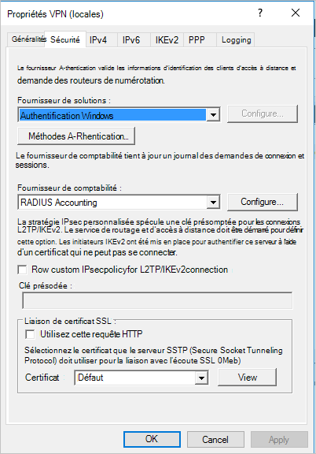
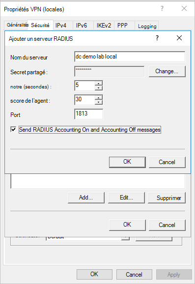
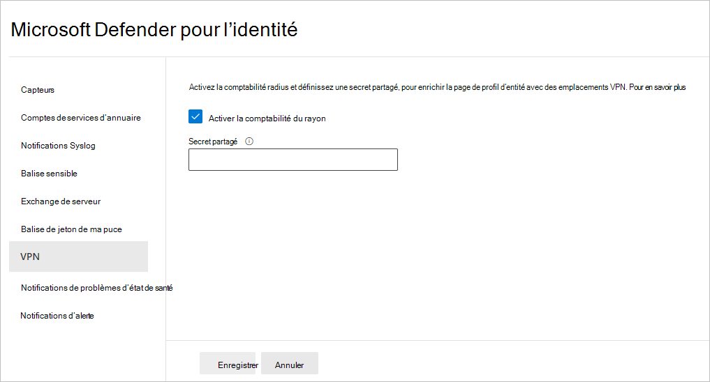

# Intégration VPN De Defender pour l’identité dans Microsoft 365 Defender

**S’applique à :**

- Microsoft 365 Defender
- Defender pour l’identité

Cet article explique comment intégrer un VPN à [Microsoft Defender pour l’identité](/defender-for-identity) [dans Microsoft 365 Defender](/microsoft-365/security/defender/overview-security-center).

>[!IMPORTANT]
>Dans le cadre de la convergence avec <a href="https://go.microsoft.com/fwlink/p/?linkid=2077139" target="_blank">Microsoft 365 Defender</a>, certaines options et détails ont changé par rapport à leur emplacement dans le portail Defender pour l’identité. Veuillez lire les détails ci-dessous pour découvrir où trouver les fonctionnalités connues et nouvelles.

[!INCLUDE [Product long](includes/product-long.md)] peut collecter des informations de comptabilité à partir de solutions VPN. Lorsque la page de profil de l’utilisateur est configurée, elle inclut les informations des connexions VPN, telles que les adresses IP et les emplacements d’origine des connexions. Ce processus complète l’examen en fournissant des informations supplémentaires sur l’activité des utilisateurs, ainsi qu’une nouvelle détection des connexions VPN anormales. L’appel de résolution d’une adresse IP externe à un emplacement est anonyme. Aucun identificateur personnel n’est envoyé dans cet appel.

[!INCLUDE [Product short](includes/product-short.md)] s’intègre à votre solution VPN en écouteant les événements de comptabilité RADIUS transmis aux capteurs [!INCLUDE [Product short](includes/product-short.md)] . Ce mécanisme est basé sur la comptabilité RADIUS standard ([RFC 2866](https://tools.ietf.org/html/rfc2866)) et les fournisseurs VPN suivants sont pris en charge :

- Microsoft
- F5
- Point de contrôle
- Cisco ASA

## Configuration requise

Pour activer l’intégration VPN, veillez à définir les paramètres suivants :

- Ouvrez le port UDP 1813 sur vos [!INCLUDE [Product short](includes/product-short.md)] capteurs et/ou [!INCLUDE [Product short](includes/product-short.md)] capteurs autonomes.

> [!NOTE]
>
> - En **activant Radius Accounting**, [!INCLUDE [Product short](includes/product-short.md)] le capteur active une stratégie de pare-feu **[!INCLUDE [Product long](includes/product-long.md)]** Windows pré-mise en service appelée Capteur pour autoriser la comptabilité RADIUS entrante sur le port UDP 1813.
> - L’intégration VPN n’est pas prise en charge dans les environnements respectant les normes FIPS (Federal Information Processing Standards)

L’exemple ci-dessous utilise Le routage Microsoft et le serveur d’accès à distance (RRAS) pour décrire le processus de configuration VPN.

Si vous utilisez une solution VPN tierce, consultez leur documentation pour obtenir des instructions sur la façon d’activer la comptabilité RADIUS.

## Configurer la comptabilité RADIUS sur le système VPN

Effectuez les étapes suivantes sur votre serveur RRAS.

1. Ouvrez **la console Routage et accès** à distance.
1. Cliquez avec le bouton droit sur le nom du serveur et sélectionnez **Propriétés**.
1. Dans **l’onglet Sécurité** , sous **Fournisseur de comptabilité**, sélectionnez **Radius Accounting** et **Configure**.

    

1. Dans la **fenêtre Ajouter un serveur RADIUS** , tapez le nom **du** [!INCLUDE [Product short](includes/product-short.md)] serveur du capteur le plus proche (qui dispose d’une connectivité réseau). Pour la haute disponibilité, vous pouvez ajouter des capteurs [!INCLUDE [Product short](includes/product-short.md)] supplémentaires en tant que serveurs RADIUS. Sous **Port**, assurez-vous que la valeur par défaut de 1813 est configurée. **Sélectionnez Modifier** et tapez une nouvelle chaîne secrète partagée de caractères alphanumériques. Notez la nouvelle chaîne secrète partagée, car vous devrez la remplir ultérieurement pendant la [!INCLUDE [Product short](includes/product-short.md)] configuration. Cochez **la case Envoyer un compte RADIUS et tenir compte des messages** et sélectionnez **OK** dans toutes les boîtes de dialogue ouvertes.

    

## Configurer vpn dans Defender pour l’identité

[!INCLUDE [Product short](includes/product-short.md)] collecte des données VPN qui permettent de profiler les emplacements à partir des lesquels les ordinateurs se connectent au réseau et de détecter les connexions VPN suspectes.

Pour configurer les données VPN dans [!INCLUDE [Product short](includes/product-short.md)] Microsoft 365 Defender :

1. Dans <a href="https://go.microsoft.com/fwlink/p/?linkid=2077139" target="_blank">Microsoft 365 Defender</a>, go to **Paramètres** and then **Identities**.

    

1. Sélectionnez **VPN**.
1. **Sélectionnez Activer la comptabilité du** rayon, puis tapez la secret **partagé** que vous avez configurée précédemment sur votre serveur VPN RRAS. Sélectionnez **Enregistrer**.

    

Une fois cette opération activée, tous les capteurs Defender for Identity écoutent le port 1813 pour les événements de comptabilité RADIUS, et votre configuration VPN est terminée.

Une fois que le capteur Defender pour l’identité a reçu les événements VPN et les a envoyés au service cloud de Defender for Identity pour traitement, le profil d’entité indique des emplacements VPN et des activités VPN distincts dans le profil indiquent les emplacements.

## Voir aussi

- [Examiner les alertes dans Microsoft 365 Defender](../defender/investigate-alerts.md)
