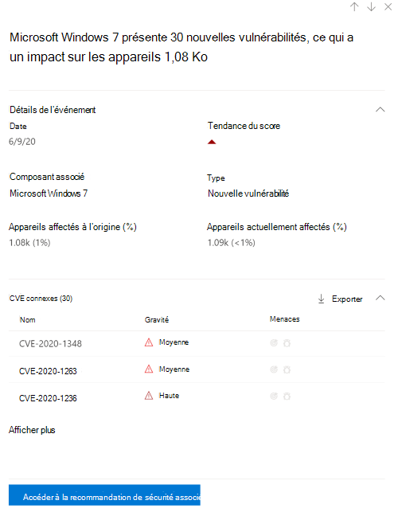

# Chronologie des événements 

[!INCLUDE [Microsoft 365 Defender rebranding](../../includes/microsoft-defender.md)]

**S’applique à :**

- [Microsoft Defender pour point de terminaison Plan 2](https://go.microsoft.com/fwlink/?linkid=2154037)
- [Gestion des vulnérabilités de Microsoft Defender](index.yml)
- [Microsoft 365 Defender](https://go.microsoft.com/fwlink/?linkid=2118804)

[!include[Prerelease information](../../includes/prerelease.md)]

>[!Note]
> Vous voulez découvrir Gestion des vulnérabilités Microsoft Defender ? En savoir plus sur la façon dont vous pouvez vous inscrire à la [Gestion des vulnérabilités Microsoft Defender préversion publique](../defender-vulnerability-management/get-defender-vulnerability-management.md).

La chronologie des événements est un flux d’actualités sur les risques qui vous aide à interpréter la façon dont le risque est introduit dans l’organisation par le biais de nouvelles vulnérabilités ou d’exploits. Vous pouvez afficher les événements susceptibles d’avoir un impact sur le risque de votre organisation. Par exemple, vous pouvez trouver de nouvelles vulnérabilités qui ont été introduites, des vulnérabilités qui sont devenues exploitables, des exploits qui ont été ajoutés à un kit d’exploitation, et bien plus encore.

La chronologie des événements raconte également l’histoire de votre [score d’exposition](tvm-exposure-score.md) et du [degré de sécurisation Microsoft pour les appareils afin](tvm-microsoft-secure-score-devices.md) que vous puissiez déterminer la cause des modifications importantes. Les événements peuvent avoir un impact sur vos appareils ou votre score pour les appareils. Réduisez votre exposition en traitant ce qui doit être corrigé en fonction des [recommandations de sécurité](tvm-security-recommendation.md) hiérarchisées.

> [!TIP]
> Pour obtenir des e-mails sur les nouveaux événements de vulnérabilité, consultez [Configurer les notifications par e-mail de vulnérabilité dans Microsoft Defender pour point de terminaison](../defender-endpoint/configure-email-notifications.md)

## Accéder à la page Chronologie des événements

Il existe également trois points d’entrée du [tableau de bord Gestion des vulnérabilités Microsoft Defender](tvm-dashboard-insights.md) :

- **Carte de score d’exposition de l’organisation** : pointez sur les points d’événement dans le graphique « Score d’exposition au fil du temps », puis sélectionnez « Afficher tous les événements de ce jour ». Les événements représentent des vulnérabilités logicielles.
- **Score de sécurité Microsoft pour les appareils** : pointez sur les points d’événement dans le graphique « Votre score pour les appareils au fil du temps », puis sélectionnez « Afficher tous les événements de cette journée ». Les événements représentent de nouvelles évaluations de configuration.
- **Carte des événements supérieurs** : sélectionnez « Afficher plus » en bas de la table des événements supérieurs. La carte affiche les trois événements les plus marquants des 7 derniers jours. Les événements impactants peuvent inclure si l’événement affecte un grand nombre d’appareils ou s’il s’agit d’une vulnérabilité critique.

### Score d’exposition et score de sécurité Microsoft pour les graphiques d’appareils

Dans le tableau de bord Gestion des vulnérabilités Defender, pointez sur le graphique du score d’exposition pour afficher les principaux événements de vulnérabilité logicielle de ce jour qui ont impacté vos appareils. Pointez sur le graphique Score de sécurité Microsoft pour appareils pour afficher les nouvelles évaluations de configuration de sécurité qui affectent votre score.

S’il n’y a aucun événement qui affecte vos appareils ou votre score pour les appareils, aucun n’est affiché.

 

### Explorer les événements de ce jour-là

Si vous sélectionnez **Afficher tous les événements de ce jour** , vous accédez à la page Chronologie des événements avec une plage de dates personnalisée pour ce jour.

Sélectionnez **Plage personnalisée** pour remplacer la plage de dates par une autre plage personnalisée ou une plage de temps prédéfin laquelle est définie.

## Vue d’ensemble de la chronologie des événements

Dans la page Chronologie des événements, vous pouvez afficher toutes les informations nécessaires relatives à un événement.

Fonctionnalités :

- Personnaliser des colonnes
- Filtrer par type d’événement ou pourcentage d’appareils impactés
- Afficher 30, 50 ou 100 éléments par page

Les deux grands nombres en haut de la page indiquent le nombre de nouvelles vulnérabilités et de vulnérabilités exploitables, et non les événements. Certains événements peuvent avoir plusieurs vulnérabilités, et certaines vulnérabilités peuvent avoir plusieurs événements.

### Colonnes

- **Date** : mois, jour, année
- **Événement** : événement impactant, y compris le composant, le type et le nombre d’appareils impactés
- **Composant associé** : logiciel
- **Appareils affectés à l’origine** : nombre et pourcentage d’appareils affectés lorsque cet événement s’est produit à l’origine. Vous pouvez également filtrer selon le pourcentage d’appareils affectés à l’origine, par rapport au nombre total d’appareils.
- **Appareils actuellement affectés** : le nombre actuel et le pourcentage d’appareils actuellement affectés par cet événement. Vous pouvez trouver ce champ en sélectionnant **Personnaliser les colonnes**.
- **Types** : reflètent les événements horodatages qui ont un impact sur le score. Ils peuvent être filtrés.
  - Exploit ajouté à un kit exploit
  - Exploit a été vérifié
  - Nouvel exploit public
  - Nouvelle vulnérabilité
  - Nouvelle évaluation de la configuration
- **Tendance du score** : tendance du score d’exposition

### Icônes

Les icônes suivantes s’affichent en regard des événements :

-  Nouvel exploit public
-  Une nouvelle vulnérabilité a été publiée
-  Exploit trouvé dans exploit kit
-  Exploit vérifié

### Descendre dans l’exploration jusqu’à un événement spécifique

Une fois que vous avez sélectionné un événement, un menu volant s’affiche avec une liste des détails et des CVE actuels qui affectent vos appareils. Vous pouvez afficher d’autres CVE ou afficher la recommandation associée.

La flèche ci-dessous « tendance du score » vous permet de déterminer si cet événement a potentiellement déclenché ou réduit le score d’exposition de votre organisation. Un score d’exposition plus élevé signifie que les appareils sont plus vulnérables à l’exploitation.

À partir de là, sélectionnez **Accéder à la recommandation de sécurité associée** pour afficher la recommandation qui résout la nouvelle vulnérabilité logicielle dans la [page recommandations de sécurité](tvm-security-recommendation.md). Après avoir lu la description et les détails de la vulnérabilité dans la recommandation de sécurité, vous pouvez envoyer une demande de correction et suivre la demande dans la [page de correction](tvm-remediation.md).

## Afficher les chronologies des événements dans les pages logicielles

Pour ouvrir une page de logiciels, sélectionnez un événement > sélectionnez le nom du logiciel avec lien hypertexte (comme Visual Studio 2017) dans la section appelée « Composant associé » dans le menu volant. [En savoir plus sur les pages logicielles](tvm-software-inventory.md#software-pages)

Une page complète s’affiche avec tous les détails d’un logiciel spécifique. Placez la souris sur le graphique pour afficher la chronologie des événements pour ce logiciel spécifique.

Accédez à l’onglet Chronologie des événements pour afficher tous les événements liés à ce logiciel. Vous pouvez également voir les recommandations de sécurité, les vulnérabilités découvertes, les appareils installés et la distribution des versions.

## Voir aussi

- [Tableau de bord](tvm-dashboard-insights.md)
- [Score d'exposition](tvm-exposure-score.md)
- [Recommandations en matière de sécurité](tvm-security-recommendation.md)
- [Corriger des vulnérabilités](tvm-remediation.md)
- [Inventaire des logiciels](tvm-software-inventory.md)
