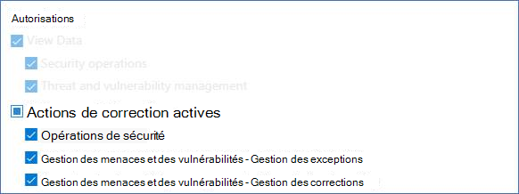
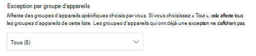
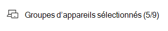
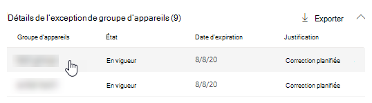
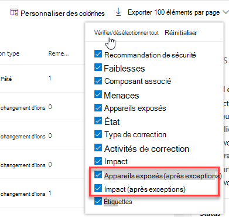

# Créer et afficher des exceptions pour les recommandations de sécurité

[!INCLUDE [Microsoft 365 Defender rebranding](../../includes/microsoft-defender.md)]

**S’applique à :**

- [Microsoft Defender pour point de terminaison Plan 2](https://go.microsoft.com/fwlink/?linkid=2154037)
- [Gestion des vulnérabilités de Microsoft Defender](index.yml)
- [Microsoft 365 Defender](https://go.microsoft.com/fwlink/?linkid=2118804)

[!include[Prerelease information](../../includes/prerelease.md)]

>[!Note]
> Vous voulez découvrir Gestion des vulnérabilités Microsoft Defender ? Mer informasjon sur la façon dont vous pouvez vous inscrire à la [Gestion des vulnérabilités Microsoft Defender préversion publique](../defender-vulnerability-management/get-defender-vulnerability-management.md).

En guise d’alternative à une demande de correction lorsqu’une recommandation n’est pas pertinente pour le moment, vous pouvez créer des exceptions pour les recommandations. Si votre organisation a des groupes d’appareils, vous pouvez étendre l’exception à des groupes d’appareils spécifiques. Des exceptions peuvent être créées pour les groupes d’appareils sélectionnés ou pour tous les groupes d’appareils passés et présents.

Lorsqu’une exception est créée pour une recommandation, la recommandation n’est pas active avant la fin de la durée de l’exception. L’état de la recommandation passe à **Exception complète** ou **Exception partielle** (par groupe d’appareils).

## Autorisations

Seuls les utilisateurs disposant d’autorisations de « gestion des exceptions » peuvent gérer les exceptions (y compris la création ou l’annulation). [Mer informasjon sur les rôles RBAC](../defender-endpoint/user-roles.md).

## Créer une exception

Sélectionnez une recommandation de sécurité pour laquelle vous souhaitez créer une exception, puis sélectionnez **Options d’exception** et remplissez le formulaire.

### Exception par groupe d’appareils

Appliquez l’exception à tous les groupes d’appareils actuels ou choisissez des groupes d’appareils spécifiques. Les groupes d’appareils futurs ne seront pas inclus dans l’exception. Les groupes d’appareils qui ont déjà une exception ne s’affichent pas dans la liste. Si vous sélectionnez uniquement certains groupes d’appareils, l’état de recommandation passe de « actif » à « exception partielle ». L’état passe à « exception complète » si vous sélectionnez tous les groupes d’appareils.

#### Vues filtrées

Si vous avez filtré par groupe d’appareils sur l’une des pages de gestion des vulnérabilités, seuls vos groupes d’appareils filtrés apparaissent en tant qu’options.

Il s’agit du bouton à filtrer par groupe d’appareils sur l’une des pages de gestion des vulnérabilités :

Vue d’exception avec des groupes d’appareils filtrés :

#### Grand nombre de groupes d’appareils

Si votre organisation compte plus de 20 groupes d’appareils, **sélectionnez Modifier** en regard de l’option de groupe d’appareils filtrée.

Un menu volant s’affiche dans lequel vous pouvez rechercher et choisir les groupes d’appareils que vous souhaitez inclure. Sélectionnez l’icône de coche sous Rechercher pour vérifier/décocher tout.

### Exceptions globales

Si vous disposez d’autorisations d’administrateur général, vous pourrez créer et annuler une exception globale. Elle affecte **tous les** groupes d’appareils actuels et futurs de votre organisation, et seul un utilisateur disposant d’autorisations similaires peut le modifier. L’état de la recommandation passe de « actif » à « exception complète ».

Voici quelques éléments à garder à l’esprit :

- Si une recommandation fait l’objet d’une exception globale, les exceptions nouvellement créées pour les groupes d’appareils sont suspendues jusqu’à ce que l’exception globale ait expiré ou ait été annulée. Après ce point, les nouvelles exceptions de groupe d’appareils entreront en vigueur jusqu’à leur expiration.
- Si une recommandation comporte déjà des exceptions pour des groupes d’appareils spécifiques et qu’une exception globale est créée, l’exception de groupe d’appareils est suspendue jusqu’à ce qu’elle expire ou que l’exception globale soit annulée avant son expiration.

### Justification

Sélectionnez votre justification pour l’exception que vous devez déposer au lieu de corriger la recommandation de sécurité en question. Renseignez le contexte de justification, puis définissez la durée de l’exception.

La liste suivante détaille les justifications derrière les options d’exception :

- **Contrôle tiers** - Un produit ou un logiciel tiers répond déjà à cette recommandation - Le choix de ce type de justification réduit votre score d’exposition et augmente votre degré de sécurisation, car votre risque est réduit
- **Autre atténuation** - Un outil interne répond déjà à cette recommandation - Le choix de ce type de justification réduit votre score d’exposition et augmente votre degré de sécurisation, car votre risque est réduit
- **Risque accepté** : pose un risque faible et/ou l’implémentation de la recommandation est trop coûteuse
- **Correction planifiée (grâce)** - Déjà planifiée, mais en attente d’exécution ou d’autorisation

## Afficher toutes les exceptions

Accédez à l’onglet **Exceptions** dans la page **Correction** . Vous pouvez filtrer par justification, type et état.

 Sélectionnez une exception pour ouvrir un menu volant avec plus de détails. Les exceptions par groupe d’appareils ont une liste de chaque groupe d’appareils couvert par l’exception, que vous pouvez exporter. Vous pouvez également afficher la recommandation associée ou annuler l’exception.

## Comment annuler une exception

Pour annuler une exception, accédez à l’onglet **Exceptions** dans la page **Correction** . Sélectionnez l’exception.

Pour annuler l’exception pour tous les groupes d’appareils ou pour une exception globale, sélectionnez le bouton **Annuler pour tous les groupes d’appareils** . Vous ne pourrez annuler que les exceptions pour les groupes d’appareils pour lesquels vous disposez d’autorisations.

### Annuler l’exception pour un groupe d’appareils spécifique

Sélectionnez le groupe d’appareils spécifique pour annuler l’exception pour celui-ci. Un menu volant s’affiche pour le groupe d’appareils, et vous pouvez sélectionner **Annuler l’exception**.

## Afficher l’impact après l’application d’exceptions

Dans la page Recommandations de sécurité, sélectionnez **Personnaliser les colonnes** et cochez les cases pour **les appareils exposés (après les exceptions)** et **Impact (après les exceptions).**

La colonne appareils exposés (après exceptions) affiche les autres appareils qui sont toujours exposés à des vulnérabilités après l’application d’exceptions. Les justifications d’exception qui affectent l’exposition incluent « contrôle tiers » et « atténuation alternative ». D’autres justifications ne réduisent pas l’exposition d’un appareil et sont toujours considérées comme exposées.

L’impact (après les exceptions) indique l’impact restant sur le score d’exposition ou le degré de sécurisation après l’application des exceptions. Les justifications d’exception qui affectent les scores incluent « contrôle tiers » et « atténuation alternative ». D’autres justifications ne réduisent pas l’exposition d’un appareil et, par conséquent, le score d’exposition et le degré de sécurisation ne changent pas.

## Voir aussi

- [Corriger des vulnérabilités](tvm-remediation.md)
- [Recommandations en matière de sécurité](tvm-security-recommendation.md)
- [Score d'exposition](tvm-exposure-score.md)
- [Niveau de sécurité Microsoft pour les appareils](tvm-microsoft-secure-score-devices.md)
