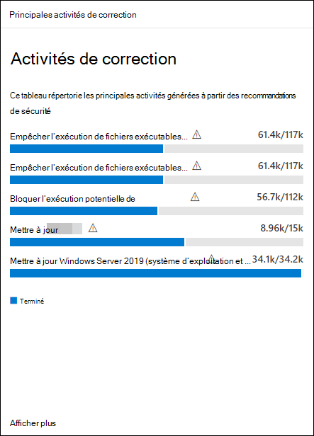

# Corriger des vulnérabilités

[!INCLUDE [Microsoft 365 Defender rebranding](../../includes/microsoft-defender.md)]

**S’applique à :**

- [Microsoft Defender pour point de terminaison Plan 2](https://go.microsoft.com/fwlink/?linkid=2154037)
- [Gestion des vulnérabilités de Microsoft Defender](index.yml)
- [Microsoft 365 Defender](https://go.microsoft.com/fwlink/?linkid=2118804)

[!include[Prerelease information](../../includes/prerelease.md)]

>[!Note]
> Vous voulez découvrir Gestion des vulnérabilités Microsoft Defender ? En savoir plus sur la façon dont vous pouvez vous inscrire à la [Gestion des vulnérabilités Microsoft Defender préversion publique](../defender-vulnerability-management/get-defender-vulnerability-management.md).

Regardez cette courte vidéo pour découvrir comment Gestion des vulnérabilités Microsoft Defender découvre les vulnérabilités et les erreurs de configuration sur vos points de terminaison et fournit des insights exploitables qui vous aident à corriger rapidement les menaces et les vulnérabilités dans votre environnement.

> [!VIDEO https://www.microsoft.com/en-us/videoplayer/embed/RE4qLVs]

## Demander une correction

Les fonctionnalités de gestion des vulnérabilités comblent l’écart entre la sécurité et les administrateurs informatiques par le biais du workflow de demande de correction. Les administrateurs de sécurité comme vous pouvez demander à l’administrateur informatique de corriger une vulnérabilité à partir des pages **de recommandation** pour Intune.

### Activer Microsoft Intune connexion

Pour utiliser cette fonctionnalité, activez vos connexions Microsoft Intune. Dans le portail Microsoft 365 Defender, **accédez aux fonctionnalités avancées** **générales** \> \> **des points de terminaison des paramètres**\>. Faites défiler vers le bas et recherchez **Microsoft Intune connexion**. Par défaut, le bouton bascule est désactivé. Activez le bouton bascule de votre **connexion Microsoft Intune****.**

**Remarque** : si la connexion Intune est activée, vous pouvez créer une tâche de sécurité Intune lors de la création d’une demande de correction. Cette option n’apparaît pas si la connexion n’est pas définie.

Pour plus d’informations, consultez [Utiliser Intune pour corriger les vulnérabilités identifiées par Microsoft Defender pour point de terminaison](/intune/atp-manage-vulnerabilities).

### Étapes de demande de correction

1. Accédez au menu de navigation **gestion des vulnérabilités** dans le portail Microsoft 365 Defender, puis sélectionnez [**Recommandations**](tvm-security-recommendation.md).

2. Sélectionnez une recommandation de sécurité pour laquelle vous souhaitez demander une correction, puis sélectionnez **Options de correction**.

3. Remplissez le formulaire, y compris les éléments pour lesquels vous demandez une correction, les groupes d’appareils applicables, la priorité, la date d’échéance et les notes facultatives.
    1. Si vous choisissez l’option de correction « attention requise », la sélection d’une date d’échéance n’est pas disponible, car il n’existe aucune action spécifique.

4. Sélectionnez **Envoyer une demande**. L’envoi d’une demande de correction crée un élément d’activité de correction dans la gestion des vulnérabilités, qui peut être utilisé pour surveiller la progression de la correction pour cette recommandation. Cela ne déclenche pas de correction ou n’applique aucune modification aux appareils.

5. Informez votre administrateur informatique de la nouvelle demande et demandez-lui de se connecter à Intune pour approuver ou rejeter la demande et démarrer un déploiement de package.

6. Accédez à la page [**Correction**](tvm-remediation.md) pour afficher l’état de votre demande de correction.

Si vous souhaitez vérifier comment le ticket s’affiche dans Intune, consultez [Utiliser Intune pour corriger les vulnérabilités identifiées par Microsoft Defender pour point de terminaison](/intune/atp-manage-vulnerabilities) pour plus d’informations.

> [!NOTE]
> Si votre demande implique la correction de plus de 10 000 appareils, nous ne pouvons envoyer que 10 000 appareils à Intune.

Une fois que les faiblesses de cybersécurité de votre organisation sont identifiées et mappées aux [recommandations de sécurité](tvm-security-recommendation.md) exploitables, commencez à créer des tâches de sécurité. Vous pouvez créer des tâches via l’intégration à Microsoft Intune où des tickets de correction sont créés.

Réduisez l’exposition de votre organisation aux vulnérabilités et augmentez votre configuration de sécurité en corrigeant les recommandations de sécurité.

## Afficher vos activités de correction

Lorsque vous envoyez une demande de correction à partir de la page Recommandations de sécurité, elle lance une activité de correction. Une tâche de sécurité est créée et peut être suivie sur une page **de correction**, et un ticket de correction est créé dans Microsoft Intune.

Si vous avez choisi l’option de correction « attention requise », il n’y aura aucune barre de progression, état du ticket ou date d’échéance, car il n’existe aucune action réelle que nous pouvons surveiller.

Une fois que vous êtes dans la page Correction, sélectionnez l’activité de correction que vous souhaitez afficher. Vous pouvez suivre les étapes de correction, suivre la progression, afficher la recommandation associée, exporter vers CSV ou marquer comme terminé.

:::image type="content" source="../../media/remediation-flyouteolswnew.png" lightbox="../../media/remediation-flyouteolswnew.png" alt-text="Exemple de page Correction, avec une activité de correction sélectionnée, et menu volant de cette activité répertoriant la description, les outils de gestion des services informatiques et des appareils, et la correction des appareils":::

> [!NOTE]
> Il existe une période de rétention de 180 jours pour les activités de correction terminées. Pour que la page Correction fonctionne de façon optimale, l’activité de correction sera supprimée 6 mois après sa fin.

### Terminé par colonne

Suivez qui a fermé l’activité de correction avec la colonne « Terminé par » dans la page Correction.

- **adresse Email** : adresse e-mail de la personne qui a effectué manuellement la tâche
- **Confirmation du système** : la tâche a été automatiquement terminée (tous les appareils corrigés)
- **N/A** : Les informations ne sont pas disponibles, car nous ne savons pas comment cette tâche plus ancienne a été effectuée

:::image type="content" alt-text="Créé par et complété par des colonnes avec deux lignes. Une ligne pour terminée par a un exemple d’e-mail, l’autre ligne indique la confirmation du système." source="../../media/defender-vulnerability-management/tvm-completed-by.png":::

### Principales activités de correction dans le tableau de bord

Affichez **les principales activités de correction** dans le [tableau **de bord gestion des vulnérabilités**](tvm-dashboard-insights.md). Sélectionnez l’une des entrées à accéder à la page **Correction** . Vous pouvez marquer l’activité de correction comme terminée une fois que l’équipe d’administration informatique a corrigé la tâche.

## Articles connexes

- [Tableau de bord](tvm-dashboard-insights.md)
- [Recommandations en matière de sécurité](tvm-security-recommendation.md)
