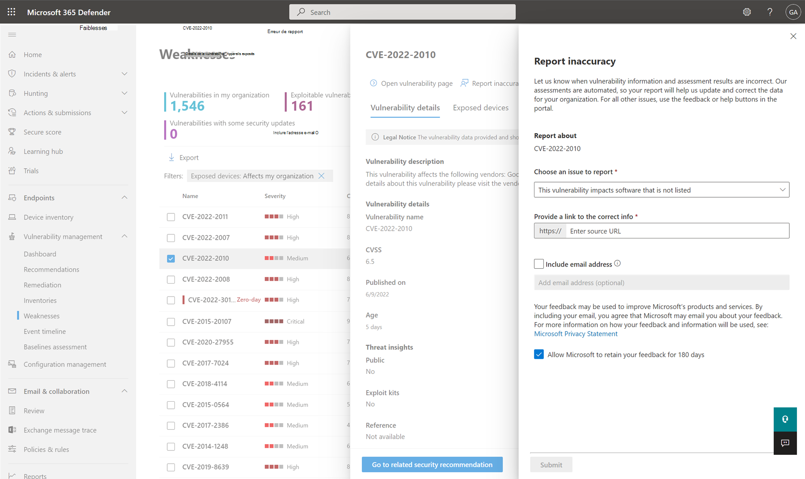

# Inventaire logiciel dans Gestion des vulnérabilités Defender

[!INCLUDE [Microsoft 365 Defender rebranding](../../includes/microsoft-defender.md)]

**S’applique à :**

- [Microsoft Defender pour point de terminaison Plan 2](https://go.microsoft.com/fwlink/?linkid=2154037)
- [Gestion des vulnérabilités de Microsoft Defender](index.yml)
- [Microsoft 365 Defender](https://go.microsoft.com/fwlink/?linkid=2118804)

[!include[Prerelease information](../../includes/prerelease.md)]

>[!Note]
> Vous voulez découvrir Gestion des vulnérabilités Microsoft Defender ? En savoir plus sur la façon dont vous pouvez vous inscrire à la [Gestion des vulnérabilités Microsoft Defender préversion publique](../defender-vulnerability-management/get-defender-vulnerability-management.md).

L’inventaire logiciel dans Defender Vulnerability Management est une liste de logiciels connus dans votre organisation. Le filtre par défaut sur la page d’inventaire logiciel affiche tous les [logiciels avec les énumérations de plateforme commune (CPE) officielles](https://nvd.nist.gov/products/cpe). La vue inclut des détails tels que le nom du fournisseur, le nombre de faiblesses, les menaces et le nombre d’appareils exposés.

Vous pouvez supprimer le filtre **disponible CPE** pour obtenir une visibilité supplémentaire et augmenter votre étendue de recherche sur tous les logiciels installés dans votre organisation. Cela signifie que tous les logiciels, y compris les logiciels sans CPE, s’affichent désormais dans la liste d’inventaire logiciel.

> [!NOTE]
> Comme les CPE sont utilisés par la gestion des vulnérabilités pour identifier les logiciels et les vulnérabilités, même si les produits logiciels sans CPE seront affichés dans la page d’inventaire logiciel, ils ne seront pas pris en charge par la gestion des vulnérabilités et des informations telles que, exploits, nombre d’appareils exposés et faiblesses ne seront pas disponibles pour eux.

## Mode de fonctionnement

Dans le domaine de la découverte, nous utilisons le même ensemble de signaux qui est responsable de la détection et de l’évaluation des vulnérabilités dans [Microsoft Defender pour point de terminaison fonctionnalités de détection et de réponse](../defender-endpoint/overview-endpoint-detection-response.md).

Étant donné qu’il s’agit d’un temps réel, en quelques minutes, vous verrez les informations de vulnérabilité au fur et à mesure qu’elles seront découvertes. Le moteur récupère automatiquement des informations à partir de plusieurs flux de sécurité. En fait, vous verrez si un logiciel particulier est connecté à une campagne de menaces en direct. Il fournit également un lien vers un rapport Analyse des menaces dès qu’il est disponible.

## Accéder à la page d’inventaire logiciel

Accédez à la page d’inventaire logiciel en sélectionnant **l’inventaire logiciel** dans le menu de navigation gestion des vulnérabilités dans le [portail Microsoft 365 Defender](../defender/microsoft-365-security-center-mde.md).

> [!NOTE]
> Si vous recherchez des logiciels à l’aide de la Microsoft Defender pour point de terminaison recherche globale, veillez à placer un trait de soulignement au lieu d’un espace. Par exemple, pour les meilleurs résultats de recherche, vous écrivez « windows_10 » ou « windows_11 » au lieu de « Windows 10 » ou « Windows 11 ».

## Vue d’ensemble de l’inventaire logiciel

La page **d’inventaire logiciel** s’ouvre avec une liste des logiciels installés dans votre réseau, y compris le nom du fournisseur, les faiblesses trouvées, les menaces associées, les appareils exposés, l’impact sur le score d’exposition et les balises.

Par défaut, la vue est filtrée par **code de produit (CPE) : disponible**. Vous pouvez également filtrer l’affichage de liste en fonction des faiblesses détectées dans le logiciel, des menaces qui y sont associées et des balises telles que si le logiciel a atteint la fin du support.

:::image type="content" alt-text="Exemple de page d’accueil pour l’inventaire logiciel." source="../../media/defender-vulnerability-management/software-inventory-page.png" lightbox="../../media/defender-vulnerability-management/software-inventory-page.png":::

Sélectionnez le logiciel à examiner. Un panneau volant s’ouvre avec une vue plus compacte des informations sur la page. Vous pouvez approfondir l’investigation et sélectionner **la page Ouvrir un logiciel**, ou signaler les incohérences techniques en sélectionnant **l’inexactitude du rapport**.

### Logiciel non pris en charge

Les logiciels qui ne sont actuellement pas pris en charge par la gestion des vulnérabilités peuvent être présents dans la page d’inventaire logiciel. Étant donné qu’elle n’est pas prise en charge, seules des données limitées sont disponibles. Filtrez par logiciel non pris en charge avec l’option « Non disponible » dans la section « Faiblesse ».

:::image type="content" alt-text="Filtre logiciel non pris en charge." source="../../media/defender-vulnerability-management/tvm-unsupported-software-filter.png" lightbox="../../media/defender-vulnerability-management/tvm-unsupported-software-filter.png":::

Les éléments suivants indiquent que les logiciels ne sont pas pris en charge :

- Le champ Faiblesses indique « Non disponible »
- Le champ Appareils exposés affiche un tiret
- Texte d’information ajouté dans le panneau latéral et dans la page du logiciel
- La page logicielle ne contient pas les recommandations de sécurité, les vulnérabilités détectées ou les sections de chronologie des événements

## Inventaire logiciel sur les appareils

Dans le panneau de navigation du portail Microsoft 365 Defender, accédez à **[l’inventaire des appareils](../defender-endpoint/machines-view-overview.md)**. Sélectionnez le nom d’un appareil pour ouvrir la page de l’appareil (par exemple, Ordinateur1), puis sélectionnez l’onglet **Inventaire logiciel** pour afficher la liste de tous les logiciels connus présents sur l’appareil. Sélectionnez une entrée logicielle spécifique pour ouvrir le menu volant avec plus d’informations.

Le logiciel peut être visible au niveau de l’appareil, même s’il n’est actuellement pas pris en charge par la gestion des vulnérabilités. Toutefois, seules des données limitées seront disponibles. Vous saurez si le logiciel n’est pas pris en charge, car il indiquera « Non disponible » dans la colonne « Faiblesse ».

Les logiciels sans CPE peuvent également apparaître sous cet inventaire logiciel spécifique à l’appareil.

### Preuves logicielles

Consultez la preuve de l’emplacement où nous avons détecté un logiciel spécifique sur un appareil à partir du registre, du disque ou des deux. Vous pouvez le trouver sur n’importe quel appareil dans l’inventaire logiciel de l’appareil.

Sélectionnez un nom de logiciel pour ouvrir le menu volant et recherchez la section « Preuve logicielle ».

:::image type="content" alt-text="Exemple de preuve logicielle de Windows 10 de la liste des appareils, montrant le chemin du Registre des preuves logicielles." source="../../media/defender-vulnerability-management/tvm-software-evidence.png" lightbox="../../media/defender-vulnerability-management/tvm-software-evidence.png":::

## Pages logicielles

Vous pouvez afficher les pages logicielles de différentes façons :

- Page d’inventaire logiciel > Sélectionner un nom de logiciel > Sélectionner **la page Ouvrir le logiciel** dans le menu volant
- [Page Recommandations de sécurité](tvm-security-recommendation.md) > Sélectionner une recommandation > Sélectionner **la page Ouvrir un logiciel** dans le menu volant
- [Page Chronologie des événements](threat-and-vuln-mgt-event-timeline.md) > Sélectionnez un événement > Sélectionnez le nom du logiciel en lien hypertexte (comme Visual Studio 2017) dans la section appelée « Composant associé » dans le menu volant

 Une page complète s’affiche avec tous les détails d’un logiciel spécifique et les informations suivantes :

- Panneau latéral contenant les informations du fournisseur, la prévalence du logiciel dans l’organisation (y compris le nombre d’appareils sur lesquels il est installé et les appareils exposés qui ne sont pas corrigés), la disponibilité et l’exploitation des logiciels et l’impact sur le score d’exposition.
- Visualisations de données indiquant le nombre et la gravité des vulnérabilités et des erreurs de configuration. En outre, graphiques avec le nombre d’appareils exposés.
- Onglets affichant des informations telles que :
  - Recommandations de sécurité correspondantes pour les faiblesses et les vulnérabilités identifiées.
  - CVE nommés des vulnérabilités découvertes.
  - Appareils sur lesquels le logiciel est installé (ainsi que le nom de l’appareil, le domaine, le système d’exploitation, etc.).
  - Liste des versions logicielles (y compris le nombre d’appareils sur lesquels la version est installée, le nombre de vulnérabilités découvertes et les noms des appareils installés).

    :::image type="content" alt-text="Page d’exemple de logiciel pour Visual Studio 2017 avec les détails du logiciel, les faiblesses, les appareils exposés, etc." source="../../media/defender-vulnerability-management/tvm-software-page-example.png" lightbox="../../media/defender-vulnerability-management/tvm-software-page-example.png":::

## Erreur de rapport

Signalez une inexactitude lorsque vous voyez des informations sur les vulnérabilités et des résultats d’évaluation incorrects.

1. Ouvrez le menu volant logiciel dans la page d’inventaire logiciel.
2. Sélectionnez **l’inexactitude du rapport**.
3. Dans le volet de menu volant, choisissez un problème à signaler dans :

    - un détail logiciel est incorrect
    - le logiciel n’est installé sur aucun appareil de mon organisation
    - le nombre d’appareils installés ou exposés est incorrect

4. Renseignez les détails demandés sur l’inexactitude. Cela varie en fonction du problème que vous signalez.

5. Sélectionnez **Envoyer**. Vos commentaires sont immédiatement envoyés aux experts en gestion des vulnérabilités.

## Articles connexes

- [Recommandations en matière de sécurité](tvm-security-recommendation.md)
- [Chronologie des événements](threat-and-vuln-mgt-event-timeline.md)
- [Afficher et organiser la liste des appareils Microsoft Defender pour point de terminaison](../defender-endpoint/machines-view-overview.md)
