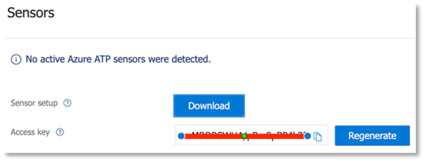

# Configurer les piliers de Microsoft 365 Defender pour votre laboratoire d’essai ou votre environnement pilote

[!INCLUDE [Microsoft 365 Defender rebranding](../includes/microsoft-defender.md)]

**S’applique à :**
- Microsoft 365 Defender

La création d’un laboratoire d’évaluation ou d’un environnement pilote Microsoft 365 Defender et son déploiement sont un processus en trois phases :

| [Phase 1 : Préparer](prepare-m365d-eval.md) | [Phase 2 : Configurer](setup-m365deval.md) | Phase 3 : Intégration |  [Retour au manuel pilote](m365d-pilot.md) |
|--|--|--|--|
|| |*Vous êtes là !* | |

Vous êtes actuellement en phase de configuration.

La préparation est essentielle pour tout déploiement réussi. Dans cet article, vous serez guidé sur les points que vous devrez prendre en compte lorsque vous préparerez le déploiement de Microsoft Defender pour Endpoint.

## Piliers de Microsoft 365 Defender
Microsoft 365 Defender se compose de quatre piliers. Bien qu’un pilier puisse déjà apporter une valeur ajoutée à la sécurité de votre organisation réseau, l’activation des quatre piliers de Microsoft 365 Defender donnera la valeur la plus importante à votre organisation.

Cette section vous guide pour configurer :
-   Microsoft Defender pour Office 365
-   Microsoft Defender pour l’identité 
-   Microsoft Cloud App Security
-   Microsoft Defender pour point de terminaison

## Configurer Microsoft Defender pour Office 365

>[!NOTE]
>Ignorez cette étape si vous avez déjà activé Defender pour Office 365. 

Il existe un module PowerShell appelé *OrCA (Advanced Threat Protection Recommended Configuration Analyzer) Office 365* qui vous aide à déterminer certains de ces paramètres. Lorsqu’il est exécuté en tant qu’administrateur dans votre client, get-ORCAReport vous aide à générer une évaluation des paramètres d’hygiène des messages anti-courrier indésirable, anti-hameçonnage et autres. Vous pouvez télécharger ce module à partir https://www.powershellgallery.com/packages/ORCA/ de . 

1. Accédez à la stratégie de gestion des menaces du Centre [& conformité Office 365.](https://protection.office.com/homepage)  >    >  

   
 
2. Cliquez **sur Anti-hameçonnage,** **sélectionnez Créer** et remplir le nom et la description de la stratégie. Cliquez sur **Suivant**.

   

   > [!NOTE]
   > Modifiez votre stratégie anti-hameçonnage avancée dans Microsoft Defender pour Office 365. Modifiez **le seuil de hameçonnage** avancé **sur 2 - Agressif**.

3. Cliquez sur le menu déroulant Ajouter une **condition** et sélectionnez vos domaines comme domaine destinataire. Cliquez sur **Suivant**.

   
 
4. Examinez vos paramètres. Cliquez **sur Créer cette stratégie pour** confirmer. 

   
 
5. Sélectionnez **Pièces jointes sécurisées,** puis sélectionnez l’option Activer la sécurité contre les autres pour **SharePoint, OneDrive et Microsoft Teams.**

   

6. Cliquez sur l’icône + pour créer une stratégie de pièces jointes sécurisées, puis appliquez-la en tant que domaine de destinataire à vos domaines. Cliquez sur **Enregistrer**.

   
 
7. Ensuite, sélectionnez la **stratégie de liens** sécurisés, puis cliquez sur l’icône de crayon pour modifier la stratégie par défaut.

8. Assurez-vous que l’option Ne pas **me** suivre lorsque les utilisateurs cliquent sur l’option Liens sécurisés n’est pas sélectionnée, tandis que les autres options sont sélectionnées. Pour plus [d’informations,](/microsoft-365/security/defender-365-security/recommended-settings-for-eop-and-office365) voir paramètres de liens sécurisés. Cliquez sur **Enregistrer**. 

   

9. Sélectionnez ensuite la **stratégie anti-programme** malveillant, sélectionnez la stratégie par défaut, puis choisissez l’icône de crayon.

10. Cliquez **sur Paramètres,** **sélectionnez Oui et utilisez le texte de notification** par défaut pour activer la réponse de détection de programmes **malveillants.** Activer le **filtre Types de pièces jointes courants.** Cliquez sur **Enregistrer**.

    
  
11. Accédez à la recherche dans le journal d’audit du Centre de sécurité et & conformité [Office 365](https://protection.office.com/homepage)  >    >   et activer l’audit.

    

12. Intégrez Microsoft Defender pour Office 365 à Microsoft Defender pour point de terminaison. Accédez à l’Explorateur de gestion des menaces du Centre de sécurité & Conformité [Office 365](https://protection.office.com/homepage)et sélectionnez Microsoft Defender pour les paramètres de point de terminaison dans le coin supérieur droit de  >    >    l’écran. Dans la boîte de dialogue de connexion Defender pour point de terminaison, activer la connexion **à Microsoft Defender pour le point de terminaison.**

    

## Configurer Microsoft Defender pour l’identité

>[!NOTE]
>Ignorez cette étape si vous avez déjà activé Microsoft Defender pour l’identité

1. Accédez [au Centre de sécurité Microsoft 365](https://security.microsoft.com/info) > **sélectionnez plus de ressources** Microsoft Defender pour  >  **l’identité.**

   

2. Cliquez **sur Créer** pour démarrer l’Assistant Microsoft Defender pour l’identité. 

   

3. Choisissez **Fournir un nom d’utilisateur et un mot de passe pour vous connecter à votre forêt Active Directory.**  

   

4. Entrez vos informations d’identification Active Directory sur site. Il peut s’y trouver n’importe quel compte d’utilisateur qui dispose d’un accès en lecture à Active Directory.

   

5. Ensuite, **sélectionnez Télécharger le programme d’installation du** capteur et transférer le fichier vers votre contrôleur de domaine.

   

6. Exécutez le programme d’installation de Microsoft Defender for Identity Sensor et commencez à suivre l’Assistant.

   
 
7. Cliquez **sur Suivant** au niveau du type de déploiement du capteur.

   
 
8. Copiez la touche d’accès rapide, car vous devez la saisir ensuite dans l’Assistant.

   
 
9. Copiez la touche d’accès rapide dans l’Assistant, puis cliquez sur **Installer.** 

   

10. Félicitations, vous avez correctement configuré Microsoft Defender pour l’identité sur votre contrôleur de domaine.

    
 
11. Sous la section [Paramètres de Microsoft Defender pour](https://go.microsoft.com/fwlink/?linkid=2040449) l’identité, sélectionnez **Microsoft Defender pour le point de terminaison **, puis activer le basculement. Cliquez sur **Enregistrer**. 

    

> [!NOTE]
> Windows Defender ATP a été renommé Microsoft Defender pour Endpoint. Les modifications apportées au changement de nom sur tous nos portails sont déployées pour des raisons de cohérence.

## Configurer Microsoft Cloud App Security

> [!NOTE]
> Ignorez cette étape si vous avez déjà activé Microsoft Cloud App Security. 

1. Accédez au [Centre de sécurité Microsoft 365 plus](https://security.microsoft.com/info)de  >  **ressources** Microsoft Cloud  >  **App Security**.

   

2. À l’invite d’informations pour intégrer Microsoft Defender pour l’identité, sélectionnez **Activer Microsoft Defender pour l’intégration des données d’identité.**
  
   

   > [!NOTE]
   > Si vous ne voyez pas cette invite, cela peut signifier que l’intégration des données microsoft Defender pour l’identité a déjà été activée. Toutefois, si vous n’êtes pas sûr, contactez votre administrateur informatique pour confirmer. 

3. Go to **Settings**, turn on the **Microsoft Defender for Identity integration** toggle, then click **Save**. 

   
   
   > [!NOTE]
   > Pour les nouvelles instances de Microsoft Defender pour l’identité, ce basculement d’intégration est automatiquement allumé. Confirmez que l’intégration de Microsoft Defender for Identity a été activée avant de passer à l’étape suivante.
 
4. Sous les paramètres de découverte cloud, sélectionnez **Microsoft Defender pour l’intégration de point** de terminaison, puis activez l’intégration. Cliquez sur **Enregistrer**.

   

5. Sous Paramètres de découverte cloud, sélectionnez **Enrichissement d’utilisateur,** puis activez l’intégration avec Azure Active Directory.

   

## Configurer Microsoft Defender pour le point de terminaison

>[!NOTE]
>Ignorez cette étape si vous avez déjà activé Microsoft Defender pour endpoint.

1. Accédez au [Centre de sécurité Microsoft 365](https://security.microsoft.com/info)Plus de  >  **ressources** Centre  >  **de sécurité Microsoft Defender**. Cliquez sur **Ouvrir**. 

   
 
2. Suivez l’Assistant Microsoft Defender pour point de terminaison. Cliquez sur **Suivant**. 

   

3. Choisissez en fonction de votre emplacement de stockage de données préféré, de votre stratégie de rétention des données, de la taille de l’organisation et de votre choix pour les fonctionnalités de prévisualisation.

   
   
   > [!NOTE]
   > Vous ne pouvez pas modifier certains paramètres, tels que l’emplacement de stockage des données, par la suite. 

   Cliquez sur **Suivant**. 

4. Cliquez **sur Continuer** pour mettre en service votre client Microsoft Defender for Endpoint.

   

5. Intégrer vos points de terminaison via des stratégies de groupe, Microsoft Endpoint Manager ou en exécutant un script local dans Microsoft Defender pour endpoint. Par souci de simplicité, ce guide utilise le script local.

6. Cliquez **sur Télécharger le package** et copiez le script d’intégration sur vos points de terminaison.

   

7. Sur votre point de terminaison, exécutez le script d’intégration en tant qu’administrateur et choisissez Y. 

   

8. Félicitations, vous avez intégré votre premier point de terminaison.

   

9. Copiez-collez le test de détection à partir de l’Assistant Microsoft Defender for Endpoint.

   

10. Copiez le script PowerShell dans une invite de commandes avec élévation de niveaux et exécutez-le. 

    

11. Sélectionnez **Démarrer à l’aide de Microsoft Defender pour le point de terminaison à partir** de l’Assistant.

    
 
12. Visitez le [Centre de sécurité Microsoft Defender.](https://securitycenter.windows.com/) Go to **Settings** and then select **Advanced features**. 

    

13. Activer l’intégration avec **Microsoft Defender pour l’identité.**  

    

14. Activer l’intégration avec **Office 365 Threat Intelligence**.

    

15. Activer l’intégration avec **Microsoft Cloud App Security.**

    

16. Faites défiler vers le bas et cliquez **sur Enregistrer les préférences** pour confirmer les nouvelles intégrations.

    

## Démarrer le service Microsoft 365 Defender

>[!NOTE]
>À compter du 1er juin 2020, Microsoft active automatiquement les fonctionnalités de Microsoft 365 Defender pour tous les clients éligibles. Consultez cet article de la communauté technique Microsoft sur [l’éligibilité aux licences](https://techcommunity.microsoft.com/t5/security-privacy-and-compliance/microsoft-threat-protection-will-automatically-turn-on-for/ba-p/1345426) pour plus d’informations. 

Go to [Microsoft 365 Security Center](https://security.microsoft.com/homepage). Accédez **à Paramètres,** puis **sélectionnez Microsoft 365 Defender.**

  

Pour obtenir des conseils plus complets, voir [Activer Microsoft 365 Defender.](m365d-enable.md) 

Félicitations ! Vous viennent de créer votre laboratoire d’essai ou votre environnement pilote Microsoft 365 Defender ! Vous pouvez maintenant vous familiariser avec l’interface utilisateur de Microsoft 365 Defender ! Découvrez ce que vous pouvez apprendre du guide interactif Microsoft 365 Defender suivant et découvrez comment utiliser chaque tableau de bord pour vos tâches quotidiennes d’opérations de sécurité.

>[!VIDEO https://aka.ms/MTP-Interactive-Guide]

Ensuite, vous pouvez simuler une attaque et voir comment les fonctionnalités entre produits détectent, créent des alertes et répondent automatiquement à une attaque sans fichier sur un point de terminaison.

## Étape suivante

- [Générez une alerte de test](generate-test-alert.md) : exécutez une simulation d’attaque dans votre laboratoire d’essai microsoft 365 Defender.