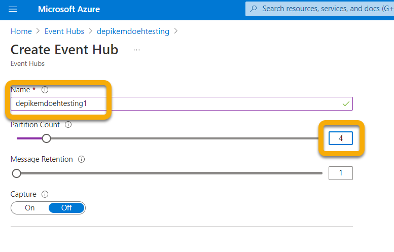

# <a name="configure-your-event-hub"></a>Configurer votre Hub d’événements

[!INCLUDE [Microsoft 365 Defender rebranding](../../includes/microsoft-defender.md)]

**S’applique à :**
- [Microsoft 365 Defender](https://go.microsoft.com/fwlink/?linkid=2118804)

Découvrez comment configurer votre Hub d’événements afin qu’il puisse inger des événements à partir de Microsoft 365 Defender.

## <a name="set-up-the-required-resource-provider-in-the-event-hub-subscription"></a>Configurer le fournisseur de ressources requis dans l’abonnement Event Hub

1. Connectez-vous au [Portail Azure](https://portal.azure.com).
1. Select **Subscriptions** > **{ Select the subscription the event hub will be deployed to }** > **Resource providers**.
1. Vérifiez que **microsoft.Informations** Le fournisseur est inscrit. Sinon, inscrivez-le.


## <a name="set-up-azure-active-directory-app-registration"></a>Configurer l’Azure Active Directory’application

> ! [REMARQUE] Vous devez avoir un rôle d’administrateur ou Azure Active Directory (AAD) doit être définie pour autoriser les non-administrateurs à inscrire des applications. Vous devez également avoir un rôle Propriétaire ou Administrateur d’accès utilisateur pour attribuer un rôle au principal de service. Pour plus d’informations, voir [Créer Azure AD application & principal de service dans le portail - Plateforme d'identités Microsoft \| Documents Microsoft](/azure/active-directory/develop/howto-create-service-principal-portal).

1. Créez une nouvelle inscription (qui crée par nature un principal de service) \> dans **Azure Active Directory’application Nouvelle** \> **inscription.**

1. Remplissez le formulaire avec uniquement le nom (aucun URI de redirection n’est requis).

    

    

1. Créez une secret en cliquant sur **Certificats & Clés secrètes Client** \> **Nouvelle :**

    

> [!WARNING]
> **Vous ne pourrez plus accéder à la secret client. Veillez donc à l’enregistrer**.

## <a name="set-up-event-hub-namespace"></a>Configurer l’espace de noms Event Hub

1. Créez un espace de noms Event Hub :

    Allez **sur Hubs d’événements \>** Ajouter et sélectionner le niveau de tarification, les unités de débit et l’auto-évaluation (nécessite une tarification standard et sous fonctionnalités) appropriés à la charge que vous attendez. Pour plus d’informations, voir [Tarification - Hubs d’événements \| Microsoft Azure](https://azure.microsoft.com/pricing/details/event-hubs/)

    > [!NOTE]
    > Vous pouvez utiliser un hub d’événements existant, mais le débit et la mise à l’échelle sont définies au niveau de l’espace de noms. Il est donc recommandé de placer un hub d’événements dans son espace de noms.

   

1. Vous aurez également besoin de l’ID de ressource de cet espace de noms Event Hub. Go to your Azure Event Hubs namespace page \> Properties. Copiez le texte sous L’ID de ressource et enregistrez-le pour l’utiliser dans la section Microsoft 365 configuration ci-dessous.

    

1. Une fois l’espace de noms Hub d’événements créé, vous devez ajouter le principal du service d’inscription d’application en tant que lecteur, récepteur de données Azure Event Hubs et utilisateur qui se connectera à Microsoft 365 Defender en tant que collaborateur (vous pouvez également le faire au niveau du groupe de ressources ou de l’abonnement).

    Pour ce  faire, dans event **Hubs Namespace** \> **Access Control (IAM),** \> ajoutez et vérifiez sous **Attributions de rôles** :

    

## <a name="set-up-event-hub"></a>Configurer le Hub d’événements

**Option 1 :**

Vous pouvez créer un Hub d’événements dans votre  espace de noms et tous les types d’événements (Tables) que vous sélectionnez pour l’exportation seront écrits dans **ce hub** d’événements.

**Option 2 :**

Au lieu d’exporter tous les types d’événements (tables) dans un hub d’événements, vous pouvez exporter chaque table dans un hub d’événements différent à l’intérieur de votre espace de noms Event Hub (un Hub d’événements par type d’événement).

Dans cette option, Microsoft 365 Defender créera des Hubs d’événements pour vous.

> [!NOTE]
> Si vous utilisez un espace de noms Event Hub qui ne  fait pas partie d’un cluster Event Hub, vous ne pourrez choisir que 10 types d’événements (Tables) à exporter dans chaque Paramètres Export que vous définissez, en raison d’une limite Azure de 10 Hubs d’événements par espace de noms Event Hub.

Par exemple :


Si vous choisissez cette option, vous pouvez passer à la section [Configurer Microsoft 365 Defender pour envoyer des tables de courrier](#configure-microsoft-365-defender-to-send-email-tables) électronique.

Créez un Hub d’événements dans votre espace de noms en sélectionnant **Hubs d’événements** **+ Hub d’événements**\>.

Le nombre de partitions autorise davantage de débit via le parallélisme. Il est donc recommandé d’augmenter ce nombre en fonction de la charge que vous attendez. Les valeurs de rétention et de capture des messages par défaut de 1 et De sont recommandées.



Pour ce Hub d’événements (et non un espace de noms), vous devez configurer une stratégie d’accès partagé avec les revendications Envoyer, Écouter. Cliquez sur vos stratégies **d’accès** partagé du Hub  \> \> d’événements **+** Ajoutez-le, puis donnez-lui un nom de stratégie (non utilisé ailleurs) et vérifiez **Envoyer** et **écouter**.


## <a name="configure-microsoft-365-defender-to-send-email-tables"></a>Configurer Microsoft 365 Defender pour envoyer des tables de courrier électronique

### <a name="set-up-microsoft-365-defender-send-email-tables-to-splunk-via-event-hub"></a>Configurer Microsoft 365 Defender envoyer des tables de messagerie à Splunk via le Hub d’événements

1. Connectez-vous <a href="https://go.microsoft.com/fwlink/p/?linkid=2077139" target="_blank">Microsoft 365 Defender</a> un compte qui répond à toutes les exigences de rôle suivantes :

    - Rôle de collaborateur au niveau de  la ressource d’espace de noms du Hub d’événements ou supérieur pour le Hub d’événements vers qui vous allez exporter. Sans cette autorisation, vous recevez une erreur d’exportation lorsque vous essayez d’enregistrer les paramètres.

    - Rôle d’administrateur global ou d’administrateur de sécurité sur le client lié à Microsoft 365 Defender azure.

    

1. Cliquez sur **Exportation de données brutes \> +Ajouter**.

    Vous allez maintenant utiliser les données que vous avez enregistrées ci-dessus.

    **Nom** : cette valeur est locale et doit être tout ce qui fonctionne dans votre environnement.

    **Forward events to event hub**: Select this checkbox.

    **ID de ressource Event-Hub** : cette valeur est l’ID de ressource d’espace de noms Event Hub que vous avez enregistré lors de la configuration du Hub d’événements.

    **Nom du Hub d’événements** : si vous avez créé un Hub d’événements à l’intérieur de votre espace de noms Event Hub, collez le nom du Hub d’événements que vous avez enregistré ci-dessus.

    Si vous choisissez de laisser Microsoft 365 Defender créer des hubs d’événements par types d’événements (Tables), laissez ce champ vide.

    **Types d’événements** : sélectionnez les tables de recherche avancée que vous souhaitez faire suivre au Hub d’événements, puis à votre application personnalisée. Les tables d’alerte sont Microsoft 365 Defender, les tables Périphériques sont issues de Microsoft Defender pour le point de terminaison (PEPT) et les tables e-mail sont issues de Microsoft Defender pour Office 365. Les événements de messagerie enregistrent toutes les transactions de messagerie. L’URL (Coffre Links), attachment (Coffre Attachments) et les événements de remise (ZAP) sont également enregistrés et peuvent être joints aux événements de messagerie sur le champ NetworkMessageId.

    

1. Veillez à cliquer sur **Envoyer**.

### <a name="verify-that-the-events-are-being-exported-to-the-event-hub"></a>Vérifier que les événements sont exportés vers le Hub d’événements

Vous pouvez vérifier que les événements sont envoyés au Hub d’événements en exécutant une requête de recherche avancée de base. **Sélectionnez Une** \> **requête de recherche** \> **avancée et** entrez la requête suivante :

```console
EmailEvents
|joinkind=fullouterEmailAttachmentInfoonNetworkMessageId
|joinkind=fullouterEmailUrlInfoonNetworkMessageId
|joinkind=fullouterEmailPostDeliveryEventsonNetworkMessageId
|whereTimestamp\>ago(1h)
|count
```

Cela vous indique le nombre d’e-mails reçus au cours de la dernière heure, joints dans toutes les autres tables. Elle vous indique également si vous voyez des événements qui peuvent être exportés vers le hub d’événements. Si ce nombre indique 0, vous ne verrez aucune donnée sortante vers le Hub d’événements.


Une fois que vous avez vérifié qu’il existe des données à exporter, vous pouvez afficher le Hub d’événements pour vérifier que les messages sont entrants. Cela peut prendre jusqu’à une heure.

1. Dans Azure, go to **Event Hubs** \> Click on the **Namespace** \> **Event Hubs** \> Click on the **Event Hub**.
1. Sous **Vue d’ensemble**, faites défiler vers le bas et dans le graphique Messages, vous devriez voir messages entrants. Si vous ne voyez aucun résultat, il n’y aura aucun message pour l’ing d’une application personnalisée.

    
