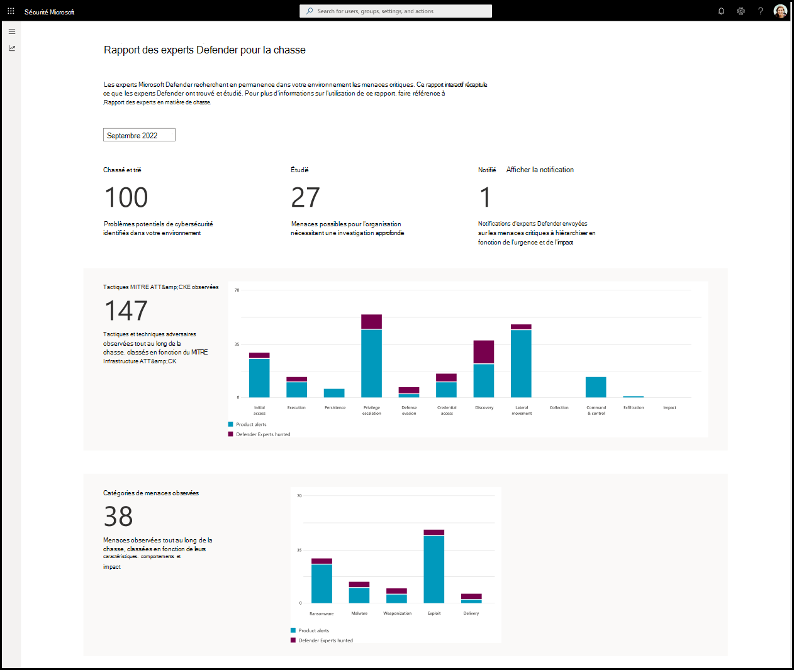

# Comprendre le rapport Defender Experts for Hunting dans Microsoft 365 Defender

[!INCLUDE [Microsoft 365 Defender rebranding](../../includes/microsoft-defender.md)]

**S’applique à :**

- [Microsoft 365 Defender](https://go.microsoft.com/fwlink/?linkid=2118804)

Microsoft Defender Experts for Hunting dispose d’une intelligence humaine et d’une technologie formée par des experts pour aider Microsoft 365 Defender clients à comprendre les menaces importantes auxquelles ils sont confrontés. Il montre comment les compétences de Defender Expert en matière de chasse aux menaces, une compréhension approfondie du paysage des menaces et la connaissance des menaces émergentes peuvent vous aider à identifier, hiérarchiser et résoudre ces menaces dans votre environnement. 

Le service Defender Experts for Hunting publie des rapports mensuels pour vous aider à comprendre toutes les menaces que le service de chasse a exposées dans votre environnement, ainsi que les alertes générées par vos produits Microsoft 365 Defender.

Pour afficher le dernier rapport dans votre portail Microsoft 365 Defender, accédez au **rapport Rapports**, sélectionnez **Defender Experts** > **Defender Experts for Hunting.**

## Analyser le rapport Defender Experts for Hunting pour savoir ce qu’il faut hiérarchiser

Chaque section du rapport est conçue pour fournir des insights supplémentaires sur les menaces que nos experts Defender ont détectées dans votre environnement. Les rapports incluent les sections décrites dans le tableau suivant :

| Section Rapport | Description |
|--|--|
| Chassé et trié | Nombre total de problèmes potentiels de cybersécurité détectés dans votre environnement. |
| Étudié | Nombre de problèmes de cybersécurité qui nécessitent une analyse plus approfondie pour déterminer leur nature et leur étendue. |
| Notifié (afficher la notification) | Nombre de notifications d’experts Defender envoyées par les experts Defender. Ces notifications sont liées aux activités de menace possibles examinées dans votre environnement qui doivent être hiérarchisées en fonction de l’urgence et de l’impact. |
| Tactiques MITRE ATT&CK observées | Nombre de tactiques et de techniques d’attaque observées dans votre environnement et mappées selon [l’infrastructure MITRE ATT&CK](https://attack.mitre.org/). Cette section visualise le nombre d’attaques qui ont atteint chaque tactique afin que vous puissiez prendre les mesures appropriées, comme passer en revue celles qui ont progressé plus avant. |
| Catégories de menaces observées | Les catégories représentent les menaces et les risques les plus importants observés dans votre environnement. Les catégories les plus critiques sont mises en évidence pour vous aider à évaluer et évaluer davantage votre posture de sécurité en fonction des caractéristiques connues des menaces, du comportement et de l’impact potentiel. Il vous permet également de vous concentrer et de hiérarchiser les tâches urgentes à traiter. |

Reportez-vous à la capture d’écran suivante d’un exemple de rapport :

## Afficher les notifications des experts Defender

Une notification d’experts Defender décrit l’activité importante de menace Defender Experts for Hunting observée dans votre environnement et fournit des recommandations pour corriger et défendre votre organisation.

Les rapports Defender Experts for Hunting vous fournissent le nombre total de notifications Defender Experts que nos experts Defender ont envoyées pour l’heure choisie. Pour afficher ces notifications, sélectionnez **Afficher la notification** en regard **de Notifié**.

Ce lien vous redirige vers la page Microsoft 365 Defender incidents. Les alertes Defender Expert for Hunting ou les notifications Defender Experts sont étiquetées avec **Defender Experts**.

> [!NOTE]
> Le lien **de notification Affichage** s’affiche uniquement si la valeur affichée dans **Notifié** est au moins 1.

## Identifier les points d’entrée d’attaque potentiels et d’autres points faibles de sécurité

Les tactiques MITRE ATT&CK représentent des objectifs adversaires, ce qu’ils essaient d’atteindre à chaque phase d’attaque. La section **MITRE ATT&tactiques CK observées** dans le rapport suit la progression des attaques contre la phase qu’elles ont atteinte :

1.  Reconnaissance
2.  Développement de ressources
3.  Accès initial
4.  Exécution
3.  Persistance
4.  Élévation des privilèges
5.  Évasion de défense
6.  Accès aux informations d’identification
7.  Découverte
8.  Déplacement latéral
9.  Collection
10. Commande et contrôle
11. Exfiltration
12. Impact

Les signaux de Microsoft 365 Defender et les investigations effectuées par les experts Defender pour la chasse permettent d’identifier ces tactiques, représentées dans le graphique à barres. Ce graphique vous aide à visualiser où se trouve la poussée et vous fournit les informations dont vous avez besoin pour planifier les actions de confinement et de correction correspondantes.

## Connaître et comprendre les menaces répandues dans votre environnement

Les catégories de menaces permettent d’identifier et d’organiser les menaces de sécurité en classes afin d’évaluer leur impact et d’élaborer des stratégies pour prévenir ou atténuer ces menaces pour votre environnement. La section **Catégories de menaces observées** dans le rapport affiche un graphique à barres avec des risques et menaces significatifs détectés dans votre environnement, ce qui vous aide à comprendre l’étendue et l’étendue de votre exposition.

Parmi les différentes catégories de menaces disponibles, les catégories suivantes sont soigneusement choisies, car elles ne sont pas couvertes par mitre ATT&framework CK :

- Rançongiciel
- Programme malveillant
- Armement
- Exploiter
- Remise

Vous pouvez hiérarchiser la correction en fonction de la catégorie la plus affectée, comme illustré dans le graphique à barres.

